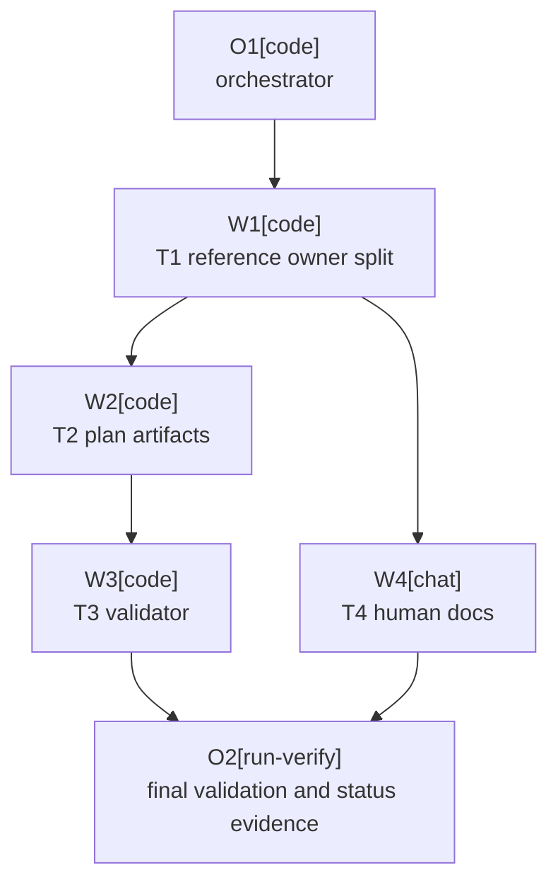

# Plan: AI Execution Orchestration Optimization

Plan-ID: PLAN-ai-execution-orchestration-optimization

Status: In Progress

Workers: 2 (parallel, tasks: T2-plan-artifacts, T4-human-docs)

Filename: `.agents/plans/PLAN-ai-execution-orchestration-optimization.md`

## Readiness

- Plan readiness: In progress under approved execution model.
- Approved by: Kamil Kiewisz <kamkie@outlook.com>
- Approved at: 2026-05-23T17:07:16+02:00
- Open questions: None.
- Implementation progress: T1-reference-owner-split, T2-plan-artifacts, and T4-human-docs complete; T3-validator ready.

## Status History

- 2026-05-23T16:58:06+02:00: none -> Draft by OpenAI Codex <codex@openai.com>; plan created after ADR 0073 acceptance.
- 2026-05-23T17:07:16+02:00: Draft -> Approved by Kamil Kiewisz <kamkie@outlook.com>; explicit user approval recorded.
- 2026-05-23T17:08:19+02:00: Approved -> In Progress by OpenAI Codex <codex@openai.com>; T1-reference-owner-split dispatched.

## Goal

Implement accepted `adr-0073` by making direct one-off execution cheaper, moving orchestration policy to one owner, allowing delegation by default with clear boundaries, extending task packets, validating packet shape, and updating human-facing request guidance.

## Non-Goals

- Do not change plugin runtime behavior.
- Do not change the ADR gate, plan approval gate, one-commit-per-plan-task rule, single-branch topology, changelog ownership, or disjoint write-scope requirement for parallel write workers.
- Do not add durable `.agents/runs/` logs or per-worker git worktrees.

## Assumptions

- `adr-0073` is the governing accepted decision for this plan.
- Documentation-only guidance changes do not require plugin build validation.
- Validator changes can be covered by `scripts/ai/validate-agent-artifacts.ps1`, `scripts/validate-docs.ps1`, and `git diff --check`.

## Open Questions

- None.

## Proposed Changes

- Add .agents/references/orchestration.md as the single AI-facing owner for orchestration details.
- Refactor `.agents/references/execution.md` into explicit direct one-off and approved-plan execution paths.
- Refactor `.agents/references/planning.md` to focus on plan creation, readiness, status, and packet shape.
- Update `.agents/plans/README.md` and `.agents/plans/PLAN_TEMPLATE.md` with the new packet fields and cross-references.
- Extend `scripts/ai/validate-agent-artifacts.ps1` to validate task-packet fields for approved multi-task plans.
- Update `docs/WORKING_WITH_AI.md` with request shapes for direct one-off, delegated one-off, approved plan execution, and review-only sidecar delegation.
- Update `docs/DEVELOPMENT_LIFECYCLE.md` only if needed to preserve accurate cross-references.

## Task Packets

### Task Packet: T1-reference-owner-split

Task id: T1-reference-owner-split

Lane: implementation

Required skills:

- repository-documentation

Initial context budget:

- `AGENTS.md`
- `.agents/references/documentation.md`
- `.agents/references/execution.md`
- `.agents/references/planning.md`
- `docs/decisions/adr-0073-optimize-ai-execution-paths-and-orchestration-context.md`

Escalation triggers:

- Load `.agents/references/releases.md` only if changelog ownership wording changes.
- Load `docs/DEVELOPMENT_LIFECYCLE.md` only if execution cross-references need lifecycle alignment.

Goal:

- Add .agents/references/orchestration.md and reduce duplicate orchestration policy in execution and planning guidance.

Allowed inputs:

- Plan header, readiness summary, execution graph, this task packet, and listed initial context.

Forbidden inputs:

- Unrelated archived plans.
- Prior worker chat beyond the orchestrator handoff summary.
- Implementation evidence from unrelated task packets.

Write scope:

- The future .agents/references/orchestration.md file from T1.
- `.agents/references/execution.md`
- `.agents/references/planning.md`

Dependencies:

- none.

Validation:

- `pwsh -NoProfile -ExecutionPolicy Bypass -File scripts/ai/validate-agent-artifacts.ps1`
- `git diff --check`

Stop conditions:

- A needed policy change contradicts `adr-0073` or another accepted ADR.

Expected output:

- Changed files.
- Validation evidence.
- Blockers or handoff notes.

Result summary:

- Status: completed
- Worker: W1, implementation lane
- Changed files or reviewed diff: Added `.agents/references/orchestration.md`; updated `.agents/references/execution.md` and `.agents/references/planning.md`.
- Validation evidence: `pwsh -NoProfile -ExecutionPolicy Bypass -File scripts/ai/validate-agent-artifacts.ps1` passed; `git diff --check` passed.
- Blockers: None.
- Review risks: Low; documentation-only guidance split, with orchestrator follow-up wording fix for post-approval plan statuses.
- Handoff notes: Orchestration policy now has one AI-facing owner; no `CHANGELOG.md` update because this is internal agent workflow guidance.

### Task Packet: T2-plan-artifacts

Task id: T2-plan-artifacts

Lane: implementation

Required skills:

- repository-documentation

Initial context budget:

- `AGENTS.md`
- `.agents/references/documentation.md`
- `.agents/plans/README.md`
- `.agents/plans/PLAN_TEMPLATE.md`
- The future .agents/references/orchestration.md file from T1.
- `.agents/references/planning.md`

Escalation triggers:

- Load `.agents/references/execution.md` only if template wording needs execution-loop alignment.

Goal:

- Update plan catalog and template guidance for orchestration references and new task-packet fields.

Allowed inputs:

- Plan header, readiness summary, execution graph, this task packet, and listed initial context.

Forbidden inputs:

- Unrelated archived plans.
- Prior worker chat beyond the orchestrator handoff summary.

Write scope:

- `.agents/plans/README.md`
- `.agents/plans/PLAN_TEMPLATE.md`

Dependencies:

- T1-reference-owner-split.

Validation:

- `pwsh -NoProfile -ExecutionPolicy Bypass -File scripts/ai/validate-agent-artifacts.ps1`
- `git diff --check`

Stop conditions:

- Template changes need fields not covered by `adr-0073`.

Expected output:

- Changed files.
- Validation evidence.
- Blockers or handoff notes.

Result summary:

- Status: completed
- Worker: W2, implementation lane
- Changed files or reviewed diff: Updated `.agents/plans/README.md` and `.agents/plans/PLAN_TEMPLATE.md`.
- Validation evidence: `pwsh -NoProfile -ExecutionPolicy Bypass -File scripts/ai/validate-agent-artifacts.ps1` passed; `git diff --check` passed.
- Blockers: None.
- Review risks: Low; documentation-only plan artifact update aligned to the new orchestration owner.
- Handoff notes: Task-packet guidance now includes required skills, initial context budget, escalation triggers, and explicit validation or review expectations.

### Task Packet: T3-validator

Task id: T3-validator

Lane: implementation

Required skills:

- repository-documentation

Initial context budget:

- `AGENTS.md`
- `.agents/references/documentation.md`
- `.agents/plans/PLAN_TEMPLATE.md`
- `scripts/ai/validate-agent-artifacts.ps1`

Escalation triggers:

- Load `scripts/validate-docs.ps1` only if top-level docs validation needs matching wrapper behavior.

Goal:

- Validate required task-packet fields for approved multi-task plans.

Allowed inputs:

- Plan header, readiness summary, execution graph, this task packet, and listed initial context.

Forbidden inputs:

- Unrelated validator history or archived plan details.

Write scope:

- `scripts/ai/validate-agent-artifacts.ps1`
- `scripts/validate-docs.ps1` only if required by wrapper behavior.

Dependencies:

- T2-plan-artifacts.

Validation:

- `pwsh -NoProfile -ExecutionPolicy Bypass -File scripts/ai/validate-agent-artifacts.ps1`
- `pwsh -NoProfile -ExecutionPolicy Bypass -File scripts/validate-docs.ps1`
- `git diff --check`

Stop conditions:

- Validator changes would require a new stable artifact format not covered by `adr-0073`.

Expected output:

- Changed files.
- Validation evidence.
- Blockers or handoff notes.

Result summary:

- Status: pending
- Worker:
- Changed files or reviewed diff:
- Validation evidence:
- Blockers:
- Review risks:
- Handoff notes:

### Task Packet: T4-human-docs

Task id: T4-human-docs

Lane: implementation

Required skills:

- repository-documentation

Initial context budget:

- `AGENTS.md`
- `.agents/references/documentation.md`
- `docs/WORKING_WITH_AI.md`
- `docs/DEVELOPMENT_LIFECYCLE.md`
- `docs/decisions/adr-0073-optimize-ai-execution-paths-and-orchestration-context.md`

Escalation triggers:

- Load the new orchestration reference after T1 lands.
- Load `.agents/references/execution.md` only if wording needs exact execution-loop references.

Goal:

- Update human-facing request guidance for direct one-off work, delegated one-off work, approved plan execution, and review-only sidecar delegation.

Allowed inputs:

- Plan header, readiness summary, execution graph, this task packet, and listed initial context.

Forbidden inputs:

- Unrelated archived proposals or plans.

Write scope:

- `docs/WORKING_WITH_AI.md`
- `docs/DEVELOPMENT_LIFECYCLE.md`

Dependencies:

- T1-reference-owner-split.

Validation:

- `pwsh -NoProfile -ExecutionPolicy Bypass -File scripts/validate-docs.ps1`
- `git diff --check`

Stop conditions:

- Human-facing docs would imply delegation is mandatory or bypasses plan approval.

Expected output:

- Changed files.
- Validation evidence.
- Blockers or handoff notes.

Result summary:

- Status: completed
- Worker: W4, implementation lane
- Changed files or reviewed diff: Updated `docs/WORKING_WITH_AI.md` and `docs/DEVELOPMENT_LIFECYCLE.md`.
- Validation evidence: `pwsh -NoProfile -ExecutionPolicy Bypass -File scripts/validate-docs.ps1` passed; `git diff --check` passed.
- Blockers: None.
- Review risks: Low; documentation-only human guidance change with no plugin runtime behavior.
- Handoff notes: Human-facing guidance now describes direct one-off, delegated one-off, approved-plan execution, and review-only sidecar request shapes while preserving approval gates and no-delegation constraints.

## Execution Model

- Use one orchestrator for the whole plan.
- Run T1 first to establish the orchestration owner.
- T2 and T4 may run in parallel after T1 because their write scopes are disjoint.
- Run T3 after T2 so validator checks match the final task-packet template.
- The orchestrator updates plan result summaries and final ADR implementation evidence.
- Task workers return compact result summaries by default; they do not edit `CHANGELOG.md`.

## Execution Graph

## Validation

- `pwsh -NoProfile -ExecutionPolicy Bypass -File scripts/ai/validate-agent-artifacts.ps1`
- `pwsh -NoProfile -ExecutionPolicy Bypass -File scripts/validate-docs.ps1`
- `git diff --check`

## Risks

- Moving orchestration rules can leave stale duplicate wording behind.
- Validator checks can become too rigid for simple single-task plans if not scoped to approved multi-task plans.
- Human-facing docs can overstate delegation if they do not preserve no-delegation instructions and environment limits.

## Handoff Notes

- After implementation, update the `adr-0073` implementation tracker row from `planned` to `implemented` with evidence paths.
- Do not update `CHANGELOG.md`; this is internal AI workflow guidance only.
