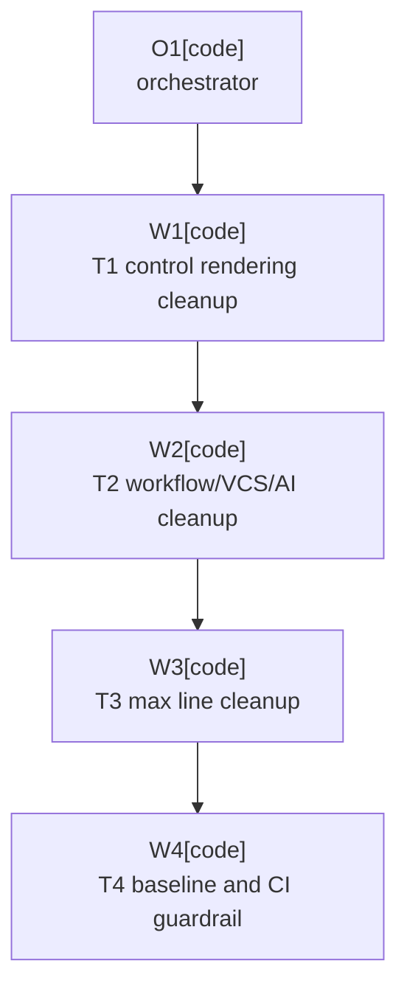

# Plan: Detekt Baseline Cleanup

Plan-ID: PLAN-detekt-baseline-cleanup

Status: Closed

Close-Reason: Archived

Workers: 1

Filename: `.agents/plans/PLAN-detekt-baseline-cleanup.md`

## Readiness

- Plan readiness: Closed; implementation and release-preparation validation are complete.
- Approved by: Kamil Kiewisz <kamkie@outlook.com>
- Approved at: 2026-05-24T16:40:56+02:00
- Open questions: None.
- Implementation progress: Tasks 1, 2, 3, and 4 complete; no further plan work is expected.

## Status History

- 2026-05-24T16:29:57+02:00: none -> Draft by Kamil Kiewisz <kamkie@outlook.com>; plan created from the user request for the `TASKS.md` `### Detekt Plugin` section.
- 2026-05-24T16:40:56+02:00: Draft -> Approved by Kamil Kiewisz <kamkie@outlook.com>; explicit user approval recorded.
- 2026-05-24T16:40:56+02:00: Approved -> In Progress by Kamil Kiewisz <kamkie@outlook.com>; implementation requested with approval.
- 2026-05-24T17:28:14+02:00: In Progress -> Implemented by Codex <codex@openai.com>; W4 completed the baseline guardrail and Detekt task closeout.
- 2026-05-24T23:16:16+02:00: Implemented -> Closed by Kamil Kiewisz <kamkie@outlook.com>; current validation confirmed implementation complete and ready for archive closeout.

## Goal

Retire the Detekt baseline tracked by `T-DETEKT-001..T-DETEKT-008` without weakening the plugin's runtime behavior, IntelliJ Platform fail-closed behavior, or CI quality signal.

The current baseline has 118 suppressed findings:

| Rule | Count |
|------|-------|
| `ComplexCondition` | 1 |
| `MagicNumber` | 38 |
| `MaxLineLength` | 44 |
| `ReturnCount` | 26 |
| `TooGenericExceptionCaught` | 6 |
| `TooManyFunctions` | 1 |
| `UnusedParameter` | 2 |

## Non-Goals

- Do not change observable plugin behavior except where a refactor preserves the same behavior more clearly.
- Do not broaden Detekt suppressions or regenerate a larger baseline.
- Do not replace Detekt, Spotless, or the existing CI quality model.
- Do not perform release publication work.

## Assumptions

- `T-DETEKT-001..T-DETEKT-008` are the accepted scope for this plan.
- `MaxLineLength` findings should be resolved by refactoring or line wrapping first; adding `config/detekt/detekt.yml` or raising a threshold is a fallback only if implementation finds a strong maintainability reason.
- `TooGenericExceptionCaught` changes must keep fail-closed boundaries intact. If narrowing `Throwable` would no longer catch a platform failure that should stop safely, the worker must stop and escalate.
- Baseline edits should remove only entries proven obsolete by the matching implementation and Detekt validation.

## Open Questions

- None.

## Proposed Changes

### Task 1: Control Rendering Detekt Cleanup

Refs: `T-DETEKT-002`, `T-DETEKT-003`, partial `T-DETEKT-007`.

- Refactor `src/main/kotlin/pl/devopssolutions/aicommitall/actions/AiCommitAllThreeSectionControl.kt`.
- Extract named constants for non-color geometry, scale, animation, stroke, dash, icon, and layout `MagicNumber` findings.
- Replace `ControlColors` hex literals with a named color container or `JBColor.namedColor` lookups while preserving accepted ADR 0053 light/dark colors.
- Address the `TooManyFunctions` baseline finding only when the refactor can split cohesive rendering concerns without obscuring Swing paint flow.
- Update focused action/control tests when names or structure change.
- Remove matching `MagicNumber` and `TooManyFunctions` entries from `config/detekt/baseline.xml` after `detekt` proves them gone.

### Task 2: Workflow, VCS, And AI Service Detekt Cleanup

Refs: `T-DETEKT-005`, `T-DETEKT-006`, partial `T-DETEKT-007`.

- Reduce `ReturnCount` findings in `src/main/kotlin/pl/devopssolutions/aicommitall/workflow/`, `src/main/kotlin/pl/devopssolutions/aicommitall/vcs/`, and `src/main/kotlin/pl/devopssolutions/aicommitall/ai/`.
- Replace `catch (Throwable)` sites with the narrowest safe platform or Kotlin exception boundaries while keeping conservative stop behavior.
- Address the `ComplexCondition` finding in `GitStageSelectionItems`.
- Address the `UnusedParameter` findings in `PushOnlyWorkflowExecutionService`.
- Extract the `GitStageConfirmation` `250` constant into a named setting.
- Update or add focused unit tests where control-flow or exception boundaries change.
- Remove matching baseline entries only after focused tests and `detekt` pass.

### Task 3: Remaining Source Baseline Cleanup

Refs: `T-DETEKT-004`, residual `T-DETEKT-001` source cleanup.

- Resolve remaining `MaxLineLength` findings after Tasks 1 and 2 land, because earlier refactors may remove many long-line entries.
- Resolve any remaining non-`MaxLineLength` source baseline entries not covered by Tasks 1 and 2 before the final guardrail task.
- Prefer wrapping declarations, extracting small helpers, or naming repeated expressions.
- Create `config/detekt/detekt.yml` with a documented threshold change only if the remaining findings are clearer as long declarations than as wrapped code.
- Remove matching baseline entries after `detekt` confirms they are gone.

### Task 4: Baseline Removal And CI Guardrail

Refs: `T-DETEKT-001`, `T-DETEKT-008`.

- Empty or remove the effective contents of `config/detekt/baseline.xml` once all suppressed findings are resolved.
- Add a Gradle or CI guardrail that fails when the Detekt baseline contains current issues again.
- Wire the guardrail into `.github/workflows/ci.yml` and the release workflow if needed.
- Update `TASKS.md` / `TASKS_ARCHIVE.md` task state, `.agents/plans/README.md`, this plan's result summaries, and `CHANGELOG.md` if the CI/release quality gate changes are public plugin-facing.

## Task Packets

### Task Packet: T1-control-rendering-detekt-cleanup

Task id: T1-control-rendering-detekt-cleanup

Lane: implementation

Required skills:

- `kotlin-plugin-style`
- `intellij-plugin-development`

Goal:

- Complete `T-DETEKT-002`, `T-DETEKT-003`, and the `AiCommitAllThreeSectionControl` part of `T-DETEKT-007`.

Initial context budget:

- Read first:
  - Plan header, readiness summary, execution graph, and this task packet.
  - `TASKS.md` `### Detekt Plugin`.
  - `src/main/kotlin/pl/devopssolutions/aicommitall/actions/AiCommitAllThreeSectionControl.kt`.
  - `src/test/kotlin/pl/devopssolutions/aicommitall/actions/`.
  - `config/detekt/baseline.xml`.
- Escalate to:
  - `docs/decisions/adr-0053-*.md` only if color semantics are unclear.
  - `.agents/references/code-style.md` if formatting or Kotlin style questions arise.

Allowed inputs:

- Files named in `Read first`.
- Files named in `Escalate to` only after an escalation trigger fires.

Forbidden inputs:

- Unrelated archived plans.
- Previous worker chat beyond the orchestrator handoff summary.
- Implementation evidence from unrelated task packets.

Write scope:

- `src/main/kotlin/pl/devopssolutions/aicommitall/actions/AiCommitAllThreeSectionControl.kt`.
- `src/test/kotlin/pl/devopssolutions/aicommitall/actions/`.
- `config/detekt/baseline.xml`.

Dependencies:

- None.

Validation:

- `.\gradlew.bat spotlessCheck`
- `.\gradlew.bat detekt`
- Focused action/control tests affected by the refactor.

Escalation triggers:

- The refactor would alter ADR 0053 colors or visible control geometry.
- Escalate if `TooManyFunctions` cannot be reduced without hiding paint responsibilities.
- Escalate if baseline entries remain after implementation and the reason is not obvious.

Stop conditions:

- Any visual behavior change that lacks a governing ADR or task.
- Any Detekt fix that weakens readability or removes useful test coverage.

Expected output:

- Changed files.
- Validation evidence.
- Removed baseline entries.
- Review risks and any remaining control-rendering findings.

Result summary:

- Status: completed
- Worker: W1
- Changed files or reviewed diff:
  - `src/main/kotlin/pl/devopssolutions/aicommitall/actions/AiCommitAllThreeSectionControl.kt`
  - `src/test/kotlin/pl/devopssolutions/aicommitall/actions/AiCommitAllThreeSectionControlTest.kt`
  - `config/detekt/baseline.xml`
- Validation evidence:
  - `./gradlew.bat spotlessCheck` passed.
  - `./gradlew.bat detekt` passed.
  - `./gradlew.bat test --tests "pl.devopssolutions.aicommitall.actions.AiCommitAllThreeSectionControlTest" --tests "pl.devopssolutions.aicommitall.actions.AiCommitAllActionsTest"` passed with 37 tests.
  - `git diff --check HEAD^ HEAD` passed.
- Blockers: None.
- Review risks: Large internal rendering refactor; existing rendering and action tests passed, but no manual IDE visual sandbox check was run.
- Handoff notes: Removed 36 `MagicNumber` and one `TooManyFunctions` baseline entries for `AiCommitAllThreeSectionControl`; committed as `f2789b7`.

### Task Packet: T2-workflow-vcs-ai-detekt-cleanup

Task id: T2-workflow-vcs-ai-detekt-cleanup

Lane: implementation

Required skills:

- `kotlin-plugin-style`
- `intellij-plugin-development`

Goal:

- Complete `T-DETEKT-005`, `T-DETEKT-006`, and the workflow/VCS residual findings from `T-DETEKT-007`.

Initial context budget:

- Read first:
  - Plan header, readiness summary, execution graph, and this task packet.
  - `TASKS.md` `### Detekt Plugin`.
  - `src/main/kotlin/pl/devopssolutions/aicommitall/workflow/`.
  - `src/main/kotlin/pl/devopssolutions/aicommitall/vcs/`.
  - `src/main/kotlin/pl/devopssolutions/aicommitall/ai/`.
  - Matching tests under `src/test/kotlin/pl/devopssolutions/aicommitall/`.
  - `config/detekt/baseline.xml`.
- Escalate to:
  - `docs/specification.md` sections for selection, AI completion, commit, push, and stop behavior when a refactor touches observable behavior.
  - Relevant ADRs only when a fail-closed or platform-error boundary is unclear.

Allowed inputs:

- Files named in `Read first`.
- Files named in `Escalate to` only after an escalation trigger fires.

Forbidden inputs:

- Unrelated archived plans.
- Previous worker chat beyond the orchestrator handoff summary.
- Implementation evidence from unrelated task packets.

Write scope:

- `src/main/kotlin/pl/devopssolutions/aicommitall/workflow/`.
- `src/main/kotlin/pl/devopssolutions/aicommitall/vcs/`.
- `src/main/kotlin/pl/devopssolutions/aicommitall/ai/`.
- Matching focused tests under `src/test/kotlin/pl/devopssolutions/aicommitall/`.
- `config/detekt/baseline.xml`.

Dependencies:

- Task 1 should be complete and committed first to avoid concurrent baseline edits.

Validation:

- `.\gradlew.bat spotlessCheck`
- `.\gradlew.bat detekt`
- Focused workflow, VCS, and AI tests affected by the refactor.

Escalation triggers:

- Escalate if narrowing `Throwable` would stop catching a platform failure that should fail closed.
- Return-count cleanup risks changing workflow result mapping.
- A refactor touches user-observable commit, push, AI, or selection behavior.

Stop conditions:

- Any behavior change requiring a specification or ADR update beyond the Detekt cleanup scope.
- Any uncertainty about preserving fail-closed behavior.

Expected output:

- Changed files.
- Validation evidence.
- Removed baseline entries.
- Review risks and any remaining workflow/VCS/AI findings.

Result summary:

- Status: completed
- Worker: W2
- Changed files or reviewed diff:
  - `src/main/kotlin/pl/devopssolutions/aicommitall/workflow/`
  - `src/main/kotlin/pl/devopssolutions/aicommitall/vcs/`
  - `src/main/kotlin/pl/devopssolutions/aicommitall/ai/`
  - `src/test/kotlin/pl/devopssolutions/aicommitall/workflow/PushOnlyWorkflowExecutionServiceTest.kt`
  - `config/detekt/baseline.xml`
- Validation evidence:
  - `./gradlew.bat spotlessCheck` passed.
  - `./gradlew.bat detekt` passed.
  - Focused workflow/VCS/AI test slice passed with 110 tests.
  - `git diff --check HEAD^ HEAD` passed.
- Blockers: None.
- Review risks: No intended user-observable behavior change; fail-closed completion behavior preserved through local `runCatching` completion helpers. Remaining baseline entries are outside this packet's scope.
- Handoff notes: Removed 32 T2-owned baseline entries for `ComplexCondition`, `MagicNumber`, `ReturnCount`, `TooGenericExceptionCaught`, and `UnusedParameter`; committed as `7083d43`.

### Task Packet: T3-max-line-length-cleanup

Task id: T3-max-line-length-cleanup

Lane: implementation

Required skills:

- `kotlin-plugin-style`

Goal:

- Complete `T-DETEKT-004` after earlier refactors settle the source layout, and remove any remaining source-level baseline entries that would otherwise block Task 4.

Initial context budget:

- Read first:
  - Plan header, readiness summary, execution graph, and this task packet.
  - Current Detekt report or `config/detekt/baseline.xml` after Tasks 1 and 2.
  - Files still listed under `MaxLineLength`.
  - Files still listed under any non-`MaxLineLength` source baseline entries after Tasks 1 and 2.
- Escalate to:
  - `build.gradle.kts` and `config/detekt/` only if a threshold/config change becomes necessary.

Allowed inputs:

- Files named in `Read first`.
- Files named in `Escalate to` only after an escalation trigger fires.

Forbidden inputs:

- Unrelated archived plans.
- Previous worker chat beyond the orchestrator handoff summary.
- Implementation evidence from unrelated task packets.

Write scope:

- Files still listed under `MaxLineLength`.
- Files still listed under remaining source-level non-`MaxLineLength` baseline entries after Tasks 1 and 2.
- `config/detekt/baseline.xml`.
- `config/detekt/` only if a justified config file is created.

Dependencies:

- Tasks 1 and 2 complete and committed.

Validation:

- `.\gradlew.bat spotlessCheck`
- `.\gradlew.bat detekt`
- Focused tests only when wrapping requires helper extraction.

Escalation triggers:

- Escalate if a threshold increase looks preferable to code wrapping.
- Long-line cleanup would reduce readability.

Stop conditions:

- Need for a Detekt threshold policy decision not already covered by `T-DETEKT-004`.

Expected output:

- Changed files.
- Validation evidence.
- Removed baseline entries.
- Any rationale for a config threshold decision.
- Any residual baseline entries that must be handled by Task 4.

Result summary:

- Status: completed
- Worker: W3
- Changed files or reviewed diff:
  - `config/detekt/baseline.xml`
  - Source and focused test files under `actions`, `ai`, `settings`, `vcs`, and `workflow`
- Validation evidence:
  - `./gradlew.bat detekt` passed.
  - `./gradlew.bat spotlessCheck` passed.
  - Focused action, settings, and workflow test slice passed with 76 tests.
  - `git diff --check HEAD^ HEAD` passed.
- Blockers: None.
- Review risks: Low; changes were mechanical wrapping, local naming, and equivalent early-return cleanup with no Detekt threshold change.
- Handoff notes: Removed 49 remaining source-level baseline entries: 44 `MaxLineLength`, four `ReturnCount`, and one `MagicNumber`. `CurrentIssues` is empty; committed as `8a64318`.

### Task Packet: T4-baseline-ci-guardrail

Task id: T4-baseline-ci-guardrail

Lane: implementation

Required skills:

- `repository-documentation`
- `kotlin-plugin-style`

Goal:

- Complete `T-DETEKT-001` and `T-DETEKT-008` by eliminating the baseline and preventing future baseline growth.

Initial context budget:

- Read first:
  - Plan header, readiness summary, execution graph, and this task packet.
  - `config/detekt/baseline.xml`.
  - `build.gradle.kts`.
  - `.github/workflows/ci.yml`.
  - `.github/workflows/release.yml`.
  - `TASKS.md`.
  - `TASKS_ARCHIVE.md`.
  - `CHANGELOG.md`.
- Escalate to:
  - `.agents/references/releases.md` if changelog eligibility is unclear.
  - `.agents/references/testing.md` if validation scope needs adjustment.

Allowed inputs:

- Files named in `Read first`.
- Files named in `Escalate to` only after an escalation trigger fires.

Forbidden inputs:

- Unrelated archived plans.
- Previous worker chat beyond the orchestrator handoff summary.
- Implementation evidence from unrelated task packets.

Write scope:

- `config/detekt/baseline.xml`.
- `build.gradle.kts`.
- `.github/workflows/ci.yml`.
- `.github/workflows/release.yml`.
- `TASKS.md`.
- `TASKS_ARCHIVE.md`.
- `CHANGELOG.md`.
- `.agents/plans/PLAN-detekt-baseline-cleanup.md`.
- `.agents/plans/README.md`.

Dependencies:

- Tasks 1, 2, and 3 complete and committed.

Validation:

- `.\gradlew.bat spotlessCheck`
- `.\gradlew.bat detekt`
- The new baseline guard command.
- `pwsh -NoProfile -ExecutionPolicy Bypass -File scripts/validate-docs.ps1`
- `pwsh -NoProfile -ExecutionPolicy Bypass -File scripts/ai/validate-agent-artifacts.ps1`
- `git diff --check`

Escalation triggers:

- Escalate if CI guardrail cannot be made cross-platform or configuration-cache friendly.
- Empty baseline handling differs between local Detekt and CI.
- Changelog or task archive ownership is unclear.

Stop conditions:

- Detekt still needs a baseline entry.
- Guardrail would make local or CI validation brittle.

Expected output:

- Empty or effectively retired baseline.
- CI/release guardrail changes.
- Task closeout docs.
- Validation evidence.

Result summary:

- Status: completed
- Worker: W4
- Changed files or reviewed diff:
  - `build.gradle.kts`
  - `.github/workflows/ci.yml`
  - `.github/workflows/release.yml`
  - `config/detekt/baseline.xml` (reviewed; remained empty)
  - `TASKS.md`
  - `TASKS_ARCHIVE.md`
  - `CHANGELOG.md`
  - `.agents/plans/PLAN-detekt-baseline-cleanup.md`
  - `.agents/plans/README.md`
  - `src/test/kotlin/pl/devopssolutions/aicommitall/ci/GitHubActionsWorkflowTest.kt`
- Validation evidence:
  - Initial orchestrator `./gradlew.bat test` exposed two stale `GitHubActionsWorkflowTest` assertions before remediation.
  - `./gradlew.bat test --tests "pl.devopssolutions.aicommitall.ci.GitHubActionsWorkflowTest"` passed.
  - `./gradlew.bat test` passed with 274 tests and one pending test.
  - `./gradlew.bat verifyDetektBaseline` passed.
  - `./gradlew.bat spotlessCheck` passed.
  - `./gradlew.bat detekt` passed.
  - `pwsh -NoProfile -ExecutionPolicy Bypass -File scripts/validate-docs.ps1` passed.
  - `pwsh -NoProfile -ExecutionPolicy Bypass -File scripts/ai/validate-agent-artifacts.ps1` passed.
  - `git diff --check HEAD^ HEAD` passed.
- Blockers: None.
- Review risks: Low; the guardrail parses the checked-in Detekt baseline XML and fails on any `CurrentIssues` or manual suppression entries, while Detekt reports remain uploaded by the existing CI Detekt step.
- Handoff notes: `config/detekt/baseline.xml` remains empty; `verifyDetektBaseline` is wired into Gradle `check`, pull-request/main CI, and the manual release validation gate. CI workflow tests now assert the empty-baseline guardrail contract.

## Execution Model

- `Workers: 1`; execute task packets sequentially through fresh sub-agent workers after explicit plan approval.
- If sub-agents are unavailable, unauthorized by the active tool contract, or explicitly forbidden for approved-plan execution, stop before implementation and report the blocker instead of running the task locally.
- Commit each completed task packet before starting the next packet when commits are allowed by the approval request.
- Keep baseline edits in the same task packet as the code change that proves those entries obsolete.

## Execution Graph



## Validation

Use the smallest relevant checks per packet, then finish the full plan with:

```powershell
.\gradlew.bat spotlessCheck
.\gradlew.bat detekt
.\gradlew.bat test
pwsh -NoProfile -ExecutionPolicy Bypass -File scripts/validate-docs.ps1
git diff --check
```

Run `.\gradlew.bat buildPlugin` if any refactor touches plugin descriptor inputs, Gradle configuration beyond Detekt guardrails, or compatibility-sensitive IntelliJ Platform boundaries.

## Risks

- `AiCommitAllThreeSectionControl.kt` has dense Swing rendering code; over-extraction could make paint flow harder to verify.
- Narrowing `Throwable` catches may miss platform linkage or reflection failures if done without checking current fail-closed tests.
- Baseline cleanup touches broad source areas and can create merge conflicts with unrelated work in the dirty worktree.
- Final CI guardrails must fail on baseline growth without making Detekt reports harder to inspect.

## Handoff Notes

- This is a draft plan only. Implementation must wait for explicit user approval and then follow the approved-plan sub-agent execution rule.
- The working tree already contained unrelated changes when this plan was created; implementation workers must preserve unrelated user edits.
