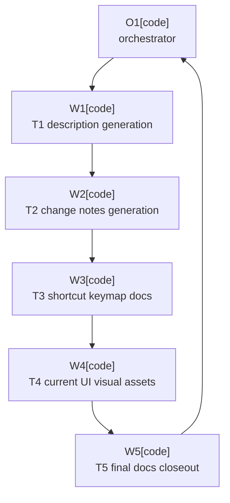

# Plan: Documentation Release Follow-Ups

Plan-ID: PLAN-documentation-release-followups

Status: Implemented

Workers: 1

Filename: `.agents/plans/PLAN-documentation-release-followups.md`

## Readiness

- Plan readiness: Approved and implemented; explicit user approval was recorded from the 2026-05-24 request to "approve and implement PLAN-documentation-release-followups".
- Approved by: Kamil Kiewisz <kamkie@outlook.com>
- Approved at: 2026-05-24T14:20:15+02:00
- Open questions: None.
- Implementation progress: T1 through T5 are complete. Release-preparation upkeep remains tracked by `T-DOC-019`; this plan is not a release pass and should not close that task.

## Status History

- 2026-05-24T14:08:09+02:00: none -> Draft by OpenAI Codex <codex@openai.com>; plan created after documentation backlog priority triage.
- 2026-05-24T14:20:15+02:00: Draft -> Approved by Kamil Kiewisz <kamkie@outlook.com>; explicit user approval recorded.
- 2026-05-24T14:20:16+02:00: Approved -> In Progress by OpenAI Codex <codex@openai.com>; implementation started through approved-plan sub-agent workers.
- 2026-05-24T14:51:09+02:00: In Progress -> Implemented by OpenAI Codex <codex@openai.com>; final documentation closeout completed with `T-DOC-019` left open for release preparation.

## Goal

Finish the deferred user-facing documentation follow-ups left after ADR 0076 by deriving Marketplace metadata from stable sources, confirming shortcut documentation, and adding current reviewed UI visuals only after the UI evidence is current.

## Non-Goals

- Do not change plugin runtime behavior.
- Do not publish to JetBrains Marketplace, create release tags, or dispatch release workflows.
- Do not present concept graphics as final plugin UI evidence.
- Do not change support scope, supported IDE scope, Git-only scope, or AI Assistant dependency policy.

## Priority Reassessment

- P1: `T-DOC-025` and `T-DOC-018`; generate the Marketplace description first, then expand it from stable user-facing docs so manual metadata edits do not drift.
- P2: `T-DOC-026` and `T-DOC-019`; generate Marketplace change notes from `CHANGELOG.md` before release preparation depends on them.
- P3: `T-DOC-023`; shortcut documentation is already caveated, but confirmed macOS wording should land before public release docs are treated as final.
- P4: `T-DOC-020`; final screenshots and animation should wait for current UI validation evidence so concept graphics are not mistaken for product screenshots.
- Retired during triage: `T-DOC-024`, because `README.md` already links to `docs/user-guide.md`.

## Assumptions

- ADR 0076 already authorizes deriving Marketplace text from the rebuilt README and user guide.
- `config/intellij-platform/description.html` and `config/intellij-platform/change-notes.html` remain the files consumed by Gradle plugin metadata.
- `CHANGELOG.md` remains the source of public plugin-facing release notes.
- Final screenshots or animation must come from the current plugin UI, not the concept graphics directory.

## Open Questions

- None.

## Proposed Changes

1. `T1-marketplace-description-generation` completes `T-DOC-025` and `T-DOC-018`.
   Add a small generation path for `config/intellij-platform/description.html` from stable user-facing source docs, then include the feature summary, requirements, AI Assistant dependency, source link, and license note. Expected files: `config/intellij-platform/description.html`, generation script or Gradle wiring, and task/archive updates.

2. `T2-change-notes-generation` completes `T-DOC-026` and prepares `T-DOC-019`.
   Generate `config/intellij-platform/change-notes.html` from `CHANGELOG.md`, preserving release status so unreleased changes are not presented as released. `T-DOC-019` should remain release-preparation upkeep until a release pass confirms the generated notes for the target release.

3. `T3-shortcut-keymap-docs` completes `T-DOC-023`.
   Confirm macOS keymap equivalents from primary JetBrains docs or manual IDE evidence. Update `docs/user-guide.md` only for claims that are backed by evidence; otherwise keep bounded keymap-specific wording.

4. `T4-current-ui-visual-assets` completes `T-DOC-020`.
   Add current light and dark screenshots plus a short animation for the `AI | Commit | Push` control, then link the reviewed assets from `docs/user-guide.md` and the generated Marketplace description. This task depends on `T-VAL-024` or a scoped visual validation pass.

5. `T5-final-docs-closeout` reviews the completed follow-ups.
   Archive completed `T-DOC-*` rows after validation, check for unsupported Marketplace claims, stale concept-image references, task/archive consistency, and changelog eligibility.

## Task Packets

### T1-marketplace-description-generation

- Task label: Marketplace description generation for `T-DOC-025` and `T-DOC-018`.
- Worker lane: implementation.
- Required skills: repository-documentation.
- Goal: Add a maintainable generation path for `config/intellij-platform/description.html` from stable user-facing source docs and update the generated description with the feature summary, requirements, AI Assistant dependency, source link, and Apache-2.0 license note.
- Initial context budget: Read first `AGENTS.md`, `.agents/references/documentation.md`, `.agents/references/execution.md`, `.agents/references/testing.md`, `TASKS.md` rows for `T-DOC-017`, `T-DOC-025`, and `T-DOC-018`, `README.md`, `docs/user-guide.md`, `config/intellij-platform/description.html`, `build.gradle.kts`, and existing scripts under `scripts/` only when choosing where the generator belongs.
- Forbidden inputs: unrelated archived plans, unrelated proposals, unrelated prior worker chat, and broad source scans outside generator wiring unless an escalation trigger fires.
- Write scope: `config/intellij-platform/description.html`, generator script or Gradle wiring needed for that file, focused tests or validation helpers for the generator when the repository has an established pattern, `TASKS.md`, `TASKS_ARCHIVE.md`, and this plan's compact task-result summary.
- Dependencies and sequence: First implementation task; no prior worker output required.
- Validation checks: Run the smallest generator check if added, `pwsh -NoProfile -ExecutionPolicy Bypass -File scripts/validate-docs.ps1`, `pwsh -NoProfile -ExecutionPolicy Bypass -File scripts/ai/validate-agent-artifacts.ps1`, `.\gradlew.bat verifyPluginStructure`, and `git diff --check` when feasible.
- Escalation triggers: Stop and report if generation requires a new release-policy decision, unsupported Marketplace claims, or a write scope outside the listed files.
- Stop conditions: Missing source of truth for a required Marketplace claim, failing validation that cannot be fixed in scope, or conflicting edits in the write scope.
- Expected output: Changed files, generation command or wiring, validation evidence, blockers, review risks, and handoff notes.

### T2-change-notes-generation

- Task label: Marketplace change notes generation for `T-DOC-026` and release-preparation support for `T-DOC-019`.
- Worker lane: implementation.
- Required skills: repository-documentation.
- Goal: Generate `config/intellij-platform/change-notes.html` from `CHANGELOG.md` while preserving `Unreleased` status so unreleased changes are not presented as released, and leave `T-DOC-019` open for final release-pass confirmation.
- Initial context budget: Read first `AGENTS.md`, `.agents/references/documentation.md`, `.agents/references/releases.md`, `.agents/references/execution.md`, `.agents/references/testing.md`, `CHANGELOG.md`, `config/intellij-platform/change-notes.html`, generator code or Gradle wiring created by T1, and `TASKS.md` rows for `T-DOC-026` and `T-DOC-019`.
- Forbidden inputs: unrelated archived plans, unrelated release proposals, unrelated prior worker chat, and broad source scans outside metadata generation unless an escalation trigger fires.
- Write scope: `config/intellij-platform/change-notes.html`, shared generator script or Gradle wiring created for plugin metadata, focused tests or validation helpers for the generator when appropriate, `TASKS.md`, `TASKS_ARCHIVE.md`, and this plan's compact task-result summary.
- Dependencies and sequence: Runs after T1 is complete and reconciled.
- Validation checks: Run the smallest generator check if added, `pwsh -NoProfile -ExecutionPolicy Bypass -File scripts/validate-docs.ps1`, `pwsh -NoProfile -ExecutionPolicy Bypass -File scripts/ai/validate-agent-artifacts.ps1`, `.\gradlew.bat verifyPluginStructure`, and `git diff --check` when feasible.
- Escalation triggers: Stop and report if release-note status semantics need a new maintainer decision or the generator cannot distinguish unreleased from released notes.
- Stop conditions: Missing changelog source section, validation failure that cannot be fixed in scope, or conflicting edits in the write scope.
- Expected output: Changed files, generation command or wiring, validation evidence, blockers, review risks, and handoff notes.

### T3-shortcut-keymap-docs

- Task label: Shortcut keymap documentation for `T-DOC-023`.
- Worker lane: implementation.
- Required skills: repository-documentation, platform-docs-research when primary-source shortcut evidence is needed.
- Goal: Confirm macOS keymap equivalents for the plugin commit and push shortcuts from primary JetBrains documentation or manual IDE evidence, then update `docs/user-guide.md` only for claims backed by evidence.
- Initial context budget: Read first `AGENTS.md`, `.agents/references/documentation.md`, `.agents/references/testing.md`, `docs/user-guide.md`, `src/main/resources/META-INF/plugin.xml`, and `TASKS.md` row for `T-DOC-023`; use primary JetBrains docs or manual IDE evidence only for shortcut confirmation.
- Forbidden inputs: unrelated archived plans, unrelated UI implementation files, unrelated prior worker chat, and broad web search beyond primary shortcut documentation unless primary docs are insufficient.
- Write scope: `docs/user-guide.md`, `TASKS.md`, `TASKS_ARCHIVE.md`, and this plan's compact task-result summary.
- Dependencies and sequence: Runs after T2 is complete and reconciled.
- Validation checks: `pwsh -NoProfile -ExecutionPolicy Bypass -File scripts/validate-docs.ps1`, `pwsh -NoProfile -ExecutionPolicy Bypass -File scripts/ai/validate-agent-artifacts.ps1`, `git diff --check`, and recorded primary-source or manual evidence for the shortcut wording.
- Escalation triggers: Stop and report if exact macOS equivalents cannot be confirmed or if wording would require a product decision.
- Stop conditions: Unsupported shortcut claim, validation failure that cannot be fixed in scope, or conflicting edits in the write scope.
- Expected output: Changed files, shortcut evidence, validation evidence, blockers, review risks, and handoff notes.

### T4-current-ui-visual-assets

- Task label: Current UI visual assets for `T-DOC-020`.
- Worker lane: implementation.
- Required skills: repository-documentation, intellij-plugin-development when running IDE UI evidence.
- Goal: Add current light and dark screenshots plus a short animation of the current `AI | Commit | Push` control, then link reviewed assets from `docs/user-guide.md` and the generated Marketplace description without using concept graphics as final UI evidence.
- Initial context budget: Read first `AGENTS.md`, `.agents/references/documentation.md`, `.agents/references/testing.md`, `docs/user-guide.md`, `config/intellij-platform/description.html`, `TASKS.md` row for `T-DOC-020`, `docs/validation/README.md`, and current validation evidence for `T-VAL-024` if present.
- Forbidden inputs: unrelated archived plans, unrelated concept-image expansion, unrelated prior worker chat, and broad UI implementation reads unless required to produce or validate the assets.
- Write scope: final documentation asset files under the established documentation asset location, `docs/user-guide.md`, generated Marketplace description source or output as needed, `TASKS.md`, `TASKS_ARCHIVE.md`, and this plan's compact task-result summary.
- Dependencies and sequence: Runs after T3 is complete and reconciled; depends on completed `T-VAL-024` evidence or a scoped visual validation pass performed in this task.
- Validation checks: Visual review of the added light screenshot, dark screenshot, and animation; `pwsh -NoProfile -ExecutionPolicy Bypass -File scripts/validate-docs.ps1`; `pwsh -NoProfile -ExecutionPolicy Bypass -File scripts/ai/validate-agent-artifacts.ps1`; `.\gradlew.bat verifyPluginStructure` if Marketplace metadata output changes; and `git diff --check`.
- Escalation triggers: Stop and report if current UI evidence cannot be produced, if IDE automation is blocked, or if no approved asset location exists.
- Stop conditions: Any asset is stale, concept-only, unreviewed, or cannot be linked without unsupported Marketplace claims.
- Expected output: Changed files, visual evidence source, validation evidence, blockers, review risks, and handoff notes.

### T5-final-docs-closeout

- Task label: Final documentation closeout for `PLAN-documentation-release-followups`.
- Worker lane: review.
- Required skills: repository-documentation, plugin-review.
- Goal: Review completed follow-ups, archive completed `T-DOC-*` rows after validation, leave release-preparation upkeep open where appropriate, check unsupported Marketplace claims, stale concept-image references, task/archive consistency, changelog eligibility, and plan readiness for final implementation status.
- Initial context budget: Read first `AGENTS.md`, `.agents/references/documentation.md`, `.agents/references/execution.md`, `.agents/references/releases.md`, `.agents/references/reviews.md`, this plan's task-result summaries, `README.md`, `docs/user-guide.md`, `CHANGELOG.md`, `TASKS.md`, `TASKS_ARCHIVE.md`, `config/intellij-platform/description.html`, and `config/intellij-platform/change-notes.html`.
- Forbidden inputs: unrelated archived plans, unrelated proposals, and unrelated prior worker chat unless a consistency failure requires escalation.
- Write scope: `TASKS.md`, `TASKS_ARCHIVE.md`, this plan file, `.agents/plans/README.md`, and small documentation fixes required by the review findings.
- Dependencies and sequence: Runs after T4 is complete and reconciled.
- Validation checks: `pwsh -NoProfile -ExecutionPolicy Bypass -File scripts/validate-docs.ps1`, `pwsh -NoProfile -ExecutionPolicy Bypass -File scripts/ai/validate-agent-artifacts.ps1`, `.\gradlew.bat verifyPluginStructure`, and `git diff --check`.
- Escalation triggers: Stop and report if release workflow scope is required, if a completed task lacks validation evidence, or if a new ADR or user decision is required.
- Stop conditions: Unsupported release or Marketplace claims, stale final visual evidence, task/archive inconsistency that cannot be fixed in scope, or validation failure that cannot be resolved.
- Expected output: Reviewed diff, task/archive updates, final plan status recommendation, validation evidence, blockers, review risks, and handoff notes.

## Task Result Summaries

- `T1-marketplace-description-generation` completed `T-DOC-025` and `T-DOC-018`.
  Changed `scripts/generate-intellij-platform-description.ps1` and `config/intellij-platform/description.html`, then moved only those two task rows to `TASKS_ARCHIVE.md`.
  The generator derives the Marketplace description from `README.md`, `docs/user-guide.md`, and `LICENSE`, and fails when required source claims disappear.
  Validation evidence: `pwsh -NoProfile -ExecutionPolicy Bypass -File scripts/generate-intellij-platform-description.ps1 -Check` passed; final repository validation evidence is recorded in the W1 handoff.
  Review risks: generated text intentionally avoids Marketplace publication status, support guarantees, screenshots, and release-note claims; next worker can reuse the script pattern or split shared metadata generation during T2.
- `T2-change-notes-generation` completed `T-DOC-026` and left `T-DOC-019` open for final release-pass confirmation.
  Changed `scripts/generate-intellij-platform-change-notes.ps1` and `config/intellij-platform/change-notes.html`, then moved only `T-DOC-026` to `TASKS_ARCHIVE.md`.
  The generator derives Marketplace change notes from `CHANGELOG.md`, omits empty `Unreleased` content, labels non-empty `Unreleased` notes as not yet included in a Marketplace release, and fails when the changelog lacks `Unreleased` or a released version section.
  Validation evidence: `pwsh -NoProfile -ExecutionPolicy Bypass -File scripts/generate-intellij-platform-change-notes.ps1 -Check`, `pwsh -NoProfile -ExecutionPolicy Bypass -File scripts/validate-docs.ps1`, `pwsh -NoProfile -ExecutionPolicy Bypass -File scripts/ai/validate-agent-artifacts.ps1`, `.\gradlew.bat verifyPluginStructure`, and `git diff --check` passed.
  Review risks: generation flattens Keep a Changelog category headings into one Marketplace list; `T-DOC-019` remains open to confirm the generated notes during final release preparation.
- `T3-shortcut-keymap-docs` completed `T-DOC-023`.
  Changed `docs/user-guide.md`, then moved only `T-DOC-023` to `TASKS_ARCHIVE.md`.
  Shortcut evidence: `src/main/resources/META-INF/plugin.xml` mirrors `CheckinProject` and `Vcs.Push`; JetBrains IntelliJ IDEA 2026.1 Predefined macOS keymap lists global VCS `Commit...` as `Cmd+K` and `Push...` as `Cmd+Shift+K`; JetBrains Main version control shortcuts lists the matching Windows/Linux defaults as `Ctrl+K` and `Ctrl+Shift+K`.
  Validation evidence: `pwsh -NoProfile -ExecutionPolicy Bypass -File scripts/validate-docs.ps1`, `pwsh -NoProfile -ExecutionPolicy Bypass -File scripts/ai/validate-agent-artifacts.ps1`, and `git diff --check` passed.
  Review risks: wording is limited to predefined JetBrains keymap defaults; custom keymaps remain keymap-specific and must be confirmed in the active IDE.
- `T4-current-ui-visual-assets` completed `T-DOC-020`.
  Changed `src/test/kotlin/pl/devopssolutions/aicommitall/actions/AiCommitAllControlAssetGeneratorTest.kt`, `docs/assets/user-guide/ai-commit-all-control-light.png`, `docs/assets/user-guide/ai-commit-all-control-dark.png`, `docs/assets/user-guide/ai-commit-all-control-running.gif`, `docs/user-guide.md`, `scripts/generate-intellij-platform-description.ps1`, and `config/intellij-platform/description.html`, then moved only `T-DOC-020` to `TASKS_ARCHIVE.md`.
  Visual evidence source: the focused generator test instantiates the actual runtime `AiCommitAllThreeSectionControl`, updates real enabled and running states, renders through Swing painting with `JBColor.setDark`, and writes reviewed light and dark PNGs plus a 12-frame GIF; concept graphics were not used.
  Blocked evidence path recorded: `.\gradlew.bat releaseMatrixUiTest "-PideProducts=IU" "-PideVersion=2026.1.2"` failed before IDE startup because the cached IU layout was Linux and lacked `idea64.exe`, so Starter screenshots were not used.
  Validation evidence: `$env:AICOMMITALL_GENERATE_USER_GUIDE_ASSETS='true'; .\gradlew.bat test --tests "pl.devopssolutions.aicommitall.actions.AiCommitAllControlAssetGeneratorTest"` passed and generated assets; final repository validation evidence is recorded in the W4 handoff.
  Review risks: assets prove deterministic runtime Swing control rendering only; they do not close the remaining full manual IDE matrix tracked by `T-VAL-024`.
- `T5-final-docs-closeout` completed final plan review and archived `T-DOC-017`.
  Changed `README.md`, `CHANGELOG.md`, `TASKS.md`, `TASKS_ARCHIVE.md`, `.agents/plans/PLAN-documentation-release-followups.md`, `.agents/plans/README.md`, and regenerated `config/intellij-platform/change-notes.html`.
  Review result: no unsupported Marketplace publication, support, release, or validation-completion claims found; the stale README visual-assets limitation was replaced with a user-guide asset reference; `T-DOC-019` remains open for the final release pass.
  Validation evidence: `pwsh -NoProfile -ExecutionPolicy Bypass -File scripts/generate-intellij-platform-description.ps1 -Check`, `pwsh -NoProfile -ExecutionPolicy Bypass -File scripts/generate-intellij-platform-change-notes.ps1 -Check`, `pwsh -NoProfile -ExecutionPolicy Bypass -File scripts/validate-docs.ps1`, `pwsh -NoProfile -ExecutionPolicy Bypass -File scripts/ai/validate-agent-artifacts.ps1`, `.\gradlew.bat verifyPluginStructure`, and `git diff --check` passed.
  Review risks: this closeout does not perform release preparation, Marketplace publication, manual release validation, or the full `T-VAL-024` matrix.

## Execution Model

- Execute sequentially with one active worker at a time because generation, source docs, task closeout, and Marketplace metadata touch overlapping files.
- Use a fresh approved-plan task worker for each implementation or review task after approval.
- Keep work on the current branch.

## Execution Graph

## Validation

- `pwsh -NoProfile -ExecutionPolicy Bypass -File scripts/validate-docs.ps1`
- `pwsh -NoProfile -ExecutionPolicy Bypass -File scripts/ai/validate-agent-artifacts.ps1`
- `.\gradlew.bat verifyPluginStructure` after generated plugin metadata changes.
- `git diff --check`
- Manual or primary-source evidence for macOS shortcut wording.
- Visual review for final screenshots and animation.

## Risks

- A generator can overfit the current docs and make future release notes harder to maintain.
- Marketplace text can accidentally imply publication, support guarantees, or validation coverage that does not exist yet.
- Screenshot and animation work can drift from current UI if it uses concept assets or stale automation output.
- macOS shortcut wording may require manual IDE evidence if primary docs do not resolve the exact keymap mapping.

## Handoff Notes

- `T-DOC-024` was archived during plan creation because `README.md` already links to `docs/user-guide.md`.
- `T-DOC-019` should stay open until a release pass confirms generated change notes for the target release.
- `T-DOC-020` was closed using approved scoped visual validation; full manual release visual validation remains tracked by `T-VAL-024`.
