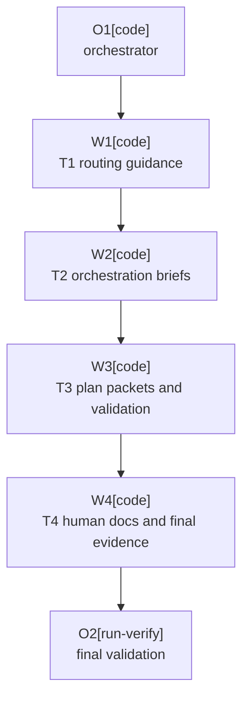

# Plan: Execution Context Discipline

Plan-ID: PLAN-execution-context-discipline

Status: Draft

Workers: 1

Filename: `.agents/plans/PLAN-execution-context-discipline.md`

## Readiness

- Plan readiness: Draft companion plan for proposed `adr-0075`; implementation is blocked until ADR acceptance and later explicit plan approval.
- Open questions: None.
- Implementation progress: Not started.

## Status History

- 2026-05-23T18:07:42+02:00: none -> Draft by OpenAI Codex <codex@openai.com>; companion plan created for proposed ADR 0075.

## Goal

Implement accepted ADR 0075 by aligning execution routing, one-off delegation, task-packet context discipline, orchestrator duties, worker-event tiers, validation checks, and human-facing request guidance.

## Non-Goals

- Do not change plugin runtime behavior.
- Do not change ADR gates, plan approval gates, one-commit-per-approved-plan-task rules, single-branch topology, changelog ownership, or disjoint write-scope requirements.
- Do not add durable `.agents/runs/` logs or authorize per-worker git worktrees.
- Do not import generic subagent catalogs or create broad new skills.

## Assumptions

- Proposed `adr-0075` is accepted before this plan is approved or implemented.
- Documentation-only guidance changes do not require Gradle or plugin build validation.
- Validator changes are covered by agent artifact validation, docs validation, and `git diff --check`.

## Open Questions

- None.

## Proposed Changes

- Update `AGENTS.md` to align one-off delegation wording with `.agents/references/orchestration.md`.
- Add a direct one-off, plan, and proposal routing matrix to `.agents/references/execution.md` and `.agents/references/planning.md`.
- Clarify in planning and lifecycle guidance that narrow implementation of already-decided behavior may use the direct one-off loop.
- Add a compact one-off worker brief shape and more operational orchestrator duties to `.agents/references/orchestration.md`.
- Tier worker-event logging so approved-plan workers and one-off write workers keep full structured events, while read-only one-off sidecars may use compact start and result summaries.
- Replace broad default task-packet context in `.agents/plans/PLAN_TEMPLATE.md` with explicit read-first and escalation guidance.
- Update `.agents/plans/README.md` to match the calibrated task-packet and one-off delegation guidance.
- Extend `scripts/ai/validate-agent-artifacts.ps1` with deterministic packet-quality checks.
- Update `docs/WORKING_WITH_AI.md` and `docs/DEVELOPMENT_LIFECYCLE.md` so human-facing guidance matches the calibrated execution paths.
- Update `docs/decisions/README.md` when ADR 0075 is accepted and again when implementation evidence changes.

## Task Packets

### Task Packet: T1-routing-guidance

Task id: T1-routing-guidance

Lane: implementation

Required skills:

- repository-documentation

Goal:

- Align entry-point, execution, planning, and lifecycle guidance around the calibrated direct one-off, plan, and proposal routing rules.

Initial context budget:

- Read first:
    - `AGENTS.md`
    - `.agents/references/documentation.md`
    - `.agents/references/execution.md`
    - `.agents/references/planning.md`
    - `docs/DEVELOPMENT_LIFECYCLE.md`
    - accepted `docs/decisions/adr-0075-calibrate-ai-execution-routing-and-context-discipline.md`

Allowed inputs:

- Plan header, readiness summary, execution graph, and this task packet.
- The files listed in `Initial context budget`.

Forbidden inputs:

- Unrelated archived plans.
- Unrelated proposals or ADRs beyond direct references named by ADR 0075.
- Previous worker chat beyond the orchestrator handoff summary.

Write scope:

- `AGENTS.md`
- `.agents/references/execution.md`
- `.agents/references/planning.md`
- `docs/DEVELOPMENT_LIFECYCLE.md`

Dependencies:

- ADR 0075 accepted.

Validation:

- Content review against accepted ADR 0075.
- `pwsh -NoProfile -ExecutionPolicy Bypass -File scripts/ai/validate-agent-artifacts.ps1`
- `pwsh -NoProfile -ExecutionPolicy Bypass -File scripts/validate-docs.ps1`
- `git diff --check`

Escalation triggers:

- Load `.agents/references/orchestration.md` only if delegation wording needs exact cross-reference alignment.
- Stop and report if routing guidance would weaken an accepted ADR or plan approval gate.

Stop conditions:

- ADR 0075 is not accepted.
- The routing matrix would imply implementation can bypass ADR, plan, or missing-input gates.

Expected output:

- Changed files.
- Validation evidence.
- Blockers.
- Review risks.
- Handoff notes.

Result summary:

- Status: pending
- Worker:
- Changed files or reviewed diff:
- Validation evidence:
- Blockers:
- Review risks:
- Handoff notes:

### Task Packet: T2-orchestration-briefs

Task id: T2-orchestration-briefs

Lane: implementation

Required skills:

- repository-documentation

Goal:

- Add a compact one-off worker brief shape, operational orchestrator responsibilities, and tiered event logging to orchestration guidance.

Initial context budget:

- Read first:
    - `AGENTS.md`
    - `.agents/references/documentation.md`
    - `.agents/references/orchestration.md`
    - accepted `docs/decisions/adr-0075-calibrate-ai-execution-routing-and-context-discipline.md`

Allowed inputs:

- Plan header, readiness summary, execution graph, and this task packet.
- The files listed in `Initial context budget`.

Forbidden inputs:

- Unrelated archived plans.
- Raw worker transcripts not needed to update the standing guidance.
- Implementation evidence from unrelated task packets.

Write scope:

- `.agents/references/orchestration.md`

Dependencies:

- T1-routing-guidance.

Validation:

- Content review against accepted ADR 0075.
- `pwsh -NoProfile -ExecutionPolicy Bypass -File scripts/ai/validate-agent-artifacts.ps1`
- `git diff --check`

Escalation triggers:

- Load `.agents/references/execution.md` only if orchestration wording needs execution-loop cross-reference alignment.
- Stop if event-tiering would conflict with ADR 0058.

Stop conditions:

- ADR 0075 is not accepted.
- New orchestration wording would allow write workers without explicit disjoint write scopes.

Expected output:

- Changed files.
- Validation evidence.
- Blockers.
- Review risks.
- Handoff notes.

Result summary:

- Status: pending
- Worker:
- Changed files or reviewed diff:
- Validation evidence:
- Blockers:
- Review risks:
- Handoff notes:

### Task Packet: T3-plan-packets-and-validation

Task id: T3-plan-packets-and-validation

Lane: implementation

Required skills:

- repository-documentation

Goal:

- Tighten plan packet template context fields and add deterministic packet-quality validation.

Initial context budget:

- Read first:
    - `AGENTS.md`
    - `.agents/references/documentation.md`
    - `.agents/plans/README.md`
    - `.agents/plans/PLAN_TEMPLATE.md`
    - `scripts/ai/validate-agent-artifacts.ps1`
    - accepted `docs/decisions/adr-0075-calibrate-ai-execution-routing-and-context-discipline.md`

Allowed inputs:

- Plan header, readiness summary, execution graph, and this task packet.
- The files listed in `Initial context budget`.

Forbidden inputs:

- Unrelated archived plans.
- Unrelated validator history or old validation logs.
- Prior worker chat beyond the orchestrator handoff summary.

Write scope:

- `.agents/plans/README.md`
- `.agents/plans/PLAN_TEMPLATE.md`
- `scripts/ai/validate-agent-artifacts.ps1`

Dependencies:

- T2-orchestration-briefs.

Validation:

- `pwsh -NoProfile -ExecutionPolicy Bypass -File scripts/ai/validate-agent-artifacts.ps1`
- `pwsh -NoProfile -ExecutionPolicy Bypass -File scripts/validate-docs.ps1`
- `git diff --check`

Escalation triggers:

- Load `.agents/references/planning.md` only if plan catalog or template wording needs exact owner-guide alignment.
- Load `scripts/validate-docs.ps1` only if top-level docs validation wrapper behavior must change.

Stop conditions:

- ADR 0075 is not accepted.
- Proposed validation would fail existing valid draft plans or require subjective quality judgments.

Expected output:

- Changed files.
- Validation evidence.
- Blockers.
- Review risks.
- Handoff notes.

Result summary:

- Status: pending
- Worker:
- Changed files or reviewed diff:
- Validation evidence:
- Blockers:
- Review risks:
- Handoff notes:

### Task Packet: T4-human-docs-and-final-evidence

Task id: T4-human-docs-and-final-evidence

Lane: implementation

Required skills:

- repository-documentation

Goal:

- Align human-facing request guidance, run final validation, and update ADR implementation evidence when the plan is complete.

Initial context budget:

- Read first:
    - `AGENTS.md`
    - `.agents/references/documentation.md`
    - `docs/WORKING_WITH_AI.md`
    - `docs/DEVELOPMENT_LIFECYCLE.md`
    - `docs/decisions/README.md`
    - accepted `docs/decisions/adr-0075-calibrate-ai-execution-routing-and-context-discipline.md`

Allowed inputs:

- Plan header, readiness summary, execution graph, and this task packet.
- T1 through T3 result summaries.
- The files listed in `Initial context budget`.

Forbidden inputs:

- Unrelated archived proposals or plans.
- Raw worker transcripts.

Write scope:

- `docs/WORKING_WITH_AI.md`
- `docs/DEVELOPMENT_LIFECYCLE.md`
- `docs/decisions/README.md`
- `.agents/plans/PLAN-execution-context-discipline.md`

Dependencies:

- T3-plan-packets-and-validation.

Validation:

- `pwsh -NoProfile -ExecutionPolicy Bypass -File scripts/ai/validate-agent-artifacts.ps1`
- `pwsh -NoProfile -ExecutionPolicy Bypass -File scripts/validate-docs.ps1`
- `git diff --check`

Escalation triggers:

- Load `.agents/references/orchestration.md`, `.agents/references/execution.md`, or `.agents/references/planning.md` only to resolve exact wording mismatches found during final review.

Stop conditions:

- ADR 0075 is not accepted.
- Human-facing docs would imply delegation is mandatory or bypasses gates.
- Final validation fails for reasons outside this plan's write scope.

Expected output:

- Changed files.
- Validation evidence.
- Blockers.
- Review risks.
- Handoff notes.

Result summary:

- Status: pending
- Worker:
- Changed files or reviewed diff:
- Validation evidence:
- Blockers:
- Review risks:
- Handoff notes:

## Execution Model

- Keep the plan sequential with `Workers: 1`.
- Use one orchestrator for the whole plan.
- Use fresh task context per task when delegation is available.
- Do not dispatch implementation before ADR 0075 is accepted and this plan is explicitly approved.
- The orchestrator updates plan state and ADR implementation evidence.

## Execution Graph

## Validation

- `pwsh -NoProfile -ExecutionPolicy Bypass -File scripts/ai/validate-agent-artifacts.ps1`
- `pwsh -NoProfile -ExecutionPolicy Bypass -File scripts/validate-docs.ps1`
- `git diff --check`

## Risks

- Routing wording could accidentally weaken plan gates for work that really needs a plan.
- Event-tiering could be misread as removing structured events for one-off write workers.
- Packet validation can become too subjective if it checks prose quality instead of deterministic placeholder and scope rules.
- Updating human-facing docs can overstate delegation if no-delegation instructions and environment limits are not preserved.

## Handoff Notes

- This plan is intentionally blocked until proposed ADR 0075 is accepted and the plan is explicitly approved.
- Do not update `CHANGELOG.md`; this is internal AI workflow guidance only.
