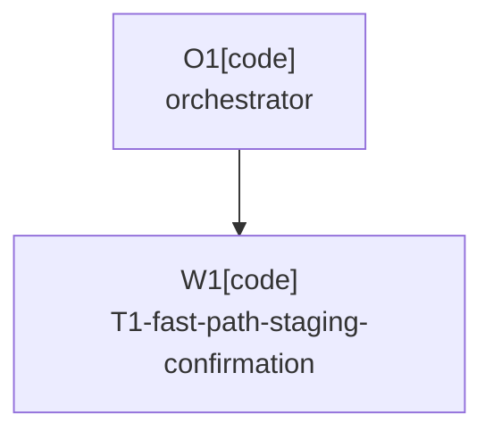

# Plan: Fast-Path Staging Confirmation

Plan-ID: PLAN-fast-path-staging-confirmation

Status: Approved

Workers: 1

Filename: `.agents/plans/PLAN-fast-path-staging-confirmation.md`

## Readiness

- Plan readiness: Approved and ready for implementation in the user-requested new Codex task.
- Approved by: Kamil Kiewisz <kamkie@outlook.com>
- Approved at: 2026-07-10T15:33:34+02:00
- Open questions: No.
- Implementation progress: Not started; handoff to a new Codex task requested.

## Status History

- 2026-07-10T15:07:47+02:00: none -> Draft by Codex <codex@openai.com>; replaced the rejected timeout/cancellation approach with a staging-path fix.
- 2026-07-10T15:32:00+02:00: Draft -> Draft by Codex <codex@openai.com>; corrected the AI handoff after verifying that the installed JetBrains AI action reads included changes from `CommitWorkflowUi`, not from the Git index or handler state.
- 2026-07-10T15:33:34+02:00: Draft -> Approved by Kamil Kiewisz <kamkie@outlook.com>; explicitly requested implementation in a new Codex task.

## Goal

Continue from successful Git staging without blocking background preparation on IntelliJ changelist and staging-tracker refresh callbacks when the Git index already proves every selected path is staged or HEAD-identical. On the EDT turn that invokes JetBrains AI, first apply the index-confirmed tracker state and included roots to the Commit UI, verify that the UI exposes the expected staged changes, and only then invoke AI generation.

## Non-Goals

- Cancel or time out an AI action merely because its EDT callback is delayed.
- Run the AI Assistant action outside the EDT or change its modality policy.
- Claim to fix EDT starvation caused by IntelliJ or another plugin.
- Change which files are selected, staged, committed, or pushed.
- Weaken fail-closed handling when the Git index cannot confirm all expected paths.

## Assumptions

- `git add` completion followed by direct per-path Git index confirmation is stronger staging evidence than waiting for eventually consistent IDE tracker callbacks.
- The installed JetBrains AI Assistant `Vcs.LLMCommitMessageAction` reads `CommitWorkflowUi.includedChanges` and `includedUnversionedFiles`; assigning only `GitStageCommitWorkflowHandler.state` is insufficient because that setter does not update `GitStageCommitPanel`.
- The index-confirmed tracker state and included roots therefore form a required Commit UI model handoff, not a best-effort visual refresh.
- `ChangeListManager` and `GitStageTracker` refresh callbacks remain useful for eventual IDE consistency, but they do not need to block background preparation after direct index confirmation succeeds.
- If immediate index confirmation is incomplete or fails, the existing bounded IDE refresh and retry path remains the fallback.

## Open Questions

- None.

## Proposed Changes

### T1-fast-path-staging-confirmation

- Add regression tests proving that successful direct index confirmation skips `waitForStatusRefresh()` and `refreshTrackerState()` while still returning an index-confirmed state.
- Reorder staging confirmation so `GitFileUtils.addPaths` is followed by immediate Git index confirmation for all expected paths.
- When every path is `STAGED` or `HEAD_IDENTICAL`, synthesize the required tracker state from the current tracker snapshot and carry it, its included roots, and the expected staged paths into the AI-phase EDT handoff.
- In the same EDT callback that invokes `Vcs.LLMCommitMessageAction`, first assign the confirmed handler state, call `GitStageCommitPanel.setTrackerState(...)` and `setIncludedRoots(...)`, and verify that `CommitWorkflowUi.includedChanges` exposes every expected staged path. Invoke AI only after that required model handoff succeeds; fail closed otherwise.
- Keep unrelated visual repaint or eventual tracker refresh work asynchronous and best-effort, with diagnostics, after the required inclusion model is current.
- Preserve the current blocking refresh/retry path when any path remains `UNCONFIRMED` or the direct Git check fails.
- Add step timing diagnostics for `git add`, direct index confirmation, the fallback IDE refresh, the EDT Commit UI model handoff, and the included-path verification so future logs distinguish them.
- Extend the fake AI action to record the paths returned by `CommitWorkflowUi` at invocation, and add a staging-enabled integration assertion proving AI receives the intended modified, deleted, renamed, and multi-root changes through that API.
- Update `REQ-SEL-008` to state that direct post-stage index confirmation may precede IDE tracker refresh but that the Commit UI inclusion model MUST be current before AI invocation, and add an `Unreleased` changelog entry.

## Task Packets

### Task Packet: T1-fast-path-staging-confirmation

Task id: T1-fast-path-staging-confirmation

Lane: implementation

Required skills:

- `intellij-plugin-development`
- `kotlin-plugin-style`
- `plugin-test-tdd`
- `repository-documentation`

Goal:

- A staging run whose Git index immediately confirms every expected path reaches AI preparation without waiting for IntelliJ status/tracker refresh callbacks; unconfirmed paths retain the existing bounded fallback and fail-closed behavior.

Initial context budget:

- Read first:
  - This plan's header, readiness summary, execution graph, and this task packet.
  - `AGENTS.md`.
  - `src/main/kotlin/pl/devopssolutions/aicommitall/workflow/GitStageConfirmation.kt`.
  - `src/test/kotlin/pl/devopssolutions/aicommitall/workflow/GitStageConfirmationTest.kt`.
  - `src/main/kotlin/pl/devopssolutions/aicommitall/workflow/ReflectiveCommitWorkflowSynchronizer.kt`.
  - `src/main/kotlin/pl/devopssolutions/aicommitall/workflow/AiCommitAllWorkflowCoordinator.kt`.
  - `src/integrationTest/kotlin/pl/devopssolutions/aicommitall/integration/fakeai/FakeLlmCommitMessageAction.kt`.
  - `src/integrationTest/kotlin/pl/devopssolutions/aicommitall/integration/fakeai/FakeAiAssistantProbe.kt`.
  - `src/integrationTest/kotlin/pl/devopssolutions/aicommitall/integration/ReleaseMatrixUiHarnessTest.kt`.
  - `docs/specification.md` requirements `REQ-SEL-004`, `REQ-SEL-005`, and `REQ-SEL-008`.
- Escalate to:
  - `src/main/kotlin/pl/devopssolutions/aicommitall/vcs/GitStageSelectionItems.kt` only if staged-path predicates require adjustment.
  - IntelliJ 2026.x GitStageTracker sources only if reading the current snapshot has compatibility ambiguity.

Allowed inputs:

- Files and artifacts named in `Read first`.
- Files named in `Escalate to` only after the matching trigger fires.
- The retained IDEA trace showing about 4.3 seconds of bounded refresh waits before direct index confirmation succeeded.

Forbidden inputs:

- Unrelated archived plans.
- Previous worker chat beyond the orchestrator handoff summary.
- AI completion, commit execution, push, release, or Marketplace implementation files other than the explicitly named AI-phase coordinator and fake-action integration seam.

Write scope:

- `src/main/kotlin/pl/devopssolutions/aicommitall/workflow/GitStageConfirmation.kt`.
- `src/test/kotlin/pl/devopssolutions/aicommitall/workflow/GitStageConfirmationTest.kt`.
- `src/main/kotlin/pl/devopssolutions/aicommitall/workflow/ReflectiveCommitWorkflowSynchronizer.kt`.
- `src/test/kotlin/pl/devopssolutions/aicommitall/workflow/ReflectiveCommitWorkflowSynchronizerTest.kt`.
- `src/main/kotlin/pl/devopssolutions/aicommitall/workflow/AiCommitAllWorkflowCoordinator.kt`.
- `src/test/kotlin/pl/devopssolutions/aicommitall/workflow/AiCommitAllWorkflowRunnerTest.kt`.
- `src/integrationTest/kotlin/pl/devopssolutions/aicommitall/integration/fakeai/FakeLlmCommitMessageAction.kt`.
- `src/integrationTest/kotlin/pl/devopssolutions/aicommitall/integration/fakeai/FakeAiAssistantProbe.kt`.
- `src/integrationTest/kotlin/pl/devopssolutions/aicommitall/integration/ReleaseMatrixUiHarnessTest.kt`.
- Escalation-only source/test files explicitly named above.
- `docs/specification.md`.
- `CHANGELOG.md`.
- This plan's status, result summary, and continuity sections.

Dependencies:

- Plan status must be `Approved` with `Approved by:` and `Approved at:` recorded.
- Diagnostic commit `0a3820f` must remain in the implementation base.

Validation:

- Red first: a test expecting direct index-confirmed staging to avoid both blocking IDE refresh calls.
- Red first: a test proving AI is not invoked until the required Commit UI model handoff exposes every expected staged path.
- Green: fast-path staged, HEAD-identical, multi-root, and mixed-path cases; fallback unconfirmed, Git error, retry, and final failure cases.
- `./gradlew.bat test --tests "*GitStageConfirmationTest"`.
- `./gradlew.bat test`.
- `./gradlew.bat spotlessCheck detekt`.
- `./gradlew.bat buildPlugin`.
- The focused staging-enabled release-matrix integration test, including an assertion on the exact paths observed by the fake `Vcs.LLMCommitMessageAction` through `CommitWorkflowUi`.
- `pwsh -NoProfile -ExecutionPolicy Bypass -File scripts/validate-docs.ps1`.
- `pwsh -NoProfile -ExecutionPolicy Bypass -File scripts/ai/validate-agent-artifacts.ps1`.
- `git diff --check`.
- Manual sandbox scenario when practical: trigger Commit and switch away immediately; verify the plugin no longer spends the two bounded IDE-refresh waits before scheduling AI, the required Commit UI model handoff completes before AI invocation, and the generated message reflects the selected staged content.
- Self-review per `.agents/references/reviews.md`, prioritizing incomplete staging, HEAD-identical paths, multi-root selection, and fail-closed fallback.

Escalation triggers:

- Load IntelliJ 2026.x GitStageTracker sources if a current tracker snapshot cannot be safely used as the base for index-confirmed state synthesis.
- Load `GitStageSelectionItems.kt` if immediate Git index checks cannot distinguish staged, HEAD-identical, and worktree-only paths with the existing operations.
- Stop and report if the required Commit UI model cannot be updated and verified on the same EDT turn as AI invocation without waiting for another refresh callback.
- Stop and report if a test shows the fast path can commit less than the selected scope.
- Stop and report if the change requires modifying commit execution or push behavior.

Stop conditions:

- The plan is not explicitly approved.
- Direct index confirmation cannot prove every expected path before AI generation.
- `CommitWorkflowUi.includedChanges` does not expose every expected staged path immediately before the AI action is invoked.
- The fallback path would become less bounded or less fail-closed.
- Implementation would require proprietary AI Assistant APIs.

Expected output:

- Focused staging implementation and regression tests.
- TDD red/green evidence and full validation results.
- Self-review evidence for staging correctness and fallback safety.
- One plan-task commit with worker/orchestrator metadata.
- Structured worker events and orchestrator reconciliation.
- Updated specification, changelog, plan status, and result summary.
- Any blockers, residual IDE compatibility risk, and manual sandbox gap.

Result summary:

- Status: pending
- Worker: pending new-task dispatch
- Changed files or reviewed diff: pending implementation
- Validation evidence: pending implementation per `.agents/references/testing.md`
- Self-review evidence: pending implementation per `.agents/references/reviews.md`
- Commit: pending implementation
- Worker events: pending implementation
- Orchestrator reconciliation: pending implementation
- Changelog/docs/spec/tasks updates: pending implementation
- Blockers: none at approval handoff
- Review risks: Commit UI inclusion state must be current before AI invocation; residual EDT starvation remains out of scope.
- Handoff notes and next action: New Codex task moves the plan to `In Progress`, dispatches T1 to its implementation sub-agent, and completes validation and reconciliation.

## Execution Model

- `Workers: 1`; after approval, one fresh implementation sub-agent executes T1 under the orchestrator.
- If sub-agents are unavailable or forbidden, stop before implementation rather than executing this approved-plan task locally.
- Use the current branch; the worker owns only the task packet write scope and the orchestrator owns plan status and reconciliation.
- Commit T1 after implementation, validation, and self-review with `Project-Source: plan-task`, `Project-Plan: PLAN-fast-path-staging-confirmation`, and `Project-Plan-Task: T1-fast-path-staging-confirmation`.

## Long-Run Continuity

- Resume docs reread: after compaction, interruption, resume, or handoff, reread `AGENTS.md`; this plan's header, `## Readiness`, `## Execution Model`, current task packet, and result summary; `.agents/references/execution.md`; `.agents/references/orchestration.md`; `.agents/references/testing.md`; `.agents/references/reviews.md`; and `.gitmessage` before committing.
- Current task or wave: approved; awaiting implementation task startup.
- Completed commits: diagnostic baseline `0a3820f`.
- Plan status and readiness: Approved; ready for implementation in the new Codex task.
- Validation and self-review state: plan validation pending.
- Worker event state: no implementation worker dispatched.
- Orchestrator reconciliation state: not applicable until implementation.
- Changelog, docs, spec, task, or plan updates: plan and active-plan catalog only.
- Blockers or open questions: none.
- Next action: the new Codex task moves the plan to `In Progress` and dispatches T1 to its implementation sub-agent.
- Context handoff notes: the rejected timeout/cancellation plan was removed. This plan changes only staging confirmation order and preserves normal AI execution.

## Execution Graph

## Validation

- Validate plan structure, links, and Markdown with the repository documentation and agent-artifact scripts.
- During implementation, run the task packet's targeted TDD, full Gradle, formatting, static-analysis, packaging, docs, and diff checks.
- Keep the focus-switch reproduction as manual evidence; automated tests prove the plugin skips its blocking waits but cannot reproduce Windows/IDE scheduling.

## Risks

- Staging correctness: a stale tracker base must be fully amended with direct index confirmations for every expected path before continuation.
- HEAD-identical paths: they must remain satisfied without creating synthetic staged content.
- Fallback regression: any unconfirmed path must still take the bounded refresh/retry path and eventually stop rather than invoking AI.
- AI visibility: the installed AI action reads the Commit UI inclusion model, so handler-only state assignment or a later best-effort `setTrackerState` callback would produce stale or empty AI input.
- Residual EDT delay: eliminating plugin-owned refresh waits saves the bounded refresh time but cannot make a starved EDT execute sooner; the historical 134-second EDT queue delay remains a separate problem and the diagnostics from `0a3820f` remain necessary.

## Handoff Notes

- No ADR is required: `REQ-SEL-008` already authorizes index-confirmed state and asynchronous best-effort visual refresh; this plan moves that confirmation earlier.
- This plan deliberately does not cancel delayed AI work. It also does not claim that Git index confirmation alone is visible to JetBrains AI; the required Commit UI model handoff is part of the fix.
