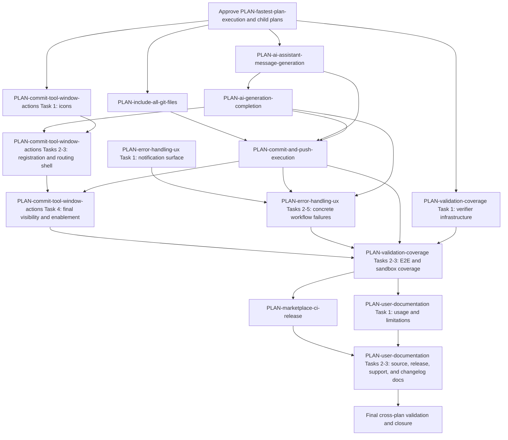
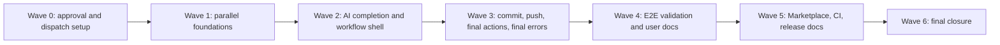

# Plan: Fastest Plan Execution

Plan-ID: PLAN-fastest-plan-execution

Status: Approved

Filename: `.agents/plans/PLAN-fastest-plan-execution.md`

## Readiness

- Plan readiness: Approved; ready to orchestrate implementation.
- Approved by: Kamil Kiewisz <kamkie@outlook.com>
- Open questions: None.
- Implementation progress: Not started.

## Goal

Run all active implementation plans in the fastest safe order by making cross-plan dependencies explicit, using parallel workers only where write scopes and behavior dependencies are disjoint, and preserving the repository rule that every plan task is validated, reviewed, and committed before the next dependent task starts.

## Non-Goals

- Do not implement child-plan behavior in this plan.
- Do not mark child plans `Approved` without explicit user approval.
- Do not bypass per-task validation, review, or commit requirements from `.agents/references/planning.md` and `.agents/references/execution.md`.
- Do not parallelize tasks that share commit workflow state, Gradle configuration, plugin descriptor entries, or user-facing behavior in a way that would create merge or safety risk.

## Assumptions

- The child plans remain the source of implementation details and task acceptance criteria.
- This plan is the source of cross-plan ordering and parallelization decisions.
- A later user request may explicitly approve this plan and all named child plans in one statement; until then, all implementation remains blocked.
- The orchestrator owns plan state, task dispatch, validation evidence, changelog maintenance, integration review, and commit verification.
- Parallel workers must receive disjoint file ownership and must stop if they discover a dependency on another worker's unmerged output.

## Open Questions

No open plan questions.

## Dependency Graph

Current child plans do not encode a full cross-plan dependency graph. Their dependencies are mostly implicit in goals and handoff notes. Use this graph during execution:

### Execution Graph

### Wave Graph

### Dependency Table

| Plan                                   | Upstream Dependencies                                                                                                            | Downstream Dependents                                                                                                      | Parallel Notes                                                                                                             |
|----------------------------------------|----------------------------------------------------------------------------------------------------------------------------------|----------------------------------------------------------------------------------------------------------------------------|----------------------------------------------------------------------------------------------------------------------------|
| `PLAN-include-all-git-files`           | None                                                                                                                             | `PLAN-commit-and-push-execution`, `PLAN-commit-tool-window-actions`, `PLAN-validation-coverage`, `PLAN-user-documentation` | Can run in parallel with AI action discovery if source package ownership is disjoint.                                      |
| `PLAN-ai-assistant-message-generation` | None                                                                                                                             | `PLAN-ai-generation-completion`, `PLAN-commit-and-push-execution`, `PLAN-validation-coverage`, `PLAN-user-documentation`   | Can run in parallel with file-selection work if source package ownership is disjoint.                                      |
| `PLAN-ai-generation-completion`        | `PLAN-ai-assistant-message-generation`                                                                                           | `PLAN-commit-and-push-execution`, `PLAN-error-handling-ux`, `PLAN-validation-coverage`, `PLAN-user-documentation`          | Should start after AI invocation has a concrete success/failure signal.                                                    |
| `PLAN-commit-and-push-execution`       | `PLAN-include-all-git-files`, `PLAN-ai-assistant-message-generation`, `PLAN-ai-generation-completion`                            | `PLAN-error-handling-ux`, `PLAN-validation-coverage`, `PLAN-user-documentation`                                            | Do not run before selection and completion gates exist.                                                                    |
| `PLAN-commit-tool-window-actions`      | Final routing depends on `PLAN-commit-and-push-execution`; icon work has no upstream dependency.                                 | `PLAN-validation-coverage`, `PLAN-user-documentation`                                                                      | Icon task can run early; action registration and enablement should wait for workflow services or a stable coordinator API. |
| `PLAN-error-handling-ux`               | Concrete failure branches depend on the workflow plans that expose them.                                                         | `PLAN-validation-coverage`, `PLAN-user-documentation`                                                                      | Notification setup can start early; final failure handling should run after core workflow paths exist.                     |
| `PLAN-validation-coverage`             | Full coverage depends on implemented workflow plans; verifier infrastructure can start earlier.                                  | `PLAN-user-documentation`, `PLAN-marketplace-ci-release`                                                                   | Split infrastructure from scenario execution.                                                                              |
| `PLAN-user-documentation`              | Depends on implemented behavior and, for release/source docs, Marketplace metadata.                                              | Release readiness                                                                                                          | Do not document behavior before it exists and is validated.                                                                |
| `PLAN-marketplace-ci-release`          | Core workflow should exist before publishable release workflow; CI and metadata can partially start earlier with disjoint files. | Release readiness                                                                                                          | Keep secrets out of repository and do not publish or tag unless separately requested.                                      |

## Proposed Execution Waves

### Wave 0: Approval And Dispatch Setup

- Confirm explicit approval for this plan and every child plan selected for execution.
- Update approved plan statuses before implementation starts.
- Assign file ownership for parallel workers before dispatch.
- Confirm `docs/decisions/OPEN_QUESTIONS.md` has no blockers.
- Create an integration checklist covering validation, changelog entries, support-policy updates, and final plan status updates.

### Wave 1: Independent Foundations

Run these in parallel only with disjoint ownership:

- Track A: Execute `PLAN-include-all-git-files`.
    - Suggested ownership: VCS selection services and related tests.
- Track B: Execute `PLAN-ai-assistant-message-generation`.
    - Suggested ownership: AI action discovery, invocation context, and related tests.
- Track C: Execute `PLAN-commit-tool-window-actions` Task 1 only.
    - Suggested ownership: final SVG icon resources.
- Track D: Execute early validation infrastructure from `PLAN-validation-coverage` Task 1 only if it does not touch files owned by another active worker.
    - Suggested ownership: plugin verifier configuration or validation documentation.

Integration checkpoint:

- Merge or review outputs in sequence.
- Run `gradle buildPlugin`.
- Run docs validation if any docs changed.
- Commit each completed child-plan task with the required plan metadata.

### Wave 2: AI Completion And Workflow Shell

Start after Wave 1 Track B completes and integration is green:

- Execute `PLAN-ai-generation-completion`.
- Execute `PLAN-error-handling-ux` Task 1 if notification setup is still independent.
- Continue `PLAN-commit-tool-window-actions` only for action registration that can compile against a stable workflow coordinator API.

Integration checkpoint:

- Validate timeout, unchanged message, empty message, and user-edit safety branches where practical.
- Confirm running activity does not block the IDE UI thread.
- Commit completed tasks before starting dependent execution work.

### Wave 3: Commit, Push, And Final Action Integration

Start after file selection and AI completion are integrated:

- Execute `PLAN-commit-and-push-execution`.
- Finish `PLAN-commit-tool-window-actions` routing, visibility, and enablement.
- Finish `PLAN-error-handling-ux` concrete workflow failures, including timeout, empty state, busy VCS, commit failures, and push failures.

Integration checkpoint:

- Run `gradle buildPlugin`.
- Run available automated tests.
- Manually smoke-test commit-only and commit-and-push in a local sandbox repository if practical at this stage.
- Confirm every stop path fails closed without unintended commit or push.

### Wave 4: End-To-End Validation And User Docs

Start after the runnable workflow is integrated:

- Execute remaining `PLAN-validation-coverage` tasks.
- Execute `PLAN-user-documentation` Task 1 for setup, usage, AI Assistant dependency, sandbox command, and known limitations.

Parallelism:

- Validation scenario execution and README drafting can overlap only if documentation uses implemented behavior and validation evidence already produced.
- Keep changelog maintenance with the orchestrator.

Integration checkpoint:

- Run docs validation.
- Run Gradle build and configured verifier/tests.
- Record exact sandbox IDE product names and build numbers for manual validation.

### Wave 5: Marketplace, CI, Release Automation, And Release Docs

Start after the workflow and validation coverage are stable:

- Execute `PLAN-marketplace-ci-release`.
- Execute `PLAN-user-documentation` Tasks 2 and 3 once Marketplace metadata and release automation exist.

Integration checkpoint:

- Validate CI workflow syntax where possible.
- Confirm pull-request CI does not require Marketplace or signing secrets.
- Confirm signing and publishing reference only local properties, environment variables, or CI secrets.
- Do not tag or publish unless the user explicitly requests release execution.

### Wave 6: Final Cross-Plan Closure

- Run full docs validation.
- Run full available Gradle validation.
- Run plugin verifier if configured.
- Review all child plans and update statuses to `Implemented` only after their planned changes are complete and validated.
- Leave release-wide artifact preparation, tagging, and Marketplace publication for a separate explicit release request.

## Parallelization Rules

- Parallelize across plans only when the dependency graph allows it and file ownership is disjoint.
- Do not run two workers that both edit `build.gradle.kts`, `src/main/resources/META-INF/plugin.xml`, `README.md`, `CHANGELOG.md`, or the same package subtree.
- Do not run commit execution, action routing, or final error handling before file selection and AI completion gates exist.
- Do not let task workers update `CHANGELOG.md`; the orchestrator owns final changelog entries.
- Prefer one worker per child-plan task. A worker may execute multiple tasks only when the approved child plan says they are inseparable or the orchestrator records why they are a single safe unit.

## Validation

- Run `pwsh -NoProfile -ExecutionPolicy Bypass -File scripts/validate-docs.ps1` after plan, docs, changelog, or workflow documentation edits.
- Run `gradle buildPlugin` at every integration checkpoint that changes executable code, plugin descriptor metadata, Gradle configuration, or resources.
- Run newly added tests before committing their owning task.
- Run plugin verifier when configured and before release-readiness claims.
- Manually validate sandbox IDE scenarios from `.agents/references/testing.md` before closing workflow plans.

## Risks

- Cross-plan parallelism can create hidden API dependencies between workers; require workers to stop when they need another worker's unmerged output.
- IntelliJ commit workflow APIs may force a different sequence after implementation discovery; update this plan before continuing if that changes the dependency graph.
- Release automation can conflict with validation infrastructure in Gradle or CI files; assign ownership carefully.
- Documentation can overstate readiness if written before validation evidence exists.

## Handoff Notes

At present, the fastest safe path is parallel Wave 1 foundation work, then sequential integration through AI completion and commit execution, followed by validation, documentation, and release automation. Treat this plan as the orchestrator's map; keep child plans as the implementation contracts.
