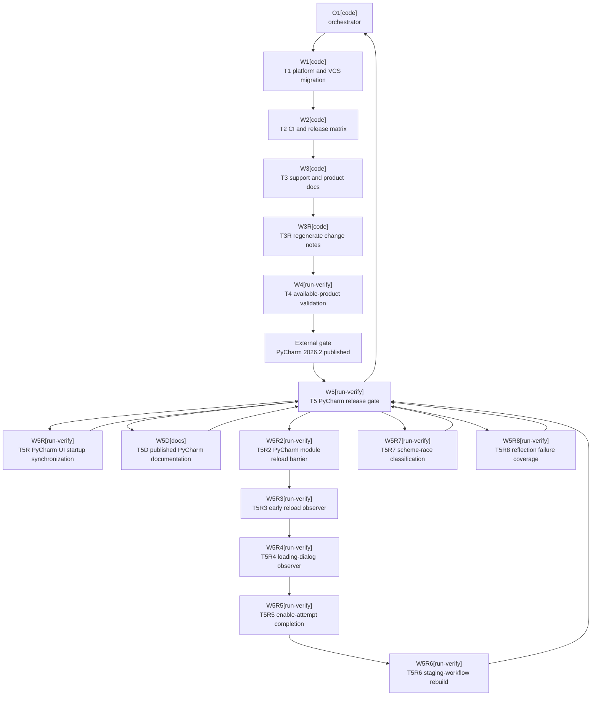

# Plan: IntelliJ 2026.2 SDK Upgrade

Plan-ID: PLAN-intellij-2026-2-sdk-upgrade

Status: In Progress

Workers: 1

Filename: `.agents/plans/PLAN-intellij-2026-2-sdk-upgrade.md`

## Readiness

- Plan readiness: Ready; the original plan and the bounded `T3R-regenerate-marketplace-change-notes`, `T5R-stabilize-pycharm-ui-startup`, `T5D-align-published-pycharm-documentation`, `T5R2-synchronize-pycharm-module-reload`, `T5R3-observe-pycharm-reload-at-startup`, `T5R4-observe-pycharm-loading-dialog`, `T5R5-await-pycharm-enable-attempt`, `T5R6-rebuild-pycharm-staging-workflow`, `T5R7-classify-2026-2-scheme-race`, and `T5R8-cover-262-reflection-failures` remediation packets are explicitly approved.
- Approved by: Kamil Kiewisz <kamkie@outlook.com>
- Approved at: 2026-07-16T21:17:58+02:00
- Open questions: None; the maintainer directed that `PY-2026.2` remain required and be allowed to fail until JetBrains publishes it.
- Implementation progress: T1 through T4, T3R, T5R, T5D, T5R6, and T5R7 are complete. The complete exact-head local and GitHub Actions gates passed on `a0bd6c7`, but delayed Codecov patch/project checks found missing failure-path coverage in the branch-262 reflection boundary. T5R8 must add that behavioral coverage before T5 restarts.

## Status History

- 2026-07-16T21:02:39+02:00: none -> Draft by Codex <codex@openai.com>; companion plan created for proposed ADR 0089.
- 2026-07-16T21:17:58+02:00: Draft -> Approved by Kamil Kiewisz <kamkie@outlook.com>; explicit user approval recorded.
- 2026-07-16T21:18:00+02:00: Approved -> In Progress by Codex <codex@openai.com>; approved implementation started.
- 2026-07-16T22:15:11+02:00: In Progress -> Blocked by Codex <codex@openai.com>; T4 found stale generated Marketplace change notes and requires an explicitly approved remediation packet.
- 2026-07-16T22:25:25+02:00: Blocked -> In Progress by Kamil Kiewisz <kamkie@outlook.com>; explicit approval to execute T3R and continue the review-fix-validation loop recorded.
- 2026-07-23T10:43:36+02:00: In Progress continued by Kamil Kiewisz <kamkie@outlook.com>; the maintainer's standing instruction to execute the normal change-review-fix loop without stopping, together with the request to check and merge PR #37, approves the bounded T5R remediation packet after the first published-PyCharm gate failure.
- 2026-07-23T11:45:36+02:00: In Progress continued by Kamil Kiewisz <kamkie@outlook.com>; the same standing review-fix instruction approves the bounded T5D packet after final review found current public documentation that still described published PyCharm 2026.2 as unavailable.
- 2026-07-23T11:58:50+02:00: In Progress continued by Kamil Kiewisz <kamkie@outlook.com>; the same standing review-fix instruction approves the bounded T5R2 packet after hosted validation proved T5R opens a paid-product modal on an unlicensed Linux runner.
- 2026-07-23T12:27:22+02:00: In Progress continued by Kamil Kiewisz <kamkie@outlook.com>; the same standing review-fix instruction approves the bounded T5R3 packet after T5R2 proved every Driver-time state or listener has an unavoidable pre-reload gap.
- 2026-07-23T12:45:18+02:00: In Progress continued by Kamil Kiewisz <kamkie@outlook.com>; the same standing review-fix instruction approves the bounded T5R4 packet after T5R3 proved `PlatformTaskSupport` does not publish `ProgressManagerListener` for the startup loading dialog.
- 2026-07-23T12:57:24+02:00: In Progress continued by Kamil Kiewisz <kamkie@outlook.com>; the same standing review-fix instruction approves the bounded T5R5 packet after T5R4 proved the loading modal lives in the split frontend and cannot be observed from the backend fake-plugin process.
- 2026-07-23T13:14:12+02:00: In Progress continued by Kamil Kiewisz <kamkie@outlook.com>; the same standing review-fix instruction approves the bounded T5R6 packet after T5R5 proved completion of rejected Ultimate loading is deterministic but does not itself restore the staging workflow fixture.
- 2026-07-23T14:26:40+02:00: In Progress continued by Kamil Kiewisz <kamkie@outlook.com>; the same standing review-fix instruction approves the bounded T5R7 packet after exact-head hosted evidence proved Starter promotes one branch-262 `SchemeManagerImpl` concurrent-mutation diagnostic during the already-known Islands Dark scheme lifecycle.
- 2026-07-23T15:30:17+02:00: In Progress continued by Kamil Kiewisz <kamkie@outlook.com>; the same standing review-fix instruction approves the bounded T5R8 packet after delayed exact-head Codecov checks isolated the only remaining failure to uncovered branch-262 reflection failure paths.

## Goal

Advance the minimum supported IntelliJ Platform from 2026.1 to 2026.2, migrate the Java and compatibility-sensitive VCS/Commit boundaries required by branch 262, and prepare the complete required product matrix while leaving the pull request draft until PyCharm 2026.2 is available and passes.

## Non-Goals

- Do not retain 2026.1 compatibility through a second artifact, version branch, shim, fallback, or feature flag.
- Do not suppress, conditionally skip, or mark the unavailable PyCharm 2026.2 lane as successful.
- Do not change Git-only or all-IDE scope, AI Assistant policy, commit/push behavior, Marketplace channels, signing, or release versioning.
- Do not upgrade Gradle, Kotlin, IntelliJ Platform Gradle Plugin, tests, or unrelated dependencies unless direct 2026.2 validation proves it necessary.
- Do not refactor unrelated VCS or workflow code.

## Assumptions

- Accepted ADR 0089 will supersede ADR 0008 and make branch 262 the minimum.
- IntelliJ IDEA `2026.2` is `IU-262.8665.258`, WebStorm `2026.2` is `WS-262.8665.259`, and AI Assistant `262.8665.258` is the exact build-SDK dependency.
- IntelliJ Platform Gradle Plugin `2.18.1` maps branch 262 to Java 25; Java and Kotlin targets must both use 25.
- `bundledModule(...)` is the supported build-classpath mechanism for the VCS/DVCS modules split out in 262.
- Existing fail-closed Commit and staging semantics remain authoritative.
- The PR may remain red solely because `PY-2026.2` is unpublished. Every other failure is an implementation defect.

## Open Questions

No open plan questions. ADR acceptance and plan approval are required lifecycle gates, not unresolved design questions.

## Proposed Changes

- `T1-platform-and-vcs-migration`: update the platform, Java, module, AI Assistant, and compatibility-sensitive Kotlin boundaries until the 262 plugin builds and tests pass.
- `T2-ci-and-release-matrix`: update CI, release, local validation, and workflow contract tests to JDK 25 and the required 2026.2 matrix.
- `T3-support-and-product-docs`: update specification, user/support/contributor docs, Marketplace description, issue template, and changelog.
- `T3R-regenerate-marketplace-change-notes`: regenerate the single stale Marketplace change-notes artifact created from the orchestrator-owned Unreleased changelog entry.
- `T4-available-product-validation`: validate all available 2026.2 products and record the expected PyCharm availability failure.
- `T5-pycharm-release-gate`: after PyCharm 2026.2 is published, rerun the unchanged required lane and full current-head readiness gate.
- `T5R-stabilize-pycharm-ui-startup`: synchronize the release-matrix harness with PyCharm's first-session product-plugin reconfiguration after the hosted lane exposed a Linux-only race.
- `T5D-align-published-pycharm-documentation`: replace the now-stale public availability wording and regenerate Marketplace change notes before final readiness.
- `T5R2-synchronize-pycharm-module-reload`: remove the paid-startup option and wait for PyCharm's normal module reload plus AI Commit All action re-registration before a scenario begins.
- `T5R3-observe-pycharm-reload-at-startup`: register the reload observer from the fake AI plugin descriptor so it captures `Loading Plugins` before the Driver can enter a scenario.
- `T5R4-observe-pycharm-loading-dialog`: install an AWT observer from an app-start listener and record the actual `Loading Plugins` dialog open/close lifecycle.
- `T5R5-await-pycharm-enable-attempt`: register an early `DynamicPluginEnabler` state listener in the fake AI plugin and wait until the Ultimate-module enable/load attempt has returned before a PyCharm scenario can begin.
- `T5R6-rebuild-pycharm-staging-workflow`: retain the exact enable-attempt barrier and deterministically create or rebuild the requested Git staging Commit workflow after PyCharm's rejected Ultimate-module reload.
- `T5R7-classify-2026-2-scheme-race`: extend the existing version-gated test-reporter mapping to the exact `SchemeManagerImpl`/`EditorColorsManagerImpl`/`FileStatusImpl` concurrent-mutation stack produced by the known Islands Dark startup lifecycle.
- `T5R8-cover-262-reflection-failures`: add behavioral unit coverage for invocation failure, missing nested boundary methods, and incompatible reflective results in the branch-262 Git staging access boundary.

## Task Packets

### Task Packet: T1-platform-and-vcs-migration

Task id: T1-platform-and-vcs-migration

Lane: implementation

Required skills:

- `intellij-plugin-development`
- `kotlin-plugin-style`
- `platform-docs-research`
- `plugin-test-tdd`

Goal:

- Produce a Java 25, `since-build=262` plugin that compiles, tests, and packages against IDEA 2026.2 without changing Commit, staging, or push behavior.

Initial context budget:

- Read first: `AGENTS.md`, accepted ADR 0089, this plan's readiness and execution graph, this packet, `build.gradle.kts`, `gradle.properties`, `src/main/resources/META-INF/plugin.xml`, `src/main/kotlin/pl/devopssolutions/aicommitall/workflow/ReflectiveCommitWorkflowSynchronizer.kt`, and its matching test.
- Escalate to: exact IntelliJ 262 source, `.agents/references/code-style.md`, `.agents/references/testing.md`, and `.agents/references/reviews.md` when compile or validation evidence requires them.

Allowed inputs:

- The files in the write scope, accepted ADR 0089, JetBrains 262 source and documentation, and focused Gradle validation output.

Forbidden inputs:

- Unrelated archived plans, unrelated feature code, and prior worker transcripts beyond the orchestrator handoff.

Write scope:

- `build.gradle.kts`, `gradle.properties`, `src/main/resources/META-INF/plugin.xml`, `src/main/kotlin/pl/devopssolutions/aicommitall/workflow/ReflectiveCommitWorkflowSynchronizer.kt`, and `src/test/kotlin/pl/devopssolutions/aicommitall/workflow/ReflectiveCommitWorkflowSynchronizerTest.kt`.

Dependencies:

- Accepted ADR 0089, approved plan, and no prior task.

Validation:

- Capture focused red evidence; run affected tests, full `test`, `buildPlugin`, `verifyPluginProjectConfiguration`, `spotlessCheck detekt`, self-review, and `git diff --check`; commit T1 before T2.

Escalation triggers:

- Escalate when no narrow 262 staging boundary preserves behavior, runtime modules alter product scope, or another dependency upgrade is required.

Stop conditions:

- A new product decision, behavior change, or broad compatibility abstraction is required.

Expected output:

- Passing 262 build foundation, regression evidence, task commit, risks, worker events, and orchestrator reconciliation.

Result summary:

- Status: completed
- Worker: `/root/t1_platform_vcs_migration`; corrective worker `/root/t1_integration_262_fix`.
- Changed files or reviewed diff: Initial `build.gradle.kts`, `gradle.properties`, `ReflectiveCommitWorkflowSynchronizer.kt`, and its test; corrective 262 Starter/VCS migration in `build.gradle.kts`, `ReleaseMatrixUiHarnessTest.kt`, and `FakeAiAssistantProbe.kt`.
- Validation evidence: Initial red compile captured missing 262 modules/internal handler; focused 25 tests passed; full 514 tests passed with 1 existing pending; `buildPlugin` and `verifyPluginProjectConfiguration` passed. Corrective validation passed `compileIntegrationTestKotlin`, `spotlessCheck`, `detekt`, `git diff --check`, a focused UI scenario, and the full IU 2026.2 UI lane with 21/21 tests.
- Self-review evidence from `.agents/references/reviews.md`: Exact-class reflective boundary fails closed; Commit/staging/push semantics remain unchanged; no proprietary AI compile dependency or product-scope expansion was added. The integration harness maps only exact, version-bounded upstream 2026.2 failures and synchronizes on observable VCS selection rather than sleeps or retries.
- Commit: `a7d4a5e635a1023b56f768d0bed915a278bce5b5`; corrective integration commit `bf3092218d3540650c27b23ccff2ad2ea04e8553`.
- Worker events: Initial worker preserved red job `20260716-213137-intellij-2026-2-t1-focused-red-f286f8` and completed focused/full green jobs. Corrective worker preserved the first cache and VCS-refresh failures, proved both alternating patterns with three focused reruns each, and completed full green job `20260717-013913-intellij-2026-2-t1-integration-ui-iu-final-r5`.
- Orchestrator reconciliation: Both workers' claims match their scoped commits, required commit metadata, generated `since-build=262` without `until-build`, and managed-job evidence; the final 21/21 run exercised the exact workspace-cache matcher while keeping unrelated failures red.
- Changelog/docs/spec/tasks updates: None in T1; compatibility docs remain assigned to T3 and changelog ownership remains with the orchestrator.
- Blockers: None.
- Review risks: Cross-product WebStorm smoke behavior remains for T4 validation.
- Handoff notes and next action: Dispatch T2 CI and release matrix.

### Task Packet: T2-ci-and-release-matrix

Task id: T2-ci-and-release-matrix

Lane: implementation

Required skills:

- `intellij-plugin-development`
- `plugin-test-tdd`
- `repository-documentation`

Goal:

- Move automation and local prerelease validation to JDK 25 and the required 2026.2 IDEA/PyCharm/WebStorm matrix without bypassing PyCharm.

Initial context budget:

- Read first: `AGENTS.md`, accepted ADR 0089, this plan's readiness and execution graph, this packet, the seven workflows and prerelease script in the write scope, and the three CI contract tests.
- Escalate to: release/testing guidance and exact validation failures when required.

Allowed inputs:

- The files in the write scope, accepted ADR 0089, and their focused validation output.

Forbidden inputs:

- Plugin behavior source, unrelated workflows, and prior worker transcripts beyond the handoff.

Write scope:

- `.github/workflows/ci.yml`, `.github/workflows/codeql.yml`, `.github/workflows/dependency-submission.yml`, `.github/workflows/github-release.yml`, `.github/workflows/plugin-verifier.yml`, `.github/workflows/release.yml`, `.github/workflows/release-matrix-ui.yml`, `scripts/run-local-prerelease-validation.ps1`, and `src/test/kotlin/pl/devopssolutions/aicommitall/ci/`.

Dependencies:

- T1 committed and reconciled.

Validation:

- Run focused workflow tests and any shared suite, docs validation for executable docs, self-review that `PY-2026.2` is required with no skip or `continue-on-error`, and `git diff --check`; commit T2 before T3.

Escalation triggers:

- Escalate when a workflow tool cannot run on JDK 25 or an accepted product identifier is wrong.

Stop conditions:

- Passing CI would require hiding or weakening the PyCharm gate.

Expected output:

- Updated automation, contract-test evidence, expected unavailable-product behavior, task commit, events, and reconciliation.

Result summary:

- Status: completed
- Worker: `/root/t2_ci_release_matrix`
- Changed files or reviewed diff: Seven Gradle-running workflows, local prerelease validation script, and the three CI contract test classes.
- Validation evidence: Focused red produced 5 expected failures; focused green passed 25 tests; shared validation passed 516 tests with 1 existing pending plus `spotlessCheck`; docs, PowerShell syntax, YAML syntax, and `git diff --check` passed.
- Self-review evidence from `.agents/references/reviews.md`: Every Gradle workflow uses JDK 25; IU/PY/WS 2026.2 remain required; no PyCharm skip or `continue-on-error` was added.
- Commit: `a29e97485a710c56306c637a8ce8578594f5992b`; corrective summary fix `ceb791e44ea0f1724f7c67450f438c6169ce8bdd`.
- Worker events: Started from clean `09e48eb`; red job `20260716-215419-intellij-2026-2-t2-contract-red-5b0258`; focused green `20260716-215608-intellij-2026-2-t2-contract-green-a29f69`; shared green `20260716-215741-intellij-2026-2-t2-shared-validation-9f67d8`; T4 later reproduced the final-summary `OrderedDictionary.ContainsKey` defect; fresh corrective worker proved `.Contains` with exact `-Resume`, 15 CI contract tests, syntax, and diff checks.
- Orchestrator reconciliation: Initial worker claims and corrective worker claims match their scoped commits and validation evidence; the only existing `continue-on-error` is the unrelated Detekt reporting flow.
- Changelog/docs/spec/tasks updates: Public compatibility changelog text suggested for orchestrator reconciliation after T3.
- Blockers: None for T3.
- Review risks: Missing PyCharm 2026.2 intentionally blocks the required CI/UI lanes until T5.
- Handoff notes and next action: Dispatch T3 support and product documentation.

### Task Packet: T3-support-and-product-docs

Task id: T3-support-and-product-docs

Lane: implementation

Required skills:

- `repository-documentation`
- `intellij-plugin-development`

Goal:

- Align all current compatibility statements with the accepted 2026.2 baseline and draft-readiness condition.

Initial context budget:

- Read first: `AGENTS.md`, accepted ADR 0089, this plan's readiness and execution graph, this packet, the files in the write scope, and landed T1/T2 configuration.
- Escalate to: documentation/release guidance for generated artifacts when required.

Allowed inputs:

- The files in the write scope, accepted ADR 0089, and landed T1/T2 configuration.

Forbidden inputs:

- Unrelated archived plans, historical reports, and unrelated changelog sections.

Write scope:

- `README.md`, `docs/SUPPORT.md`, `docs/specification.md`, `docs/user-guide.md`, `docs/troubleshooting.md`, `CONTRIBUTING.md`, `.github/ISSUE_TEMPLATE/bug_report.yml`, and `config/intellij-platform/description.html`.

Dependencies:

- T2 committed and reconciled.

Validation:

- Run docs validation, relevant documentation/spec tests, self-review that no PyCharm pass is claimed, and `git diff --check`; commit T3 before T4.

Escalation triggers:

- Escalate when the Marketplace description cannot be reproduced or a new support/release decision appears.

Stop conditions:

- Correct wording contradicts ADR 0089 or landed configuration.

Expected output:

- Aligned docs, a suggested public compatibility changelog entry for the orchestrator, validation evidence, task commit, events, and reconciliation.

Result summary:

- Status: completed
- Worker: `/root/t3_support_product_docs`
- Changed files or reviewed diff: Eight approved user, support, specification, contributor, issue-template, and generated Marketplace description files.
- Validation evidence: Docs validation, Marketplace description parity, issue-template YAML parse, stale-version scan, scope check, and `git diff --check` passed.
- Self-review evidence from `.agents/references/reviews.md`: No false PyCharm pass claim; compatibility/support wording matches branch 262, JDK 25, ADR 0089, and landed T1/T2 configuration.
- Commit: `a0e2d0122bf90c2af8e373f44ad78cddbabaa54b`
- Worker events: Started from clean `771c442`; mapped all eight scoped surfaces; generated Marketplace description from source docs; completed docs/parity/YAML/stale-version/scope validation.
- Orchestrator reconciliation: Worker claims match the committed eight-file diff, clean worktree, required commit metadata, documentation ownership, and validation evidence.
- Changelog/docs/spec/tasks updates: Specification and support/public docs aligned; orchestrator added the eligible Unreleased compatibility entry to `CHANGELOG.md`.
- Blockers: None for T4.
- Review risks: PyCharm 2026.2 availability remains the external readiness blocker; no product validation pass is claimed.
- Handoff notes and next action: Dispatch T4 available-product validation.

### Task Packet: T3R-regenerate-marketplace-change-notes

Task id: T3R-regenerate-marketplace-change-notes

Lane: implementation

Required skills:

- `repository-documentation`

Goal:

- Regenerate the Marketplace change-notes artifact from the approved Unreleased compatibility entry so the required generator check passes without changing release content.

Initial context budget:

- Read first: `AGENTS.md`, accepted ADR 0089, this plan's readiness and execution graph, this packet, `CHANGELOG.md`, `config/intellij-platform/change-notes.html`, and `scripts/generate-intellij-platform-change-notes.ps1`.
- Escalate to: `.agents/references/documentation.md` and `.agents/references/releases.md` only if generator ownership or output scope is unclear.

Allowed inputs:

- The named changelog, generator, generated file, T4 blocked report, and validation output.

Forbidden inputs:

- Plugin source, build configuration, workflows, unrelated documentation, historical reports, and previous worker chat beyond the orchestrator handoff.

Write scope:

- `config/intellij-platform/change-notes.html`.

Dependencies:

- T3 committed and reconciled; T4 blocked report recorded; explicit approval of this remediation packet.

Validation:

- Run `scripts/generate-intellij-platform-change-notes.ps1 -Check`, docs validation, self-review that the generated output contains only current Unreleased public notes, and `git diff --check`; commit T3R before restarting T4.

Escalation triggers:

- Escalate if regeneration changes another file, includes released or internal plan content, or fails after a clean regeneration.

Stop conditions:

- Any content decision beyond reproducing the accepted `CHANGELOG.md` entry is required.

Expected output:

- Regenerated change notes, generator parity evidence, task commit, worker events, and orchestrator reconciliation.

Result summary:

- Status: completed
- Worker: `/root/t3r_change_notes`
- Changed files or reviewed diff: `config/intellij-platform/change-notes.html` only; two current public Unreleased entries generated, with released content unchanged.
- Validation evidence: Change-notes generator parity, docs validation, post-commit parity recheck, and `git diff --check` passed.
- Self-review evidence from `.agents/references/reviews.md`: Exact one-file generated output; no internal plan content or released-note modification.
- Commit: `d736a9120b599fd04e8ab0a19dbd7f28d7b4fac6`
- Worker events: Started from clean `562af0c`; ran the generator; verified exact one-file scope; completed parity/docs/diff checks and post-commit parity.
- Orchestrator reconciliation: Worker claims match the committed five-line generated diff, clean worktree, required metadata, and validation output.
- Changelog/docs/spec/tasks updates: Generated Marketplace change notes now match `CHANGELOG.md`.
- Blockers: None.
- Review risks: None beyond the T4/T5 product validation risks.
- Handoff notes and next action: Restart T4 with a fresh validation worker.

### Task Packet: T4-available-product-validation

Task id: T4-available-product-validation

Lane: testing

Required skills:

- `intellij-plugin-development`
- `plugin-review`
- `repository-documentation`

Goal:

- Prove current head against every available 2026.2 gate, record PyCharm's external availability failure, and leave no other failure unresolved.

Initial context budget:

- Read first: `AGENTS.md`, accepted ADR 0089, this plan's readiness and execution graph, this packet, current diff, testing/review guidance, and current product data.
- Escalate to: files required to attribute a validation failure.

Allowed inputs:

- Current-head repository state, validation output, JetBrains feeds, and available local IDEs.

Forbidden inputs:

- Unrelated archived evidence and implementation changes outside a separately dispatched remediation packet.

Write scope:

- `docs/validation/reports/2026-07-16-intellij-2026-2-upgrade.md`.

Dependencies:

- T3R committed and reconciled after its explicit approval.

Validation:

- Run full unit, coverage, formatting, Detekt, packaging, configuration, docs, and agent checks; verifier and UI checks for available IDEA/WebStorm 2026.2; manual staging/AI smoke where possible; invoke `PY-2026.2` and accept only product-unavailable resolution failure; review the full diff; commit evidence before T5.

Escalation triggers:

- Escalate on any non-PyCharm failure or a changed head.

Stop conditions:

- A non-PyCharm failure remains or the head changes without full revalidation.

Expected output:

- Current-head report, exact blocker, review findings, task commit, events, and reconciliation.

Result summary:

- Status: completed
- Worker: Final worker `/root/t4_final_after_262_remediation`; earlier stopped attempts `/root/t4_available_product_validation`, `/root/t4_available_product_rerun`, and `/root/t4_final_exact_head` supplied remediation evidence.
- Changed files or reviewed diff: Final exact-head evidence in `docs/validation/reports/2026-07-16-intellij-2026-2-upgrade.md`; full 33-file `origin/main..a3a6cb9` diff reviewed read-only.
- Validation evidence: On exact source `a3a6cb9`, fresh prerelease passed all seven gates with 516 tests and compatible IU/WS verifiers; forced `verifyPluginProjectConfiguration` passed; clean full IU UI rerun passed 21/21; WS smoke passed 13/13. Local and hosted PY lanes failed only while resolving unpublished `PyCharmProfessional` 2026.2, before verifier or IDE execution. Hosted build, CodeQL, Security, IU verifier, and WS verifier passed.
- Self-review evidence from `.agents/references/reviews.md`: Full branch review found no confirmed defect; PR has no review threads or current-head changes requested. The initial forced IU run's single staging JMX/restart failure and 13 derived port cascades were preserved, reproduced as focused 1/1 green, and cleared by a clean full 21/21 rerun.
- Commit: `8e4c78155b681f75521b45d3dd6b32d503ab8d40`.
- Worker events: Earlier workers exposed and fixed generated metadata, final-summary, and 262 integration failures. Final worker completed exact-head prerelease/configuration, preserved and triaged one IU infrastructure flake, passed focused/full IU and WS UI, exercised local PY resolution, reconciled hosted checks, and committed the report.
- Orchestrator reconciliation: Final worker claims match the report-only commit, exact managed-job logs, current hosted results, clean worktree, and required commit metadata. T4 is complete because every available product gate passed and PyCharm failed only at the approved external-availability boundary.
- Changelog/docs/spec/tasks updates: Final validation report records exact head, product feed data, all local/hosted gates, review state, the triaged infrastructure flake, and the expected PyCharm blocker.
- Blockers: PyCharm 2026.2 is unpublished; no non-PyCharm blocker remains.
- Review risks: Published PyCharm 2026.2 may expose a new compatibility issue during T5; no current available-product risk is unresolved.
- Handoff notes and next action: Keep PR #37 draft. After JetBrains publishes PyCharm 2026.2, dispatch T5 for its unchanged verifier/UI lanes and the full current-head readiness gate.

### Task Packet: T5-pycharm-release-gate

Task id: T5-pycharm-release-gate

Lane: testing

Required skills:

- `intellij-plugin-development`
- `plugin-review`
- `repository-documentation`

Goal:

- After PyCharm 2026.2 is published, prove its unchanged required lane and the full current-head readiness gate.

Initial context budget:

- Read first: `AGENTS.md`, accepted ADR 0089, this plan's readiness and execution graph, this packet, T4 report, current PR head/checks/reviews, and product data.
- Escalate to: files required to attribute a validation failure.

Allowed inputs:

- Current-head repository/PR state, PyCharm 2026.2 metadata, and T4 evidence.

Forbidden inputs:

- Earlier-head approvals as current evidence and unrelated history.

Write scope:

- `docs/validation/reports/2026-07-16-intellij-2026-2-upgrade.md`; remediation requires a separate approved packet.

Dependencies:

- T4 committed and PyCharm 2026.2 published.

Validation:

- Run PyCharm verifier/UI and the complete current-head matrix; re-fetch head, checks, reviews, and threads; commit final evidence and complete the plan only after all gates pass.

Escalation triggers:

- Escalate when published PyCharm changes accepted identifiers, Java, modules, compatibility, or any current-head gate fails.

Stop conditions:

- PyCharm remains unavailable, a check fails, the head changes, or current-head review blocks readiness.

Expected output:

- Passing full-matrix evidence, final task commit, plan update, events, reconciliation, and PR readiness result.

Result summary:

- Status: blocked pending T5R8 coverage remediation and restart
- Worker: `/root/t5_pycharm_release_gate`
- Changed files or reviewed diff: Appended the first published-PyCharm gate evidence to `docs/validation/reports/2026-07-16-intellij-2026-2-upgrade.md`; source head remained unchanged.
- Validation evidence: On exact head `a0bd6c7389c1d8f5bdb03c87e3e870f8d4acb2c3`, full local prerelease passed all eight gates; IU passed 22/22, PY passed 13/13, and WS passed 13/13. Hosted build, Security, CodeQL, Detekt, IU/PY/WS verifier, and UI coverage jobs all passed. Delayed `codecov/patch` failed at 65.48% against a 90.27% target with 39 changed lines uncovered, and `codecov/project` failed at 89.58%, down 0.69% from base.
- Self-review evidence from `.agents/references/reviews.md`: No production defect or compatibility change is confirmed; the failing IDE logs show IntelliJ declining an AI action because its target control stopped showing during dynamic plugin reconfiguration.
- Commit:
- Worker events: Initial worker stopped at the first published-PyCharm failure. Restarted worker `/root/t5_final_exact_head` preserved the branch-262 scheme failure. Worker `/root/t5_final_exact_head_r2` started at `2026-07-23T14:48:00+02:00`, completed every local and GitHub Actions gate, then stopped cleanly when delayed Codecov checks failed at `2026-07-23T15:28:16+02:00`.
- Orchestrator reconciliation: Exact local, origin, and PR head remained `a0bd6c7389c1d8f5bdb03c87e3e870f8d4acb2c3`; worktree was clean. Codecov attributes all 19 missing lines and 20 partial branches to `ReflectiveCommitWorkflowSynchronizer.kt`, specifically the branch-262 reflective compatibility boundary added by this upgrade.
- Changelog/docs/spec/tasks updates: T5D aligned README, contributor/support documentation, changelog, and generated Marketplace notes; the validation report records the earlier timing failures and must add the T5R hosted modal evidence.
- Blockers: T5R8 must cover the exact reflection failure paths and restore both Codecov checks without weakening thresholds or changing user behavior.
- Review risks: Tests must assert fail-closed results and precise diagnostics rather than merely execute implementation lines; production changes are forbidden unless a minimal testability correction is proven necessary.
- Handoff notes and next action: Execute and push T5R8, then restart the complete T5 gate.

### Task Packet: T5R-stabilize-pycharm-ui-startup

Task id: T5R-stabilize-pycharm-ui-startup

Lane: testing

Required skills:

- `intellij-plugin-development`
- `kotlin-plugin-style`
- `plugin-test-tdd`
- `triage-flaky-test`

Goal:

- Prevent IDE Starter from disabling paid product plugins during release-matrix startup so PyCharm 2026.2 does not rebuild the Commit UI after the test begins.

Initial context budget:

- Read first: `AGENTS.md`, accepted ADR 0089, this plan's readiness and execution graph, this packet, the first hosted failure artifact, the matching local passing IDE logs, `ReleaseMatrixUiHarnessTest.kt`, and `FakeAiAssistantProbe.kt`.
- Escalate to: exact IntelliJ 262 plugin-enable APIs or bytecode only when required to prove the completion signal.

Allowed inputs:

- The preserved hosted/local PyCharm evidence, exact IntelliJ 262 APIs, and focused validation output.

Forbidden inputs:

- Production plugin behavior changes, retries, sleeps, weakened assertions, quarantines, product-scope changes, and unrelated source.

Write scope:

- `src/integrationTest/kotlin/pl/devopssolutions/aicommitall/integration/ReleaseMatrixUiHarnessTest.kt`

Dependencies:

- First T5 attempt stopped on the preserved hosted failure; this bounded packet is approved by the maintainer's normal change-review-fix continuation directive and current merge request.

Validation:

- Preserve the hosted 10/13 failure; compile integration tests; run the three affected PyCharm scenarios and inspect their IDE JVM options/logs for the paid-plugin startup flag and absence of a late Ultimate-plugin transition; rerun them enough to establish the post-fix pattern; run the full PyCharm UI lane, `spotlessCheck`, `detekt`, and `git diff --check`; commit T5R before restarting T5.

Escalation triggers:

- Escalate if the completion signal requires production code, unsupported timing assumptions, another product decision, or changes outside the two-file scope.

Stop conditions:

- IDE Starter's official paid-plugin startup option does not prevent the late reconfiguration, or focused/full PyCharm validation still fails.

Expected output:

- Deterministic startup synchronization, exact before/after evidence, task commit, events, reconciliation, and a clean handoff back to T5.

Result summary:

- Status: completed
- Worker: `/root/t5r_stabilize_pycharm_startup`; read-only diagnosis `/root/t5_ci_timing_diagnosis`.
- Changed files or reviewed diff: Added only `doNotDisablePaidPluginsOnStartup()` to `ReleaseMatrixUiHarnessTest.kt` before release-matrix plugin configuration.
- Validation evidence: `compileIntegrationTestKotlin` passed; two focused PyCharm runs passed 3/3 each; the full PyCharm 2026.2 lane passed 13/13 in 4 minutes 37 seconds; all 13 IDE logs contain `-Dide.do.not.disable.paid.plugins.on.startup=true` and none contains an Ultimate disable, applied re-enable, or dynamic-reconfiguration event; `spotlessCheck detekt` and `git diff --check` passed.
- Self-review evidence from `.agents/references/reviews.md`: The official IDE Starter option removes the startup lifecycle transition before tests begin; no assertion, timeout, retry, sleep, production code, or product-scope change was added.
- Commit: `234d91e18bda4b6028a594316ed1e2d90d57229c`
- Worker events: Read-only diagnosis classified the race and recommended the official Starter API; the fresh T5R worker completed one-file implementation and all focused/full validation.
- Orchestrator reconciliation: Worker claims match the one-line committed diff, 6/6 focused pattern, 13/13 full log, 13 property-bearing IDE logs, zero late-transition events, and required commit metadata.
- Changelog/docs/spec/tasks updates: No user-facing change; the task-local failure and remediation evidence is recorded in the active plan and validation report.
- Blockers: None.
- Review risks: Hosted Linux remains the final environment-specific proof.
- Handoff notes and next action: Hosted validation later proved the paid-startup option opens a modal on an unlicensed runner; supersede this approach through T5R2 before restarting T5.

### Task Packet: T5R2-synchronize-pycharm-module-reload

Task id: T5R2-synchronize-pycharm-module-reload

Lane: testing

Required skills:

- `intellij-plugin-development`
- `kotlin-plugin-style`
- `plugin-test-tdd`
- `triage-flaky-test`

Goal:

- Remove the paid-plugin startup option and deterministically wait until PyCharm's normal Ultimate-module reconfiguration and AI Commit All action re-registration are complete before each fake-AI scenario begins.

Initial context budget:

- Read first: `AGENTS.md`, accepted ADR 0089, this plan's readiness and execution graph, this packet, hosted run 29993726119/job 89163423209 logs, the earlier hosted timing failures, `ReleaseMatrixUiHarnessTest.kt`, and `FakeAiAssistantProbe.kt`.
- Escalate to: exact IntelliJ 262 plugin/module identifier and loaded-state APIs or bytecode only when required to implement the completion signal.

Allowed inputs:

- Preserved pre-T5R timing failures, the T5R hosted modal/time-limit failure, exact IntelliJ 262 APIs, focused validation output, and current local logs.

Forbidden inputs:

- Production plugin behavior, paid licenses or paid-startup flags, dialog dismissal, retries, sleeps, weakened assertions, quarantines, product-scope changes, and unrelated source.

Write scope:

- `src/integrationTest/kotlin/pl/devopssolutions/aicommitall/integration/ReleaseMatrixUiHarnessTest.kt`
- `src/integrationTest/kotlin/pl/devopssolutions/aicommitall/integration/fakeai/FakeAiAssistantProbe.kt`

Dependencies:

- T5R and hosted run 29993726119 preserved the paid-startup modal failure; this bounded replacement is approved by the maintainer's standing normal review-fix continuation directive and current merge request.

Validation:

- Remove `doNotDisablePaidPluginsOnStartup()`; compile integration tests; prove the barrier observes the PyCharm Ultimate-module loaded state followed by AI Commit All plugin/action availability; rerun the previously timing-sensitive and hosted-modal scenarios; run the full PyCharm lane enough to establish a post-fix pattern; run `spotlessCheck`, `detekt`, and `git diff --check`; require no paid-startup flag or paid modal in fresh IDE logs; commit T5R2 before restarting T5.

Escalation triggers:

- Escalate if the completion signal requires production code, dialog handling, a timing-only assumption, another product decision, or a file outside the two-file scope.

Stop conditions:

- Exact 262 APIs cannot prove module reload completion, focused/full PyCharm validation fails after the barrier, or a paid modal remains.

Expected output:

- Unlicensed-runner-safe deterministic reload synchronization, exact before/after evidence, task commit, events, reconciliation, and a clean handoff back to T5.

Result summary:

- Status: stopped after proving the two-file approach cannot be deterministic
- Worker: `/root/t5r2_pycharm_reload_barrier`
- Changed files or reviewed diff: Three candidate barriers were implemented and tested sequentially, then both scoped Kotlin files were restored exactly to T5R; no task diff or commit remains.
- Validation evidence: `compileIntegrationTestKotlin` passed for each candidate. Focused A1 job `20260723-121018-intellij-2026-2-t5r2-py-focused-a1-8198fa` proved loaded-only excludes a terminal failed reload; A2 `20260723-121723-intellij-2026-2-t5r2-py-focused-a2-0a25f7` proved Driver-time listeners initialize about seven seconds after `Loading Plugins` finishes; A3 `20260723-121951-intellij-2026-2-t5r2-py-focused-a3-96c067` proved the platform clears the non-load reason. Final `git diff --check` passed.
- Self-review evidence from `.agents/references/reviews.md`: `!disabled && !modal` has an observed 349-millisecond pre-modal gap, and the internal dynamic-plugin lock still leaves an observed 225-millisecond pre-lock gap; accepting either would preserve the race.
- Commit: None.
- Worker events: The worker was recovered once after API diagnosis, tested three exact 262 predicates, stopped when the two-file scope could not provide an early observer, and restored its scope cleanly.
- Orchestrator reconciliation: Worker claims match all three managed-job logs, exact IDE timestamps, clean scoped files, removed generated artifacts, and the required escalation boundary.
- Changelog/docs/spec/tasks updates: Task-local diagnosis is recorded in this plan and validation report; no user-facing behavior or support policy changed.
- Blockers: An observer must be registered before Driver utility availability, requiring the fake AI test plugin descriptor.
- Review risks: The early listener must capture only the platform's `Loading Plugins` lifecycle, preserve failed and successful reload completion, and avoid production/plugin-runtime scope.
- Handoff notes and next action: Execute T5R3 with the additional fake-plugin descriptor scope.

### Task Packet: T5R3-observe-pycharm-reload-at-startup

Task id: T5R3-observe-pycharm-reload-at-startup

Lane: testing

Required skills:

- `intellij-plugin-development`
- `kotlin-plugin-style`
- `plugin-test-tdd`
- `triage-flaky-test`

Goal:

- Register a test-only progress listener when the fake AI plugin loads so PyCharm's startup `Loading Plugins` lifecycle is recorded before IDE Driver utility calls become available.

Initial context budget:

- Read first: `AGENTS.md`, accepted ADR 0089, this plan's readiness and execution graph, this packet, T5R/T5R2 evidence, exact focused A1/A2/A3 IDE logs, the two Kotlin files, and the fake AI plugin descriptor.
- Escalate to: exact IntelliJ 262 application-listener descriptor syntax and `ProgressManagerListener` contract only.

Allowed inputs:

- Preserved hosted/local failures, exact IntelliJ 262 listener APIs, the test-only fake AI plugin, and focused validation output.

Forbidden inputs:

- Production plugin behavior or descriptor, paid licenses or paid-startup flags, dialog dismissal, retries, sleeps, weakened assertions, quarantines, product-matrix changes, and unrelated source.

Write scope:

- `src/integrationTest/kotlin/pl/devopssolutions/aicommitall/integration/ReleaseMatrixUiHarnessTest.kt`
- `src/integrationTest/kotlin/pl/devopssolutions/aicommitall/integration/fakeai/FakeAiAssistantProbe.kt`
- `src/integrationTest/resources/fake-ai-assistant-plugin/META-INF/plugin.xml`

Dependencies:

- T5R2 restored its scope after proving Driver-time observation is too late; this bounded early-observer packet is approved by the maintainer's standing normal review-fix continuation directive and current merge request.

Validation:

- Remove `doNotDisablePaidPluginsOnStartup()`; register an early test-plugin application listener for the exact `Loading Plugins` lifecycle; wait for either Ultimate already loaded or the relevant loading task completed, then require AI Commit All plugin/action and fake action availability; compile integration tests; run the six previously timing-sensitive/modal scenarios at least twice; inspect fresh logs/evidence for both successful and rejected reload paths, no paid-startup flag, no paid modal, and no stale-control rejection; run the full PyCharm lane at least twice, `spotlessCheck`, `detekt`, and `git diff --check`; commit T5R3 before restarting T5.

Escalation triggers:

- Escalate if descriptor registration cannot initialize before the reload, task completion cannot be attributed to the Ultimate enable attempt, focused/full PyCharm validation fails, or any file outside the three-file scope is required.

Stop conditions:

- The listener misses the startup task, observes unrelated progress as readiness, or fresh runs retain a timing/modal failure.

Expected output:

- Early unlicensed-runner-safe reload observation, exact before/after evidence, task commit, events, reconciliation, and a clean handoff back to T5.

Result summary:

- Status: stopped after proving the proposed progress topic is not emitted
- Worker: `/root/t5r3_early_reload_observer`
- Changed files or reviewed diff: Registered the proposed listener, enabled it for test/headless modes, added harness/probe state, then restored all three scoped files exactly after the platform did not emit the required callback.
- Validation evidence: `compileIntegrationTestKotlin` passed. Focused A1 job `20260723-123504-intellij-2026-2-t5r3-py-focused-a1-c63bf4` passed 3/6 before staging retained `ChangesViewCommitWorkflowHandler`. Targeted job `20260723-124224-intellij-2026-2-t5r3-listener-proof-81beb2` passed 1/1 but logged `Loading Plugins` at `12:43:04.305`, listener construction only at `12:43:08.922`, and its first unrelated callback at `12:43:08.926`.
- Self-review evidence from `.agents/references/reviews.md`: The descriptor was packaged and active in integration/headless modes, but `PlatformTaskSupport` does not publish this loading operation through `ProgressManagerListener.TOPIC`; accepting the passing fallback would not prove rejected-reload synchronization.
- Commit: None.
- Worker events: The worker stopped at the packet boundary, restored the three files, removed generated artifacts, and left only orchestrator-owned plan/report changes.
- Orchestrator reconciliation: Exact timestamps, packaged descriptor, targeted log, clean scoped diff, and `git diff --check` agree with the worker report.
- Changelog/docs/spec/tasks updates: Task-local evidence is recorded in this plan and validation report; no user-facing behavior changed.
- Blockers: The early hook must observe the actual AWT modal rather than the absent progress topic.
- Review risks: The observer must install before the modal, match only `Loading Plugins`, never dismiss it, and record closure after successful or rejected reload.
- Handoff notes and next action: Execute T5R4 in the same three-file test-only scope.

### Task Packet: T5R4-observe-pycharm-loading-dialog

Task id: T5R4-observe-pycharm-loading-dialog

Lane: testing

Required skills:

- `intellij-plugin-development`
- `kotlin-plugin-style`
- `plugin-test-tdd`
- `triage-flaky-test`

Goal:

- Install a test-only AWT window observer from an early app-start listener and wait for the actual PyCharm `Loading Plugins` dialog to close before scenarios begin.

Initial context budget:

- Read first: `AGENTS.md`, accepted ADR 0089, this plan's readiness and execution graph, this packet, T5R through T5R3 evidence, the targeted idea log, the two Kotlin files, and the fake AI plugin descriptor.
- Escalate to: exact IntelliJ 262 `AppLifecycleListener` callback and application-listener descriptor contract only.

Allowed inputs:

- Preserved hosted/local failures, exact 262 app lifecycle APIs, AWT window events, the test-only fake AI plugin, and focused validation output.

Forbidden inputs:

- Production plugin behavior or descriptor, paid licenses or paid-startup flags, dialog dismissal or interaction, retries, sleeps, weakened assertions, quarantines, product-matrix changes, and unrelated source.

Write scope:

- `src/integrationTest/kotlin/pl/devopssolutions/aicommitall/integration/ReleaseMatrixUiHarnessTest.kt`
- `src/integrationTest/kotlin/pl/devopssolutions/aicommitall/integration/fakeai/FakeAiAssistantProbe.kt`
- `src/integrationTest/resources/fake-ai-assistant-plugin/META-INF/plugin.xml`

Dependencies:

- T5R3 restored its scope after proving the progress topic is not emitted; this bounded AWT observer packet is approved by the maintainer's standing normal review-fix continuation directive and current merge request.

Validation:

- Remove `doNotDisablePaidPluginsOnStartup()`; register an active-in-test/headless `AppLifecycleListener` that installs an AWT listener before reload; record only `Dialog` windows titled `Loading Plugins`, marking active on open and complete on close when Ultimate is loaded or enabled in configuration; wait for either Ultimate already loaded or relevant dialog completion, then require AI Commit All plugin/action and fake action; compile; prove observer installation precedes dialog opening in a targeted run; run the six timing/modal scenarios twice; inspect logs for successful/rejected reload paths, no paid flag/modal hang/stale-control rejection; run full PyCharm twice, `spotlessCheck`, `detekt`, and `git diff --check`; commit T5R4 before restarting T5.

Escalation triggers:

- Escalate if app lifecycle initialization occurs after the dialog, AWT close is not emitted, unrelated windows can satisfy readiness, focused/full validation fails, or any file outside the three-file scope is required.

Stop conditions:

- The listener misses the dialog, interacts with it, or leaves a timing-only readiness path.

Expected output:

- Early non-interacting loading-dialog observation, exact lifecycle evidence, task commit, events, reconciliation, and a clean handoff back to T5.

Result summary:

- Status: stopped after proving the split frontend dialog is not observable through backend AWT
- Worker: `/root/t5r4_loading_dialog_observer`
- Changed files or reviewed diff: Implemented the app-start AWT observer in the three scoped test-plugin files, then restored all three files exactly after the lifecycle proof missed the frontend dialog; no task diff or commit remains.
- Validation evidence: `compileIntegrationTestKotlin` passed. Targeted job `20260723-125313-intellij-2026-2-t5r4-py-lifecycle-proof-7af0e5` passed 1/1. The listener installed at `12:53:48.156`, before `PlatformTaskSupport` logged `Modal dialog is shown: Loading Plugins` at `12:53:49.636`, but the observer received neither `WINDOW_OPENED` nor `WINDOW_CLOSED`.
- Self-review evidence from `.agents/references/reviews.md`: Descriptor timing is early enough, but the remote-development split keeps the modal in the frontend process; accepting absence of a backend window callback as completion would preserve the race.
- Commit: None.
- Worker events: Worker started at `2026-07-23T12:46:59+02:00`, hit the explicit no-callback stop condition, restored its scope, and stopped cleanly at `2026-07-23T12:55:00+02:00`.
- Orchestrator reconciliation: Exact timestamps, packaged descriptor behavior, the targeted job log, clean scoped diff, and `git diff --check` agree with the worker report.
- Changelog/docs/spec/tasks updates: Task-local evidence is recorded in this plan and validation report; no user-facing behavior changed.
- Blockers: The barrier must observe the backend `DynamicPluginEnabler` completion boundary rather than a frontend dialog.
- Review risks: The listener must be installed before the enable call, filter the exact Ultimate module, retain failed-load completion, and require action availability after completion.
- Handoff notes and next action: Execute T5R5 in the same three-file test-only scope.

### Task Packet: T5R5-await-pycharm-enable-attempt

Task id: T5R5-await-pycharm-enable-attempt

Lane: testing

Required skills:

- `intellij-plugin-development`
- `kotlin-plugin-style`
- `plugin-test-tdd`
- `triage-flaky-test`

Goal:

- Register a test-only platform state listener before PyCharm's Ultimate-module enablement and do not enter a scenario until the corresponding dynamic load attempt has returned.

Initial context budget:

- Read first: `AGENTS.md`, accepted ADR 0089, this plan's readiness and execution graph, this packet, T5R through T5R4 evidence, the two Kotlin files, and the fake AI plugin descriptor.
- Escalate to: exact IntelliJ 262 `DynamicPluginEnabler` and `PluginEnableStateChangedListener` bytecode/contracts only.

Allowed inputs:

- Preserved hosted/local failures, exact 262 dynamic-plugin enable APIs, the test-only fake AI plugin, and focused validation output.

Forbidden inputs:

- Production plugin behavior or descriptor, paid licenses or paid-startup flags, dialog observation/dismissal, retries, sleeps, weakened assertions, quarantines, product-matrix changes, and unrelated source.

Write scope:

- `src/integrationTest/kotlin/pl/devopssolutions/aicommitall/integration/ReleaseMatrixUiHarnessTest.kt`
- `src/integrationTest/kotlin/pl/devopssolutions/aicommitall/integration/fakeai/FakeAiAssistantProbe.kt`
- `src/integrationTest/resources/fake-ai-assistant-plugin/META-INF/plugin.xml`

Dependencies:

- T5R4 restored its scope after proving a backend AWT listener cannot observe the split frontend modal; this bounded platform-callback packet is approved by the maintainer's standing normal review-fix continuation directive and current merge request.

Validation:

- Remove `doNotDisablePaidPluginsOnStartup()`; register an active-in-test/headless `AppLifecycleListener` that strongly retains a `PluginEnableStateChangedListener` through `DynamicPluginEnabler.addPluginStateChangedListener`; record completion only when `enabled=true` and the callback descriptors contain `com.intellij.modules.ultimate`; require listener installation and either Ultimate already loaded or that exact enable-attempt callback, followed by AI Commit All plugin/action and fake action availability; compile; prove installation precedes the enable attempt and the callback follows its load attempt; run the six timing/modal scenarios at least twice; inspect logs for successful/rejected reload paths, no paid flag/modal hang/stale-control rejection; run the full PyCharm lane at least twice, `spotlessCheck`, `detekt`, and `git diff --check`; commit T5R5 before restarting T5.

Escalation triggers:

- Escalate if the listener registers after the enable call, the callback fires before `DynamicPlugins.loadPlugins` returns, the exact Ultimate descriptor cannot be attributed, focused/full validation fails, or any file outside the three-file scope is required.

Stop conditions:

- The callback misses the enable attempt, unrelated plugin state can satisfy readiness, or fresh runs retain a timing/modal failure.

Expected output:

- Early unlicensed-runner-safe post-load-attempt synchronization, exact before/after evidence, task commit, events, reconciliation, and a clean handoff back to T5.

Result summary:

- Status: stopped after proving terminal rejected loading is not staging-workflow readiness
- Worker: `/root/t5r5_pycharm_enable_completion`
- Changed files or reviewed diff: Implemented the exact platform state listener and harness barrier in the three scoped test-plugin files, then restored all three exactly after the staging validation stop condition; no task diff or commit remains.
- Validation evidence: `compileIntegrationTestKotlin` passed. Callback proof job `20260723-130406-intellij-2026-2-t5r5-py-callback-proof-440677` passed 1/1: observer installed at `13:04:24.936`, enablement began at `13:04:26.437`, reconfiguration was rejected at `13:04:26.590`, and the exact callback arrived at `13:04:26.595`. Focused job `20260723-130525-intellij-2026-2-t5r5-py-focused-a1-25ced1` passed 5/6; narrow final-source job `20260723-130951-intellij-2026-2-t5r5-py-staging-repro-cd5335` reproduced the staging failure 0/1 with `ChangesViewCommitWorkflowHandler`.
- Self-review evidence from `.agents/references/reviews.md`: The callback is a valid post-load-attempt boundary and removes the original stale-control race, but accepting it alone would exclude the existing staging behavior because rejected Ultimate loading leaves the Commit workflow fixture in changelist mode.
- Commit: None.
- Worker events: Worker started at `2026-07-23T12:59:17+02:00`, preserved the callback proof and focused failure, restored its scope, and stopped cleanly at `2026-07-23T13:12:24+02:00`.
- Orchestrator reconciliation: Exact timestamps, both managed-job logs, clean scoped diff, removed Allure output, and `git diff --check` agree with the worker report.
- Changelog/docs/spec/tasks updates: Task-local evidence is recorded in this plan and validation report; no user-facing behavior changed.
- Blockers: After the callback, the staging-enabled scenario must deterministically create or rebuild `GitStageCommitWorkflowHandler`.
- Review risks: Fixture repair must use a real platform lifecycle/API, preserve both staging and changelist assertions, and not mask a plugin behavior defect.
- Handoff notes and next action: Execute T5R6 in the same three-file test-only scope, retaining the proven T5R5 barrier.

### Task Packet: T5R6-rebuild-pycharm-staging-workflow

Task id: T5R6-rebuild-pycharm-staging-workflow

Lane: testing

Required skills:

- `intellij-plugin-development`
- `kotlin-plugin-style`
- `plugin-test-tdd`
- `triage-flaky-test`

Goal:

- Retain T5R5's exact post-enable-attempt synchronization and make the release-matrix fixture deterministically enter the requested Git staging or changelist Commit workflow after PyCharm rejects Ultimate-module loading.

Initial context budget:

- Read first: `AGENTS.md`, accepted ADR 0089, this plan's readiness and execution graph, this packet, T5R through T5R5 evidence, callback proof and staging-repro logs, the two Kotlin files, and the fake AI plugin descriptor.
- Escalate to: exact IntelliJ 262 `GitVcsApplicationSettings`, Commit tool-window/workflow manager, staging-setting listener, and workflow rebuild contracts only.

Allowed inputs:

- Preserved callback/staging failures, exact IntelliJ 262 test-fixture and Commit workflow APIs, the test-only fake AI plugin, and focused validation output.

Forbidden inputs:

- Production plugin behavior or descriptor, paid licenses or paid-startup flags, dialog observation/dismissal, retries, sleeps, weakened assertions, direct construction of fake workflow handlers, quarantines, product-matrix changes, and unrelated source.

Write scope:

- `src/integrationTest/kotlin/pl/devopssolutions/aicommitall/integration/ReleaseMatrixUiHarnessTest.kt`
- `src/integrationTest/kotlin/pl/devopssolutions/aicommitall/integration/fakeai/FakeAiAssistantProbe.kt`
- `src/integrationTest/resources/fake-ai-assistant-plugin/META-INF/plugin.xml`

Dependencies:

- T5R5 restored its scope after proving the exact enable callback but reproducing persistent changelist workflow selection in the staging scenario; this bounded fixture-remediation packet is approved by the maintainer's standing normal review-fix continuation directive and current merge request.

Validation:

- Reapply T5R5 without the paid-startup option; prove the same exact callback ordering; diagnose the branch-262 supported lifecycle that applies `GitVcsApplicationSettings.stagingAreaEnabled` to an already-created or subsequently-created Commit workflow; invoke only that real lifecycle from the test fixture after terminal PyCharm enablement; require the handler to become `GitStageCommitWorkflowHandler` for enabled and not that class for disabled; run the narrow staging repro at least three times, the six timing/modal scenarios twice, both staging-enabled and staging-disabled commit flows, and the full PyCharm lane at least twice; inspect logs for no paid flag/modal hang/stale-control rejection; run `spotlessCheck`, `detekt`, and `git diff --check`; commit T5R6 before restarting T5.

Escalation triggers:

- Escalate if no real 262 lifecycle can rebuild workflow selection, the fix requires production code or direct fake-handler construction, either staging mode fails, or any file outside the three-file scope is required.

Stop conditions:

- The fixture can pass only through timing, retries, weaker handler/selection assertions, or bypassing the real Commit workflow.

Expected output:

- Unlicensed-runner-safe enable synchronization plus deterministic real staging/changelist workflow selection, exact evidence, task commit, events, reconciliation, and a clean handoff back to T5.

Result summary:

- Status: completed
- Worker: `/root/t5r6_pycharm_staging_workflow`
- Changed files or reviewed diff: Removed the paid-plugin startup flag, added an early test-plugin Ultimate enable-attempt listener and harness barrier, and changed the fake probe's staging setter to invoke the real `GitStageManagerKt.enableStagingArea(boolean)` lifecycle in the exact three-file scope.
- Validation evidence: `compileIntegrationTestKotlin` passed; the formerly deterministic narrow staging failure passed 3/3; the six timing-sensitive scenarios passed 6/6 twice; staging-disabled and staging-enabled commit flows passed 2/2; full PyCharm passed 13/13 twice; all 13 full-lane logs proved listener-before-enable and terminal callback ordering with zero paid-startup or stale-control hits; `spotlessCheck`, `detekt`, and `git diff --check` passed.
- Self-review evidence from `.agents/references/reviews.md`: The diff is test-only, exercises the real Commit workflow and existing handler assertions, retains both staging modes, and adds no retries, sleeps, fake handlers, paid licensing, dialog handling, production changes, or unrelated refactor.
- Commit: `777cf177ca1ea7c54156c761b54ab1250fc002d4`
- Worker events: Worker started at `2026-07-23T13:16:16.8671783+02:00`, preserved the first formatting failures, completed the full repeated matrix, and stopped successfully at `2026-07-23T14:00:00.8295546+02:00`.
- Orchestrator reconciliation: The worker's claims match the three-file commit, required metadata, managed-job logs, clean task scope, static checks, and exact runtime bytecode for `GitStageManagerKt.enableStagingArea`.
- Changelog/docs/spec/tasks updates: No user-facing behavior changed; task-local evidence is recorded in this plan and validation report. T5D already aligned the changelog and generated Marketplace notes with the published release.
- Blockers: None; restart T5 on the exact integrated head.
- Review risks: Hosted Linux remains the decisive environment proof, followed by exact-head review and readiness gates.
- Handoff notes and next action: Integrate current `main`, restart T5, keep PR #37 draft until every exact-head gate passes.

### Task Packet: T5R7-classify-2026-2-scheme-race

Task id: T5R7-classify-2026-2-scheme-race

Lane: testing

Required skills:

- `intellij-plugin-development`
- `kotlin-plugin-style`
- `plugin-test-tdd`
- `triage-flaky-test`

Goal:

- Extend the existing branch-262 test-reporter compatibility mapping so Starter does not fail a successful scenario for the exact Islands Dark scheme-manager concurrent-mutation diagnostic observed before harness entry.

Initial context budget:

- Read first: `AGENTS.md`, accepted ADR 0089, this plan's readiness and execution graph, this packet, the exact hosted job log/artifact stack, and the reporter/constants in `ReleaseMatrixUiHarnessTest.kt`.
- Escalate to: exact IntelliJ 262 `SchemeManagerImpl.findSchemeByName`, `EditorColorsManagerImpl.getSchemeForCurrentUITheme`, and `FileStatusImpl.getColor` stack contracts only.

Allowed inputs:

- Hosted artifact `8563226012`, the exact synthetic test name and stack, the existing branch-262 reporter mapping, and focused validation output.

Forbidden inputs:

- Production code/resources/descriptors, fallback color schemes, theme or user-setting mutation, arbitrary `ConcurrentModificationException` suppression, product skips, retries, sleeps, assertion weakening, and unrelated source.

Write scope:

- `src/integrationTest/kotlin/pl/devopssolutions/aicommitall/integration/ReleaseMatrixUiHarnessTest.kt`

Dependencies:

- Restarted T5 preserved the exact hosted failure and restored a clean worktree; this bounded reporter-remediation packet is approved by the maintainer's standing normal review-fix continuation directive and current merge request.

Validation:

- Add a dedicated predicate that requires the exact `java.util.ConcurrentModificationException` synthetic name and all distinguishing `ArrayList$Itr`, `SchemeManagerImpl.findSchemeByName`, `EditorColorsManagerImpl.getSchemeForCurrentUITheme`, and `FileStatusImpl.getColor` stack frames; keep the existing exact `aicommitall.ide.version == 2026.2` gate; prove the captured hosted error is accepted while arbitrary concurrent modification and each distinguishing-frame near miss remain rejected; compile integration tests; rerun the previously failed PyCharm scenario at least three times and the full PyCharm smoke lane; run `spotlessCheck`, `detekt`, and `git diff --check`; commit T5R7 before restarting T5.

Escalation triggers:

- Escalate if exact classification cannot be tested without a production change, another diagnostic appears, the scenario fails for plugin behavior, or a file outside the one-file scope is required.

Stop conditions:

- Passing requires a generic exception suppression, fallback/theme replacement, timing workaround, product skip, or weakened workflow assertion.

Expected output:

- Exact version-gated platform diagnostic classification, positive/negative proof, focused/full PyCharm evidence, task commit, events, reconciliation, and a clean handoff back to T5.

Result summary:

- Status: completed
- Worker: `/root/t5r7_scheme_race_classifier`
- Changed files or reviewed diff: Changed only `src/integrationTest/kotlin/pl/devopssolutions/aicommitall/integration/ReleaseMatrixUiHarnessTest.kt`; refactored the existing exact IntelliJ 2026.2 reporter gate through a dedicated predicate and added an exact synthetic-name plus four-frame classifier and near-miss coverage.
- Validation evidence: `compileIntegrationTestKotlin` passed; the pure classifier test passed 1/1; the formerly failed PyCharm scenario passed 1/1 in three independent processes (`20260723-143215-intellij-2026-2-t5r7-py-empty-r1-56e6de`, `20260723-143315-intellij-2026-2-t5r7-py-empty-r2-248cbd`, and `20260723-143408-intellij-2026-2-t5r7-py-empty-r3-89db7e`); full PyCharm smoke passed 13/13 in `20260723-143500-intellij-2026-2-t5r7-py-full-637ff3`; `spotlessCheck`, `detekt`, and `git diff --check` passed.
- Self-review evidence from `.agents/references/reviews.md`: The classifier requires exact IDE version `2026.2`, exact synthetic test name `java.util.ConcurrentModificationException: null`, and every distinguishing `ArrayList$Itr`, `SchemeManagerImpl`, `EditorColorsManagerImpl`, and `FileStatusImpl` frame. Production code/resources, fallback schemes, theme/user settings, product skips, retries, sleeps, and workflow assertions are unchanged.
- Commit: `c3bae72f614e8e4fb224aa93bbd82f0b1eade3be`
- Worker events: Worker started at `2026-07-23T14:30:58.3509502+02:00`, completed the bounded one-file packet and all validation, and stopped successfully at `2026-07-23T14:43:30.3744018+02:00`.
- Orchestrator reconciliation: The worker claims match the exact one-file diff, test counts, managed-job evidence, clean task scope, and required commit metadata.
- Changelog/docs/spec/tasks updates: No user-facing behavior changed; the task-local platform-diagnostic evidence is recorded in this plan and validation report. T5D already updated `CHANGELOG.md` and generated Marketplace notes for the PyCharm release.
- Blockers: None; restart T5 on the exact pushed head.
- Review risks: Hosted Linux and the full three-product exact-head gate remain required before readiness.
- Handoff notes and next action: Push T5R7 and this reconciliation, then dispatch a fresh T5 worker for the complete current-head gate.

### Task Packet: T5R8-cover-262-reflection-failures

Task id: T5R8-cover-262-reflection-failures

Lane: testing

Required skills:

- `intellij-plugin-development`
- `kotlin-plugin-style`
- `plugin-test-tdd`
- `gh-fix-ci-security-quality`

Goal:

- Restore required patch and project coverage by testing the observable fail-closed behavior and diagnostics of the branch-262 Git staging reflection boundary.

Initial context budget:

- Read first: `AGENTS.md`, this plan's readiness/execution graph/this packet, Codecov checks `89214533481` and `89214528762`, `ReflectiveCommitWorkflowSynchronizer.kt`, and `ReflectiveCommitWorkflowSynchronizerTest.kt`.
- Escalate to: local unit and aggregate JaCoCo XML for the changed file and exact branch-262 reflective method shapes only.

Allowed inputs:

- Exact Codecov summaries, local JaCoCo line/branch counters, existing reflection test fixtures, and the 2026.2 Git staging handler boundary already accepted by ADR 0089.

Forbidden inputs:

- Coverage threshold changes, exclusions, ignores, Codecov configuration changes, superficial source execution without behavioral assertions, production behavior changes, generic compatibility shims, retries, UI harness changes, and unrelated refactors.

Write scope:

- `src/test/kotlin/pl/devopssolutions/aicommitall/workflow/ReflectiveCommitWorkflowSynchronizerTest.kt`

Dependencies:

- T5 exact-head local and GitHub Actions gates passed; Codecov is the sole blocker and attributes all missing patch coverage to the named production file.

Validation:

- Add tests that prove invocation failure, missing nested boundary methods, and incompatible method results each return no access and emit the exact `gitStageCommitWorkflowAccess` diagnostic, including exception and cause where applicable. Run the targeted test, `jacocoTestReport`, inspect changed-file line/branch improvement, run the full unit suite, `verifyJacocoCoverageReport`, `spotlessCheck`, `detekt`, and `git diff --check`; commit the bounded test change before restarting T5.

Escalation triggers:

- Escalate if the required failure path cannot be reached through the public/internal boundary, a production seam is required, or local coverage cannot explain the Codecov delta.

Stop conditions:

- Passing requires a threshold/exclusion/configuration change, non-behavioral coverage trick, production compatibility expansion, or a file outside the one-file scope.

Expected output:

- Exact behavioral tests, before/after changed-file coverage evidence, task commit, self-review, events, reconciliation, and clean handoff to T5.

Result summary:

- Status: ready
- Worker:
- Changed files or reviewed diff:
- Validation evidence:
- Self-review evidence from `.agents/references/reviews.md`:
- Commit:
- Worker events:
- Orchestrator reconciliation:
- Changelog/docs/spec/tasks updates:
- Blockers:
- Review risks:
- Handoff notes and next action:

### Task Packet: T5D-align-published-pycharm-documentation

Task id: T5D-align-published-pycharm-documentation

Lane: docs

Required skills:

- `repository-documentation`
- `intellij-plugin-development`

Goal:

- Align every current/public compatibility statement with the published PyCharm 2026.2 release and regenerate Marketplace change notes from the corrected changelog.

Initial context budget:

- Read first: `AGENTS.md`, accepted ADR 0089, this plan's readiness and execution graph, this packet, the documentation ownership guidance, the five scoped files, and the Marketplace change-notes generator.
- Escalate to: only directly linked current/public compatibility documentation required to prove no stale availability statement remains.

Allowed inputs:

- JetBrains' published PyCharm 2026.2 product metadata, the accepted 2026.2 support decision, and current validation evidence.

Forbidden inputs:

- Historical ADR wording, production/test/workflow changes, unrelated documentation, and claims that final PR readiness has passed before current-head checks are terminal.

Write scope:

- `README.md`
- `CONTRIBUTING.md`
- `docs/SUPPORT.md`
- `CHANGELOG.md`
- `config/intellij-platform/change-notes.html` through the repository generator

Dependencies:

- PyCharm 2026.2 is published and the restarted T5 review identified the stale public wording.

Validation:

- Regenerate Marketplace change notes from `CHANGELOG.md`; run the documentation and Marketplace parity validators; search current/public documentation for stale PyCharm-unavailable claims; run `git diff --check`; do not stage, commit, or push.

Escalation triggers:

- Escalate if correcting the public availability statement requires a compatibility-policy change, historical ADR edit, or file outside the bounded scope.

Stop conditions:

- A scoped validator fails for a reason outside the documentation diff or source evidence contradicts the published release.

Expected output:

- Five-file documentation diff, generated Marketplace parity, validation evidence, events, reconciliation, and a clean handoff back to T5.

Result summary:

- Status: completed
- Worker: `/root/t5d_align_published_pycharm_docs`
- Changed files or reviewed diff: Updated the published-PyCharm compatibility statement in `README.md`, `CONTRIBUTING.md`, `docs/SUPPORT.md`, and `CHANGELOG.md`, then regenerated `config/intellij-platform/change-notes.html`.
- Validation evidence: Marketplace change-notes generator parity, `scripts/validate-docs.ps1`, stale PyCharm-unavailable wording search, and `git diff --check` passed.
- Self-review evidence from `.agents/references/reviews.md`: The five-file diff changes only current/public release-state wording, preserves the unchanged required product matrix, avoids a premature PR-readiness claim, and does not edit the historical ADR.
- Commit: `82abd9634effcc276b2d4821d8ee8b8657cd0ffe`
- Worker events: The sole active worker completed the bounded documentation packet without escalation.
- Orchestrator reconciliation: Worker claims match the exact five-file diff, generated changelog parity, required validation, clean task commit, and reserved plan/report scope.
- Changelog/docs/spec/tasks updates: Current public compatibility wording and generated Marketplace notes now agree that PyCharm 2026.2 is published and its local lanes pass.
- Blockers: None.
- Review risks: Final hosted and current-head readiness evidence remains owned by T5.
- Handoff notes and next action: Restart T5 on the documentation-aligned head.

## Execution Model

- Use one active worker at a time and a fresh sub-agent for each task packet.
- The orchestrator records a decision capsule, reserves each write scope, reconciles claims, and commits each completed task before the next.
- After T3, the orchestrator decides and applies any eligible `CHANGELOG.md` entry during reconciliation; workers may only suggest the text.
- T1 through T4, T3R, T5R, T5D, T5R6, T5R7, and the T1/T2 corrective work are complete. T5R2 through T5R5 stopped cleanly after producing successively narrower platform evidence used by T5R6; execute T5R8, then restart T5.
- Follow `.agents/references/orchestration.md`; use the current upgrade worktree only.

## Long-Run Continuity

- Resume docs reread: after compaction, interruption, resume, or handoff, reread `AGENTS.md`; this plan's header, readiness, execution model, current packet, and result summary; `.agents/references/execution.md`; `.agents/references/orchestration.md`; `.agents/references/testing.md`; `.agents/references/reviews.md`; `.gitmessage` before commits; and the next owner files.
- Current task or wave: T5R8 branch-262 reflection failure coverage.
- Completed commits: T1 `a7d4a5e635a1023b56f768d0bed915a278bce5b5`; T2 `a29e97485a710c56306c637a8ce8578594f5992b`; T3 `a0e2d0122bf90c2af8e373f44ad78cddbabaa54b`; T3R `d736a9120b599fd04e8ab0a19dbd7f28d7b4fac6`; T2 corrective `ceb791e44ea0f1724f7c67450f438c6169ce8bdd`; T1 integration corrective `bf3092218d3540650c27b23ccff2ad2ea04e8553`; T4 `8e4c78155b681f75521b45d3dd6b32d503ab8d40`; T5R `234d91e18bda4b6028a594316ed1e2d90d57229c`; T5D `82abd9634effcc276b2d4821d8ee8b8657cd0ffe`; T5R6 `777cf177ca1ea7c54156c761b54ab1250fc002d4`; T5R7 `c3bae72f614e8e4fb224aa93bbd82f0b1eade3be`.
- Plan status and readiness: In Progress; the original plan, T3R, T5R, T5D, T5R2, T5R3, T5R4, T5R5, T5R6, and T5R7 remediation packets are approved.
- Validation and self-review state: Exact-head local prerelease and IU/PY/WS UI gates passed; all GitHub Actions jobs passed; only Codecov patch/project coverage is red.
- Worker event and reconciliation state: All prior tasks through completed T5R7 and stopped exact-head T5 worker `/root/t5_final_exact_head_r2` are reconciled; dispatch T5R8 with a fresh worker.
- Changelog, docs, spec, task, or plan updates: Compatibility configuration, current public docs, changelog, and regenerated Marketplace notes are aligned with published 2026.2/JDK 25 state.
- Blockers or open questions: No open question; T5R8 coverage and the complete final-head gate remain required evidence.
- Next action: Keep PR #37 draft, execute T5R8, push, and rerun the final T5 current-head gate.
- Context handoff notes: Codecov is the sole current blocker. It reports 19 missing lines and 20 partial branches in the new branch-262 reflection boundary; thresholds and production behavior must remain unchanged.

## Execution Graph

## Validation

- Governance draft: run docs validation, agent-artifact validation, self-review, and `git diff --check`.
- T1 through T5 own implementation validation; drafting this plan authorizes none of it.

## Risks

- IntelliJ 262 internal and modular VCS APIs may require a narrower replacement than initial compile errors reveal.
- Compile-successful modules may still fail runtime class loading across products.
- The draft PR may remain red for an unknown period while PyCharm 2026.2 is unavailable.
- Published PyCharm may expose a new compatibility decision rather than a safe implementation detail.
- Java 25 changes every Gradle-running environment; local success does not prove hosted compatibility.

## Handoff Notes

- Research used `origin/main` at `3f3828826153d04f8719689e1102f5df6d29921f`.
- A property-only `buildPlugin` probe failed on Java target 25 versus Kotlin target 21.
- A diagnostic retry exposed missing VCS/DVCS modules and Kotlin-internal `GitStageCommitWorkflowHandler`; neither probe modified repository files.
- The PR stays draft until T5 completes on the current head.
