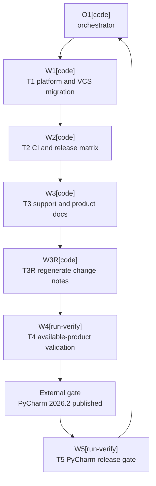

# Plan: IntelliJ 2026.2 SDK Upgrade

Plan-ID: PLAN-intellij-2026-2-sdk-upgrade

Status: In Progress

Workers: 1

Filename: `.agents/plans/PLAN-intellij-2026-2-sdk-upgrade.md`

## Readiness

- Plan readiness: Ready; the original plan and the one-file `T3R-regenerate-marketplace-change-notes` remediation packet are explicitly approved.
- Approved by: Kamil Kiewisz <kamkie@outlook.com>
- Approved at: 2026-07-16T21:17:58+02:00
- Open questions: None; the maintainer directed that `PY-2026.2` remain required and be allowed to fail until JetBrains publishes it.
- Implementation progress: T1 through T3, T3R, and the T2 prerelease-summary corrective fix are complete; T4 is ready for a fresh exact-head rerun.

## Status History

- 2026-07-16T21:02:39+02:00: none -> Draft by Codex <codex@openai.com>; companion plan created for proposed ADR 0089.
- 2026-07-16T21:17:58+02:00: Draft -> Approved by Kamil Kiewisz <kamkie@outlook.com>; explicit user approval recorded.
- 2026-07-16T21:18:00+02:00: Approved -> In Progress by Codex <codex@openai.com>; approved implementation started.
- 2026-07-16T22:15:11+02:00: In Progress -> Blocked by Codex <codex@openai.com>; T4 found stale generated Marketplace change notes and requires an explicitly approved remediation packet.
- 2026-07-16T22:25:25+02:00: Blocked -> In Progress by Kamil Kiewisz <kamkie@outlook.com>; explicit approval to execute T3R and continue the review-fix-validation loop recorded.

## Goal

Advance the minimum supported IntelliJ Platform from 2026.1 to 2026.2, migrate the Java and compatibility-sensitive VCS/Commit boundaries required by branch 262, and prepare the complete required product matrix while leaving the pull request draft until PyCharm 2026.2 is available and passes.

## Non-Goals

- Do not retain 2026.1 compatibility through a second artifact, version branch, shim, fallback, or feature flag.
- Do not suppress, conditionally skip, or mark the unavailable PyCharm 2026.2 lane as successful.
- Do not change Git-only or all-IDE scope, AI Assistant policy, commit/push behavior, Marketplace channels, signing, or release versioning.
- Do not upgrade Gradle, Kotlin, IntelliJ Platform Gradle Plugin, tests, or unrelated dependencies unless direct 2026.2 validation proves it necessary.
- Do not refactor unrelated VCS or workflow code.

## Assumptions

- Accepted ADR 0089 will supersede ADR 0008 and make branch 262 the minimum.
- IntelliJ IDEA `2026.2` is `IU-262.8665.258`, WebStorm `2026.2` is `WS-262.8665.259`, and AI Assistant `262.8665.258` is the exact build-SDK dependency.
- IntelliJ Platform Gradle Plugin `2.18.1` maps branch 262 to Java 25; Java and Kotlin targets must both use 25.
- `bundledModule(...)` is the supported build-classpath mechanism for the VCS/DVCS modules split out in 262.
- Existing fail-closed Commit and staging semantics remain authoritative.
- The PR may remain red solely because `PY-2026.2` is unpublished. Every other failure is an implementation defect.

## Open Questions

No open plan questions. ADR acceptance and plan approval are required lifecycle gates, not unresolved design questions.

## Proposed Changes

- `T1-platform-and-vcs-migration`: update the platform, Java, module, AI Assistant, and compatibility-sensitive Kotlin boundaries until the 262 plugin builds and tests pass.
- `T2-ci-and-release-matrix`: update CI, release, local validation, and workflow contract tests to JDK 25 and the required 2026.2 matrix.
- `T3-support-and-product-docs`: update specification, user/support/contributor docs, Marketplace description, issue template, and changelog.
- `T3R-regenerate-marketplace-change-notes`: regenerate the single stale Marketplace change-notes artifact created from the orchestrator-owned Unreleased changelog entry.
- `T4-available-product-validation`: validate all available 2026.2 products and record the expected PyCharm availability failure.
- `T5-pycharm-release-gate`: after PyCharm 2026.2 is published, rerun the unchanged required lane and full current-head readiness gate.

## Task Packets

### Task Packet: T1-platform-and-vcs-migration

Task id: T1-platform-and-vcs-migration

Lane: implementation

Required skills:

- `intellij-plugin-development`
- `kotlin-plugin-style`
- `platform-docs-research`
- `plugin-test-tdd`

Goal:

- Produce a Java 25, `since-build=262` plugin that compiles, tests, and packages against IDEA 2026.2 without changing Commit, staging, or push behavior.

Initial context budget:

- Read first: `AGENTS.md`, accepted ADR 0089, this plan's readiness and execution graph, this packet, `build.gradle.kts`, `gradle.properties`, `src/main/resources/META-INF/plugin.xml`, `src/main/kotlin/pl/devopssolutions/aicommitall/workflow/ReflectiveCommitWorkflowSynchronizer.kt`, and its matching test.
- Escalate to: exact IntelliJ 262 source, `.agents/references/code-style.md`, `.agents/references/testing.md`, and `.agents/references/reviews.md` when compile or validation evidence requires them.

Allowed inputs:

- The files in the write scope, accepted ADR 0089, JetBrains 262 source and documentation, and focused Gradle validation output.

Forbidden inputs:

- Unrelated archived plans, unrelated feature code, and prior worker transcripts beyond the orchestrator handoff.

Write scope:

- `build.gradle.kts`, `gradle.properties`, `src/main/resources/META-INF/plugin.xml`, `src/main/kotlin/pl/devopssolutions/aicommitall/workflow/ReflectiveCommitWorkflowSynchronizer.kt`, and `src/test/kotlin/pl/devopssolutions/aicommitall/workflow/ReflectiveCommitWorkflowSynchronizerTest.kt`.

Dependencies:

- Accepted ADR 0089, approved plan, and no prior task.

Validation:

- Capture focused red evidence; run affected tests, full `test`, `buildPlugin`, `verifyPluginProjectConfiguration`, `spotlessCheck detekt`, self-review, and `git diff --check`; commit T1 before T2.

Escalation triggers:

- Escalate when no narrow 262 staging boundary preserves behavior, runtime modules alter product scope, or another dependency upgrade is required.

Stop conditions:

- A new product decision, behavior change, or broad compatibility abstraction is required.

Expected output:

- Passing 262 build foundation, regression evidence, task commit, risks, worker events, and orchestrator reconciliation.

Result summary:

- Status: completed
- Worker: `/root/t1_platform_vcs_migration`
- Changed files or reviewed diff: `build.gradle.kts`, `gradle.properties`, `ReflectiveCommitWorkflowSynchronizer.kt`, and its test.
- Validation evidence: Red compile captured missing 262 modules/internal handler; focused 25 tests passed; full 514 tests passed with 1 existing pending; `buildPlugin`, `verifyPluginProjectConfiguration`, `spotlessCheck`, `detekt`, and `git diff --check` passed.
- Self-review evidence from `.agents/references/reviews.md`: Exact-class reflective boundary fails closed; Commit/staging/push semantics remain unchanged; no proprietary AI compile dependency or product-scope expansion was added.
- Commit: `a7d4a5e635a1023b56f768d0bed915a278bce5b5`
- Worker events: Started with clean dependency `773d9cf`; preserved red job `20260716-213137-intellij-2026-2-t1-focused-red-f286f8`; completed focused green `20260716-214234-intellij-2026-2-t1-refactor-focused-r3-f7c1da` and full green `20260716-214341-intellij-2026-2-t1-full-validation-r2-bf1529`.
- Orchestrator reconciliation: Worker claims match the committed four-file diff, clean worktree, required commit metadata, generated `since-build=262` without `until-build`, and green managed-job evidence.
- Changelog/docs/spec/tasks updates: None in T1; compatibility docs remain assigned to T3 and changelog ownership remains with the orchestrator.
- Blockers: None.
- Review risks: Real IDE staging UI behavior remains for T4 validation.
- Handoff notes and next action: Dispatch T2 CI and release matrix.

### Task Packet: T2-ci-and-release-matrix

Task id: T2-ci-and-release-matrix

Lane: implementation

Required skills:

- `intellij-plugin-development`
- `plugin-test-tdd`
- `repository-documentation`

Goal:

- Move automation and local prerelease validation to JDK 25 and the required 2026.2 IDEA/PyCharm/WebStorm matrix without bypassing PyCharm.

Initial context budget:

- Read first: `AGENTS.md`, accepted ADR 0089, this plan's readiness and execution graph, this packet, the seven workflows and prerelease script in the write scope, and the three CI contract tests.
- Escalate to: release/testing guidance and exact validation failures when required.

Allowed inputs:

- The files in the write scope, accepted ADR 0089, and their focused validation output.

Forbidden inputs:

- Plugin behavior source, unrelated workflows, and prior worker transcripts beyond the handoff.

Write scope:

- `.github/workflows/ci.yml`, `.github/workflows/codeql.yml`, `.github/workflows/dependency-submission.yml`, `.github/workflows/github-release.yml`, `.github/workflows/plugin-verifier.yml`, `.github/workflows/release.yml`, `.github/workflows/release-matrix-ui.yml`, `scripts/run-local-prerelease-validation.ps1`, and `src/test/kotlin/pl/devopssolutions/aicommitall/ci/`.

Dependencies:

- T1 committed and reconciled.

Validation:

- Run focused workflow tests and any shared suite, docs validation for executable docs, self-review that `PY-2026.2` is required with no skip or `continue-on-error`, and `git diff --check`; commit T2 before T3.

Escalation triggers:

- Escalate when a workflow tool cannot run on JDK 25 or an accepted product identifier is wrong.

Stop conditions:

- Passing CI would require hiding or weakening the PyCharm gate.

Expected output:

- Updated automation, contract-test evidence, expected unavailable-product behavior, task commit, events, and reconciliation.

Result summary:

- Status: completed
- Worker: `/root/t2_ci_release_matrix`
- Changed files or reviewed diff: Seven Gradle-running workflows, local prerelease validation script, and the three CI contract test classes.
- Validation evidence: Focused red produced 5 expected failures; focused green passed 25 tests; shared validation passed 516 tests with 1 existing pending plus `spotlessCheck`; docs, PowerShell syntax, YAML syntax, and `git diff --check` passed.
- Self-review evidence from `.agents/references/reviews.md`: Every Gradle workflow uses JDK 25; IU/PY/WS 2026.2 remain required; no PyCharm skip or `continue-on-error` was added.
- Commit: `a29e97485a710c56306c637a8ce8578594f5992b`; corrective summary fix `ceb791e44ea0f1724f7c67450f438c6169ce8bdd`.
- Worker events: Started from clean `09e48eb`; red job `20260716-215419-intellij-2026-2-t2-contract-red-5b0258`; focused green `20260716-215608-intellij-2026-2-t2-contract-green-a29f69`; shared green `20260716-215741-intellij-2026-2-t2-shared-validation-9f67d8`; T4 later reproduced the final-summary `OrderedDictionary.ContainsKey` defect; fresh corrective worker proved `.Contains` with exact `-Resume`, 15 CI contract tests, syntax, and diff checks.
- Orchestrator reconciliation: Initial worker claims and corrective worker claims match their scoped commits and validation evidence; the only existing `continue-on-error` is the unrelated Detekt reporting flow.
- Changelog/docs/spec/tasks updates: Public compatibility changelog text suggested for orchestrator reconciliation after T3.
- Blockers: None for T3.
- Review risks: Missing PyCharm 2026.2 intentionally blocks the required CI/UI lanes until T5.
- Handoff notes and next action: Dispatch T3 support and product documentation.

### Task Packet: T3-support-and-product-docs

Task id: T3-support-and-product-docs

Lane: implementation

Required skills:

- `repository-documentation`
- `intellij-plugin-development`

Goal:

- Align all current compatibility statements with the accepted 2026.2 baseline and draft-readiness condition.

Initial context budget:

- Read first: `AGENTS.md`, accepted ADR 0089, this plan's readiness and execution graph, this packet, the files in the write scope, and landed T1/T2 configuration.
- Escalate to: documentation/release guidance for generated artifacts when required.

Allowed inputs:

- The files in the write scope, accepted ADR 0089, and landed T1/T2 configuration.

Forbidden inputs:

- Unrelated archived plans, historical reports, and unrelated changelog sections.

Write scope:

- `README.md`, `docs/SUPPORT.md`, `docs/specification.md`, `docs/user-guide.md`, `docs/troubleshooting.md`, `CONTRIBUTING.md`, `.github/ISSUE_TEMPLATE/bug_report.yml`, and `config/intellij-platform/description.html`.

Dependencies:

- T2 committed and reconciled.

Validation:

- Run docs validation, relevant documentation/spec tests, self-review that no PyCharm pass is claimed, and `git diff --check`; commit T3 before T4.

Escalation triggers:

- Escalate when the Marketplace description cannot be reproduced or a new support/release decision appears.

Stop conditions:

- Correct wording contradicts ADR 0089 or landed configuration.

Expected output:

- Aligned docs, a suggested public compatibility changelog entry for the orchestrator, validation evidence, task commit, events, and reconciliation.

Result summary:

- Status: completed
- Worker: `/root/t3_support_product_docs`
- Changed files or reviewed diff: Eight approved user, support, specification, contributor, issue-template, and generated Marketplace description files.
- Validation evidence: Docs validation, Marketplace description parity, issue-template YAML parse, stale-version scan, scope check, and `git diff --check` passed.
- Self-review evidence from `.agents/references/reviews.md`: No false PyCharm pass claim; compatibility/support wording matches branch 262, JDK 25, ADR 0089, and landed T1/T2 configuration.
- Commit: `a0e2d0122bf90c2af8e373f44ad78cddbabaa54b`
- Worker events: Started from clean `771c442`; mapped all eight scoped surfaces; generated Marketplace description from source docs; completed docs/parity/YAML/stale-version/scope validation.
- Orchestrator reconciliation: Worker claims match the committed eight-file diff, clean worktree, required commit metadata, documentation ownership, and validation evidence.
- Changelog/docs/spec/tasks updates: Specification and support/public docs aligned; orchestrator added the eligible Unreleased compatibility entry to `CHANGELOG.md`.
- Blockers: None for T4.
- Review risks: PyCharm 2026.2 availability remains the external readiness blocker; no product validation pass is claimed.
- Handoff notes and next action: Dispatch T4 available-product validation.

### Task Packet: T3R-regenerate-marketplace-change-notes

Task id: T3R-regenerate-marketplace-change-notes

Lane: implementation

Required skills:

- `repository-documentation`

Goal:

- Regenerate the Marketplace change-notes artifact from the approved Unreleased compatibility entry so the required generator check passes without changing release content.

Initial context budget:

- Read first: `AGENTS.md`, accepted ADR 0089, this plan's readiness and execution graph, this packet, `CHANGELOG.md`, `config/intellij-platform/change-notes.html`, and `scripts/generate-intellij-platform-change-notes.ps1`.
- Escalate to: `.agents/references/documentation.md` and `.agents/references/releases.md` only if generator ownership or output scope is unclear.

Allowed inputs:

- The named changelog, generator, generated file, T4 blocked report, and validation output.

Forbidden inputs:

- Plugin source, build configuration, workflows, unrelated documentation, historical reports, and previous worker chat beyond the orchestrator handoff.

Write scope:

- `config/intellij-platform/change-notes.html`.

Dependencies:

- T3 committed and reconciled; T4 blocked report recorded; explicit approval of this remediation packet.

Validation:

- Run `scripts/generate-intellij-platform-change-notes.ps1 -Check`, docs validation, self-review that the generated output contains only current Unreleased public notes, and `git diff --check`; commit T3R before restarting T4.

Escalation triggers:

- Escalate if regeneration changes another file, includes released or internal plan content, or fails after a clean regeneration.

Stop conditions:

- Any content decision beyond reproducing the accepted `CHANGELOG.md` entry is required.

Expected output:

- Regenerated change notes, generator parity evidence, task commit, worker events, and orchestrator reconciliation.

Result summary:

- Status: completed
- Worker: `/root/t3r_change_notes`
- Changed files or reviewed diff: `config/intellij-platform/change-notes.html` only; two current public Unreleased entries generated, with released content unchanged.
- Validation evidence: Change-notes generator parity, docs validation, post-commit parity recheck, and `git diff --check` passed.
- Self-review evidence from `.agents/references/reviews.md`: Exact one-file generated output; no internal plan content or released-note modification.
- Commit: `d736a9120b599fd04e8ab0a19dbd7f28d7b4fac6`
- Worker events: Started from clean `562af0c`; ran the generator; verified exact one-file scope; completed parity/docs/diff checks and post-commit parity.
- Orchestrator reconciliation: Worker claims match the committed five-line generated diff, clean worktree, required metadata, and validation output.
- Changelog/docs/spec/tasks updates: Generated Marketplace change notes now match `CHANGELOG.md`.
- Blockers: None.
- Review risks: None beyond the T4/T5 product validation risks.
- Handoff notes and next action: Restart T4 with a fresh validation worker.

### Task Packet: T4-available-product-validation

Task id: T4-available-product-validation

Lane: testing

Required skills:

- `intellij-plugin-development`
- `plugin-review`
- `repository-documentation`

Goal:

- Prove current head against every available 2026.2 gate, record PyCharm's external availability failure, and leave no other failure unresolved.

Initial context budget:

- Read first: `AGENTS.md`, accepted ADR 0089, this plan's readiness and execution graph, this packet, current diff, testing/review guidance, and current product data.
- Escalate to: files required to attribute a validation failure.

Allowed inputs:

- Current-head repository state, validation output, JetBrains feeds, and available local IDEs.

Forbidden inputs:

- Unrelated archived evidence and implementation changes outside a separately dispatched remediation packet.

Write scope:

- `docs/validation/reports/2026-07-16-intellij-2026-2-upgrade.md`.

Dependencies:

- T3R committed and reconciled after its explicit approval.

Validation:

- Run full unit, coverage, formatting, Detekt, packaging, configuration, docs, and agent checks; verifier and UI checks for available IDEA/WebStorm 2026.2; manual staging/AI smoke where possible; invoke `PY-2026.2` and accept only product-unavailable resolution failure; review the full diff; commit evidence before T5.

Escalation triggers:

- Escalate on any non-PyCharm failure or a changed head.

Stop conditions:

- A non-PyCharm failure remains or the head changes without full revalidation.

Expected output:

- Current-head report, exact blocker, review findings, task commit, events, and reconciliation.

Result summary:

- Status: pending fresh exact-head rerun after completed T3R and T2 corrective fix.
- Worker: Attempts `/root/t4_available_product_validation` and `/root/t4_available_product_rerun`; final fresh rerun pending.
- Changed files or reviewed diff: Blocked evidence report `docs/validation/reports/2026-07-16-intellij-2026-2-upgrade.md`; full `origin/main..c25e8f3` diff reviewed read-only.
- Validation evidence: Initial job `20260716-221032-intellij-2026-2-t4-available-prerelease-912c5d` found stale generated change notes, fixed by T3R. Rerun `20260716-223227-intellij-2026-2-t4-rerun-available-prere-9949fa` completed all substantive prerelease gates and compatible IU/WS verifier results, then exposed the final-summary `ContainsKey` bug fixed by `ceb791e`; hosted exact-head IU/WS/build/CodeQL/Security passed and PY verifier/UI failed only on unavailable product resolution.
- Self-review evidence from `.agents/references/reviews.md`: Two confirmed validation-loop findings were fixed; full branch review found no additional confirmed diff issue.
- Commit: No T4 completion commit; blocked report is included with the orchestrator's plan-amendment evidence and will be updated by the rerun.
- Worker events: Initial attempt stopped on generated metadata; second attempt verified official product metadata, completed substantive local gates and hosted reconciliation, then stopped on the final-summary bug; both preserved reports and logs.
- Orchestrator reconciliation: Both findings match logs and scoped fixes; the report remains unstaged for the final exact-head rerun.
- Changelog/docs/spec/tasks updates: Blocked validation report records exact head, product feed data, failure, skipped gates, and required remediation.
- Blockers: Both known non-PyCharm blockers are resolved; no current non-PyCharm blocker known.
- Review risks: Final exact-head local IU/WS UI and explicit local PyCharm resolution evidence remain pending.
- Handoff notes and next action: Dispatch a fresh T4 worker for the complete sequence from the new exact head.

### Task Packet: T5-pycharm-release-gate

Task id: T5-pycharm-release-gate

Lane: testing

Required skills:

- `intellij-plugin-development`
- `plugin-review`
- `repository-documentation`

Goal:

- After PyCharm 2026.2 is published, prove its unchanged required lane and the full current-head readiness gate.

Initial context budget:

- Read first: `AGENTS.md`, accepted ADR 0089, this plan's readiness and execution graph, this packet, T4 report, current PR head/checks/reviews, and product data.
- Escalate to: files required to attribute a validation failure.

Allowed inputs:

- Current-head repository/PR state, PyCharm 2026.2 metadata, and T4 evidence.

Forbidden inputs:

- Earlier-head approvals as current evidence and unrelated history.

Write scope:

- `docs/validation/reports/2026-07-16-intellij-2026-2-upgrade.md`; remediation requires a separate approved packet.

Dependencies:

- T4 committed and PyCharm 2026.2 published.

Validation:

- Run PyCharm verifier/UI and the complete current-head matrix; re-fetch head, checks, reviews, and threads; commit final evidence and complete the plan only after all gates pass.

Escalation triggers:

- Escalate when published PyCharm changes accepted identifiers, Java, modules, compatibility, or any current-head gate fails.

Stop conditions:

- PyCharm remains unavailable, a check fails, the head changes, or current-head review blocks readiness.

Expected output:

- Passing full-matrix evidence, final task commit, plan update, events, reconciliation, and PR readiness result.

Result summary:

- Status: pending
- Worker:
- Changed files or reviewed diff:
- Validation evidence:
- Self-review evidence from `.agents/references/reviews.md`:
- Commit:
- Worker events:
- Orchestrator reconciliation:
- Changelog/docs/spec/tasks updates:
- Blockers:
- Review risks:
- Handoff notes and next action:

## Execution Model

- Use one active worker at a time and a fresh sub-agent for each task packet.
- The orchestrator records a decision capsule, reserves each write scope, reconciles claims, and commits each completed task before the next.
- After T3, the orchestrator decides and applies any eligible `CHANGELOG.md` entry during reconciliation; workers may only suggest the text.
- T1 through T3 are complete. T3R requires explicit amendment approval, then T4 restarts from its commit. T5 waits for JetBrains to publish PyCharm 2026.2.
- Follow `.agents/references/orchestration.md`; use the current upgrade worktree only.

## Long-Run Continuity

- Resume docs reread: after compaction, interruption, resume, or handoff, reread `AGENTS.md`; this plan's header, readiness, execution model, current packet, and result summary; `.agents/references/execution.md`; `.agents/references/orchestration.md`; `.agents/references/testing.md`; `.agents/references/reviews.md`; `.gitmessage` before commits; and the next owner files.
- Current task or wave: T4 available-product validation rerun.
- Completed commits: T1 `a7d4a5e635a1023b56f768d0bed915a278bce5b5`; T2 `a29e97485a710c56306c637a8ce8578594f5992b`; T3 `a0e2d0122bf90c2af8e373f44ad78cddbabaa54b`; T3R `d736a9120b599fd04e8ab0a19dbd7f28d7b4fac6`; T2 corrective `ceb791e44ea0f1724f7c67450f438c6169ce8bdd`.
- Plan status and readiness: In Progress; the original plan and T3R remediation packet are approved.
- Validation and self-review state: T1 through T3R and the T2 corrective fix passed; two T4-discovered defects are fixed; previous hosted IU/WS verifier gates passed and PY verifier/UI failures matched expected unavailable-product resolution.
- Worker event and reconciliation state: Implementation and corrective workers complete; both stopped T4 attempts reconciled; final fresh T4 dispatch pending.
- Changelog, docs, spec, task, or plan updates: ADR state, compatibility docs/spec/support/Marketplace description, and Unreleased changelog are aligned with 2026.2/JDK 25; generated Marketplace change notes remain the recorded T3R blocker.
- Blockers or open questions: No current non-PyCharm blocker and no open product decision.
- Next action: Restart T4 with a fresh validation worker on the remediated exact head.
- Context handoff notes: Missing PyCharm is a future readiness blocker, not permission to weaken CI.

## Execution Graph

## Validation

- Governance draft: run docs validation, agent-artifact validation, self-review, and `git diff --check`.
- T1 through T5 own implementation validation; drafting this plan authorizes none of it.

## Risks

- IntelliJ 262 internal and modular VCS APIs may require a narrower replacement than initial compile errors reveal.
- Compile-successful modules may still fail runtime class loading across products.
- The draft PR may remain red for an unknown period while PyCharm 2026.2 is unavailable.
- Published PyCharm may expose a new compatibility decision rather than a safe implementation detail.
- Java 25 changes every Gradle-running environment; local success does not prove hosted compatibility.

## Handoff Notes

- Research used `origin/main` at `3f3828826153d04f8719689e1102f5df6d29921f`.
- A property-only `buildPlugin` probe failed on Java target 25 versus Kotlin target 21.
- A diagnostic retry exposed missing VCS/DVCS modules and Kotlin-internal `GitStageCommitWorkflowHandler`; neither probe modified repository files.
- The PR stays draft until T5 completes on the current head.
