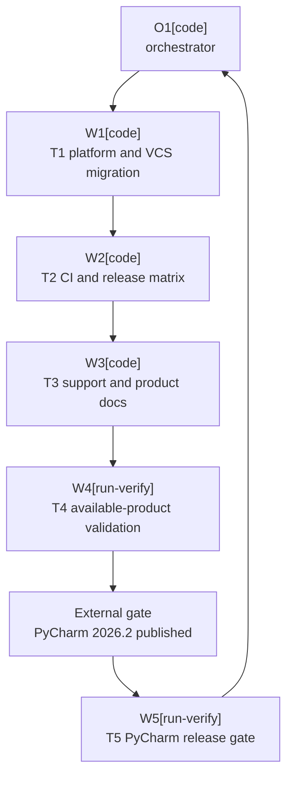

# Plan: IntelliJ 2026.2 SDK Upgrade

Plan-ID: PLAN-intellij-2026-2-sdk-upgrade

Status: Draft

Workers: 1

Filename: `.agents/plans/PLAN-intellij-2026-2-sdk-upgrade.md`

## Readiness

- Plan readiness: Blocked on explicit acceptance of proposed ADR 0089 and later explicit approval of this plan.
- Approved by:
- Approved at:
- Open questions: None; the maintainer directed that `PY-2026.2` remain required and be allowed to fail until JetBrains publishes it.
- Implementation progress: Not started. No SDK, source, workflow, or user-documentation changes are authorized yet.

## Status History

- 2026-07-16T21:02:39+02:00: none -> Draft by Codex <codex@openai.com>; companion plan created for proposed ADR 0089.

## Goal

Advance the minimum supported IntelliJ Platform from 2026.1 to 2026.2, migrate the Java and compatibility-sensitive VCS/Commit boundaries required by branch 262, and prepare the complete required product matrix while leaving the pull request draft until PyCharm 2026.2 is available and passes.

## Non-Goals

- Do not retain 2026.1 compatibility through a second artifact, version branch, shim, fallback, or feature flag.
- Do not suppress, conditionally skip, or mark the unavailable PyCharm 2026.2 lane as successful.
- Do not change Git-only or all-IDE scope, AI Assistant policy, commit/push behavior, Marketplace channels, signing, or release versioning.
- Do not upgrade Gradle, Kotlin, IntelliJ Platform Gradle Plugin, tests, or unrelated dependencies unless direct 2026.2 validation proves it necessary.
- Do not refactor unrelated VCS or workflow code.

## Assumptions

- Accepted ADR 0089 will supersede ADR 0008 and make branch 262 the minimum.
- IntelliJ IDEA `2026.2` is `IU-262.8665.258`, WebStorm `2026.2` is `WS-262.8665.259`, and AI Assistant `262.8665.258` is the exact build-SDK dependency.
- IntelliJ Platform Gradle Plugin `2.18.1` maps branch 262 to Java 25; Java and Kotlin targets must both use 25.
- `bundledModule(...)` is the supported build-classpath mechanism for the VCS/DVCS modules split out in 262.
- Existing fail-closed Commit and staging semantics remain authoritative.
- The PR may remain red solely because `PY-2026.2` is unpublished. Every other failure is an implementation defect.

## Open Questions

No open plan questions. ADR acceptance and plan approval are required lifecycle gates, not unresolved design questions.

## Proposed Changes

- `T1-platform-and-vcs-migration`: update the platform, Java, module, AI Assistant, and compatibility-sensitive Kotlin boundaries until the 262 plugin builds and tests pass.
- `T2-ci-and-release-matrix`: update CI, release, local validation, and workflow contract tests to JDK 25 and the required 2026.2 matrix.
- `T3-support-and-product-docs`: update specification, user/support/contributor docs, Marketplace description, issue template, and changelog.
- `T4-available-product-validation`: validate all available 2026.2 products and record the expected PyCharm availability failure.
- `T5-pycharm-release-gate`: after PyCharm 2026.2 is published, rerun the unchanged required lane and full current-head readiness gate.

## Task Packets

### Task Packet: T1-platform-and-vcs-migration

Task id: T1-platform-and-vcs-migration

Lane: implementation

- Required skills: `intellij-plugin-development`, `kotlin-plugin-style`, `platform-docs-research`, and `plugin-test-tdd`.
- Goal: Produce a Java 25, `since-build=262` plugin that compiles, tests, and packages against IDEA 2026.2 without changing Commit, staging, or push behavior.
- Initial context budget: Read `AGENTS.md`, accepted ADR 0089, this packet, `build.gradle.kts`, `gradle.properties`, `src/main/resources/META-INF/plugin.xml`, `src/main/kotlin/pl/devopssolutions/aicommitall/workflow/ReflectiveCommitWorkflowSynchronizer.kt`, and its matching test; escalate to exact IntelliJ 262 source and owner guides when required.
- Allowed inputs: The files in the write scope, accepted ADR 0089, JetBrains 262 source and documentation, and focused Gradle validation output.
- Forbidden inputs: Unrelated archived plans, unrelated feature code, and prior worker transcripts beyond the orchestrator handoff.
- Write scope: `build.gradle.kts`, `gradle.properties`, `src/main/resources/META-INF/plugin.xml`, `src/main/kotlin/pl/devopssolutions/aicommitall/workflow/ReflectiveCommitWorkflowSynchronizer.kt`, and `src/test/kotlin/pl/devopssolutions/aicommitall/workflow/ReflectiveCommitWorkflowSynchronizerTest.kt`.
- Dependencies: Accepted ADR 0089, approved plan, and no prior task.
- Validation: Capture focused red evidence; run affected tests, full `test`, `buildPlugin`, `verifyPluginProjectConfiguration`, `spotlessCheck detekt`, self-review, and `git diff --check`; commit T1 before T2.
- Escalation triggers: No narrow 262 staging boundary preserves behavior; runtime modules alter product scope; or another dependency upgrade is required.
- Stop conditions: A new product decision, behavior change, or broad compatibility abstraction is required.
- Expected output: Passing 262 build foundation, regression evidence, task commit, risks, worker events, and orchestrator reconciliation.
- Result summary: Status pending; worker, diff, validation, review, commit, events, docs/spec/tasks, blockers, risks, reconciliation, and next action to be recorded.

### Task Packet: T2-ci-and-release-matrix

Task id: T2-ci-and-release-matrix

Lane: implementation

- Required skills: `intellij-plugin-development`, `plugin-test-tdd`, and `repository-documentation`.
- Goal: Move automation and local prerelease validation to JDK 25 and the required 2026.2 IDEA/PyCharm/WebStorm matrix without bypassing PyCharm.
- Initial context budget: Read `AGENTS.md`, accepted ADR 0089, this packet, the seven workflows and prerelease script in the write scope, and the three CI contract tests; escalate to release/testing guidance and exact failures.
- Allowed inputs: The files in the write scope, accepted ADR 0089, and their focused validation output.
- Forbidden inputs: Plugin behavior source, unrelated workflows, and prior worker transcripts beyond the handoff.
- Write scope: `.github/workflows/ci.yml`, `.github/workflows/codeql.yml`, `.github/workflows/dependency-submission.yml`, `.github/workflows/github-release.yml`, `.github/workflows/plugin-verifier.yml`, `.github/workflows/release.yml`, `.github/workflows/release-matrix-ui.yml`, `scripts/run-local-prerelease-validation.ps1`, and `src/test/kotlin/pl/devopssolutions/aicommitall/ci/`.
- Dependencies: T1 committed and reconciled.
- Validation: Run focused workflow tests and any shared suite, docs validation for executable docs, self-review that `PY-2026.2` is required with no skip or `continue-on-error`, and `git diff --check`; commit T2 before T3.
- Escalation triggers: A workflow tool cannot run on JDK 25 or an accepted product identifier is wrong.
- Stop conditions: Passing CI would require hiding or weakening the PyCharm gate.
- Expected output: Updated automation, contract-test evidence, expected unavailable-product behavior, task commit, events, and reconciliation.
- Result summary: Status pending; worker, diff, validation, review, commit, events, docs/spec/tasks, blockers, risks, reconciliation, and next action to be recorded.

### Task Packet: T3-support-and-product-docs

Task id: T3-support-and-product-docs

Lane: implementation

- Required skills: `repository-documentation` and `intellij-plugin-development`.
- Goal: Align all current compatibility statements with the accepted 2026.2 baseline and draft-readiness condition.
- Initial context budget: Read `AGENTS.md`, accepted ADR 0089, this packet, the files in the write scope, and landed T1/T2 configuration; escalate to documentation/release guidance for generated artifacts.
- Allowed inputs: The files in the write scope, accepted ADR 0089, and landed T1/T2 configuration.
- Forbidden inputs: Unrelated archived plans, historical reports, and unrelated changelog sections.
- Write scope: `README.md`, `docs/SUPPORT.md`, `docs/specification.md`, `docs/user-guide.md`, `docs/troubleshooting.md`, `CONTRIBUTING.md`, `.github/ISSUE_TEMPLATE/bug_report.yml`, and `config/intellij-platform/description.html`.
- Dependencies: T2 committed and reconciled.
- Validation: Run docs validation, relevant documentation/spec tests, self-review that no PyCharm pass is claimed, and `git diff --check`; commit T3 before T4.
- Escalation triggers: Marketplace description cannot be reproduced or a new support/release decision appears.
- Stop conditions: Correct wording contradicts ADR 0089 or landed configuration.
- Expected output: Aligned docs, a suggested public compatibility changelog entry for the orchestrator, validation evidence, task commit, events, and reconciliation.
- Result summary: Status pending; worker, diff, validation, review, commit, events, docs/spec/tasks, blockers, risks, reconciliation, and next action to be recorded.

### Task Packet: T4-available-product-validation

Task id: T4-available-product-validation

Lane: testing

- Required skills: `intellij-plugin-development`, `plugin-review`, and `repository-documentation`.
- Goal: Prove current head against every available 2026.2 gate, record PyCharm's external availability failure, and leave no other failure unresolved.
- Initial context budget: Read `AGENTS.md`, accepted ADR 0089, this packet, current diff, testing/review guidance, and current product data; escalate only to files needed to attribute a failure.
- Allowed inputs: Current-head repository state, validation output, JetBrains feeds, and available local IDEs.
- Forbidden inputs: Unrelated archived evidence and implementation changes outside a separately dispatched remediation packet.
- Write scope: `docs/validation/reports/2026-07-16-intellij-2026-2-upgrade.md`.
- Dependencies: T3 committed and reconciled.
- Validation: Run full unit, coverage, formatting, Detekt, packaging, configuration, docs, and agent checks; verifier and UI checks for available IDEA/WebStorm 2026.2; manual staging/AI smoke where possible; invoke `PY-2026.2` and accept only product-unavailable resolution failure; review the full diff; commit evidence before T5.
- Escalation triggers: Any non-PyCharm failure or a changed head.
- Stop conditions: A non-PyCharm failure remains or the head changes without full revalidation.
- Expected output: Current-head report, exact blocker, review findings, task commit, events, and reconciliation.
- Result summary: Status pending; worker, diff, validation, review, commit, events, docs/spec/tasks, blockers, risks, reconciliation, and next action to be recorded.

### Task Packet: T5-pycharm-release-gate

Task id: T5-pycharm-release-gate

Lane: testing

- Required skills: `intellij-plugin-development`, `plugin-review`, and `repository-documentation`.
- Goal: After PyCharm 2026.2 is published, prove its unchanged required lane and the full current-head readiness gate.
- Initial context budget: Read `AGENTS.md`, accepted ADR 0089, this packet, T4 report, current PR head/checks/reviews, and product data; escalate only to failing files.
- Allowed inputs: Current-head repository/PR state, PyCharm 2026.2 metadata, and T4 evidence.
- Forbidden inputs: Earlier-head approvals as current evidence and unrelated history.
- Write scope: `docs/validation/reports/2026-07-16-intellij-2026-2-upgrade.md`; remediation requires a separate approved packet.
- Dependencies: T4 committed and PyCharm 2026.2 published.
- Validation: Run PyCharm verifier/UI and the complete current-head matrix; re-fetch head, checks, reviews, and threads; commit final evidence and complete the plan only after all gates pass.
- Escalation triggers: Published PyCharm changes accepted identifiers, Java, modules, compatibility, or any current-head gate fails.
- Stop conditions: PyCharm remains unavailable, a check fails, the head changes, or current-head review blocks readiness.
- Expected output: Passing full-matrix evidence, final task commit, plan update, events, reconciliation, and PR readiness result.
- Result summary: Status pending; worker, diff, validation, review, commit, events, docs/spec/tasks, blockers, risks, reconciliation, and next action to be recorded.

## Execution Model

- Use one active worker at a time and a fresh sub-agent for each task packet.
- The orchestrator records a decision capsule, reserves each write scope, reconciles claims, and commits each completed task before the next.
- After T3, the orchestrator decides and applies any eligible `CHANGELOG.md` entry during reconciliation; workers may only suggest the text.
- T1 through T4 execute sequentially after both lifecycle gates. T5 waits for JetBrains to publish PyCharm 2026.2.
- Follow `.agents/references/orchestration.md`; use the current upgrade worktree only.

## Long-Run Continuity

- Resume docs reread: after compaction, interruption, resume, or handoff, reread `AGENTS.md`; this plan's header, readiness, execution model, current packet, and result summary; execution, orchestration, testing, and review guides; `.gitmessage` before commits; and the next owner files.
- Current task or wave: Governance draft only.
- Completed commits: None.
- Plan status and readiness: Draft; blocked on ADR acceptance and explicit plan approval.
- Validation and self-review state: Research probes completed; implementation validation not authorized.
- Worker event and reconciliation state: No implementation workers dispatched; reconciliation not started.
- Changelog, docs, spec, task, or plan updates: Proposed ADR 0089 and this plan only.
- Blockers or open questions: Lifecycle gates only; no open design questions.
- Next action: User explicitly accepts ADR 0089 and then explicitly approves this plan.
- Context handoff notes: Missing PyCharm is a future readiness blocker, not permission to weaken CI.

## Execution Graph

## Validation

- Governance draft: run docs validation, agent-artifact validation, self-review, and `git diff --check`.
- T1 through T5 own implementation validation; drafting this plan authorizes none of it.

## Risks

- IntelliJ 262 internal and modular VCS APIs may require a narrower replacement than initial compile errors reveal.
- Compile-successful modules may still fail runtime class loading across products.
- The draft PR may remain red for an unknown period while PyCharm 2026.2 is unavailable.
- Published PyCharm may expose a new compatibility decision rather than a safe implementation detail.
- Java 25 changes every Gradle-running environment; local success does not prove hosted compatibility.

## Handoff Notes

- Research used `origin/main` at `3f3828826153d04f8719689e1102f5df6d29921f`.
- A property-only `buildPlugin` probe failed on Java target 25 versus Kotlin target 21.
- A diagnostic retry exposed missing VCS/DVCS modules and Kotlin-internal `GitStageCommitWorkflowHandler`; neither probe modified repository files.
- The PR stays draft until T5 completes on the current head.
