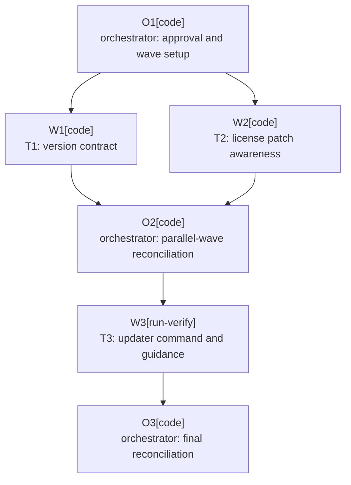

# Plan: IntelliJ Patch Upgrade Automation

Plan-ID: PLAN-intellij-patch-upgrade-automation

Status: In Progress

Workers: 2 (parallel, tasks: T1-version-contract, T2-license-restart-patch-awareness; then T3-patch-update-command sequential)

Filename: `.agents/plans/PLAN-intellij-patch-upgrade-automation.md`

## Readiness

- Plan readiness: Approved and ready. PR #48 is merged with all required checks passing, and approved-plan workers are available.
- Approved by: Kamil Kiewisz <kamkie@outlook.com>
- Approved at: 2026-08-17T10:52:34+02:00
- Open questions: None.
- Implementation progress: Wave 1 starting with T1 and T2 in parallel; T3 remains dependency-blocked.

## Status History

- 2026-08-17T10:39:06+02:00: none -> Draft by Kamil Kiewisz <kamkie@outlook.com>; user requested a patch-upgrade implementation plan.
- 2026-08-17T10:52:34+02:00: Draft -> Approved by Kamil Kiewisz <kamkie@outlook.com>; explicit user approval recorded.
- 2026-08-17T10:52:55+02:00: Approved -> In Progress by Codex <codex@openai.com>; implementation started after verifying PR #48 and worker readiness.

## Goal

Make patch upgrades within the approved IntelliJ release line, such as `2026.2` to `2026.2.1`, a small validated operation that changes only the exact IntelliJ Platform and compatible AI Assistant coordinates. Keep routine Dependabot pull requests free from patch-build, absolute-path, and exact-version harness failures while preserving explicit human review for release-line upgrades such as `2026.2` to `2026.3`.

## Non-Goals

- Automating or approving a new IntelliJ release line, Java baseline, `pluginSinceBuild`, internal API migration, or supported-product decision.
- Discovering or selecting a compatible AI Assistant build automatically.
- Replacing Dependabot, enabling automatic merge, publishing a plugin release, or changing Marketplace credentials.
- Generalizing 2026.2-only platform-error suppressions to later release lines without evidence.
- Refactoring unrelated dependency versions, Detekt, KtLint, CI actions, or release workflows.

## Assumptions

- ADR 0089 remains the governing decision for the IntelliJ 2026.2, build-branch 262, and Java 25 baseline.
- `platformReleaseLine=2026.2` is the explicit human approval gate. Patch coordinates must match this release line; a `2026.3` coordinate must fail until a separate reviewed release-line upgrade changes the gate.
- `pluginSinceBuild=262` is the expected AI Assistant build prefix and stays unchanged throughout 2026.2 patch upgrades.
- The caller supplies the exact new `platformVersion` and compatible `aiAssistantPluginVersion`.
- GitHub Dependabot does not own arbitrary `gradle.properties` values; the patch updater is a separate maintainer command.
- Existing `IU-2026.2`, `PY-2026.2`, and `WS-2026.2` workflow targets are intentionally patch-following and remain unchanged.
- Build and validation failures leave a visible working-tree diff; the updater does not rewrite Git history, stage, commit, push, or roll back user work.

## Open Questions

None. Automatic AI Assistant version discovery and cross-release-line upgrades are explicitly outside this plan.

## Proposed Changes

### T1-version-contract

- Add `platformReleaseLine=2026.2` to `gradle.properties` and change the default local verifier target from exact `IU-2026.2.0.1` to patch-following `IU-2026.2`.
- Add a testable `buildSrc` IntelliJ patch-version contract and verification task that accept base and patch coordinates within the release line and reject delimiter near misses or later release lines.
- Validate that `platformVersion` belongs to `platformReleaseLine`, `aiAssistantPluginVersion` begins with `pluginSinceBuild.`, and every configured verifier target belongs to the approved release line.
- Register a Gradle verification task and attach it to an existing CI-reached build/package gate so every Dependabot pull request exercises the contract without workflow-version duplication.

### T2-license-restart-patch-awareness

- Replace the remaining exact `2026.2` license-restart comparisons in the host harness and fake AI Assistant probe with delimiter-aware release-line matching.
- Keep title, body, action, product, process, and marker-state checks exact.
- Add deterministic tests that accept `2026.2` and `2026.2.1`, reject `2026.20`, `2026.3`, and unrelated versions, and preserve the existing fail-closed behavior.
- Reuse the runtime-path classifier from PR #48 without broadening known-error signatures or release scope.

### T3-patch-update-command

- Add `scripts/update-intellij-patch.ps1` as the single maintainer entry point.
- Keep the script thin: register a tested `buildSrc` update task that owns strict property parsing, validation, atomic replacement, and preservation, then let the script invoke that task and the post-update validation sequence.
- Require explicit platform and AI Assistant versions, validate both against the approved contract before writing, and update only the two exact property values.
- Preserve file encoding, LF line endings, property order, comments, and all unrelated values; write atomically and refuse duplicate or missing property keys.
- Run the version-contract gate, focused patch-aware harness tests, `spotlessCheck`, `buildPlugin`, `verifyPlugin`, and the PyCharm 2026.2 UI smoke lane after updating.
- Document the command, accepted inputs, failure behavior, resulting two-property diff, and release-line-upgrade stop condition in contributor and agent validation guidance.

## Task Packets

### Task Packet: T1-version-contract

Task id: T1-version-contract
Lane: implementation
Required skills: intellij-plugin-development, plugin-test-tdd, kotlin-plugin-style

Goal:
- Establish one executable patch-version contract and wire it into ordinary Gradle validation.

Initial context budget:
- Read first: parent plan header/readiness/graph, this packet, `AGENTS.md`, ADR 0089, `gradle.properties`, `build.gradle.kts`, `buildSrc/build.gradle.kts`, existing `buildSrc` verification tasks, testing guidance, code style, and `.gitmessage` before commit.
- Escalate to: `.github/workflows/ci.yml` only if no existing Gradle task dependency can execute the contract; IntelliJ Platform Gradle Plugin docs only if task/provider behavior is unclear.

Allowed inputs:
- Read-first files and escalation-only files after a trigger fires.

Forbidden inputs:
- Unrelated plans, product workflow source, release documentation, prior worker transcripts, and T2/T3 implementation evidence beyond the orchestrator summary.

Write scope:
- gradle.properties
- build.gradle.kts
- buildSrc/build.gradle.kts
- buildSrc/src/main/kotlin/pl/devopssolutions/aicommitall/gradle/
- buildSrc/src/test/kotlin/pl/devopssolutions/aicommitall/gradle/
- .github/workflows/ci.yml only after its escalation trigger fires

Dependencies:
- None. May run in parallel with T2 because write scopes are disjoint.

Validation:
- Red: out-of-line patch, AI build-prefix mismatch, verifier mismatch, and delimiter near miss.
- Green: 2026.2, 2026.2.0.1, and 2026.2.1 contracts.
- Run the new verification task, spotlessCheck, buildPlugin, and git diff --check.
- Self-review that a release-line change cannot pass as a patch and ordinary dependency PRs execute the gate.
- Commit T1 before T3 starts.

Escalation triggers:
- Load `.github/workflows/ci.yml` if CI cannot execute the contract through an existing Gradle gate.
- Open IntelliJ Platform Gradle Plugin documentation if Gradle provider timing requires broader build-logic changes.

Stop conditions:
- Validation would derive or silently change pluginSinceBuild, Java, or the approved release line.
- Work would enter T2 integration files or T3 scripts/docs.

Expected output:
- Changed files, red/green evidence, final validation, self-review, commit, worker events, blockers, risks, and T3 handoff.

Result summary:
- Status: pending
- Worker:
- Changed files or reviewed diff:
- Validation evidence:
- Self-review:
- Commit:
- Worker events:
- Orchestrator reconciliation:
- Docs/spec/tasks: Not expected; contributor guidance is owned by T3.
- Blockers:
- Review risks:
- Handoff:

### Task Packet: T2-license-restart-patch-awareness

Task id: T2-license-restart-patch-awareness
Lane: implementation
Required skills: intellij-plugin-development, plugin-test-tdd, kotlin-plugin-style

Goal:
- Make the 2026.2 license-restart harness accept patch versions without weakening any other contract field.

Initial context budget:
- Read first: parent plan header/readiness/graph, this packet, `AGENTS.md`, ADR 0089, PR #48 final classifier diff, `src/integrationTest/kotlin/pl/devopssolutions/aicommitall/integration/ReleaseMatrixUiHarnessTest.kt`, `src/integrationTest/kotlin/pl/devopssolutions/aicommitall/integration/fakeai/FakeAiAssistantProbe.kt`, testing guidance, code style, and `.gitmessage` before commit.
- Escalate to: PR #48 CI logs only if its final head fails in the touched harness; archived 2026.2 plan only if the exact restart contract is unclear.

Allowed inputs:
- Read-first files and escalation-only evidence after a trigger fires.

Forbidden inputs:
- Unrelated workflows, Gradle dependencies, production implementation, archived plans, prior worker transcripts, and T1/T3 implementation evidence beyond the orchestrator summary.

Write scope:
- src/integrationTest/kotlin/pl/devopssolutions/aicommitall/integration/ReleaseMatrixUiHarnessTest.kt
- src/integrationTest/kotlin/pl/devopssolutions/aicommitall/integration/fakeai/FakeAiAssistantProbe.kt

Dependencies:
- PR #48 runtime-path classifier changes must be present.
- May run in parallel with T1 after that prerequisite is satisfied.

Validation:
- Red/green targeted release-line and license-restart contract tests through releaseMatrixUiTest without full IDE scenarios.
- Run compileIntegrationTestKotlin, neighboring classifiers, spotlessCheck, and git diff --check.
- Self-review that later release lines and altered dialog/marker fields remain rejected.
- Commit T2 before T3 starts.

Escalation triggers:
- Review `ApplicationInfo.shortVersion` evidence if it conflicts with delimiter-aware patch matching.
- Check PR #48's final diff if the same classifier or restart lines changed after approval.

Stop conditions:
- Supporting a patch requires broadening a known error to another release line.
- Work would change production behavior or public compatibility promises.

Expected output:
- Changed files, red/green evidence, final compilation, self-review, commit, worker events, blockers, risks, and T3 handoff.

Result summary:
- Status: pending
- Worker:
- Changed files or reviewed diff:
- Validation evidence:
- Self-review:
- Commit:
- Worker events:
- Orchestrator reconciliation:
- Docs/spec/tasks: Not applicable; test harness only.
- Blockers:
- Review risks:
- Handoff:

### Task Packet: T3-patch-update-command

Task id: T3-patch-update-command
Lane: implementation
Required skills: intellij-plugin-development, plugin-test-tdd, repository-documentation

Goal:
- Deliver one fail-closed command that performs and validates an in-release-line IntelliJ patch update.

Initial context budget:
- Read first: parent plan header/readiness/graph, this packet, reconciled T1/T2 summaries, `AGENTS.md`, `gradle.properties`, the T1 contract, existing `scripts/` validation commands, `CONTRIBUTING.md`, `.agents/references/testing.md`, `.agents/references/documentation.md`, and `.gitmessage` before commit.
- Escalate to: `.github/workflows/` only if the command cannot reuse existing CI-equivalent gates; `.agents/references/troubleshooting.md` after repeated validation failure.

Allowed inputs:
- Read-first files, reconciled T1/T2 summaries and commits, and escalation-only files after a trigger fires.

Forbidden inputs:
- Unrelated production source, release automation, archived plans, prior worker transcripts, and external AI Assistant version discovery.

Write scope:
- scripts/update-intellij-patch.ps1
- build.gradle.kts for update-task registration
- buildSrc/src/main/kotlin/pl/devopssolutions/aicommitall/gradle/UpdateIntellijPatchProperties.kt
- buildSrc/src/main/kotlin/pl/devopssolutions/aicommitall/gradle/UpdateIntellijPatchTask.kt
- buildSrc/src/test/kotlin/pl/devopssolutions/aicommitall/gradle/UpdateIntellijPatchPropertiesTest.kt
- CONTRIBUTING.md
- .agents/references/testing.md
- buildSrc/src/main/kotlin/pl/devopssolutions/aicommitall/gradle/IntellijPatchVersionContract.kt only to reuse T1 validation

Dependencies:
- T1 and T2 committed, validated, and reconciled.

Validation:
- Reject without mutation: 2026.3, 2026.20, AI prefix mismatch, missing keys, duplicate keys.
- Accept an isolated fixture update that changes only platformVersion and aiAssistantPluginVersion while preserving UTF-8, LF, order, comments, and unrelated bytes.
- Run spotlessCheck, version contract, focused T2 tests, buildPlugin, verifyPlugin, PyCharm 2026.2 UI smoke, docs validation, agent-artifact validation, and git diff --check.
- Self-review that the command never stages, commits, pushes, rolls back, changes release-line policy, or discovers versions.
- Commit T3 after complete validation.

Escalation triggers:
- Stop and report if atomic updates require a broader reusable PowerShell or Gradle abstraction.
- Run the flaky-test workflow if PyCharm smoke fails outside the touched surface.
- Open `.agents/references/documentation.md` if documentation ownership requires another governed artifact.

Stop conditions:
- Invalid input cannot fail before mutation.
- Validation would publish, sign, use Marketplace secrets, or mutate external state.
- The updater would select an AI Assistant version automatically.

Expected output:
- Changed files, negative/positive evidence, full validation, self-review, commit, worker events, blockers, risks, and final handoff.

Result summary:
- Status: pending
- Worker:
- Changed files or reviewed diff:
- Validation evidence:
- Self-review:
- Commit:
- Worker events:
- Orchestrator reconciliation:
- Docs/spec/tasks: Contributor and agent validation guidance expected; public docs/changelog only if behavior changes.
- Blockers:
- Review risks:
- Handoff:

## Execution Model

- T1 and T2 form one approved parallel wave with disjoint write scopes and separate commits.
- The orchestrator waits for both commits, validates their result summaries, and reconciles their combined diff before dispatching T3.
- T3 runs sequentially on the reconciled branch and commits only after its full validation set passes.
- Use one fresh sub-agent task worker per packet. If approved-plan workers are unavailable or unauthorized by the active tool contract, stop before implementation; local packet mode is not permitted.
- Use the current branch only. Do not create per-worker worktrees.
- Use `Project-Source: plan-task`, `Project-Plan: PLAN-intellij-patch-upgrade-automation`, and the exact `Project-Plan-Task:` id, plus required worker/orchestrator/agent-mode trailers.
- Keep structured worker events in chat and compact result summaries in this plan.

## Long-Run Continuity

- Resume docs reread:
  - After compaction, interruption, resume, or handoff, reread the latest user request; `AGENTS.md`; this plan's header, readiness, execution model, execution graph, current task packet, and current result summaries; `.agents/references/execution.md`; `.agents/references/orchestration.md`; `.agents/references/testing.md`; `.agents/references/reviews.md`; `.gitmessage` before commit; and only the exact owner artifacts needed next.
- Current task or wave: Wave 1, T1-version-contract and T2-license-restart-patch-awareness.
- Completed commits: None for this plan.
- Plan status and readiness: In Progress; approved by Kamil Kiewisz <kamkie@outlook.com> at 2026-08-17T10:52:34+02:00.
- Validation and self-review state: Plan/docs validation passed before approval; task validation pending.
- Worker event state: No workers started.
- Orchestrator reconciliation state: Not started.
- Changelog, docs, spec, task, or plan updates: Approved plan and plan catalog state; implementation changes pending.
- Blockers or open questions: None for Wave 1; T3 waits for both Wave 1 commits and reconciliation.
- Next action: Dispatch T1 and T2 workers with disjoint write scopes.
- Context handoff notes: Preserve the distinction between patch coordinates and the manually approved release line.

## Execution Graph

## Validation

- Plan-only validation before approval:
  - `pwsh -NoProfile -ExecutionPolicy Bypass -File scripts/validate-docs.ps1`
  - `pwsh -NoProfile -ExecutionPolicy Bypass -File scripts/ai/validate-agent-artifacts.ps1`
  - `git diff --check`
- Implementation validation is task-specific above and culminates in version-contract, integration harness, build/package, Plugin Verifier, PyCharm UI smoke, docs, agent-artifact, and diff checks.
- No signing, publishing, Marketplace credential, or real repository mutation beyond the explicit local property update is part of this plan.

## Risks

- JetBrains patch identifiers and AI Assistant build identifiers are related but not interchangeable; prefix validation cannot prove semantic compatibility, so the caller must supply a known-compatible AI build.
- The fake AI probe runs inside a separate IDE process and cannot share host-private helpers; both sides need equivalent delimiter-aware tests.
- An updater bug could corrupt `gradle.properties`; strict key counts, pre-write validation, atomic replacement, encoding/line-ending preservation, and isolated-fixture tests are mandatory.
- A release-line upgrade could masquerade as a patch if validation uses naive string prefixes; delimiter-aware matching and near-miss tests are mandatory.
- The PyCharm smoke lane may expose unrelated platform flakes; preserve first-failure evidence and use the flaky-test workflow before changing assertions.

## Handoff Notes

- This plan does not alter ADR 0089 or approve an IntelliJ 2026.3 migration.
- PR #48 remains the owner of runtime-path classifier hardening and should stay scoped to that fix.
- Implementation is explicitly approved; execute task packets in the declared graph and keep result summaries current.
- No README, specification, support, or changelog update is expected unless implementation evidence reveals public behavior or compatibility-policy changes.
