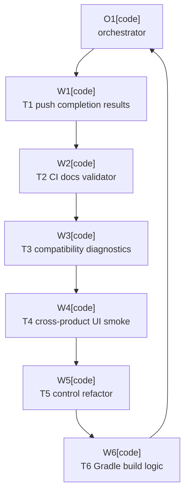

# Plan: Maintainability Stability Audit

Plan-ID: PLAN-maintainability-stability-audit

Status: In Progress

Workers: 1

Filename: `.agents/plans/PLAN-maintainability-stability-audit.md`

## Readiness

- Plan readiness: Approved and in active implementation.
- Approved by: Kamil Kiewisz <kamkie@outlook.com>
- Approved at: 2026-05-24T21:06:43+02:00
- Open questions: None.
- Implementation progress: `T1-push-completion-results`, `T2-ci-docs-validator`, `T3-compatibility-diagnostics`, `T4-cross-product-release-ui-smoke`, and `T5-three-section-control-refactor` are implemented and validated; `T6-gradle-verification-build-logic` is next.

## Status History

- 2026-05-24T21:01:54+02:00: none -> Draft by OpenAI Codex <codex@openai.com>; plan created from accepted proposal findings in `PROP-maintainability-stability-audit`.
- 2026-05-24T21:06:43+02:00: Draft -> Approved by Kamil Kiewisz <kamkie@outlook.com>; maintainer explicitly approved with "accept and implement PLAN-maintainability-stability-audit".
- 2026-05-24T21:06:43+02:00: Approved -> In Progress by OpenAI Codex <codex@openai.com>; orchestrator started approved-plan worker execution.

## Goal

Implement the accepted non-terminal findings from `PROP-maintainability-stability-audit`: preserve Git push completion results, run full documentation validation in pull-request CI, add compatibility diagnostics, extend release-matrix UI smoke coverage beyond IDEA, split the three-section Swing control into reviewable units, and move custom Gradle verification task implementations out of the root build script.

## Non-Goals

- Do not implement rejected finding `F001`.
- Do not change plugin product strategy, supported IDE versions, Marketplace timing, or JetBrains AI Assistant dependency policy.
- Do not replace platform-owned commit, push, warning, or error UI with plugin-owned prompts.
- Do not remove the manual release checklist or `T-VAL-024` release-validation responsibility.
- Do not redesign the three-section control or intentionally change its labels, colors, shortcuts, layout, accessibility contract, or rendered output during the refactor task.
- Do not make release-matrix UI checks required on every pull request unless a later accepted decision says so.

## Assumptions

- The proposal acceptance is sufficient to start planning, but implementation still requires explicit plan approval under `AGENTS.md`.
- `F002`, `E001`, `E002`, `E003`, `S001`, and `S002` are in scope; `F001` remains `not-required`.
- Current IntelliJ Platform APIs expose enough `GitPushRepoResult` information to distinguish success, cancellation, and failure without bypassing platform push handling.
- Cross-product UI smoke coverage should use the repository's current product aliases and existing release-matrix harness shape rather than inventing a separate validation stack.
- Refactors in `S001` and `S002` should be behavior-preserving and validated before and after extraction.

## Open Questions

- None.

## Proposed Changes

- T1-push-completion-results: Preserve per-repository `GitPushRepoResult` data through the push-completion listener and safe immediate push service, add timeout/failure handling, and update focused tests and observable requirements where behavior changes.
- T2-ci-docs-validator: Change pull-request CI to run `scripts/validate-docs.ps1`, keep agent-artifact validation covered, and update workflow tests.
- T3-compatibility-diagnostics: Add narrow logging for reflection and platform compatibility fallbacks in AI completion, commit workflow synchronization, and staging-area collection without changing fail-closed user behavior.
- T4-cross-product-release-ui-smoke: Extend `releaseMatrixUiTest` and the GitHub release-matrix UI workflow so PyCharm and WebStorm can run a small deterministic smoke subset while IDEA remains the full harness.
- T5-three-section-control-refactor: Split `AiCommitAllThreeSectionControl.kt` and its asset-generation helpers into smaller package-private units with unchanged behavior.
- T6-gradle-verification-build-logic: Move custom Gradle verification task implementations out of `build.gradle.kts` into focused build logic while preserving task registration, thresholds, and configuration-cache behavior.

## Task Packets

### Task Packet: T1-push-completion-results

Task id: T1-push-completion-results

Lane: implementation

Required skills:

- `intellij-plugin-development`
- `kotlin-plugin-style`
- `plugin-test-tdd`
- `repository-documentation`

Goal:

- Make safe immediate push completion preserve platform push result state and finish the plugin workflow only after success, cancellation, failure, or bounded timeout is represented explicitly.

Initial context budget:

- Read first:
  - Plan header, readiness summary, execution graph, and this task packet.
  - `docs/proposals/PROP-maintainability-stability-audit-2026-05-24T20-17.md`
  - `docs/specification.md`
  - `src/main/java/pl/devopssolutions/aicommitall/vcs/GitPushCompletionListener.java`
  - `src/main/kotlin/pl/devopssolutions/aicommitall/vcs/GitPushCompletionService.kt`
  - `src/main/kotlin/pl/devopssolutions/aicommitall/vcs/SafeImmediatePushService.kt`
  - `src/test/kotlin/pl/devopssolutions/aicommitall/vcs/GitPushCompletionServiceTest.kt`
  - `src/test/kotlin/pl/devopssolutions/aicommitall/vcs/SafeImmediatePushServiceTest.kt`
- Escalate to:
  - `src/main/kotlin/pl/devopssolutions/aicommitall/workflow/` and related tests only if workflow result propagation changes.
  - `docs/validation/scenario-register.md` and `docs/validation/release-checklist.md` only when observable validation scenarios need alignment.
  - IntelliJ Platform SDK or source references only if `GitPushRepoResult` success semantics are unclear.

Allowed inputs:

- Files and artifacts named in `Read first`.
- Files and artifacts named in `Escalate to` only after an escalation trigger fires.

Forbidden inputs:

- Unrelated archived plans.
- Previous worker chat beyond the orchestrator handoff summary.
- Implementation evidence from unrelated task packets.

Write scope:

- `docs/specification.md`
- `docs/validation/scenario-register.md`
- `docs/validation/release-checklist.md`
- `src/main/java/pl/devopssolutions/aicommitall/vcs/GitPushCompletionListener.java`
- `src/main/kotlin/pl/devopssolutions/aicommitall/vcs/`
- `src/main/kotlin/pl/devopssolutions/aicommitall/workflow/`
- `src/test/kotlin/pl/devopssolutions/aicommitall/vcs/`
- `src/test/kotlin/pl/devopssolutions/aicommitall/workflow/`

Dependencies:

- This plan explicitly approved.

Validation:

- Add or update failing focused tests before production changes when practical.
- Run `.\gradlew.bat test --tests "pl.devopssolutions.aicommitall.vcs.GitPushCompletionServiceTest"`.
- Run `.\gradlew.bat test --tests "pl.devopssolutions.aicommitall.vcs.SafeImmediatePushServiceTest"`.
- Run workflow tests if workflow result propagation changes.
- Run `pwsh -NoProfile -ExecutionPolicy Bypass -File scripts/validate-docs.ps1` if docs or specs change.
- Run `git diff --check`.
- Self-review for push safety, platform error preservation, multi-repository behavior, timeout behavior, and no real remote contact in tests.

Escalation triggers:

- Load platform references if tests cannot determine which `GitPushRepoResult` values count as success, cancellation, or failure.
- Load workflow sources if the safe immediate push result must change the user-visible workflow stop reason.
- Stop if a new product decision is needed for how failed completed pushes should appear to users beyond preserving platform-owned push UI.

Stop conditions:

- Stop if the plan is not approved.
- Stop if `GitPushRepoResult` cannot be inspected compatibly across supported IDE versions.
- Stop if the implementation would bypass platform push error handling or contact real remotes during automated validation.

Expected output:

- Changed files and reviewed diff summary.
- Validation evidence.
- Blockers.
- Review risks.
- Handoff notes.
- Suggested changelog entry only if public behavior wording changes.

Result summary:

- Status: done
- Worker: Jason (`019e5b69-5824-7501-9901-de5dd3696f3f`)
- Changed files and reviewed diff: Preserved per-repository `GitPushRepoResult` through `GitPushCompletionListener`, `GitPushCompletionService`, and `SafeImmediatePushService`; added focused VCS tests; updated push requirement and validation docs.
- Validation evidence: Red-first targeted VCS tests failed before production support for the new result model; green checks passed with `.\gradlew.bat test --tests "pl.devopssolutions.aicommitall.vcs.GitPushCompletionServiceTest"`, `.\gradlew.bat test --tests "pl.devopssolutions.aicommitall.vcs.SafeImmediatePushServiceTest"`, `.\gradlew.bat spotlessCheck`, `pwsh -NoProfile -ExecutionPolicy Bypass -File scripts\validate-docs.ps1`, and `git diff --check`.
- Blockers: None.
- Review risks: `GitPushRepoResult.Type.NOT_PUSHED` is treated as cancellation/non-success, and missing completion events use a fixed 30-second internal timeout.
- Handoff notes: Proceed to `T2-ci-docs-validator`.

### Task Packet: T2-ci-docs-validator

Task id: T2-ci-docs-validator

Lane: implementation

Required skills:

- `repository-documentation`
- `plugin-test-tdd`

Goal:

- Make pull-request CI run the full documentation validator while preserving agent-artifact validation coverage.

Initial context budget:

- Read first:
  - Plan header, readiness summary, execution graph, and this task packet.
  - `.github/workflows/ci.yml`
  - `.github/workflows/release.yml`
  - `scripts/validate-docs.ps1`
  - `scripts/ai/validate-agent-artifacts.ps1`
  - `src/test/kotlin/pl/devopssolutions/aicommitall/ci/GitHubActionsWorkflowTest.kt`
- Escalate to:
  - `.agents/references/testing.md` if validation command selection is unclear.
  - `CHANGELOG.md` only if the CI change is release-note eligible under release guidance.

Allowed inputs:

- Files and artifacts named in `Read first`.
- Files and artifacts named in `Escalate to` only after an escalation trigger fires.

Forbidden inputs:

- Unrelated archived plans.
- Previous worker chat beyond the orchestrator handoff summary.
- Implementation evidence from unrelated task packets.

Write scope:

- `.github/workflows/ci.yml`
- `src/test/kotlin/pl/devopssolutions/aicommitall/ci/GitHubActionsWorkflowTest.kt`
- `CHANGELOG.md`

Dependencies:

- T1-push-completion-results complete, unless the orchestrator explicitly starts this low-risk CI task first after approval.

Validation:

- Run `pwsh -NoProfile -ExecutionPolicy Bypass -File scripts/validate-docs.ps1`.
- Run `.\gradlew.bat test --tests "pl.devopssolutions.aicommitall.ci.GitHubActionsWorkflowTest"`.
- Run `git diff --check`.
- Self-review for release CI parity and no loss of agent-artifact validation.

Escalation triggers:

- Load release guidance before adding a changelog entry.
- Stop if making full docs validation required on pull requests needs a new CI policy decision beyond the accepted proposal.

Stop conditions:

- Stop if the plan is not approved.
- Stop if workflow tests reveal a larger CI design issue outside the accepted finding.

Expected output:

- Changed files and reviewed diff summary.
- Validation evidence.
- Blockers.
- Review risks.
- Handoff notes.

Result summary:

- Status: done
- Worker: Ampere (`019e5b77-32fb-7752-a384-fc05695286f6`)
- Changed files and reviewed diff: Updated PR CI to run `scripts/validate-docs.ps1`; extended workflow tests to assert the full docs validator runs and still covers `scripts/ai/validate-agent-artifacts.ps1`.
- Validation evidence: Red-first `.\gradlew.bat test --tests "pl.devopssolutions.aicommitall.ci.GitHubActionsWorkflowTest"` failed before the workflow change; green checks passed with the same targeted test, `.\gradlew.bat spotlessCheck`, `pwsh -NoProfile -ExecutionPolicy Bypass -File scripts\validate-docs.ps1`, and `git diff --check`.
- Blockers: None.
- Review risks: None identified; release CI already ran the full validator, and PR CI now matches that documentation gate.
- Handoff notes: Proceed to `T3-compatibility-diagnostics`.

### Task Packet: T3-compatibility-diagnostics

Task id: T3-compatibility-diagnostics

Lane: implementation

Required skills:

- `intellij-plugin-development`
- `kotlin-plugin-style`
- `plugin-test-tdd`

Goal:

- Emit maintainer-visible diagnostics for compatibility-boundary failures while preserving existing fail-closed stop reasons and user-facing behavior.

Initial context budget:

- Read first:
  - Plan header, readiness summary, execution graph, and this task packet.
  - `docs/specification.md`
  - `src/main/kotlin/pl/devopssolutions/aicommitall/ai/AiGenerationCompletion.kt`
  - `src/main/kotlin/pl/devopssolutions/aicommitall/workflow/ReflectiveCommitWorkflowSynchronizer.kt`
  - `src/main/kotlin/pl/devopssolutions/aicommitall/vcs/GitChangeSelectionService.kt`
  - Focused tests under `src/test/kotlin/pl/devopssolutions/aicommitall/ai/`, `workflow/`, and `vcs/`
- Escalate to:
  - Additional compatibility-boundary sources only when a shared diagnostics helper needs all call sites.
  - `docs/validation/release-checklist.md` only if validation wording should mention log evidence.

Allowed inputs:

- Files and artifacts named in `Read first`.
- Files and artifacts named in `Escalate to` only after an escalation trigger fires.

Forbidden inputs:

- Unrelated archived plans.
- Previous worker chat beyond the orchestrator handoff summary.
- Implementation evidence from unrelated task packets.

Write scope:

- `src/main/kotlin/pl/devopssolutions/aicommitall/ai/`
- `src/main/kotlin/pl/devopssolutions/aicommitall/workflow/`
- `src/main/kotlin/pl/devopssolutions/aicommitall/vcs/`
- `src/test/kotlin/pl/devopssolutions/aicommitall/ai/`
- `src/test/kotlin/pl/devopssolutions/aicommitall/workflow/`
- `src/test/kotlin/pl/devopssolutions/aicommitall/vcs/`
- `docs/validation/release-checklist.md`

Dependencies:

- T1-push-completion-results complete.

Validation:

- Run focused tests for changed AI, workflow, and VCS compatibility paths.
- Run `.\gradlew.bat test` if shared diagnostics touches multiple packages.
- Run `pwsh -NoProfile -ExecutionPolicy Bypass -File scripts/validate-docs.ps1` if docs change.
- Run `git diff --check`.
- Self-review for no user notification churn, no changed stop reasons, and useful class/method/exception context.

Escalation triggers:

- Load additional compatibility call sites if a helper abstraction would otherwise duplicate logic.
- Stop if diagnostics require user-facing notifications or persistent telemetry.

Stop conditions:

- Stop if the plan is not approved.
- Stop if tests cannot observe diagnostics without brittle logger internals and no lower-risk review check exists.
- Stop if diagnostics would expose secrets or user content.

Expected output:

- Changed files and reviewed diff summary.
- Validation evidence.
- Blockers.
- Review risks.
- Handoff notes.

Result summary:

- Status: done
- Worker: Boole (`019e5b7a-b2a1-7ae0-b418-c8bccaec18c8`)
- Changed files and reviewed diff: Added sanitized compatibility diagnostics for AI progress reflection, reflective commit workflow synchronization, and Git staging-area selection fallback paths; added focused diagnostic tests.
- Validation evidence: Red-first focused tests failed before production diagnostics seams existed; green checks passed with `.\gradlew.bat test --tests "pl.devopssolutions.aicommitall.ai.ReflectiveActionProgressRunningSignalTest" --tests "pl.devopssolutions.aicommitall.workflow.ReflectiveCommitWorkflowSynchronizerTest" --tests "pl.devopssolutions.aicommitall.vcs.GitStagingAreaSelectionCollectorTest"`, `.\gradlew.bat spotlessCheck`, `pwsh -NoProfile -ExecutionPolicy Bypass -File scripts\validate-docs.ps1`, and `git diff --check`.
- Blockers: None.
- Review risks: Tests assert diagnostic payloads through injected seams rather than IntelliJ logger internals; production diagnostics intentionally omit exception messages, paths, commit text, changelist names, and user content.
- Handoff notes: Proceed to `T4-cross-product-release-ui-smoke`.

### Task Packet: T4-cross-product-release-ui-smoke

Task id: T4-cross-product-release-ui-smoke

Lane: implementation

Required skills:

- `intellij-plugin-development`
- `kotlin-plugin-style`
- `plugin-test-tdd`
- `repository-documentation`

Goal:

- Add a product-parameterized smoke subset for PyCharm and WebStorm while keeping IDEA as the full deterministic release-matrix UI harness.

Initial context budget:

- Read first:
  - Plan header, readiness summary, execution graph, and this task packet.
  - `build.gradle.kts`
  - `.github/workflows/release-matrix-ui.yml`
  - `docs/validation/release-checklist.md`
  - `src/integrationTest/kotlin/pl/devopssolutions/aicommitall/integration/`
  - `src/integrationTest/resources/`
- Escalate to:
  - `.agents/plans/archive/PLAN-release-matrix-ui-automation.md` only if existing harness design or task intent is unclear.
  - `docs/specification.md` and `docs/validation/scenario-register.md` only if scenario ownership changes.
  - `CHANGELOG.md` only if release workflow changes are public-plugin-facing.

Allowed inputs:

- Files and artifacts named in `Read first`.
- Files and artifacts named in `Escalate to` only after an escalation trigger fires.

Forbidden inputs:

- Unrelated archived plans other than the named release-matrix UI automation plan when the escalation trigger fires.
- Previous worker chat beyond the orchestrator handoff summary.
- Implementation evidence from unrelated task packets.

Write scope:

- `build.gradle.kts`
- `.github/workflows/release-matrix-ui.yml`
- `src/integrationTest/`
- `docs/specification.md`
- `docs/validation/scenario-register.md`
- `docs/validation/release-checklist.md`
- `CHANGELOG.md`

Dependencies:

- T1-push-completion-results complete.
- T2-ci-docs-validator complete.
- T3-compatibility-diagnostics complete.

Validation:

- Run `.\gradlew.bat compileIntegrationTestKotlin`.
- Run IDEA full lane, for example `.\gradlew.bat releaseMatrixUiTest "-PideProducts=IU"`.
- Run PyCharm and WebStorm smoke lanes using the repository-supported product aliases.
- Run `.\gradlew.bat verifyPlugin` for IDEA, PyCharm, and WebStorm target builds when plugin compatibility or product properties change.
- Run `pwsh -NoProfile -ExecutionPolicy Bypass -File scripts/validate-docs.ps1`.
- Run `git diff --check`.
- Self-review for product-specific fixture assumptions, artifact upload paths, and manual checklist preservation.

Escalation triggers:

- Load platform or Gradle IntelliJ documentation if product alias behavior or `testIdeUi` configuration is version-sensitive.
- Stop if PyCharm or WebStorm cannot load the required plugin dependency in the deterministic lane without a new product-support decision.
- Stop if the smoke subset would need live JetBrains AI Assistant credentials or real remotes.

Stop conditions:

- Stop if the plan is not approved.
- Stop if cross-product automation is unstable enough that the accepted alternative should become explicit documentation instead of executable tests.
- Stop if making the cross-product lane pull-request-required needs a new CI policy decision.

Expected output:

- Changed files and reviewed diff summary.
- Validation evidence by product.
- Blockers.
- Review risks.
- Handoff notes.
- Suggested changelog entry only if release workflow changes are public-plugin-facing.

Result summary:

- Status: done
- Worker: Darwin (`019e5b81-fd97-77d3-8099-f69efcde91aa`)
- Changed files and reviewed diff: Added single-product release-matrix UI task selection where `IU` remains the full harness and `PY`/`WS` run `releaseMatrixSmoke` tests; updated the manual GitHub workflow to build a product matrix; parameterized Starter product selection; updated release-checklist product aliases and gates.
- Validation evidence: Red-before-fix `.\gradlew.bat releaseMatrixUiTest "-PideProducts=PY"` failed on the old IDEA-only guard; green checks passed with `.\gradlew.bat compileIntegrationTestKotlin`, `.\gradlew.bat releaseMatrixUiTest "-PideProducts=PY"` with 4 smoke tests, `.\gradlew.bat releaseMatrixUiTest "-PideProducts=WS"` with 4 smoke tests, `.\gradlew.bat test --tests "pl.devopssolutions.aicommitall.ci.GitHubActionsWorkflowTest"`, `.\gradlew.bat spotlessCheck`, `pwsh -NoProfile -ExecutionPolicy Bypass -File scripts\validate-docs.ps1`, and `git diff --check`.
- Blockers: None for PyCharm/WebStorm smoke wiring.
- Review risks: Local full `IU` release-matrix run remained red in pre-existing deeper fake-AI/commit-push action-invocation paths, while the 4 smoke-tagged checks passed inside that run; do not treat this task as a green release gate for full IDEA validation.
- Handoff notes: `verifyPlugin` was not run because plugin compatibility targets and descriptors were not changed. Proceed to `T5-three-section-control-refactor`.

### Task Packet: T5-three-section-control-refactor

Task id: T5-three-section-control-refactor

Lane: implementation

Required skills:

- `intellij-plugin-development`
- `kotlin-plugin-style`
- `plugin-test-tdd`

Goal:

- Split the three-section Swing control and asset-generation helpers into smaller reviewable units without changing UI behavior or generated visual assets.

Initial context budget:

- Read first:
  - Plan header, readiness summary, execution graph, and this task packet.
  - `src/main/kotlin/pl/devopssolutions/aicommitall/actions/AiCommitAllThreeSectionControl.kt`
  - `src/test/kotlin/pl/devopssolutions/aicommitall/actions/AiCommitAllThreeSectionControlTest.kt`
  - `src/test/kotlin/pl/devopssolutions/aicommitall/actions/AiCommitAllControlAssetGeneratorTest.kt`
- Escalate to:
  - `docs/specification.md` only if behavior unexpectedly changes.
  - Release-matrix screenshot artifacts only after a visual change is intentionally accepted.

Allowed inputs:

- Files and artifacts named in `Read first`.
- Files and artifacts named in `Escalate to` only after an escalation trigger fires.

Forbidden inputs:

- Unrelated archived plans.
- Previous worker chat beyond the orchestrator handoff summary.
- Implementation evidence from unrelated task packets.

Write scope:

- `src/main/kotlin/pl/devopssolutions/aicommitall/actions/`
- `src/test/kotlin/pl/devopssolutions/aicommitall/actions/`
- `docs/specification.md`

Dependencies:

- T4-cross-product-release-ui-smoke complete, so the refactor has the broadened UI smoke harness available afterward.

Validation:

- Run `.\gradlew.bat test --tests "pl.devopssolutions.aicommitall.actions.AiCommitAllThreeSectionControlTest"`.
- Run asset-generator dimensions or hash checks if available.
- Run `.\gradlew.bat spotlessCheck test` when extraction touches shared action package code.
- Run `git diff --check`.
- Self-review for package-private API shape, unchanged accessibility text, unchanged control rendering, and no test-only hooks leaking into production behavior.

Escalation triggers:

- Load specification only if an extraction reveals undocumented behavior.
- Stop if byte-for-byte visual preservation cannot be shown and no deliberate visual change has been accepted.

Stop conditions:

- Stop if the plan is not approved.
- Stop if the refactor requires changing visible labels, colors, shortcut routing, or layout.
- Stop if new abstractions increase review complexity instead of narrowing it.

Expected output:

- Changed files and reviewed diff summary.
- Validation evidence.
- Blockers.
- Review risks.
- Handoff notes.

Result summary:

- Status: done
- Worker: Tesla (`019e5ba4-a451-7772-880a-1ff6979211a3`)
- Changed files and reviewed diff: Split the three-section Swing control into focused internal model, interaction, renderer, geometry, color, icon, and constants files; split asset generation into renderer, marketplace renderer, writer, and rendering-support helpers.
- Validation evidence: `.\gradlew.bat test --tests "pl.devopssolutions.aicommitall.actions.AiCommitAllThreeSectionControlTest"` passed with 18 tests; `.\gradlew.bat test --tests "pl.devopssolutions.aicommitall.actions.AiCommitAllControlAssetGeneratorTest"` passed with 1 test and 1 gated/pending asset writer; `.\gradlew.bat spotlessCheck test` passed with 287 tests and 1 gated/pending test; `pwsh -NoProfile -ExecutionPolicy Bypass -File scripts\validate-docs.ps1` and `git diff --check` passed.
- Blockers: None.
- Review risks: Some formerly file-private helpers are now `internal` so split files can collaborate; the gated asset writer was not run against `docs/assets`, with preservation covered by unchanged render paths, control rendering tests, and non-gated asset dimension checks.
- Handoff notes: Proceed to `T6-gradle-verification-build-logic`.

### Task Packet: T6-gradle-verification-build-logic

Task id: T6-gradle-verification-build-logic

Lane: implementation

Required skills:

- `intellij-plugin-development`
- `kotlin-plugin-style`
- `plugin-test-tdd`

Goal:

- Move custom Gradle verification task implementations out of the root build script while preserving root task registration, project thresholds, and validation behavior.

Initial context budget:

- Read first:
  - Plan header, readiness summary, execution graph, and this task packet.
  - `build.gradle.kts`
  - `settings.gradle.kts`
  - Existing Gradle validation tests under `src/test/kotlin/pl/devopssolutions/aicommitall/`
- Escalate to:
  - Gradle documentation only if build logic placement or configuration-cache behavior is unclear.
  - `.agents/references/testing.md` if final validation scope needs adjustment.

Allowed inputs:

- Files and artifacts named in `Read first`.
- Files and artifacts named in `Escalate to` only after an escalation trigger fires.

Forbidden inputs:

- Unrelated archived plans.
- Previous worker chat beyond the orchestrator handoff summary.
- Implementation evidence from unrelated task packets.

Write scope:

- `build.gradle.kts`
- `settings.gradle.kts`
- `buildSrc/`
- `gradle/`
- `src/test/kotlin/pl/devopssolutions/aicommitall/`

Dependencies:

- T5-three-section-control-refactor complete.

Validation:

- Run `.\gradlew.bat spotlessCheck`.
- Run `.\gradlew.bat test jacocoTestReport verifyJacocoCoverageReport`.
- Run `.\gradlew.bat verifyPluginStructure buildPlugin`.
- Run a configuration-cache check for affected custom tasks when practical.
- Run `git diff --check`.
- Self-review for root build-script readability, no validation behavior regression, and no unnecessary build indirection.

Escalation triggers:

- Load Gradle documentation if `buildSrc` or convention-plugin behavior is version-sensitive.
- Stop if extraction breaks configuration cache or makes the root build harder to scan.

Stop conditions:

- Stop if the plan is not approved.
- Stop if preserving validation behavior requires a larger build-system redesign than the accepted finding covers.
- Stop if task extraction would require a repository rule or ADR change.

Expected output:

- Changed files and reviewed diff summary.
- Validation evidence.
- Blockers.
- Review risks.
- Handoff notes.

Result summary:

- Status: pending
- Worker:
- Changed files and reviewed diff:
- Validation evidence:
- Blockers:
- Review risks:
- Handoff notes:

## Execution Model

- Execute sequentially with `Workers: 1`.
- After explicit approval, the orchestrator records approval metadata, moves the plan to `Approved`, then starts implementation through fresh approved-plan sub-agent workers.
- Use one worker per task packet and finish, validate, self-review, and commit each task before starting the next dependent task when commits are allowed.
- Keep work on the current branch and use the current worktree.
- Update proposal implementation summary evidence as tasks move from open to planned, in-progress, done, or not-required.
- If sub-agent workers are unavailable, unauthorized by the active tool contract, or explicitly forbidden during approved execution, stop before implementation and report the blocker.

## Execution Graph

## Validation

- `.\gradlew.bat test`
- `.\gradlew.bat spotlessCheck`
- `.\gradlew.bat jacocoTestReport verifyJacocoCoverageReport`
- `.\gradlew.bat verifyPluginStructure buildPlugin`
- `.\gradlew.bat releaseMatrixUiTest "-PideProducts=IU"`
- `.\gradlew.bat releaseMatrixUiTest` for PyCharm and WebStorm smoke products using the repository-supported aliases.
- `.\gradlew.bat verifyPlugin` for IDEA, PyCharm, and WebStorm target builds when product validation wiring changes.
- `pwsh -NoProfile -ExecutionPolicy Bypass -File scripts/validate-docs.ps1`
- `git diff --check`

## Risks

- `GitPushRepoResult` compatibility may differ across supported IDE builds, so push-result handling needs focused tests and possibly platform source confirmation.
- Release-matrix UI automation is slower and can be product-specific or flaky; keep it release-focused until stability data justifies a stronger CI gate.
- Splitting the Swing control can accidentally change rendering, accessibility, or test-only seams even when behavior is intended to remain identical.
- Moving Gradle task code can harm readability or configuration-cache behavior if the extraction is too broad.
- The broad plan touches runtime VCS behavior, CI, Gradle, integration tests, and refactors; sequential task commits keep rollback and review manageable.

## Handoff Notes

- This draft plan is the implementation gate for the accepted proposal findings. It is not approval to implement.
- After approval, update the proposal tracker and implementation summary so accepted findings covered by this plan move from `open` to `planned`.
- `F001` remains rejected and is intentionally absent from implementation tasks.
