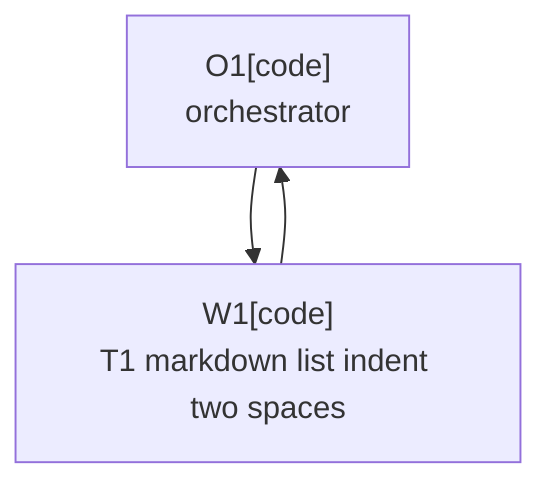

# Plan: Markdown List Indent Two Spaces

Plan-ID: PLAN-markdown-list-indent-two-spaces

Status: Implemented

Workers: 1

Filename: `.agents/plans/PLAN-markdown-list-indent-two-spaces.md`

## Readiness

- Plan readiness: Implemented; ADR 0082 is accepted and T1 is complete.
- Approved by: Kamil Kiewisz <kamkie@outlook.com>
- Approved at: 2026-05-24T02:10:41+02:00
- Open questions: None.
- Implementation progress: T1-markdown-list-indent-two-spaces is implemented and validated.

## Status History

- 2026-05-24T02:06:15+02:00: none -> Draft by OpenAI Codex <codex@openai.com>; companion plan created for proposed ADR 0082.
- 2026-05-24T02:10:41+02:00: Draft -> Approved by Kamil Kiewisz <kamkie@outlook.com>; explicit user approval recorded for ADR 0082 and this companion plan.
- 2026-05-24T02:10:41+02:00: Approved -> In Progress by OpenAI Codex <codex@openai.com>; implementation started for ADR 0082.
- 2026-05-24T02:15:58+02:00: In Progress -> Implemented by OpenAI Codex <codex@openai.com>; T1 implementation, validation, review, and tracker updates completed.

## Goal

Implement ADR 0082 by aligning Markdown list indentation validation with IntelliJ's 2-space formatting and mechanically updating tracked Markdown files to pass repository validation.

## Non-Goals

- Do not change repository content, product behavior, task status, ADR status, or implementation behavior beyond the Markdown indentation policy.
- Do not disable Markdown list indentation validation.
- Do not add file-local markdownlint suppressions for ordinary nested-list indentation.
- Do not reflow prose, rewrite documentation wording, or combine unrelated documentation cleanup with the mechanical indentation change.
- Do not implement without ADR 0082 acceptance and explicit plan approval.

## Assumptions

- The intended Markdown list indentation policy is 2 spaces for nested list items and list continuations.
- Existing Markdown lint rules other than `MD007.indent` remain in force.
- A broad mechanical Markdown diff is acceptable after ADR acceptance because the user requested all files be fixed.

## Open Questions

- None.

## Proposed Changes

- Update `.markdownlint-cli2.jsonc` so `MD007.indent` is `2`.
- Update `.agents/references/code-style.md` so Markdown formatting guidance says 2-space nested-list and continuation indentation.
- Mechanically reindent tracked Markdown list nesting to 2 spaces across files returned by `git ls-files "*.md"`, excluding generated or ignored directories already excluded from validation.
- Remove any file-local markdownlint suppression that only exists to tolerate IntelliJ-style 2-space list indentation.
- Run documentation and agent-artifact validation.

## Task Packets

### Task Packet: T1-markdown-list-indent-two-spaces

Task id: T1-markdown-list-indent-two-spaces

Lane: implementation

Required skills:

- `repository-documentation`

Goal:

- Change Markdown list indentation policy to 2 spaces and update tracked Markdown files so repository validation passes without one-off list-indent suppressions.

Initial context budget:

- Read first:
  - Plan header, readiness summary, execution graph, and this task packet.
  - `docs/decisions/adr-0082-use-two-space-markdown-list-indentation.md`
  - `.markdownlint-cli2.jsonc`
  - `.agents/references/code-style.md`
  - `.agents/prompts/compact-ai-guidance.md`
  - `scripts/validate-docs.ps1`
- Escalate to:
  - Other tracked Markdown files only when performing the mechanical indentation pass.
  - `scripts/ai/validate-agent-artifacts.ps1` only when agent-artifact validation fails and the failure needs investigation.

Allowed inputs:

- Files and artifacts named in `Read first`.
- Tracked Markdown files discovered by `git ls-files "*.md"` for the mechanical indentation pass.
- Files and artifacts named in `Escalate to` only after an escalation trigger fires.

Forbidden inputs:

- Unrelated archived plans.
- Previous worker chat beyond the orchestrator handoff summary.
- Implementation evidence from unrelated task packets.

Write scope:

- `.markdownlint-cli2.jsonc`
- `.agents/references/code-style.md`
- Tracked Markdown files discovered by `git ls-files "*.md"` that need mechanical list indentation changes.

Dependencies:

- ADR 0082 accepted.
- This plan explicitly approved.

Validation:

- Run `pwsh -NoProfile -ExecutionPolicy Bypass -File scripts\validate-docs.ps1`.
- Run `pwsh -NoProfile -ExecutionPolicy Bypass -File scripts\ai\validate-agent-artifacts.ps1`.
- Run `git diff --check`.
- Self-review the diff to ensure changes are mechanical indentation/config/docs-policy updates only.

Escalation triggers:

- Stop and return to ADR review if markdownlint `MD005` and `MD007` cannot enforce the intended 2-space style together.
- Investigate validation scripts only if validation fails after the mechanical indentation pass.
- Ask before changing prose content or validation rules other than `MD007.indent`.

Stop conditions:

- Stop if ADR 0082 is not accepted.
- Stop if this plan is not approved.
- Stop if implementation would require disabling `MD005` or `MD007`.
- Stop if formatting a Markdown file would require semantic content changes instead of mechanical indentation.

Expected output:

- Changed files.
- Validation evidence.
- Blockers.
- Review risks.
- Handoff notes.

Result summary:

- Status: implemented
- Worker: W1/Franklin (`019e5752-a177-7302-8e1e-d2415b2da7ac`)
- Changed files or reviewed diff: `.markdownlint-cli2.jsonc`, `.agents/references/code-style.md`, `.agents/prompts/compact-ai-guidance.md`, and tracked Markdown files with mechanical nested-list indentation changes.
- Validation evidence: `pwsh -NoProfile -ExecutionPolicy Bypass -File scripts\validate-docs.ps1`, `pwsh -NoProfile -ExecutionPolicy Bypass -File scripts\ai\validate-agent-artifacts.ps1`, and `git diff --check` passed.
- Blockers: None.
- Review risks: The diff is broad by design; review confirmed active Markdown policy and config changed to 2-space indentation while archived proposal text may still describe old historical options.
- Handoff notes: `MD005` and `MD007` remain enabled; `MD007.indent` is now `2`.

## Execution Model

- Use one implementation worker after ADR acceptance and explicit plan approval.
- Approved-plan execution requires a fresh sub-agent worker under ADR 0080.
- Keep work on the current branch.
- Commit the completed task before any later dependent plan work when commits are allowed.

## Execution Graph

## Validation

- `pwsh -NoProfile -ExecutionPolicy Bypass -File scripts\validate-docs.ps1`
- `pwsh -NoProfile -ExecutionPolicy Bypass -File scripts\ai\validate-agent-artifacts.ps1`
- `git diff --check`

## Risks

- Mechanical reindentation may create a broad diff that obscures content changes.
- Markdownlint may surface unrelated existing Markdown issues after the indentation rule changes.
- Some Markdown constructs may need manual inspection if a mechanical indentation pass changes semantics.

## Handoff Notes

- ADR 0082 is implemented.
- Future Markdown edits should use 2-space nested-list and continuation indentation.
