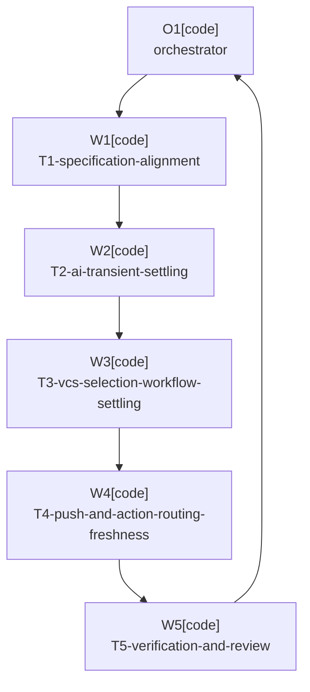

# Plan: Premature Stop Reliability

Plan-ID: PLAN-premature-stop-reliability

Status: Implemented

Workers: 1

Filename: `.agents/plans/PLAN-premature-stop-reliability.md`

## Readiness

- Plan readiness: Implemented; release preparation may still archive the completed plan later.
- Approved by: Kamil Kiewisz <kamkie@outlook.com>
- Approved at: 2026-05-25T00:16:33+02:00
- Open questions: None.
- Implementation progress: Complete.

## Status History

- 2026-05-25T00:10:58+02:00: none -> Draft by OpenAI Codex <codex@openai.com>; companion plan created for proposed ADR 0084 after plugin code and specification reliability audit.
- 2026-05-25T00:16:33+02:00: Draft -> Approved by Kamil Kiewisz <kamkie@outlook.com>; user explicitly approved ADR 0084 and PLAN-premature-stop-reliability.
- 2026-05-25T00:16:33+02:00: Approved -> In Progress by OpenAI Codex <codex@openai.com>; implementation started after approval.
- 2026-05-25T01:04:18+02:00: In Progress -> Implemented by OpenAI Codex <codex@openai.com>; implementation, validation, review, and retrospective task-shaped commits completed.

## Goal

Increase plugin reliability by updating the specification and implementation so refreshable transient IDE,
VCS, Commit tool window, AI Assistant, and push-readiness states get bounded settling before final stop
reasons are reported. The work should expose current premature-give-up cases with red-first tests and then
make those tests pass without weakening commit, push, or AI Assistant safety.

## Non-Goals

- Do not bypass IDE commit, push, before-commit, or AI Assistant safeguards.
- Do not add unbounded waits, background daemons, or custom retry prompts.
- Do not commit or push when AI completion, user-edit status, commit result, push result, or safety cannot be proven.
- Do not add new user-facing settings unless a later accepted decision requires them.
- Do not implement the separate `PLAN-test-coverage-growth` coverage-growth plan as part of this plan.

## Assumptions

- Bounded settling windows can remain internal implementation details.
- Existing stop reasons should stay stable and become final after bounded settling fails.
- Production retries should be deterministic, cancellable with project disposal, and covered by tests through narrow seams.
- Safe push behavior must continue to prefer fallback or stop over immediate push whenever safety is not proven.

## Open Questions

- None.

## Proposed Changes

1. Update `docs/specification.md` so stop reasons for transient states are final only after bounded settling
   fails, and add traceability to ADR 0084.
2. Add red-first tests for late AI action availability, transient AI progress-signal unavailability, VCS
   readiness settling, empty selection after refresh, Commit tool window activation and synchronization
   settling, refreshable safe-push metadata, and stale update-time toolbar or shortcut routing.
3. Introduce narrow production retry policies or collaborators around the affected integration boundaries.
4. Keep terminal unsafe states immediate: unsupported workflows, missing dependencies after bounded
   discovery, user-edited messages, failed commits, failed pushes, unsafe push conditions, and timeout expiry.
5. Run targeted tests during each packet, then run full validation and self-review before handoff.

## Task Packets

### Task Packet: T1-specification-alignment

Task id: T1-specification-alignment

Lane: implementation

Required skills:

- `repository-documentation`

Goal:

- Update the behavior specification to describe bounded settling and identify which existing stop reasons are final after retry versus immediately terminal.

Initial context budget:

- Read first:
  - Plan header, readiness summary, execution graph, and this task packet.
  - `docs/decisions/adr-0084-use-bounded-settling-before-transient-stop-reasons.md`
  - `docs/specification.md`
  - `docs/decisions/adr-0012-detect-ai-completion-with-configurable-timeout.md`
  - `docs/decisions/adr-0014-stop-on-runtime-ai-failure-with-standard-notification.md`
  - `docs/decisions/adr-0047-use-safe-immediate-push-fallback.md`
  - `docs/decisions/adr-0069-stop-outgoing-only-push-without-ide-dialog-fallback.md`
- Escalate to:
  - `README.md` and `docs/user-guide.md` only if the spec change reveals a public documentation mismatch.

Allowed inputs:

- Files named in `Read first`.
- Files named in `Escalate to` only after an escalation trigger fires.

Forbidden inputs:

- Unrelated archived plans.
- Previous worker chat beyond the orchestrator handoff summary.
- Implementation evidence from unrelated task packets.

Write scope:

- `docs/specification.md`
- `README.md` and `docs/user-guide.md` only if public behavior wording must be aligned after the spec change.

Dependencies:

- None.

Validation:

- Run `pwsh -NoProfile -File scripts/validate-docs.ps1`.
- Review requirement IDs and ADR traceability for consistency.

Escalation triggers:

- Load `README.md` or `docs/user-guide.md` when a requirement change appears to alter public usage guidance.
- Stop and report a decision conflict when an existing ADR conflicts with bounded settling instead of just immediate final stop timing.

Stop conditions:

- ADR 0084 is not accepted.
- A spec update would require a new user-facing setting or notification contract not covered by ADR 0084.

Expected output:

- Updated specification requirements and traceability.
- Validation evidence.
- Public-documentation mismatch assessment.

Result summary:

- Status: complete
- Worker: W1
- Changed files or reviewed diff: `docs/specification.md`; `docs/user-guide.md`; `.agents/plans/PLAN-premature-stop-reliability.md` T1 result summary
- Validation evidence: initial `pwsh -NoProfile -File scripts/validate-docs.ps1` failed because `validate-agent-artifacts` reported plan-packet metadata errors outside T1 write scope; after orchestrator metadata fixes, `pwsh -NoProfile -File scripts/validate-docs.ps1` and `pwsh -NoProfile -File scripts/ai/validate-agent-artifacts.ps1` passed.
- Commit: `79208d6` (`docs(spec): define bounded transient settling`).
- Blockers: None.
- Review risks: `PushExecutionUnavailable` finality now documents both immediately proven executor unavailability and refreshable push-readiness uncertainty that stops instead of falling back; downstream implementation should preserve that distinction.
- Handoff notes: Spec now traces ADR 0084 and identifies bounded-settled stop reasons versus immediate terminal states; `docs/user-guide.md` was aligned because the previous VCS-busy and AI-invocation wording implied immediate stop only.

### Task Packet: T2-ai-transient-settling

Task id: T2-ai-transient-settling

Lane: testing

Required skills:

- `plugin-test-tdd`
- `kotlin-plugin-style`

Goal:

- Add red-first tests and implementation for AI Assistant action discovery and AI generation observation that recover from transient unavailable states before final stop reasons.

Initial context budget:

- Read first:
  - Plan header, readiness summary, execution graph, and this task packet.
  - `docs/specification.md`
  - `src/main/kotlin/pl/devopssolutions/aicommitall/ai/AiCommitMessageActionInvocationService.kt`
  - `src/main/kotlin/pl/devopssolutions/aicommitall/ai/AiGenerationCompletion.kt`
  - Existing tests under `src/test/kotlin/pl/devopssolutions/aicommitall/ai/`
- Escalate to:
  - `src/main/kotlin/pl/devopssolutions/aicommitall/settings/` only if timeout settings need to be read without changing their public contract.

Allowed inputs:

- Files named in `Read first`.
- Files named in `Escalate to` only after an escalation trigger fires.

Forbidden inputs:

- Unrelated archived plans.
- Previous worker chat beyond the orchestrator handoff summary.
- Implementation evidence from unrelated task packets.

Write scope:

- `src/main/kotlin/pl/devopssolutions/aicommitall/ai/`
- `src/test/kotlin/pl/devopssolutions/aicommitall/ai/`
- Matching AI test helpers only when duplication becomes material.

Dependencies:

- T1-specification-alignment.

Validation:

- Run targeted AI tests changed by this packet.
- Run `.\gradlew.bat spotlessCheck` if Kotlin files changed.

Escalation triggers:

- Stop and report a scope conflict when retry timing would require a new setting or public timeout default.
- Ask the orchestrator for guidance when a JetBrains AI Assistant API boundary cannot be safely faked without brittle internals.

Stop conditions:

- Implementation would mask a real AI action absence after the bounded budget.
- Implementation would allow commit after unknown AI completion or user-edit state.

Expected output:

- Red-first and passing tests for late AI action discovery and transient `AiGenerationRunningState.Unavailable`.
- Narrow production retry implementation preserving existing timeout semantics.

Result summary:

- Status: complete
- Worker: W2
- Changed files or reviewed diff: `src/main/kotlin/pl/devopssolutions/aicommitall/ai/AiCommitMessageActionInvocationService.kt`; `src/main/kotlin/pl/devopssolutions/aicommitall/ai/AiGenerationCompletion.kt`; `src/test/kotlin/pl/devopssolutions/aicommitall/ai/AiCommitMessageActionInvokerTest.kt`; `src/test/kotlin/pl/devopssolutions/aicommitall/ai/AiGenerationCompletionObserverTest.kt`; `.agents/plans/PLAN-premature-stop-reliability.md` T2 result summary
- Validation evidence: red-first `.\gradlew.bat test --tests "pl.devopssolutions.aicommitall.ai.AiCommitMessageActionInvokerTest" --tests "pl.devopssolutions.aicommitall.ai.AiGenerationCompletionObserverTest"` failed with 4 expected new failures: transient missing action returned `MissingAction`, bounded missing-action retry attempted once instead of 3 times, transient `Unavailable` returned `NoCompletionSignal`, and persistent `Unavailable` settled after one read instead of 3 reads. Green rerun of the same command passed with 20 tests. `.\gradlew.bat spotlessCheck` passed. `git diff --check` passed. `pwsh -NoProfile -ExecutionPolicy Bypass -File scripts/ai/validate-agent-artifacts.ps1` passed.
- Commit: `f6de9f8` (`fix(ai): settle transient assistant availability`).
- Blockers: None.
- Review risks: AI action discovery now performs up to 3 lookups; dispatch-aware sleeper tests prove it does not block the dispatch thread. `AiGenerationRunningState.Unavailable` settling uses the existing stopped-signal grace period capped by the AI generation timeout as the internal bounded budget.
- Handoff notes: Persistent unknown AI completion still fails closed with `NoCompletionSignal`, and user edits still win before unavailable-signal settling can continue.

### Task Packet: T3-vcs-selection-workflow-settling

Task id: T3-vcs-selection-workflow-settling

Lane: testing

Required skills:

- `plugin-test-tdd`
- `kotlin-plugin-style`

Goal:

- Add red-first tests and implementation so VCS readiness, selection collection, Commit tool window activation, and workflow synchronization do not stop on the first refreshable transient failure.

Initial context budget:

- Read first:
  - Plan header, readiness summary, execution graph, and this task packet.
  - `docs/specification.md`
  - `src/main/kotlin/pl/devopssolutions/aicommitall/workflow/AiCommitAllWorkflowCoordinator.kt`
  - `src/main/kotlin/pl/devopssolutions/aicommitall/workflow/CommitWorkflowSelectionService.kt`
  - `src/main/kotlin/pl/devopssolutions/aicommitall/workflow/VcsOperationReadinessService.kt`
  - `src/main/kotlin/pl/devopssolutions/aicommitall/workflow/ReflectiveCommitWorkflowSynchronizer.kt`
  - `src/main/kotlin/pl/devopssolutions/aicommitall/vcs/GitChangeSelectionService.kt`
  - Existing workflow and VCS tests under `src/test/kotlin/pl/devopssolutions/aicommitall/`
- Escalate to:
  - IntelliJ fixture setup files only if an existing test helper is needed for Commit tool window behavior.

Allowed inputs:

- Files named in `Read first`.
- Files named in `Escalate to` only after an escalation trigger fires.

Forbidden inputs:

- Unrelated archived plans.
- Previous worker chat beyond the orchestrator handoff summary.
- Implementation evidence from unrelated task packets.

Write scope:

- `src/main/kotlin/pl/devopssolutions/aicommitall/workflow/`
- `src/main/kotlin/pl/devopssolutions/aicommitall/vcs/`
- `src/test/kotlin/pl/devopssolutions/aicommitall/workflow/`
- `src/test/kotlin/pl/devopssolutions/aicommitall/vcs/`
- Matching test helpers only when required for deterministic retries.

Dependencies:

- T1-specification-alignment.

Validation:

- Run targeted workflow and VCS tests changed by this packet.
- Run `.\gradlew.bat spotlessCheck` if Kotlin files changed.

Escalation triggers:

- Stop and report a safety conflict when retrying would occur after staging or commit mutation has started.
- Ask the orchestrator for guidance when a fake Commit tool window interaction would rely on unstable platform internals.

Stop conditions:

- Implementation would bypass frozen/background VCS safeguards instead of waiting for them to clear.
- Implementation would create duplicate workflow starts or lose active-workflow cleanup.

Expected output:

- Tests for frozen/background readiness clearing before selection.
- Tests for empty selection becoming non-empty after refresh.
- Tests for activation or reflective synchronization succeeding on a later deterministic attempt.
- Production settling implementation with cancellation and disposal behavior preserved.

Result summary:

- Status: complete
- Worker: W3 / OpenAI Codex
- Changed files or reviewed diff: `src/main/kotlin/pl/devopssolutions/aicommitall/workflow/AiCommitAllWorkflowCoordinator.kt`; `src/main/kotlin/pl/devopssolutions/aicommitall/workflow/CommitWorkflowSelectionService.kt`; `src/main/kotlin/pl/devopssolutions/aicommitall/workflow/ReflectiveCommitWorkflowSynchronizer.kt`; `src/main/kotlin/pl/devopssolutions/aicommitall/workflow/VcsOperationReadinessService.kt`; `src/test/kotlin/pl/devopssolutions/aicommitall/workflow/AiCommitAllWorkflowRunnerTest.kt`; `src/test/kotlin/pl/devopssolutions/aicommitall/workflow/CommitWorkflowSelectionServiceTest.kt`; `src/test/kotlin/pl/devopssolutions/aicommitall/workflow/ReflectiveCommitWorkflowSynchronizerTest.kt`; `src/test/kotlin/pl/devopssolutions/aicommitall/workflow/VcsOperationReadinessServiceTest.kt`.
- Validation evidence: red-first `.\gradlew.bat test --tests "pl.devopssolutions.aicommitall.workflow.AiCommitAllWorkflowRunnerTest" --tests "pl.devopssolutions.aicommitall.workflow.VcsOperationReadinessServiceTest" --tests "pl.devopssolutions.aicommitall.workflow.ReflectiveCommitWorkflowSynchronizerTest"` failed with 7 expected failures covering readiness clearing, empty-selection retry, persistent empty-selection expectations, push-only settling expectations, and transient reflective synchronization. Green `.\gradlew.bat test --rerun-tasks --tests "pl.devopssolutions.aicommitall.workflow.AiCommitAllWorkflowRunnerTest" --tests "pl.devopssolutions.aicommitall.workflow.VcsOperationReadinessServiceTest" --tests "pl.devopssolutions.aicommitall.workflow.ReflectiveCommitWorkflowSynchronizerTest"` passed with 31 tests. Broader `.\gradlew.bat test --tests "pl.devopssolutions.aicommitall.workflow.*"` passed with 78 tests. Review-fix focused tests covering activation retry passed. `.\gradlew.bat spotlessCheck`, `git diff --check`, and `pwsh -NoProfile -ExecutionPolicy Bypass -File scripts/ai/validate-agent-artifacts.ps1` passed.
- Commit: `4a703c3` (`fix(workflow): settle transient preparation state`).
- Blockers: none.
- Review risks: readiness and selection settling use small synchronous sleeps on existing background preparation paths; review whether the 3 x 50 ms internal budget is enough for slow Commit tool window refresh without adding visible latency. Frozen readiness still calls the existing IntelliJ frozen-state check on each bounded attempt.
- Handoff notes: retries remain before staging and commit mutation boundaries. `UnsupportedVcs`, missing workflow, definitive unsupported workflow, missing reflective methods, and persistent transient states still fail closed with existing stop reasons.

### Task Packet: T4-push-and-action-routing-freshness

Task id: T4-push-and-action-routing-freshness

Lane: testing

Required skills:

- `plugin-test-tdd`
- `kotlin-plugin-style`

Goal:

- Add red-first tests and implementation for refreshable safe-push metadata and stale update-time action routing.

Initial context budget:

- Read first:
  - Plan header, readiness summary, execution graph, and this task packet.
  - `docs/specification.md`
  - `src/main/kotlin/pl/devopssolutions/aicommitall/vcs/SafeImmediatePushService.kt`
  - `src/main/kotlin/pl/devopssolutions/aicommitall/actions/AiCommitAllActions.kt`
  - `src/main/kotlin/pl/devopssolutions/aicommitall/actions/AiCommitAllShortcutActions.kt`
  - Existing action and VCS tests under `src/test/kotlin/pl/devopssolutions/aicommitall/`
- Escalate to:
  - `src/main/kotlin/pl/devopssolutions/aicommitall/workflow/PushOnlyWorkflowExecutionService.kt` only if push-only stop timing must be aligned.

Allowed inputs:

- Files named in `Read first`.
- Files named in `Escalate to` only after an escalation trigger fires.

Forbidden inputs:

- Unrelated archived plans.
- Previous worker chat beyond the orchestrator handoff summary.
- Implementation evidence from unrelated task packets.

Write scope:

- `src/main/kotlin/pl/devopssolutions/aicommitall/vcs/SafeImmediatePushService.kt`
- `src/main/kotlin/pl/devopssolutions/aicommitall/actions/`
- `src/test/kotlin/pl/devopssolutions/aicommitall/vcs/`
- `src/test/kotlin/pl/devopssolutions/aicommitall/actions/`
- `src/main/kotlin/pl/devopssolutions/aicommitall/workflow/PushOnlyWorkflowExecutionService.kt` only if required by the accepted spec.

Dependencies:

- T1-specification-alignment.

Validation:

- Run targeted action and safe-push tests changed by this packet.
- Run `.\gradlew.bat spotlessCheck` if Kotlin files changed.

Escalation triggers:

- Stop and report an IntelliJ compatibility conflict when fresh action-time routing conflicts with action update contracts.
- Ask the orchestrator for guidance when push metadata cannot be classified as refreshable unknown versus unsafe without broader VCS design changes.

Stop conditions:

- Implementation would immediate-push without proving upstream, push spec, and outgoing commit safety.
- Implementation would leave the plugin action visible or enabled when the IDE action should own the route.

Expected output:

- Tests where safe-push metadata is initially unavailable and becomes safe before fallback or stop.
- Tests where shortcut or toolbar execution uses fresh action-time data instead of stale update-time state.
- Production changes that keep unsafe push state fail-closed.

Result summary:

- Status: complete
- Worker: W4 / OpenAI Codex
- Changed files or reviewed diff: `src/main/kotlin/pl/devopssolutions/aicommitall/vcs/SafeImmediatePushService.kt`; `src/main/kotlin/pl/devopssolutions/aicommitall/actions/AiCommitAllActions.kt`; `src/main/kotlin/pl/devopssolutions/aicommitall/actions/ThreeSectionControlInteraction.kt`; `src/test/kotlin/pl/devopssolutions/aicommitall/vcs/SafeImmediatePushServiceTest.kt`; `src/test/kotlin/pl/devopssolutions/aicommitall/actions/AiCommitAllActionsTest.kt`; `src/test/kotlin/pl/devopssolutions/aicommitall/actions/AiCommitAllThreeSectionControlTest.kt`.
- Validation evidence: red-first `.\gradlew.bat test --tests "pl.devopssolutions.aicommitall.vcs.SafeImmediatePushServiceTest" --tests "pl.devopssolutions.aicommitall.actions.AiCommitAllActionsTest"` failed with 4 expected new failures: toolbar section activation did not recheck fresh availability, stale enabled activation still started after becoming disabled, commit-and-push safe metadata unavailability fell back instead of retrying, and outgoing-only metadata unavailability stopped instead of retrying. Green targeted `.\gradlew.bat test --tests "pl.devopssolutions.aicommitall.vcs.SafeImmediatePushServiceTest" --tests "pl.devopssolutions.aicommitall.actions.AiCommitAllActionsTest" --tests "pl.devopssolutions.aicommitall.actions.AiCommitAllThreeSectionControlTest"` passed with 54 tests. Broader green `.\gradlew.bat test --tests "pl.devopssolutions.aicommitall.actions.*" --tests "pl.devopssolutions.aicommitall.vcs.SafeImmediatePushServiceTest"` passed with 76 tests and 1 pending generated-asset test. `.\gradlew.bat spotlessCheck` passed after one indentation fix. Final `git diff --check` passed. `pwsh -NoProfile -ExecutionPolicy Bypass -File scripts/ai/validate-agent-artifacts.ps1` passed.
- Commit: `524392b` (`fix(push): settle safe-push metadata before fallback`).
- Blockers: None.
- Review risks: Safe push retries only the narrowly classified case where a push spec is unavailable while tracked upstream, local/upstream head match, target safety flags, and normal repository state are otherwise clean; missing upstream, unresolved conflict, unsafe repository state, ambiguous target, and force-push-unverified states still fall back immediately. The custom control now delegates clicks on visually disabled sections so the action-time availability check owns the final route; production activation still refuses to start when current availability is disabled or a workflow is running.
- Handoff notes: `PushOnlyWorkflowExecutionService.kt` was reviewed for call-path alignment but not changed; outgoing-only settling is handled inside `SafeImmediatePushService.prepareOutgoingCommits()`.

### Task Packet: T5-verification-and-review

Task id: T5-verification-and-review

Lane: review

Required skills:

- `plugin-review`
- `repository-documentation`

Goal:

- Validate the full reliability change, check specification traceability, and review for regressions in commit and push safety.

Initial context budget:

- Read first:
  - Plan header, readiness summary, execution graph, and this task packet.
  - Final diff from T1 through T4.
  - Validation output from T1 through T4.
  - `docs/specification.md`
- Escalate to:
  - Source files changed by T1 through T4.
  - `.agents/references/testing.md` if validation output is ambiguous.

Allowed inputs:

- Files and validation output named in `Read first`.
- Files named in `Escalate to` only after an escalation trigger fires.

Forbidden inputs:

- Unrelated archived plans.
- Previous worker chat beyond the orchestrator handoff summary.

Write scope:

- read-only

Dependencies:

- T1-specification-alignment.
- T2-ai-transient-settling.
- T3-vcs-selection-workflow-settling.
- T4-push-and-action-routing-freshness.

Validation:

- Run `.\gradlew.bat test`.
- Run `.\gradlew.bat spotlessCheck`.
- Run `pwsh -NoProfile -File scripts/validate-docs.ps1`.
- Run `pwsh -NoProfile -File scripts/ai/validate-agent-artifacts.ps1`.
- Run `git diff --check`.

Escalation triggers:

- Run targeted validation again when an initial validation failure looks environmental or order-dependent.
- Stop and report a safety regression when any diff appears to weaken commit/push safety or user-edit protection.

Stop conditions:

- A safety regression is found and cannot be fixed within the approved plan scope.
- Sub-agents are unavailable or forbidden for approved-plan execution.

Expected output:

- Full validation evidence.
- Review findings or explicit no-findings result.
- Completed task result summaries and handoff notes.

Result summary:

- Status: complete
- Worker: W5 / OpenAI Codex
- Changed files or reviewed diff: full T1 through T4 diff plus follow-up review fixes for activation retry, dispatch-aware sleepers, and persistent safe-push metadata exhaustion.
- Validation evidence: `.\gradlew.bat test` passed with 308 passing and 1 pending; `.\gradlew.bat spotlessCheck` passed; `pwsh -NoProfile -File scripts/validate-docs.ps1` passed; `pwsh -NoProfile -File scripts/ai/validate-agent-artifacts.ps1` passed; `git diff --check` passed. Focused review-fix tests passed with 27 passing.
- Commit: final governance commit.
- Blockers: None.
- Review risks: Follow-up read-only review found no blocking issues. Residual risk is that dispatch-aware sleepers make EDT retries immediate rather than time-spanning, so availability that settles only after a later EDT tick may still require a new user action.
- Handoff notes: W5 initially found missing activation settling and EDT sleep risk; both were fixed and re-reviewed. No fail-open commit or push safety regression was found.

## Execution Model

- Use one worker at a time in the order shown by the execution graph.
- Dispatch only the plan header, readiness summary, execution graph, assigned task packet, and named artifacts.
- Approved-plan execution requires sub-agent workers under ADR 0080; if sub-agents are unavailable, unauthorized by the active tool contract, or explicitly forbidden, stop before implementation and report the blocker.

## Execution Graph

## Validation

- `pwsh -NoProfile -File scripts/validate-docs.ps1`
- `pwsh -NoProfile -File scripts/ai/validate-agent-artifacts.ps1`
- Targeted Gradle test commands from each task packet.
- `.\gradlew.bat test`
- `.\gradlew.bat spotlessCheck`
- `git diff --check`

## Risks

- Retrying transient states could hide a real terminal state if classification is too broad.
- Longer workflow startup during busy IDE or VCS periods could feel less immediate.
- IntelliJ Platform action update and Commit tool window internals may require narrow seams to keep tests deterministic.
- Safe push retries must never treat unknown metadata as safe.

## Handoff Notes

- ADR 0084 is accepted, implemented, and tracked as implemented in `docs/decisions/README.md`.
- The existing `PLAN-test-coverage-growth` draft already lists some of these premature-abandonment cases as coverage targets, but that plan has a non-goal against user-visible behavior changes. This plan owns the reliability behavior change instead.
- Task-shaped commits were created retrospectively after a maintainer correction that the per-task commit gate had been missed during execution; `PLAN_TEMPLATE.md` now requires result summaries to record commit evidence before dependent tasks or waves start.
