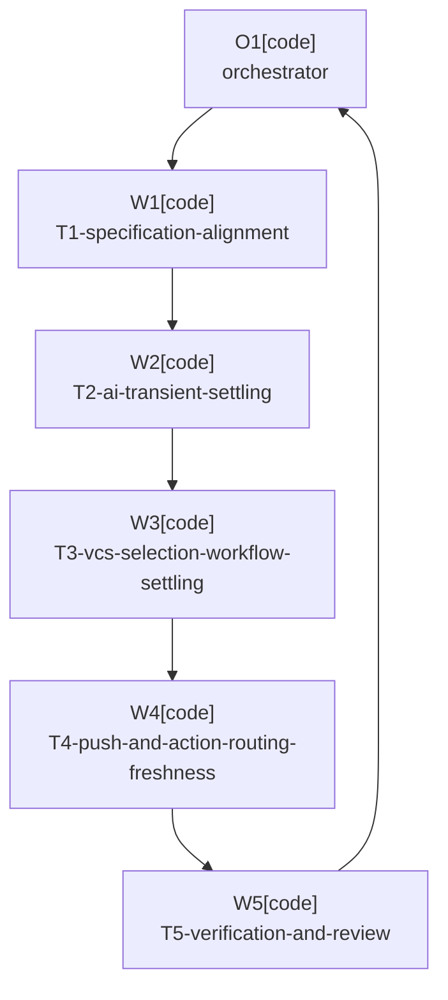

# Plan: Premature Stop Reliability

Plan-ID: PLAN-premature-stop-reliability

Status: Draft

Workers: 1

Filename: `.agents/plans/PLAN-premature-stop-reliability.md`

## Readiness

- Plan readiness: Draft companion plan for proposed `docs/decisions/adr-0084-use-bounded-settling-before-transient-stop-reasons.md`; blocked until ADR acceptance and later explicit plan approval.
- Open questions: None inside the implementation scope after ADR 0084 is accepted; current blocker is the required decision and approval.
- Implementation progress: Not started.

## Status History

- 2026-05-25T00:10:58+02:00: none -> Draft by OpenAI Codex <codex@openai.com>; companion plan created for proposed ADR 0084 after plugin code and specification reliability audit.

## Goal

Increase plugin reliability by updating the specification and implementation so refreshable transient IDE,
VCS, Commit tool window, AI Assistant, and push-readiness states get bounded settling before final stop
reasons are reported. The work should expose current premature-give-up cases with red-first tests and then
make those tests pass without weakening commit, push, or AI Assistant safety.

## Non-Goals

- Do not bypass IDE commit, push, before-commit, or AI Assistant safeguards.
- Do not add unbounded waits, background daemons, or custom retry prompts.
- Do not commit or push when AI completion, user-edit status, commit result, push result, or safety cannot be proven.
- Do not add new user-facing settings unless a later accepted decision requires them.
- Do not implement the separate `PLAN-test-coverage-growth` coverage-growth plan as part of this plan.

## Assumptions

- Bounded settling windows can remain internal implementation details.
- Existing stop reasons should stay stable and become final after bounded settling fails.
- Production retries should be deterministic, cancellable with project disposal, and covered by tests through narrow seams.
- Safe push behavior must continue to prefer fallback or stop over immediate push whenever safety is not proven.

## Open Questions

- None after ADR 0084 is accepted. Until then, implementation is blocked by the proposed decision.

## Proposed Changes

1. Update `docs/specification.md` so stop reasons for transient states are final only after bounded settling
   fails, and add traceability to ADR 0084.
2. Add red-first tests for late AI action availability, transient AI progress-signal unavailability, VCS
   readiness settling, empty selection after refresh, Commit tool window activation and synchronization
   settling, refreshable safe-push metadata, and stale update-time toolbar or shortcut routing.
3. Introduce narrow production retry policies or collaborators around the affected integration boundaries.
4. Keep terminal unsafe states immediate: unsupported workflows, missing dependencies after bounded
   discovery, user-edited messages, failed commits, failed pushes, unsafe push conditions, and timeout expiry.
5. Run targeted tests during each packet, then run full validation and self-review before handoff.

## Task Packets

### Task Packet: T1-specification-alignment

Task id: T1-specification-alignment

Lane: implementation

Required skills:

- `repository-documentation`

Goal:

- Update the behavior specification to describe bounded settling and identify which existing stop reasons are final after retry versus immediately terminal.

Initial context budget:

- Read first:
  - Plan header, readiness summary, execution graph, and this task packet.
  - `docs/decisions/adr-0084-use-bounded-settling-before-transient-stop-reasons.md`
  - `docs/specification.md`
  - `docs/decisions/adr-0012-detect-ai-completion-with-configurable-timeout.md`
  - `docs/decisions/adr-0014-stop-on-runtime-ai-failure-with-standard-notification.md`
  - `docs/decisions/adr-0047-use-safe-immediate-push-fallback.md`
  - `docs/decisions/adr-0069-stop-outgoing-only-push-without-ide-dialog-fallback.md`
- Escalate to:
  - `README.md` and `docs/user-guide.md` only if the spec change reveals a public documentation mismatch.

Allowed inputs:

- Files named in `Read first`.
- Files named in `Escalate to` only after an escalation trigger fires.

Forbidden inputs:

- Unrelated archived plans.
- Previous worker chat beyond the orchestrator handoff summary.
- Implementation evidence from unrelated task packets.

Write scope:

- `docs/specification.md`
- `README.md` and `docs/user-guide.md` only if public behavior wording must be aligned after the spec change.

Dependencies:

- ADR 0084 accepted and this plan approved.

Validation:

- Run `pwsh -NoProfile -File scripts/validate-docs.ps1`.
- Review requirement IDs and ADR traceability for consistency.

Escalation triggers:

- A requirement change appears to alter notification text, settings, or public usage guidance.
- Existing ADRs conflict with bounded settling instead of just immediate final stop timing.

Stop conditions:

- ADR 0084 is not accepted.
- A spec update would require a new user-facing setting or notification contract not covered by ADR 0084.

Expected output:

- Updated specification requirements and traceability.
- Validation evidence.
- Public-documentation mismatch assessment.

Result summary:

- Status: pending
- Worker:
- Changed files or reviewed diff:
- Validation evidence:
- Blockers:
- Review risks:
- Handoff notes:

### Task Packet: T2-ai-transient-settling

Task id: T2-ai-transient-settling

Lane: testing

Required skills:

- `plugin-test-tdd`
- `kotlin-plugin-style`

Goal:

- Add red-first tests and implementation for AI Assistant action discovery and AI generation observation that recover from transient unavailable states before final stop reasons.

Initial context budget:

- Read first:
  - Plan header, readiness summary, execution graph, and this task packet.
  - `docs/specification.md`
  - `src/main/kotlin/pl/devopssolutions/aicommitall/ai/AiCommitMessageActionInvocationService.kt`
  - `src/main/kotlin/pl/devopssolutions/aicommitall/ai/AiGenerationCompletion.kt`
  - Existing tests under `src/test/kotlin/pl/devopssolutions/aicommitall/ai/`
- Escalate to:
  - `src/main/kotlin/pl/devopssolutions/aicommitall/settings/` only if timeout settings need to be read without changing their public contract.

Allowed inputs:

- Files named in `Read first`.
- Files named in `Escalate to` only after an escalation trigger fires.

Forbidden inputs:

- Unrelated archived plans.
- Previous worker chat beyond the orchestrator handoff summary.
- Implementation evidence from unrelated task packets.

Write scope:

- `src/main/kotlin/pl/devopssolutions/aicommitall/ai/`
- `src/test/kotlin/pl/devopssolutions/aicommitall/ai/`
- Matching AI test helpers only when duplication becomes material.

Dependencies:

- T1-specification-alignment.

Validation:

- Run targeted AI tests changed by this packet.
- Run `.\gradlew.bat spotlessCheck` if Kotlin files changed.

Escalation triggers:

- Retry timing would require a new setting or public timeout default.
- A JetBrains AI Assistant API boundary cannot be safely faked without brittle internals.

Stop conditions:

- Implementation would mask a real AI action absence after the bounded budget.
- Implementation would allow commit after unknown AI completion or user-edit state.

Expected output:

- Red-first and passing tests for late AI action discovery and transient `AiGenerationRunningState.Unavailable`.
- Narrow production retry implementation preserving existing timeout semantics.

Result summary:

- Status: pending
- Worker:
- Changed files or reviewed diff:
- Validation evidence:
- Blockers:
- Review risks:
- Handoff notes:

### Task Packet: T3-vcs-selection-workflow-settling

Task id: T3-vcs-selection-workflow-settling

Lane: testing

Required skills:

- `plugin-test-tdd`
- `kotlin-plugin-style`

Goal:

- Add red-first tests and implementation so VCS readiness, selection collection, Commit tool window activation, and workflow synchronization do not stop on the first refreshable transient failure.

Initial context budget:

- Read first:
  - Plan header, readiness summary, execution graph, and this task packet.
  - `docs/specification.md`
  - `src/main/kotlin/pl/devopssolutions/aicommitall/workflow/AiCommitAllWorkflowCoordinator.kt`
  - `src/main/kotlin/pl/devopssolutions/aicommitall/workflow/CommitWorkflowSelectionService.kt`
  - `src/main/kotlin/pl/devopssolutions/aicommitall/workflow/VcsOperationReadinessService.kt`
  - `src/main/kotlin/pl/devopssolutions/aicommitall/workflow/ReflectiveCommitWorkflowSynchronizer.kt`
  - `src/main/kotlin/pl/devopssolutions/aicommitall/vcs/GitChangeSelectionService.kt`
  - Existing workflow and VCS tests under `src/test/kotlin/pl/devopssolutions/aicommitall/`
- Escalate to:
  - IntelliJ fixture setup files only if an existing test helper is needed for Commit tool window behavior.

Allowed inputs:

- Files named in `Read first`.
- Files named in `Escalate to` only after an escalation trigger fires.

Forbidden inputs:

- Unrelated archived plans.
- Previous worker chat beyond the orchestrator handoff summary.
- Implementation evidence from unrelated task packets.

Write scope:

- `src/main/kotlin/pl/devopssolutions/aicommitall/workflow/`
- `src/main/kotlin/pl/devopssolutions/aicommitall/vcs/`
- `src/test/kotlin/pl/devopssolutions/aicommitall/workflow/`
- `src/test/kotlin/pl/devopssolutions/aicommitall/vcs/`
- Matching test helpers only when required for deterministic retries.

Dependencies:

- T1-specification-alignment.

Validation:

- Run targeted workflow and VCS tests changed by this packet.
- Run `.\gradlew.bat spotlessCheck` if Kotlin files changed.

Escalation triggers:

- Retrying would occur after staging or commit mutation has started.
- A fake Commit tool window interaction would rely on unstable platform internals.

Stop conditions:

- Implementation would bypass frozen/background VCS safeguards instead of waiting for them to clear.
- Implementation would create duplicate workflow starts or lose active-workflow cleanup.

Expected output:

- Tests for frozen/background readiness clearing before selection.
- Tests for empty selection becoming non-empty after refresh.
- Tests for activation or reflective synchronization succeeding on a later deterministic attempt.
- Production settling implementation with cancellation and disposal behavior preserved.

Result summary:

- Status: pending
- Worker:
- Changed files or reviewed diff:
- Validation evidence:
- Blockers:
- Review risks:
- Handoff notes:

### Task Packet: T4-push-and-action-routing-freshness

Task id: T4-push-and-action-routing-freshness

Lane: testing

Required skills:

- `plugin-test-tdd`
- `kotlin-plugin-style`

Goal:

- Add red-first tests and implementation for refreshable safe-push metadata and stale update-time action routing.

Initial context budget:

- Read first:
  - Plan header, readiness summary, execution graph, and this task packet.
  - `docs/specification.md`
  - `src/main/kotlin/pl/devopssolutions/aicommitall/vcs/SafeImmediatePushService.kt`
  - `src/main/kotlin/pl/devopssolutions/aicommitall/actions/AiCommitAllActions.kt`
  - `src/main/kotlin/pl/devopssolutions/aicommitall/actions/AiCommitAllShortcutActions.kt`
  - Existing action and VCS tests under `src/test/kotlin/pl/devopssolutions/aicommitall/`
- Escalate to:
  - `src/main/kotlin/pl/devopssolutions/aicommitall/workflow/PushOnlyWorkflowExecutionService.kt` only if push-only stop timing must be aligned.

Allowed inputs:

- Files named in `Read first`.
- Files named in `Escalate to` only after an escalation trigger fires.

Forbidden inputs:

- Unrelated archived plans.
- Previous worker chat beyond the orchestrator handoff summary.
- Implementation evidence from unrelated task packets.

Write scope:

- `src/main/kotlin/pl/devopssolutions/aicommitall/vcs/SafeImmediatePushService.kt`
- `src/main/kotlin/pl/devopssolutions/aicommitall/actions/`
- `src/test/kotlin/pl/devopssolutions/aicommitall/vcs/`
- `src/test/kotlin/pl/devopssolutions/aicommitall/actions/`
- `src/main/kotlin/pl/devopssolutions/aicommitall/workflow/PushOnlyWorkflowExecutionService.kt` only if required by the accepted spec.

Dependencies:

- T1-specification-alignment.

Validation:

- Run targeted action and safe-push tests changed by this packet.
- Run `.\gradlew.bat spotlessCheck` if Kotlin files changed.

Escalation triggers:

- Fresh action-time routing conflicts with IntelliJ action update contracts.
- Push metadata cannot be classified as refreshable unknown versus unsafe without broader VCS design changes.

Stop conditions:

- Implementation would immediate-push without proving upstream, push spec, and outgoing commit safety.
- Implementation would leave the plugin action visible or enabled when the IDE action should own the route.

Expected output:

- Tests where safe-push metadata is initially unavailable and becomes safe before fallback or stop.
- Tests where shortcut or toolbar execution uses fresh action-time data instead of stale update-time state.
- Production changes that keep unsafe push state fail-closed.

Result summary:

- Status: pending
- Worker:
- Changed files or reviewed diff:
- Validation evidence:
- Blockers:
- Review risks:
- Handoff notes:

### Task Packet: T5-verification-and-review

Task id: T5-verification-and-review

Lane: review

Required skills:

- `plugin-review`
- `repository-documentation`

Goal:

- Validate the full reliability change, check specification traceability, and review for regressions in commit and push safety.

Initial context budget:

- Read first:
  - Plan header, readiness summary, execution graph, and this task packet.
  - Final diff from T1 through T4.
  - Validation output from T1 through T4.
  - `docs/specification.md`
- Escalate to:
  - Source files changed by T1 through T4.
  - `.agents/references/testing.md` if validation output is ambiguous.

Allowed inputs:

- Files and validation output named in `Read first`.
- Files named in `Escalate to` only after an escalation trigger fires.

Forbidden inputs:

- Unrelated archived plans.
- Previous worker chat beyond the orchestrator handoff summary.

Write scope:

- `.agents/plans/PLAN-premature-stop-reliability.md` for result summaries only.
- Documentation files changed by T1 only for small correction fixes found during review.

Dependencies:

- T1-specification-alignment.
- T2-ai-transient-settling.
- T3-vcs-selection-workflow-settling.
- T4-push-and-action-routing-freshness.

Validation:

- Run `.\gradlew.bat test`.
- Run `.\gradlew.bat spotlessCheck`.
- Run `pwsh -NoProfile -File scripts/validate-docs.ps1`.
- Run `pwsh -NoProfile -File scripts/ai/validate-agent-artifacts.ps1`.
- Run `git diff --check`.

Escalation triggers:

- Any validation failure.
- Any diff that appears to weaken commit/push safety or user-edit protection.

Stop conditions:

- A safety regression is found and cannot be fixed within the approved plan scope.
- Sub-agents are unavailable or forbidden for approved-plan execution.

Expected output:

- Full validation evidence.
- Review findings or explicit no-findings result.
- Completed task result summaries and handoff notes.

Result summary:

- Status: pending
- Worker:
- Changed files or reviewed diff:
- Validation evidence:
- Blockers:
- Review risks:
- Handoff notes:

## Execution Model

- Use one worker at a time in the order shown by the execution graph.
- Dispatch only the plan header, readiness summary, execution graph, assigned task packet, and named artifacts.
- Approved-plan execution requires sub-agent workers under ADR 0080; if sub-agents are unavailable, unauthorized by the active tool contract, or explicitly forbidden, stop before implementation and report the blocker.

## Execution Graph

## Validation

- `pwsh -NoProfile -File scripts/validate-docs.ps1`
- `pwsh -NoProfile -File scripts/ai/validate-agent-artifacts.ps1`
- Targeted Gradle test commands from each task packet.
- `.\gradlew.bat test`
- `.\gradlew.bat spotlessCheck`
- `git diff --check`

## Risks

- Retrying transient states could hide a real terminal state if classification is too broad.
- Longer workflow startup during busy IDE or VCS periods could feel less immediate.
- IntelliJ Platform action update and Commit tool window internals may require narrow seams to keep tests deterministic.
- Safe push retries must never treat unknown metadata as safe.

## Handoff Notes

- This plan is blocked until proposed ADR 0084 is accepted and the plan is explicitly approved.
- The existing `PLAN-test-coverage-growth` draft already lists some of these premature-abandonment cases as coverage targets, but that plan has a non-goal against user-visible behavior changes. This plan owns the reliability behavior change instead.
