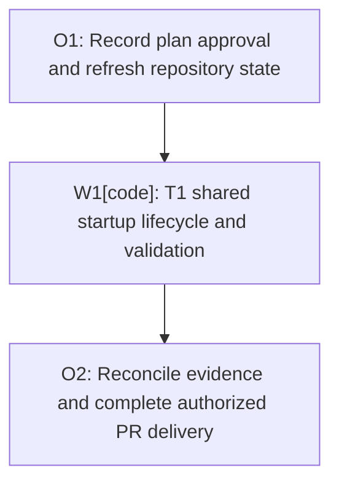

# Plan: Release Matrix Startup Stability

Plan-ID: PLAN-release-matrix-startup-stability

Status: Implemented

Workers: 1

Filename: `.agents/plans/PLAN-release-matrix-startup-stability.md`

## Readiness

- Plan readiness: Approved for autonomous execution through validation and draft PR delivery.
- Approved by: Kamil Kiewisz <kamkie@outlook.com>
- Approved at: 2026-10-05T12:48:37+02:00
- Open questions: None; the bounded IU empty-project proof passed with unchanged licensing and explicit frame reuse.
- Implementation progress: Registration correction `4fa7575` passed nine focused contracts, compilation, formatting, detekt, independent review, five targeted Linux proofs, the full 62-test matrix, and all automatic GitHub Actions checks. Draft PR 61 is delivered. Final documentation reconciliation and current-head checks follow. Codecov's external project check reports a one-line UI coverage drop; unit coverage is identical to main and its patch check passes.
- Governing decision: [ADR 0089](../../docs/decisions/adr-0089-advance-minimum-intellij-platform-to-2026-2.md). The change preserves supported products, validation expectations, and plugin behavior; no new ADR is proposed.

## Status History

- 2026-10-05T12:42:13+02:00: none -> Draft by Codex <codex@openai.com>; user requested implementation of the agreed shared startup stabilization; repository plan gate applies.
- 2026-10-05T12:48:37+02:00: Draft -> Approved by Kamil Kiewisz <kamkie@outlook.com>; explicit user instruction "just do it" approves the written plan and execution.
- 2026-10-05T12:50:30+02:00: Approved -> In Progress by Codex <codex@openai.com>; repository state reconciled and approved T1 worker dispatch started.
- 2026-10-05T15:16:01+02:00: In Progress -> Implemented by Codex <codex@openai.com>; T1 implementation, local proofs, cross-product validation, and independent review complete; draft PR delivery follows.
- 2026-10-05T15:24:00+02:00: Implemented -> In Progress by Codex <codex@openai.com>; automatic PR CI on the same source exposed a PyCharm project-activity cancellation during bootstrap closure; reopen T1 for deterministic startup synchronization and validation.
- 2026-10-05T16:14:15+02:00: In Progress -> Implemented by Codex <codex@openai.com>; precise registration gate, independent-probe validation, final full matrix, and automatic GitHub Actions checks passed on `4fa7575`.

## Goal

Open each release-matrix Git fixture only after the IDE has completed its normal startup, license handling, and required plugin transitions. Apply the lifecycle to IntelliJ IDEA, PyCharm, and WebStorm, and demonstrate that fixture indexing no longer overlaps the observed startup plugin reload.

## Evidence

- [PR 59 UI job](https://github.com/kamkie/intellij-ai-commit-all-plugin/actions/runs/37262975950/job/111717158522) used PyCharm `262.8665.309`. Its [failure artifact](https://github.com/kamkie/intellij-ai-commit-all-plugin/actions/runs/37262975950/artifacts/11340460405) records Ultimate enablement, two index reloads, and a scanner NPE two milliseconds after the index registry was dropped. Project shutdown began eight seconds later.
- The same harness source passed all 13 scenarios in the [September 28 CI run](https://github.com/kamkie/intellij-ai-commit-all-plugin/actions/runs/36393563195). Other scenarios in the failed run logged the already-classified closed-index-storage race during plugin reload.
- [Starter documentation](https://plugins.jetbrains.com/docs/intellij/integration-tests-intro.html) supports launching with `NoProject`. Runtime proofs confirm PyCharm completes automatic product enablement in its native welcome bootstrap before opening the real fixture.
- The exception occurs in shared IntelliJ indexing code. Equivalent failures in IU or WS have not been demonstrated.
- Runtime feasibility found that PyCharm's default non-modal welcome screen opens an indexable `WelcomeScreen` project and completes normal product enablement there. Disabling that welcome project with the verified platform VM option prevented natural setup: the two-minute gate reported no active license, restart marker, or enablement callback. Preserve the native bootstrap instead of forcing activation.

## Non-Goals

- New NPE suppression, broader known-error classification, test retries, fixed sleeps, or skipped product lanes.
- Production plugin changes, dependency or IDE upgrades, license bypasses, account changes, or forced trial activation.
- Merging PR 59, merging the resulting fix PR, or publishing a release.
- A reusable bootstrap framework, shared writable test sandboxes, or unrelated lifecycle refactoring.

## Assumptions

- Each scenario retains an isolated Starter context, configuration, fixture, and process lifetime.
- No real Git fixture opens at launch. PY/WS use `NoProject`, permitting the native `WelcomeScreen` where present. IU uses an isolated, initially empty `release-matrix-startup-bootstrap` directory to trigger its normal licensing. Both paths finish bootstrap indexing before replacing the bootstrap with the fixture.
- Existing 2026.2 license-restart markers, fresh-context cleanup, product-specific readiness checks, and negative dependency scenarios remain enforced.
- The NPE continues to fail validation while the prevention strategy is tested.
- This is test infrastructure work. Public specification, README, support policy, backlog, and changelog changes are not expected unless implementation evidence reveals an observable contract change.

## Open Questions

None requiring user input. The autonomous test-only contingency is proved: ordinary IU opening of an isolated empty project resolves its existing license gate, and the typed ProjectUtil task with `forceReuseFrame=true` replaces that owned bootstrap with the sole fixture. This preserves the agreed fixture-after-readiness outcome and licensing/restart checks, without licensing/account mutation, delay, filter, or product skip. PY/WS retain their validated native startup path.

## Proposed Changes

### T1-shared-startup-lifecycle

- Verify the installed Starter/Driver APIs for launching without a project and opening the fixture afterward.
- Launch without the real fixture. Use the platform's native welcome project on PY/WS and an isolated empty project on IU, where NoProject cannot initialize licensing. Do not manufacture license activation.
- Prove the license and plugin readiness checks resolve before the fixture opens, and finish bootstrap indexing before explicit opening, starting with the failing PyCharm build.
- Require completion of startup transitions before accepting readiness. The current `isUltimateModuleLoaded() || isUltimateEnableAttemptCompleted()` check can accept a module while reconfiguration is still running; a loaded-module or smart-mode snapshot alone is insufficient.
- Replace immediate fixture opening with startup readiness followed by explicit fixture opening in the shared `runReleaseMatrixIdeWithFixture` lifecycle. Use the typed platform opening task with explicit frame reuse to close only the owned bootstrap without a frame-choice dialog.
- Reuse existing product-specific probes and restart handling. Reacquire Driver/probe state after the accepted restart path; never open the fixture from an obsolete session.
- Before replacing PyCharm's native bootstrap, await the observed delayed auto-import registration. The pinned service's readiness getter synchronizes with its entire registration/start section; query it off EDT without forcing startup. Preserve natural no-op branches and fail closed on unavailable or failed readiness. This gate covers the observed registration race, not generic background quiescence or refresh completion.
- Add regression coverage for ordering, an early loaded module with reconfiguration still running, setup failure, restart cleanup, and negative dependency scenarios. Add concise phase evidence for startup-ready, fixture-opened, and scenario-completed.
- Validate IU, PY, WS, and synthetic restart handling with the existing assertions and failure reporter intact.

## Task Packets

### Task Packet: T1-shared-startup-lifecycle

Task id: T1-shared-startup-lifecycle

Lane: implementation

Required skills:

- `intellij-plugin-development`
- `kotlin-plugin-style`
- `plugin-test-tdd`
- `platform-docs-research`
- `triage-flaky-test`
- `managed-jobs` for long-running Windows validation.

Goal:

- Prevent the observed overlap by completing startup plugin transitions before fixture opening in the shared lifecycle.

Initial context budget:

- Read first: this plan, `AGENTS.md`, `.agents/references/testing.md`, `.agents/references/code-style.md`, `.agents/references/reviews.md`, and the two source files in the write scope.
- Escalate to: exact installed Starter/Driver source or bytecode, the linked failure evidence, and the existing license-restart contract tests when API or runtime proof requires them.

Allowed inputs:

- The named context and primary JetBrains lifecycle documentation.

Forbidden inputs:

- Unrelated archived plans, unrelated plugin implementation, or prior worker conversations.

Write scope:

- `src/integrationTest/kotlin/pl/devopssolutions/aicommitall/integration/ReleaseMatrixUiHarnessTest.kt`
- `src/integrationTest/kotlin/pl/devopssolutions/aicommitall/integration/fakeai/FakeAiAssistantProbe.kt`
- A focused lifecycle helper or regression test under the same integration-test package only if required to prove ordering.
- The orchestrator owns this plan and its catalog entry; workers do not edit them.

Dependencies:

- Explicit approval of this plan and a successful native-bootstrap and explicit-opening proof before implementing the shared sequence.

Validation:

- Capture failing ordering coverage before the change and passing coverage afterward. Use `-PideProducts=IU` for focused contract-only tests so the PY smoke tag filter does not exclude them.
- Run `compileIntegrationTestKotlin`, `spotlessCheck`, and `detekt`.
- Run the formerly failing PyCharm scenario in three independent fresh processes on Linux using `-PideVersion=2026.2`; retain the phase timeline and every IDE error.
- Run the full IU lane and PY/WS smoke lanes with the configured 2026.2 coordinates, plus the existing synthetic license-restart proof.
- Verify UI coverage exec and class-dump inputs still reach aggregate reporting.
- Run documentation and agent-artifact validation after final plan updates, and `git diff --check`.

Escalation triggers:

- Report and stop if Starter cannot open the fixture after bootstrap setup, setup requires the real Git fixture before readiness, restart state cannot be preserved, or a production/workflow edit becomes necessary.

Stop conditions:

- Report a failure of the native-bootstrap proof; a licensing/account mutation; fixture opening before readiness; an obsolete connected session after restart; or a passing result that requires suppressing the NPE, weakening fixture/transition assertions, retries, sleeps, or product skips.

Expected output:

- API and feasibility evidence, red/green ordering proof, cross-product results, the Linux failure-build timeline, coverage-input checks, self-review, and a completed task commit after validation passes.
- Structured worker events and a concise result for orchestrator reconciliation.

Result summary:

- Status: implementation, runtime validation, and independent review complete; delivered in draft PR 61.
- Worker: `/root/startup_lifecycle`.
- Validation evidence: The original early-loaded readiness regression failed as expected. All nine focused startup contracts, integration compilation, formatting, and detekt passed on the final source. Earlier product-bootstrap feasibility passed seven Linux proofs and the initial 62-test matrix. Automatic CI then exposed the preserved PyCharm welcome-import cancellation, which the precise registration gate addresses. Final-source Linux proofs passed three fresh push-flow launches, a synthetic restart, and the independent missing-AI probe: five tests, zero failures, errors, or skips. Each timeline reports natural import start, registration settled, then fixture opening; the restart opens only from the fresh context. The [final-source matrix](https://github.com/kamkie/intellij-ai-commit-all-plugin/actions/runs/37320108406) passed IDEA 36/36, PyCharm 13/13, and WebStorm 13/13, without failures, errors, or skips. All three artifacts contain UI coverage exec, dumped classes, and integration plus aggregate reports. [Automatic CI](https://github.com/kamkie/intellij-ai-commit-all-plugin/actions/runs/37320115035), CodeQL, security, and all product-verifier lanes passed. Independent final review found no actionable issues.
- Review risks: The [first matrix](https://github.com/kamkie/intellij-ai-commit-all-plugin/actions/runs/37305938555) exposed IU NoProject license-preflight failures. An owned empty project, awaited before licensing, resolved that product difference; the typed opener resolves its frame-choice dialog. Final runtime validation covers both corrections. The native bootstrap and unrelated later plugin reloads remain exposed to the underlying platform race. Learning Capture classified these findings as task-local and retained them here; no general workflow guidance change is justified. Public specification, README, support policy, backlog, and changelog updates are not applicable to this test-only change.
- Delivery limitation: [codecov/project](https://app.codecov.io/gh/kamkie/intellij-ai-commit-all-plugin/pull/61) remains red on `4fa7575`; GitHub's check summary reports 90.55% versus 90.58% on main, one covered line becoming partial. Unit coverage has no line-level differences from main; production source is unchanged. The patch check passes. No coverage threshold, normal smoke filter, or error classification was changed. The additional untagged PY missing-plugin proof used only a task-local test-selection override and retained its exact result.

## Long-Run Continuity

- Resume docs reread: After compaction or resume, reread `AGENTS.md`, this plan's readiness, current packet/result summary, `.agents/references/execution.md`, `.agents/references/orchestration.md`, `.agents/references/testing.md`, `.agents/references/reviews.md`, and `.gitmessage` before committing; then read only the source and evidence needed for the next action.
- Current step: All five workflows on `4fa7575` completed successfully. Retained final-source artifacts verify the 62-test matrix and five targeted Linux proofs. Complete documentation validation, commit this plan reconciliation, verify source equivalence to the matrix head, and monitor automatic checks on the documentation head. No automatic job was canceled.
- Branch/base: `codex/release-matrix-startup-stability`, initially based on `7f320a1`, with source commit `cf7fab0`, current main `f5c1430` integrated by merge commit `9eaeff0`, bootstrap correction `0ce19a3`, plan record `34d8104`, and registration correction `4fa7575`.
- Linux state: Task-created image `aicommitall-startup-stability-validation:local` and volume `aicommitall-startup-validation-20261005`; workspaces `/validation/workspaces/baseline` and `/validation/workspaces/no-project-proof`. Reuse the resolved dependency cache serially; do not run separate container PID namespaces against it concurrently.
- Evidence state: Managed-job logs preserve each exact command and result; use the running worker's latest result and targeted managed-job records before restarting validation.
- Next action: Finish documentation reconciliation and final-head verification for draft [PR 61](https://github.com/kamkie/intellij-ai-commit-all-plugin/pull/61), then clean task-created validation resources. The [automatic cancellation failure](https://github.com/kamkie/intellij-ai-commit-all-plugin/actions/runs/37313493849) and all success evidence are retained. Merge and deployment remain outside the grant.

## Execution Graph

## Delivery

- Refresh live main/PR state and use a dedicated `codex/` branch while preserving unrelated local work.
- Commit validated work, push, and create a draft fix PR targeting `kamkie/intellij-ai-commit-all-plugin` as `kamkie-codex-bot`; keep `kamkie` as the active CLI account.
- Monitor required checks on the delivered head and triage the first failure. Pending CI is not a handoff point.
- No merge or deployment is authorized. Follow the repository's review and owner-approval gates.

## Risks And Fallback Behavior

- The native welcome project itself can index during product reload. This change isolates the real fixture from startup; it does not fix JetBrains' underlying index-disposal race inside bootstrap. Every unclassified IDE error remains fatal.
- Completing startup once cannot prevent unrelated later plugin reloads; claim only the demonstrated startup overlap is removed.
- Passing pure ordering tests is insufficient. Linux reproduction and cross-product IDE runs are required evidence for stability.
- Preserve the first failed log and visible diff; do not weaken the failure reporter or discard evidence to obtain a green run.
