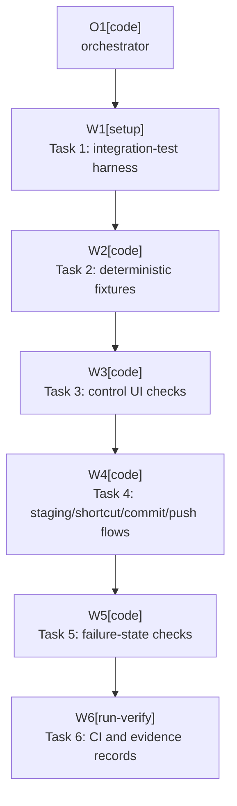

# Plan: Release Matrix UI Automation

Plan-ID: PLAN-release-matrix-ui-automation

Status: Draft

Workers: 1

Filename: `.agents/plans/PLAN-release-matrix-ui-automation.md`

## Readiness

- Plan readiness: Not ready until the maintainer approves the deterministic AI test boundary and CI gate scope.
- Open questions: Yes; see `## Open Questions`.
- Implementation progress: Not started.

## Status History

- 2026-05-20T22:47:01+02:00: none -> Draft by Codex <codex@openai.com>; plan created to automate the remaining `T-VAL-024` release matrix checks.

## Goal

Make the `T-VAL-024` release matrix runnable automatically for the current IDEA, PyCharm, and WebStorm line by adding an IntelliJ integration-test lane that launches real IDE products, installs the built plugin, opens local Git fixtures, drives the Commit tool window, and records machine-checkable evidence.

The intended result is a deterministic release validation command that covers final control rendering, staging-area modes, shortcut takeover, AI Assistant unavailable states, and full commit/push UI behavior without contacting real remotes or requiring a signed-in JetBrains AI account in CI.

## Non-Goals

- Do not store JetBrains account credentials, AI Assistant tokens, signing keys, or Marketplace secrets in CI.
- Do not rely on live AI Assistant text generation for deterministic CI assertions.
- Do not contact real Git remotes; all push checks must use temporary local bare remotes.
- Do not remove residual manual rows until an automated test owns the row's primary assertion under `docs/scenario-coverage.md` counting rules.
- Do not change user-facing runtime behavior except for narrow accessibility or testability seams that are useful outside tests.

## Assumptions

- Use JetBrains Starter and Driver integration tests through the IntelliJ Platform Gradle Plugin 2.x `testIdeUi` support instead of hand-starting `runIde`.
- Keep the existing unit and local-Git tests as the fast default CI gate.
- Add UI integration tests as a separate release-matrix lane first, then decide whether they become required on every pull request after stability data exists.
- Use a deterministic test-only AI Assistant substitute for happy-path `AI`, `Commit`, and `Push` automation.
- Keep one optional local smoke check for real signed-in AI Assistant behavior unless a later accepted decision allows credentials outside the repository.

## Open Questions

- Can the integration tests install a test-only plugin with ID `com.intellij.ml.llm` that registers `Vcs.LLMCommitMessageAction` and writes a deterministic commit message through the supplied `CommitWorkflowUi` data context?
- If a fake AI Assistant dependency is not acceptable, should production code expose a narrow test mode for `AiCommitMessageActionFinder` or should happy-path AI generation remain manual?
- Should the new UI matrix run as a pull-request gate, a scheduled/nightly job, or a manually triggered release workflow? Recommendation: manual release workflow first, then scheduled, then PR gate only if stable.
- Which product matrix is required for automation acceptance: IDEA-only for every scenario plus PyCharm/WebStorm smoke, or full IDEA/PyCharm/WebStorm for every scenario?

## Proposed Changes

- Task 1: Add the integration-test harness.
    - Add `src/integrationTest/kotlin` and `src/integrationTest/resources`.
    - Add Gradle dependencies for Starter/Driver integration tests, JUnit 5, and required runtime helpers under an `integrationTestImplementation` configuration.
    - Register a `releaseMatrixUiTest` task using `intellijPlatformTesting.testIdeUi`.
    - Pass the built plugin path and target IDE product/version matrix through Gradle properties.

- Task 2: Add deterministic IDE fixtures.
    - Add an integration-test fixture builder for temporary Git repositories with modified, deleted, renamed, unversioned, ignored, already staged, multi-root, and local bare remote states.
    - Add a test-only AI Assistant substitute that satisfies the required plugin dependency and registers the commit-message generation action used by the production discovery service.
    - Ensure the fake action writes a deterministic non-empty message through IDE commit-message APIs, not by poking production internals.

- Task 3: Automate Commit tool window and control UI checks.
    - Add stable accessible names to the three control segments if needed.
    - Drive `AI`, `Commit`, and `Push` segment clicks with Driver.
    - Assert the plugin control is visible, the standard `Commit and Push...` toolbar action is absent, disabled/running states are observable, and light/dark rendering smoke checks produce nonblank component screenshots.

- Task 4: Automate staging, shortcut, and commit/push flows.
    - Run staging-area enabled and disabled cases against temporary Git fixtures.
    - Trigger default commit and push shortcuts with takeover enabled and disabled.
    - Verify `AI` generates a message without commit, `Commit` creates one local commit, and `Push` commits and pushes only to a temporary local remote.
    - Verify outgoing-only push behavior and protected tracked-branch behavior without opening the Push window when safe immediate push is expected.

- Task 5: Automate failure-state checks.
    - Run a missing fake-AI dependency sandbox to verify dependency failure or plugin disabled behavior.
    - Run unavailable AI, timeout, unchanged message, empty message, and user-edit stop paths through deterministic fake actions.
    - Verify unchanged git log or remote hash for every stop path.
    - Keep real AI Assistant signed-out service behavior as an optional local smoke lane if fake action cannot reproduce the platform-owned message.

- Task 6: Add CI workflow and evidence records.
    - Add a manually triggered GitHub Actions workflow for release-matrix UI tests.
    - Upload JUnit XML, IDE logs, screenshots, and local Git evidence as artifacts.
    - Keep pull-request CI on fast checks until the UI lane has enough stability data.
    - Update `docs/validation/manual-sandbox.md`, `docs/scenario-coverage.md`, and `TASKS.md` only after the automated evidence is real.

## Execution Model

- Execute sequentially with `Workers: 1`.
- Treat Task 1 as a spike with a hard stop if Driver cannot launch the current product matrix locally.
- Do not reclassify manual scenarios until a test passes locally and produces evidence.
- Use one commit per implementation task if commits are requested during approved execution.

## Execution Graph

## Validation

- `.\gradlew.bat test`
- `.\gradlew.bat buildPlugin`
- `.\gradlew.bat releaseMatrixUiTest -PideProducts=IU,PY,WS -PideVersion=2026.1.2`
- `.\gradlew.bat verifyPlugin -PpluginVerifierIdeVersions="IU-2026.1.2,PY-2026.1.2,WS-2026.1.2"`
- `pwsh -NoProfile -ExecutionPolicy Bypass -File scripts\validate-docs.ps1`
- `git diff --check`

## Risks

- JetBrains Driver UI testing is documented as experimental, so APIs and selectors may change.
- UI tests need a real graphical environment; GitHub-hosted Linux will likely need Xvfb, and macOS keyboard automation needs Accessibility permissions.
- A fake AI Assistant action proves the plugin workflow, not JetBrains' live AI service behavior.
- Fake dependency loading must not leak into production packaging or Marketplace metadata.
- Product-specific Commit tool window details may differ between IDEA, PyCharm, and WebStorm.
- Full matrix tests may be slow and flaky enough to be release-only rather than pull-request checks.

## Handoff Notes

- The repository already has many automated counterpart rows from `PLAN-automate-manual-scenarios`.
- This plan targets the remaining live IDE evidence in `T-VAL-024`, not the lower-level pure Kotlin or local-Git invariants.
- Implementation must stop before replacing manual release requirements if a new ADR is needed for validation policy.
