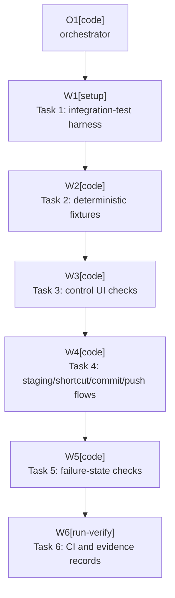

# Plan: Release Matrix UI Automation

Plan-ID: PLAN-release-matrix-ui-automation

Status: In Progress

Workers: 1

Filename: `.agents/plans/PLAN-release-matrix-ui-automation.md`

## Readiness

- Plan readiness: In progress after approval.
- Approved by: Kamil Kiewisz <kamkie@outlook.com>
- Approved at: 2026-05-20T23:07:23+02:00
- Open questions: None. The maintainer answered the task-local questions in this draft.
- Implementation progress: Tasks 1, 2, and 3 completed; Task 4 pending.

## Status History

- 2026-05-20T22:47:01+02:00: none -> Draft by Codex <codex@openai.com>; plan created to automate the remaining `T-VAL-024` release matrix checks.
- 2026-05-20T23:07:23+02:00: Draft -> Approved by Kamil Kiewisz <kamkie@outlook.com>; explicit user approval recorded from request to approve `.agents/plans/PLAN-release-matrix-ui-automation.md`.
- 2026-05-20T23:08:38+02:00: Approved -> In Progress by Codex <codex@openai.com>; Task 1 implementation started after approval.
- 2026-05-20T23:23:51+02:00: Task 1 completed by Codex <codex@openai.com>; `releaseMatrixUiTest` launches IDEA 2026.1.2, installs the built plugin plus a test-only `com.intellij.ml.llm` substitute, and verifies `Vcs.LLMCommitMessageAction` is registered through Driver.
- 2026-05-20T23:57:35+02:00: Task 2 completed by Codex <codex@openai.com>; deterministic Git fixtures and fake AI commit-message generation were added to the IDEA UI automation lane.
- 2026-05-21T00:31:45+02:00: Task 3 completed by Codex <codex@openai.com>; Commit tool window Driver checks now verify the AI Commit All control, disabled state, toolbar replacement, segment clicks, and nonblank light/dark screenshots.

## Goal

Make the `T-VAL-024` release matrix runnable automatically for current IntelliJ IDEA first by adding an IntelliJ integration-test lane that launches the real IDE product, installs the built plugin, opens local Git fixtures, drives the Commit tool window, and records machine-checkable evidence.

The intended result is a deterministic release validation command that covers final control rendering, staging-area modes, shortcut takeover, AI Assistant unavailable states, and full commit/push UI behavior for IDEA without contacting real remotes or requiring a signed-in JetBrains AI account in CI.

## Non-Goals

- Do not store JetBrains account credentials, AI Assistant tokens, signing keys, or Marketplace secrets in CI.
- Do not rely on live AI Assistant text generation for deterministic CI assertions.
- Do not contact real Git remotes; all push checks must use temporary local bare remotes.
- Do not remove residual manual rows until an automated test owns the row's primary assertion under `docs/scenario-coverage.md` counting rules.
- Do not change user-facing runtime behavior except for narrow accessibility or testability seams that are useful outside tests.
- Do not automate PyCharm or WebStorm release-matrix scenarios in the first implementation pass.

## Assumptions

- Use JetBrains Starter and Driver integration tests through the IntelliJ Platform Gradle Plugin 2.x `testIdeUi` support instead of hand-starting `runIde`.
- Keep the existing unit and local-Git tests as the fast default CI gate.
- Add UI integration tests as a separate release-matrix lane first, then decide whether they become required on every pull request after stability data exists.
- Use a deterministic test-only AI Assistant substitute for happy-path `AI`, `Commit`, and `Push` automation.
- Keep one optional local smoke check for real signed-in AI Assistant behavior unless a later accepted decision allows credentials outside the repository.
- Start with IDEA-only release-matrix automation. PyCharm and WebStorm remain manual or future automation scope.
- Prefer the test-only `com.intellij.ml.llm` plugin substitute. A production test mode or injectable production `AiCommitMessageActionFinder` is more invasive and should be attempted only if the fake dependency cannot satisfy plugin loading and action invocation.

## Open Questions

- None.

## Decisions For This Plan

- Use a test-only plugin substitute for JetBrains AI Assistant. Task 1 must prove that a local plugin with ID `com.intellij.ml.llm` can satisfy the required dependency and register `Vcs.LLMCommitMessageAction`.
- Keep production AI discovery unchanged unless the fake dependency route is blocked. A production test mode is more problematic because it risks introducing release-only switches or non-user-facing behavior into production code.
- Run the UI matrix as a manually triggered release workflow first.
- Automate IDEA scenarios only in this first pass.

## Proposed Changes

- Task 1: Add the integration-test harness.
    - Add `src/integrationTest/kotlin` and `src/integrationTest/resources`.
    - Add Gradle dependencies for Starter/Driver integration tests, JUnit 5, and required runtime helpers under an `integrationTestImplementation` configuration.
    - Register a `releaseMatrixUiTest` task using `intellijPlatformTesting.testIdeUi`.
    - Pass the built plugin path and target IDEA version through Gradle properties.

- Task 2: Add deterministic IDE fixtures.
    - Add an integration-test fixture builder for temporary Git repositories with modified, deleted, renamed, unversioned, ignored, already staged, multi-root, and local bare remote states.
    - Add a test-only AI Assistant substitute that satisfies the required plugin dependency and registers the commit-message generation action used by the production discovery service.
    - Ensure the fake action writes a deterministic non-empty message through IDE commit-message APIs, not by poking production internals.

- Task 3: Automate Commit tool window and control UI checks.
    - Add stable accessible names to the three control segments if needed.
    - Drive `AI`, `Commit`, and `Push` segment clicks with Driver.
    - Assert the plugin control is visible, the standard `Commit and Push...` toolbar action is absent, disabled/running states are observable, and light/dark rendering smoke checks produce nonblank component screenshots.

- Task 4: Automate staging, shortcut, and commit/push flows.
    - Run staging-area enabled and disabled cases against temporary Git fixtures.
    - Trigger default commit and push shortcuts with takeover enabled and disabled.
    - Verify `AI` generates a message without commit, `Commit` creates one local commit, and `Push` commits and pushes only to a temporary local remote.
    - Verify outgoing-only push behavior and protected tracked-branch behavior without opening the Push window when safe immediate push is expected.

- Task 5: Automate failure-state checks.
    - Run a missing fake-AI dependency sandbox to verify dependency failure or plugin disabled behavior.
    - Run unavailable AI, timeout, unchanged message, empty message, and user-edit stop paths through deterministic fake actions.
    - Verify unchanged git log or remote hash for every stop path.
    - Keep real AI Assistant signed-out service behavior as an optional local smoke lane if fake action cannot reproduce the platform-owned message.

- Task 6: Add CI workflow and evidence records.
    - Add a manually triggered GitHub Actions workflow for IDEA release-matrix UI tests.
    - Upload JUnit XML, IDE logs, screenshots, and local Git evidence as artifacts.
    - Keep pull-request CI on fast checks until the UI lane has enough stability data.
    - Update `docs/validation/manual-sandbox.md`, `docs/scenario-coverage.md`, and `TASKS.md` only after the automated evidence is real.

## Task Packets

Completed Tasks 1, 2, and 3 predate ADR 0071 packet dispatch and remain summarized in `## Implementation Evidence`. The pending packets below govern future worker dispatch for this in-progress plan.

### Task Packet: T4-staging-shortcut-commit-push-flows

Task id: T4-staging-shortcut-commit-push-flows

Lane: implementation

Goal:

- Automate staging-area, shortcut takeover, local commit, and safe immediate push UI flows for IDEA release-matrix validation.

Allowed inputs:

- `AGENTS.md`
- `.agents/references/execution.md`
- `.agents/references/testing.md`
- `.agents/references/reviews.md`
- Plan header, readiness summary, execution graph, this task packet, and completed implementation evidence for Tasks 1 through 3.
- `build.gradle.kts`
- `src/main/kotlin/pl/devopssolutions/aicommitall/actions/**`
- `src/main/kotlin/pl/devopssolutions/aicommitall/workflow/**`
- `src/main/kotlin/pl/devopssolutions/aicommitall/vcs/**`
- `src/integrationTest/**`
- `src/test/**` only when updating companion unit coverage.
- `docs/specification.md` only when behavior-source lines must stay aligned.

Forbidden inputs:

- Unrelated archived plans.
- Previous worker chat beyond the orchestrator handoff summary.
- Implementation evidence from unrelated plan tasks or proposals.

Write scope:

- `src/integrationTest/**`
- `src/test/**` only for companion coverage directly needed by this task.
- `src/main/kotlin/pl/devopssolutions/aicommitall/actions/**`, `workflow/**`, or `vcs/**` only for narrow testability or bug fixes discovered by the UI flow.
- `docs/specification.md` only when changed source behavior needs specification alignment.

Dependencies:

- Tasks 1, 2, and 3 complete.
- Sequential before Tasks 5 and 6.

Validation:

- `.\gradlew.bat compileIntegrationTestKotlin`
- `.\gradlew.bat test`
- `.\gradlew.bat releaseMatrixUiTest "-PideProducts=IU" "-PideVersion=2026.1.2"`
- `git diff --check`

Stop conditions:

- Safe immediate push needs a new repository rule or validation-policy decision.
- UI automation requires real remotes, credentials, or live JetBrains AI Assistant access.
- Shortcut takeover behavior differs from accepted ADRs or documented specification in a way that changes user-facing behavior.

Expected output:

- Changed files.
- Validation evidence.
- Commit and push outcome evidence against temporary local repositories.
- Blockers or handoff notes.
- Suggested changelog entry only if public plugin behavior changes.

Result summary:

- Status: pending
- Worker:
- Changed files or reviewed diff:
- Validation evidence:
- Blockers:
- Review risks:
- Handoff notes:

### Task Packet: T5-failure-state-checks

Task id: T5-failure-state-checks

Lane: implementation

Goal:

- Automate deterministic failure-state checks for missing or unavailable AI, timeouts, unchanged messages, empty messages, and user-edit stop paths.

Allowed inputs:

- `AGENTS.md`
- `.agents/references/execution.md`
- `.agents/references/testing.md`
- `.agents/references/reviews.md`
- Plan header, readiness summary, execution graph, this task packet, and completed implementation evidence for Tasks 1 through 4.
- `src/main/kotlin/pl/devopssolutions/aicommitall/ai/**`
- `src/main/kotlin/pl/devopssolutions/aicommitall/workflow/**`
- `src/main/kotlin/pl/devopssolutions/aicommitall/vcs/**`
- `src/integrationTest/**`
- `src/test/**` only when updating companion unit coverage.
- `docs/specification.md` and `README.md` only when public behavior wording must stay aligned.

Forbidden inputs:

- Unrelated archived plans.
- Previous worker chat beyond the orchestrator handoff summary.
- Implementation evidence from unrelated plan tasks or proposals.

Write scope:

- `src/integrationTest/**`
- `src/test/**` only for companion coverage directly needed by this task.
- `src/main/kotlin/pl/devopssolutions/aicommitall/ai/**`, `workflow/**`, or `vcs/**` only for narrow testability or bug fixes discovered by failure automation.
- `docs/specification.md` or `README.md` only when changed behavior needs user-facing alignment.

Dependencies:

- Task 4 complete.
- Sequential before Task 6.

Validation:

- `.\gradlew.bat compileIntegrationTestKotlin`
- `.\gradlew.bat test`
- `.\gradlew.bat releaseMatrixUiTest "-PideProducts=IU" "-PideVersion=2026.1.2"`
- `git diff --check`

Stop conditions:

- Failure-state automation requires live JetBrains AI Assistant service behavior that the fake action cannot model.
- A missing dependency or timeout path requires a new product or repository decision.
- Stop-path checks cannot prove unchanged git log or remote hash.

Expected output:

- Changed files.
- Validation evidence.
- Git log or remote hash evidence for stop paths.
- Blockers or handoff notes.
- Suggested changelog entry only if public plugin behavior changes.

Result summary:

- Status: pending
- Worker:
- Changed files or reviewed diff:
- Validation evidence:
- Blockers:
- Review risks:
- Handoff notes:

### Task Packet: T6-ci-and-evidence-records

Task id: T6-ci-and-evidence-records

Lane: implementation

Goal:

- Add the manually triggered IDEA release-matrix UI workflow and update evidence records only after automated evidence exists.

Allowed inputs:

- `AGENTS.md`
- `.agents/references/execution.md`
- `.agents/references/testing.md`
- `.agents/references/reviews.md`
- `.agents/references/releases.md`
- Plan header, readiness summary, execution graph, this task packet, and completed implementation evidence for Tasks 1 through 5.
- `.github/workflows/**`
- `docs/validation/manual-sandbox.md`
- `docs/scenario-coverage.md`
- `TASKS.md`
- `build.gradle.kts` only if the workflow needs documented Gradle task wiring.

Forbidden inputs:

- Unrelated archived plans.
- Previous worker chat beyond the orchestrator handoff summary.
- Manual scenario rows that do not have real automated evidence.

Write scope:

- `.github/workflows/**`
- `docs/validation/manual-sandbox.md`
- `docs/scenario-coverage.md`
- `TASKS.md`
- `.agents/plans/PLAN-release-matrix-ui-automation.md`
- `build.gradle.kts` only if workflow execution needs a small task wiring fix.

Dependencies:

- Task 5 complete.

Validation:

- `pwsh -NoProfile -ExecutionPolicy Bypass -File scripts\validate-docs.ps1`
- `git diff --check`
- `.\gradlew.bat test`
- `.\gradlew.bat releaseMatrixUiTest "-PideProducts=IU" "-PideVersion=2026.1.2"` when the workflow or evidence update depends on fresh local evidence.

Stop conditions:

- CI workflow design needs a policy decision about making UI tests required on pull requests.
- GitHub Actions execution requires secrets, credentials, or platform access not available to the repository.
- Scenario rows cannot be tied to passing automated evidence.

Expected output:

- Changed files.
- Documentation validation evidence.
- UI workflow or evidence handoff notes.
- Scenario coverage rows updated only for proven automated checks.
- Suggested changelog entry only if release workflow changes affect public plugin artifacts or publication.

Result summary:

- Status: pending
- Worker:
- Changed files or reviewed diff:
- Validation evidence:
- Blockers:
- Review risks:
- Handoff notes:

## Execution Model

- Execute sequentially with `Workers: 1`.
- Treat Task 1 as a spike with a hard stop if Driver cannot launch the current IDEA build locally or the test-only AI dependency cannot satisfy plugin loading.
- Do not reclassify manual scenarios until a test passes locally and produces evidence.
- Use one commit per implementation task if commits are requested during approved execution.

## Execution Graph

## Implementation Evidence

- Task 1 added the `integrationTest` source set, the `releaseMatrixUiTest` `testIdeUi` task, and a packaged test-only AI Assistant substitute plugin.
- Task 1 local validation:
    - `.\gradlew.bat spotlessCheck` passed after mechanical ktlint formatting.
    - `.\gradlew.bat test buildPlugin` passed.
    - `.\gradlew.bat releaseMatrixUiTest "-PideProducts=IU" "-PideVersion=2026.1.2"` passed on Windows after IDEA 2026.1.2 build `261.24374.151` was downloaded and cached by Starter.
    - `.\gradlew.bat verifyPlugin "-PpluginVerifierIdeVersions=IU-2026.1.2,PY-2026.1.2,WS-2026.1.2"` passed with compatible reports for `IU-261.24374.151`, `PY-261.24374.152`, and `WS-261.24374.125`.
    - `pwsh -NoProfile -ExecutionPolicy Bypass -File scripts\validate-docs.ps1` passed after excluding generated IDE test output from Markdown validation.
    - `git diff --check` passed.
    - The test installs `build/distributions/ai-commit-all-*.zip` plus `build/integrationTest/plugins/fake-ai-assistant-plugin-0.0.1-test.zip` and verifies the fake plugin registers `Vcs.LLMCommitMessageAction` from the IDE process through Driver.
    - The initial fake plugin ZIP layout was corrected from `plugins/lib/...jar` to `plugins/fake-ai-assistant-plugin/lib/...jar` after IntelliJ reported `com.intellij.ml.llm` was not installed.
- Task 2 added `ReleaseMatrixGitFixtureBuilder` for temporary local Git repositories covering modified, deleted, renamed, unversioned, ignored, already staged, multi-root, and local bare remote states.
- Task 2 updated the fake AI Assistant action so `Vcs.LLMCommitMessageAction` writes `AI Commit All release matrix message` through IDE commit-message data keys and exposes a `progressIndicator` field compatible with the production completion observer.
- Task 2 updates `releaseMatrixUiTest` to open the local Git fixture as an IDEA project, wait for Driver to see the project, and verify the fake AI action writes the deterministic commit message inside an IDE write-action context.
- Task 2 local validation:
    - `.\gradlew.bat compileIntegrationTestKotlin` passed.
    - `.\gradlew.bat releaseMatrixUiTest "-PideProducts=IU" "-PideVersion=2026.1.2"` passed on Windows after fixing fake plugin JUnit discovery and EDT action invocation.
    - `.\gradlew.bat test buildPlugin` passed.
    - `.\gradlew.bat spotlessCheck` passed.
- Task 3 added a stable Swing component name and state-aware accessible descriptions for the AI Commit All three-section control.
- Task 3 hardened toolbar replacement so the standard `Git.Commit.And.Push.Executor` action is removed by resolved group-child action ID and is also rechecked when the custom component is created.
- Task 3 added a clean Git fixture variant and a Driver-backed Commit tool window test that opens IDEA, waits for the control, verifies the standard `Commit and Push...` action is absent from the resolved primary commit group, clicks `AI`, `Commit`, and `Push` segments, asserts disabled accessibility state, and writes nonblank light/dark screenshots under `build/reports/releaseMatrixUiTest/screenshots/commit-control/`.
- Task 3 local validation:
    - `.\gradlew.bat compileIntegrationTestKotlin` passed.
    - `.\gradlew.bat test --tests "pl.devopssolutions.aicommitall.actions.AiCommitAllCommitToolbarCustomizerTest" --tests "pl.devopssolutions.aicommitall.actions.AiCommitAllThreeSectionControlTest"` passed.
    - `.\gradlew.bat spotlessCheck test buildPlugin` passed.
    - `.\gradlew.bat releaseMatrixUiTest "-PideProducts=IU" "-PideVersion=2026.1.2"` passed on Windows and produced `ai-commit-all-control-light.png` and `ai-commit-all-control-dark.png`.
    - `pwsh -NoProfile -ExecutionPolicy Bypass -File scripts\validate-docs.ps1` passed.
    - `git diff --check` passed.

## Validation

- `.\gradlew.bat test`
- `.\gradlew.bat buildPlugin`
- `.\gradlew.bat releaseMatrixUiTest "-PideProducts=IU" "-PideVersion=2026.1.2"`
- `.\gradlew.bat verifyPlugin -PpluginVerifierIdeVersions="IU-2026.1.2,PY-2026.1.2,WS-2026.1.2"`
- `pwsh -NoProfile -ExecutionPolicy Bypass -File scripts\validate-docs.ps1`
- `git diff --check`

## Risks

- JetBrains Driver UI testing is documented as experimental, so APIs and selectors may change.
- UI tests need a real graphical environment; GitHub-hosted Linux will likely need Xvfb, and macOS keyboard automation needs Accessibility permissions.
- A fake AI Assistant action proves the plugin workflow, not JetBrains' live AI service behavior.
- Fake dependency loading must not leak into production packaging or Marketplace metadata.
- Product-specific Commit tool window details may differ between IDEA, PyCharm, and WebStorm; only IDEA is automated in this first pass.
- The UI tests may be slow and flaky enough to remain release-only rather than pull-request checks.

## Handoff Notes

- The repository already has many automated counterpart rows from `PLAN-automate-manual-scenarios`.
- This plan targets the remaining live IDE evidence in `T-VAL-024`, not the lower-level pure Kotlin or local-Git invariants.
- Implementation must stop before replacing manual release requirements if a new ADR is needed for validation policy.
