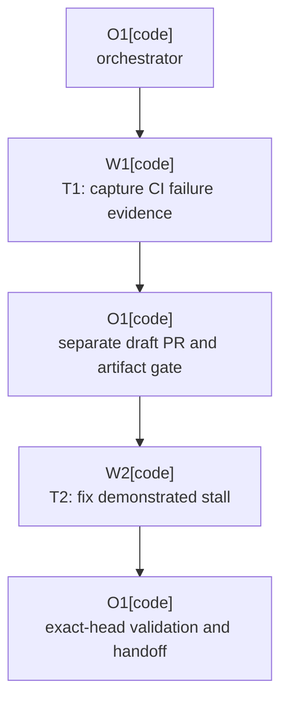

# Plan: Staging-Enabled Commit UI Reliability

Plan-ID: PLAN-staging-enabled-commit-ui-reliability

Status: In Progress

Workers: 1

Filename: `.agents/plans/PLAN-staging-enabled-commit-ui-reliability.md`

## Readiness

- Plan readiness: Approved and in progress; T1 is ready for worker dispatch.
- Approved by: Kamil Kiewisz <kamkie@outlook.com>
- Approved at: 2026-07-13T11:38:44+02:00
- Open questions: None. The exact failing boundary is an evidence dependency handled by T1, not a product decision.
- Implementation progress: T1 complete; draft PR #35 is open and T2 remains gated on its hosted failure evidence.

## Status History

- 2026-07-13T11:27:08+02:00: none -> Draft by Codex <codex@openai.com>; evidence-first fix plan created.
- 2026-07-13T11:38:44+02:00: Draft -> Approved by Kamil Kiewisz <kamkie@outlook.com>; explicit user approval recorded.
- 2026-07-13T11:38:57+02:00: Approved -> In Progress by Codex <codex@openai.com>; approved implementation started.

## Goal

Make the staging-enabled Commit UI scenario reliable in hosted CI without changing its intended commit semantics. First retain the failed IDE test evidence, then use the last emitted diagnostic boundary to add a regression test and the smallest deterministic fix at the demonstrated plugin-owned or test-harness seam.

## Non-Goals

- Do not change, close, rebase, push to, or otherwise mutate PR #34; it remains dependency-only.
- Do not revert or alter the JUnit dependency update from PR #34.
- Do not increase the 120-second wait, add retries, quarantine or disable the scenario, or treat a timeout extension as a fix.
- Do not bypass IntelliJ commit safeguards or replace the real staging-enabled Commit UI path with direct Git commands.
- Do not refactor adjacent workflow, commit, push, or staging code.
- Do not claim to fix external EDT starvation or platform behavior without evidence of a plugin-owned seam.

## Assumptions

- PR #34 and a same-day `main` control both failed at the same staging-enabled scenario, so the JUnit update is not the cause.
- The focused Windows reproduction passed in 49.8 seconds while three same-day hosted Linux executions timed out at 120 seconds, so the failure is environment-dependent and must be localized from hosted evidence.
- Existing diagnostics from commit `544cade981896882ad2926a13f4d93820df5bfa5` cover the relevant scheduling, readiness, and commit-executor boundaries; artifact retention should precede new logging.
- CI artifact retention is operational observability and does not require an ADR or behavior-specification change.
- A production behavior change requires updating the applicable `REQ-` row and traceability in `docs/specification.md`; a test-harness-only correction does not.

## Open Questions

None. If the artifact does not demonstrate a safe repository-owned fix, T2 stops and records the evidence rather than guessing.

## Proposed Changes

### T1-capture-ci-failure-evidence

- Add a failure-only `actions/upload-artifact@v7` step immediately after the release-matrix UI smoke step in `.github/workflows/ci.yml`.
- Retain only the release-matrix JUnit XML, HTML reports, Gradle release-matrix reports, IDE logs, and integration-test logs. Do not upload the full sandbox, JaCoCo execution data, or class dumps.
- Preserve the primary test failure with `if-no-files-found: warn`; skip the upload under local `act` execution.
- Commit T1, push this branch, and open a separate draft PR to trigger hosted CI. Do not use PR #34 for the diagnostic run.
- If the initial hosted run passes, permit one manual rerun. If neither run reproduces the failure, stop before T2 and report that the root-cause gate was not met.
- If the hosted run fails, download the T1 artifact and record the last diagnostic marker, test report, IDE exception context, and Git evidence relevant to the staging fixture.

### T2-fix-demonstrated-stall

- Add a focused failing regression test that reproduces the demonstrated boundary before changing production or harness behavior.
- Select the smallest branch below supported by the artifact:
  - `AI generation phase scheduled` without `AI generation phase started on EDT`: change only a demonstrated plugin-owned scheduling or synchronization seam; otherwise stop because external EDT starvation is out of scope.
  - Readiness scheduling without `default commit readiness gate opened`: correct the readiness or smart-mode transition without bypassing the gate.
  - `invoking default commit executor` without a result callback: verify the version-sensitive IntelliJ commit contract from primary platform documentation before changing execution behavior.
  - A success callback with unchanged Git HEAD: correct the integration fixture or result-observation seam rather than production commit behavior.
- Run targeted unit and integration checks, then the broad repository checks required by the changed seam.
- Require two consecutive hosted executions at the exact fixed head, the initial run and one manual rerun, before describing the scenario as stable. Any recurrence blocks completion.
- Update `docs/specification.md` and `CHANGELOG.md` only if public plugin behavior changes.

## Task Packets

### Task Packet: T1-capture-ci-failure-evidence

Task id: T1-capture-ci-failure-evidence

Lane: implementation

Required skills:

- `gh-fix-ci-security-quality`
- `repository-documentation`

Goal:

- Preserve the smallest useful staging-enabled UI failure artifact in ordinary CI and obtain a hosted failure artifact from a separate draft PR.

Initial context budget:

- Read first:
  - This plan's header, readiness summary, execution graph, and this task packet.
  - `AGENTS.md`.
  - `.github/workflows/ci.yml` around the release-matrix UI smoke step.
  - `.github/workflows/release-matrix-ui.yml` around its test summary and evidence upload steps.
- Escalate to:
  - `.agents/references/testing.md` and `.agents/references/reviews.md` when selecting final validation and self-review checks.
  - The separate draft PR's check logs and uploaded evidence after T1 is committed and pushed.

Allowed inputs:

- The files and artifacts named under `Read first`.
- The validation guides and hosted artifacts named under `Escalate to` after their triggers fire.

Forbidden inputs:

- PR #34 mutations or implementation changes.
- Unrelated archived plans and prior worker chat beyond the orchestrator handoff summary.
- Full IDE sandbox contents, credentials, JaCoCo execution data, and class dumps as uploaded evidence.

Write scope:

- `.github/workflows/ci.yml`

Dependencies:

- None. This task must be committed before the separate draft PR is created and before T2 begins.

Validation:

- `actionlint .github/workflows/ci.yml`
- `pwsh -NoProfile -ExecutionPolicy Bypass -File scripts/validate-docs.ps1`
- `git diff --check`
- Self-review the artifact condition, path scope, action version, failure preservation, and absence of PR #34 changes.
- Record the T1 commit before the orchestrator pushes the branch and creates the separate draft PR.

Escalation triggers:

- Load only the workflow or Gradle configuration that owns a mismatched path if current artifact path conventions differ.
- Run one manual rerun at the same head if the initial hosted run passes.
- Check only that run's workflow and artifact output if the upload step itself fails or captures no diagnostic logs.

Stop conditions:

- Artifact capture would require uploading the full sandbox or possible credentials.
- The proposed workflow change affects PR #34 or any dependency declaration.
- Neither the initial run nor the one permitted rerun reproduces the failure.

Expected output:

- Changed workflow diff and a separate draft PR URL.
- `actionlint`, documentation validation, and `git diff --check` evidence.
- Hosted run URL and either the captured artifact inventory with the last diagnostic boundary or a non-reproduction blocker.
- Self-review evidence and the T1 commit identifier.
- Structured worker event evidence and orchestrator reconciliation.
- Blockers, review risks, and the precise T2 handoff.

Result summary:

- Status: completed
- Worker: `/root/t1_capture_ci_failure_evidence`
- Changed files or reviewed diff: `.github/workflows/ci.yml`; 13-line failure-only artifact upload after the UI smoke step.
- Validation evidence: `actionlint .github/workflows/ci.yml`, `scripts/validate-docs.ps1`, and `git diff --check` passed.
- Self-review evidence from `.agents/references/reviews.md`: Conditions, paths, action version, primary-failure preservation, artifact scope, and PR #34 isolation checked.
- Commit: `188b173d24324b93519768afb5e770b04e5ab5ad`
- Worker events: Start `2026-07-13T11:40:40+02:00`; stop `2026-07-13T11:42:12+02:00`; both recorded in chat.
- Orchestrator reconciliation: Commit and diff independently inspected; only the reserved workflow file changed and required commit metadata is present.
- Changelog/docs/spec/tasks updates: Not applicable; T1 is CI observability only.
- Blockers: None for hosted artifact capture.
- Review risks: Failure-only evidence remains unavailable if the hosted scenario does not reproduce.
- Handoff notes and next action: Push the branch, open a separate draft PR, and inspect the hosted failure artifact before T2.

### Task Packet: T2-fix-demonstrated-stall

Task id: T2-fix-demonstrated-stall

Lane: implementation

Required skills:

- `intellij-plugin-development`
- `kotlin-plugin-style`
- `plugin-test-tdd`
- `platform-docs-research` only when the artifact implicates a version-sensitive IntelliJ contract
- `repository-documentation` only when specification or changelog updates are required

Goal:

- Reproduce the artifact-demonstrated boundary in a focused test, implement the smallest deterministic fix, and prove the staging-enabled Commit UI path at the exact fixed head.

Initial context budget:

- Read first:
  - This plan's header, readiness summary, execution graph, this task packet, and the completed T1 result summary.
  - `AGENTS.md`.
  - The T1 failure artifact inventory, last diagnostic marker, relevant exception context, and Git evidence.
  - Only the source and test files directly identified by that boundary from the allowed list below.
- Escalate to:
  - `docs/specification.md` if production behavior changes.
  - The exact primary IntelliJ Platform documentation for a version-sensitive executor, callback, readiness, smart-mode, or EDT contract.
  - `.agents/references/testing.md`, `.agents/references/reviews.md`, and `.agents/references/code-style.md` when selecting final checks.

Allowed inputs:

- T1's committed diff, validation summary, and hosted failure evidence.
- Directly implicated files from this task's write scope.
- Escalation artifacts only after the named trigger fires.

Forbidden inputs:

- PR #34 mutations, JUnit dependency changes, unrelated archived plans, and unrelated prior worker chat.
- Timeout increases, retries, quarantine, test disabling, direct-Git commit replacement, and bypasses of IntelliJ commit safeguards.
- Adjacent cleanup or refactoring not needed by the demonstrated regression.

Write scope:

- Use the smallest necessary subset of:
  - `src/main/kotlin/pl/devopssolutions/aicommitall/workflow/AiCommitAllWorkflowCoordinator.kt`
  - `src/main/kotlin/pl/devopssolutions/aicommitall/workflow/CommitWorkflowExecutionService.kt`
  - `src/main/kotlin/pl/devopssolutions/aicommitall/workflow/VcsOperationReadinessService.kt`
  - `src/test/kotlin/pl/devopssolutions/aicommitall/workflow/AiCommitAllWorkflowRunnerTest.kt`
  - `src/test/kotlin/pl/devopssolutions/aicommitall/workflow/AiCommitAllWorkflowCoordinatorTest.kt`
  - `src/test/kotlin/pl/devopssolutions/aicommitall/workflow/CommitWorkflowExecutionServiceTest.kt`
  - `src/test/kotlin/pl/devopssolutions/aicommitall/workflow/CommitWorkflowExecutionServiceImmediatePushTest.kt`
  - `src/test/kotlin/pl/devopssolutions/aicommitall/workflow/VcsOperationReadinessServiceTest.kt`
  - `src/integrationTest/kotlin/pl/devopssolutions/aicommitall/integration/ReleaseMatrixUiHarnessTest.kt`
  - `src/integrationTest/kotlin/pl/devopssolutions/aicommitall/integration/fakeai/FakeAiAssistantProbe.kt`
  - `src/integrationTest/kotlin/pl/devopssolutions/aicommitall/integration/fakeai/FakeLlmCommitMessageAction.kt`
  - `docs/specification.md`
  - `CHANGELOG.md`
- Escalation-only write scope, permitted only when the artifact ends before AI scheduling and directly implicates staging synchronization:
  - `src/main/kotlin/pl/devopssolutions/aicommitall/workflow/ReflectiveCommitWorkflowSynchronizer.kt`
  - `src/test/kotlin/pl/devopssolutions/aicommitall/workflow/ReflectiveCommitWorkflowSynchronizerTest.kt`

Dependencies:

- T1 must have a committed workflow change and a hosted artifact that demonstrates the failing boundary.
- T1's result summary must contain validation, self-review, commit, worker-event, and orchestrator-reconciliation evidence before T2 starts.

Validation:

- Demonstrate the new focused regression test fails before the fix and passes after it.
- Run the narrowest affected unit test classes with Gradle `--tests` filters.
- Run `gradlew.bat test`.
- Run `gradlew.bat spotlessCheck detekt`.
- Run `gradlew.bat buildPlugin`.
- Run the exact focused `releaseMatrixUiTest` staging-enabled method locally when the environment supports it.
- Run `pwsh -NoProfile -ExecutionPolicy Bypass -File scripts/validate-docs.ps1` and `git diff --check`.
- After push, require the separate draft PR's full checks plus one manual rerun at the same head; both must pass.
- Self-review for commit/push safety, EDT and background-thread boundaries, dumb-mode compatibility, nullable platform APIs, IDE-version compatibility, test determinism, and scope containment.
- Record the T2 commit before any final readiness recommendation.

Escalation triggers:

- Load the two escalation-only synchronizer files if the artifact directly implicates `ReflectiveCommitWorkflowSynchronizer`.
- Use primary platform documentation before editing if a version-sensitive IntelliJ callback or executor contract is implicated.
- Review the applicable `REQ-` row, traceability, and changelog if production behavior changes.
- Stop for an orchestrator reconciliation decision if the focused test cannot reproduce the captured boundary.

Stop conditions:

- The last marker points only to external EDT starvation or opaque platform behavior with no demonstrated repository-owned seam.
- The fix would bypass IntelliJ commit safeguards, alter commit selection semantics, or require broad compatibility support.
- The focused regression cannot fail before the fix.
- Any exact-head hosted execution still reproduces the failure.
- Required changes leave the declared write scope.

Expected output:

- Focused red/green regression evidence and the smallest changed-file set.
- Targeted and broad validation evidence from `.agents/references/testing.md`.
- Self-review evidence from `.agents/references/reviews.md`.
- The T2 commit identifier, worker events, and orchestrator reconciliation.
- Conditional specification and changelog updates, or an explicit not-applicable record.
- Exact-head hosted run and rerun URLs, blockers, review risks, and handoff notes.

Result summary:

- Status: pending
- Worker:
- Changed files or reviewed diff:
- Validation evidence:
- Self-review evidence from `.agents/references/reviews.md`:
- Commit:
- Worker events:
- Orchestrator reconciliation:
- Changelog/docs/spec/tasks updates:
- Blockers:
- Review risks:
- Handoff notes and next action:

## Execution Model

- Use one fresh sub-agent worker per task, sequentially: W1 for T1, then W2 for T2 after the hosted evidence gate.
- The orchestrator owns plan status, task result summaries, worker-event reconciliation, GitHub orchestration, and the final diff review.
- Each worker must implement, validate, self-review, and commit its task before the next dependent step.
- Use `Project-Source: plan-task`, `Project-Plan: PLAN-staging-enabled-commit-ui-reliability`, and the exact `Project-Plan-Task:` metadata in each task commit.
- Keep all implementation on `codex/staging-ui-failure-fix`; do not modify the PR #34 branch.
- If sub-agents are unavailable or forbidden when execution starts, stop before implementation.

## Long-Run Continuity

- Resume docs reread:
  - After compaction, interruption, resume, or handoff, reread `AGENTS.md`; this plan's header, readiness, continuity, execution model, current packet, and current result summary; `.agents/references/execution.md`; `.agents/references/orchestration.md`; `.agents/references/testing.md`; `.agents/references/reviews.md`; `.gitmessage` before a commit; and the exact owner files for the next action.
- Current task or wave: T1 complete; hosted artifact gate on draft PR #35 in progress before T2.
- Completed commits: `3a5f98e` plan approval; `188b173` T1 artifact capture.
- Plan status and readiness: In Progress; explicitly approved by Kamil Kiewisz <kamkie@outlook.com>.
- Validation and self-review state: Agent-artifact validation, documentation validation, `git diff --check`, and plan-only scope review passed on 2026-07-13.
- Worker event state: T1 start and stop events recorded; no active worker.
- Orchestrator reconciliation state: T1 commit and diff reconciled with its packet; GitHub evidence pending.
- Changelog, docs, spec, task, or plan updates: Plan and plan catalog only.
- Blockers or open questions: None for T1; T2 remains gated on hosted failure evidence.
- Next action: Monitor draft PR #35 and dispatch T2 only if its hosted failure evidence identifies a safe seam.
- Context handoff notes: Branch starts at `938b56a329e2d23e11f1e758d39f3be42b75d1ed`; PR #34 is out of scope.

## Execution Graph

## Validation

- Validate agent artifacts with `pwsh -NoProfile -ExecutionPolicy Bypass -File scripts/ai/validate-agent-artifacts.ps1`.
- Validate documentation with `pwsh -NoProfile -ExecutionPolicy Bypass -File scripts/validate-docs.ps1`.
- Run `git diff --check` and inspect the final diff for plan-only scope before approval.
- T1 and T2 validation is defined in their task packets and is not authorized by drafting this plan.

## Risks

- Failure-only evidence is unavailable when the hosted scenario does not reproduce; one same-head rerun is the limit before stopping.
- IDE logs can be large; narrowly scoped paths and inherited artifact retention limit exposure and storage.
- IntelliJ commit execution and EDT timing are version-sensitive; evidence and primary documentation must precede changes at those seams.
- A local pass alone cannot prove the Linux CI failure fixed; exact-head hosted repetition is required.
- A change can accidentally broaden from test determinism into commit semantics; the regression, specification gate, and write-scope stop conditions prevent that expansion.

## Handoff Notes

- Read-only triage found the same timeout on PR #34, its rerun, and a concurrent `main` control, while all other PR #34 checks passed.
- The focused local Windows method passed once in 49.8 seconds with `--no-daemon`; this is diagnostic contrast, not fix validation.
- The first local attempt was invalidated by an external Gradle daemon stop and was retried once with `--no-daemon`.
- Draft PR #35 is the separate evidence-and-fix PR; PR #34 remains dependency-only and out of scope.
- No ADR is required at draft time because T1 reuses existing CI evidence handling and T2 is constrained to an already specified behavior. Reassess only if evidence requires a durable architectural decision.
- The Learning Capture checkpoint found no validated new workflow guidance to add beyond this active plan; repeat it after T1 failure evidence or any repeated validation failure.
