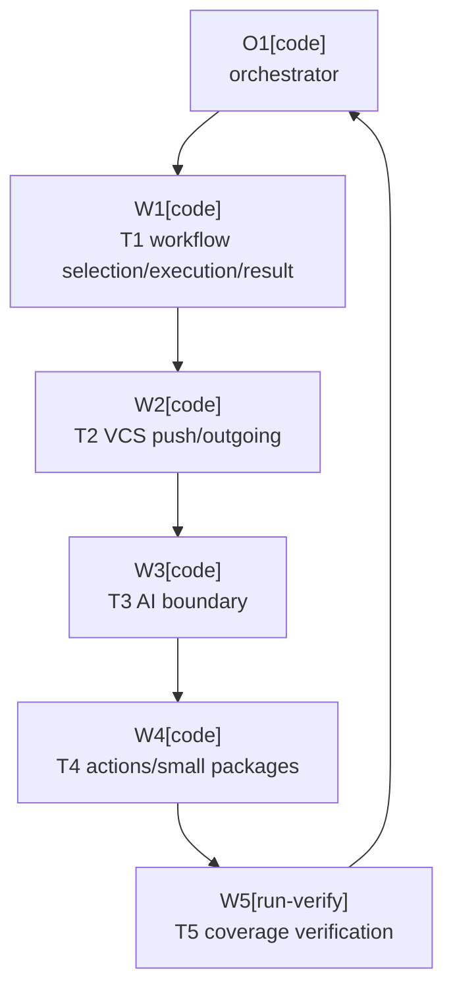

# Plan: Test Coverage Growth

Plan-ID: PLAN-test-coverage-growth

Status: In Progress

Approved by: Kamil Kiewisz <kamkie@outlook.com>

Approved at: 2026-05-25T01:40:55+02:00

Workers: 1

Filename: `.agents/plans/PLAN-test-coverage-growth.md`

## Readiness

- Plan readiness: Approved by Kamil Kiewisz <kamkie@outlook.com> on 2026-05-25T01:40:55+02:00 through the implementation request. Current coverage, residual targets, task packets, and continuity fields are updated from `.\gradlew.bat test jacocoTestReport`; implementation is in progress.
- Approved by: Kamil Kiewisz <kamkie@outlook.com>
- Approved at: 2026-05-25T01:40:55+02:00
- Open questions: None blocking. Coverage targets are plan assumptions and can be adjusted during approval.
- Implementation progress: T1 completed in commit `dea114f`; T2 dispatch pending.

## Status History

- 2026-05-24T23:01:33+02:00: none -> Draft by OpenAI Codex <codex@openai.com>; plan created from whole-codebase coverage analysis.
- 2026-05-25T01:40:55+02:00: Draft -> Approved by Kamil Kiewisz <kamkie@outlook.com>; user requested implementation of `PLAN-test-coverage-growth.md`.
- 2026-05-25T01:40:55+02:00: Approved -> In Progress by OpenAI Codex <codex@openai.com>; implementation started with approved-plan worker dispatch.

## Goal

Increase automated test coverage for the IntelliJ plugin codebase by adding focused behavior tests around the highest missed-line and missed-branch clusters, while preserving existing plugin behavior and commit/push safety guarantees.

Current baseline from `.\gradlew.bat test jacocoTestReport` on 2026-05-25:

| Metric      | Covered / Total | Coverage | Missed |
|-------------|-----------------|----------|--------|
| Line        | 2525 / 3400     | 74.3%    | 875    |
| Branch      | 926 / 1404      | 66.0%    | 478    |
| Instruction | 11829 / 16282   | 72.7%    | 4453   |

Package concentration:

| Package                                        | Line Coverage | Missed Lines | Branch Coverage | Missed Branches |
|------------------------------------------------|---------------|--------------|-----------------|-----------------|
| `pl.devopssolutions.aicommitall.workflow`      | 67.3%         | 364          | 66.5%           | 142             |
| `pl.devopssolutions.aicommitall.vcs`           | 66.9%         | 238          | 52.2%           | 175             |
| `pl.devopssolutions.aicommitall.ai`            | 75.2%         | 173          | 75.8%           | 72              |
| `pl.devopssolutions.aicommitall.actions`       | 87.7%         | 88           | 70.3%           | 71              |
| `pl.devopssolutions.aicommitall.settings`      | 96.2%         | 5            | 76.9%           | 18              |
| `pl.devopssolutions.aicommitall.notifications` | 68.4%         | 6            | 100.0%          | 0               |
| `pl.devopssolutions.aicommitall`               | 0.0%          | 1            | 100.0%          | 0               |

Target outcome for this plan:

- Raise actual coverage to at least 78% line and 70% branch coverage.
- Stretch target: 80% line and 72% branch coverage if the additional tests stay deterministic and low-maintenance.
- From the current baseline, 78% line coverage requires roughly 127 more covered lines at the same total size, and 70% branch coverage requires roughly 57 more covered branches.
- Keep `verifyJacocoCoverageReport` thresholds unchanged in this plan unless the maintainer explicitly approves a validation-policy change after the measured result.

## Non-Goals

- Do not change user-visible plugin behavior.
- Do not bypass IDE commit, push, before-commit, or AI Assistant safeguards to make tests easier.
- Do not add brittle UI sleeps or real remote pushes.
- Do not duplicate the bounded-settling reliability implementation from `PLAN-premature-stop-reliability`; treat those tests as existing regression coverage and add only residual cases with distinct behavior value.
- Do not raise `build.gradle.kts` coverage gates as part of this plan without explicit maintainer approval or a separate required decision.
- Do not replace manual release validation for live AI Assistant and Marketplace behavior.

## Assumptions

- Coverage growth should prioritize behavior risk and branch concentration over maximizing raw line count.
- Small internal test seams are acceptable when they preserve production defaults and remove static IntelliJ service coupling from otherwise valuable unit tests.
- Local Git repositories and deterministic fakes remain preferred over real remotes, live AI Assistant, or long-running sandbox scenarios.
- ADR 0084 bounded-settling behavior is already implemented; this plan may extend regression coverage around it but should not change retry budgets or stop-reason semantics.
- Current skipped asset-generation test remains skipped unless asset regeneration is explicitly requested.

## Open Questions

- None.

## Proposed Changes

1. Add or extend workflow tests for remaining selection preparation, execution lifecycle, post-commit push handling, push-only execution, commit result registration, reflective synchronization diagnostics, and adapter seams that can be tested without platform brittleness.
2. Add or extend VCS tests for outgoing-commit status, safe immediate push branch clusters not covered by ADR 0084 settling tests, push completion tracking, Git selection service behavior, staged/unstaged file move or rename states, listener/dispose races, and unsafe-versus-refreshable classification boundaries.
3. Add AI integration-boundary tests for commit-message invocation data, full action-event construction, completion service wiring, text access adapters, completion edge states not already covered by bounded-settling tests, user-edit precedence, and reflection diagnostics.
4. Add action and UI branch tests for availability, data context fallback, shortcut takeover boundaries, accessibility, geometry hit-testing, section-state behavior, and stale-update regression gaps not already covered by the reliability plan.
5. Run the full coverage gate and record the achieved coverage in the plan result summary before any optional threshold follow-up.

Residual high-value cases identified from the 2026-05-25 source/test and coverage scan:

- Workflow orchestration has tests for ordinary stop reasons, but not for activity cleanup, active-workflow reset, and phase transitions when background preparation, EDT AI invocation, commit completion, push completion, or push-only completion fails exceptionally.
- Commit execution tests cover happy paths and some invocation failures, but not every registered result-handler path: default commit success with a registered listener, listener disposal on executor/gate failure, post-commit immediate-push cancel/failure/no-success paths, asynchronous immediate-push failures, and fallback commit-and-push cancel/failure before after-refresh.
- Push completion tracking covers core success/failure/cancel/timeout results, but not empty repository waits, irrelevant repository events, duplicate completion events after a waiter is done, listener removal by parent disposal, dispose-time cancellation with partial results, timeout-handle cancellation races, or every successful push result type.
- AI invocation context tests cover some collected data, leaving full `AnActionEvent` construction, cloned presentation isolation, input-event propagation, child data-context override versus stale parent data, missing commit-message control/document combinations, and UI text mutation/access adapters as higher-risk gaps.
- Action and control tests cover main routing and several stale-update regressions, but remaining boundary hit testing at dividers and outside bounds, no-enabled-section keyboard movement, animation start/stop on displayability changes, custom accessible-name override behavior, and mixed source/plugin shortcut ordering still have value.
- Adapter-heavy classes such as project-level service providers, IntelliJ Git environment wrappers, UI-thread accessors, and compatibility diagnostics should be tested only where a narrow fake or fixture proves repository behavior instead of platform internals.

Reliability coverage already implemented by `PLAN-premature-stop-reliability` and ADR 0084:

- Late AI action discovery, transient AI progress-signal unavailability, VCS readiness settling, empty-selection settling, Commit tool window activation settling, reflective synchronization settling, refreshable safe-push metadata settling, and action-time availability rechecks.
- Future coverage work should preserve these as regression baselines, but should not re-add them as red-first scope unless a distinct uncovered branch or failure mode is identified.

Expected write areas:

- `src/test/kotlin/pl/devopssolutions/aicommitall/workflow/`
- `src/test/kotlin/pl/devopssolutions/aicommitall/vcs/`
- `src/test/kotlin/pl/devopssolutions/aicommitall/validation/`
- `src/test/kotlin/pl/devopssolutions/aicommitall/ai/`
- `src/test/kotlin/pl/devopssolutions/aicommitall/actions/`
- Narrow internal production seams under matching `src/main/kotlin/...` files only when needed for deterministic tests.

## Task Packets

### Task Packet: T1-workflow-selection-execution-and-result-registration

Task id: T1-workflow-selection-execution-and-result-registration

Lane: testing

Required skills:

- `plugin-test-tdd`
- `kotlin-plugin-style`

Goal:

- Add focused tests for `CommitWorkflowSelectionService`, `AiCommitAllWorkflowRunner`, `CommitWorkflowExecutionService`, `PushOnlyWorkflowExecutionService`, and `IntellijCommitWorkflowResultRegistrar`, the workflow files with the weakest current direct coverage and highest orchestration risk.

Initial context budget:

- Read first:
  - This plan header, readiness summary, execution graph, and this task packet.
  - `docs/specification.md`
  - `docs/decisions/adr-0084-use-bounded-settling-before-transient-stop-reasons.md`
  - `src/main/kotlin/pl/devopssolutions/aicommitall/workflow/CommitWorkflowSelectionService.kt`
  - `src/main/kotlin/pl/devopssolutions/aicommitall/workflow/CommitWorkflowSelectionResult.kt`
  - `src/main/kotlin/pl/devopssolutions/aicommitall/workflow/CommitWorkflowSelectionItems.kt`
  - `src/main/kotlin/pl/devopssolutions/aicommitall/workflow/CommitWorkflowResultRegistrar.kt`
  - `src/main/kotlin/pl/devopssolutions/aicommitall/workflow/AiCommitAllWorkflowCoordinator.kt`
  - `src/main/kotlin/pl/devopssolutions/aicommitall/workflow/CommitWorkflowExecutionService.kt`
  - `src/main/kotlin/pl/devopssolutions/aicommitall/workflow/PushOnlyWorkflowExecutionService.kt`
  - `src/main/kotlin/pl/devopssolutions/aicommitall/workflow/ReflectiveCommitWorkflowSynchronizer.kt`
  - `src/main/kotlin/pl/devopssolutions/aicommitall/workflow/VcsOperationReadinessService.kt`
  - `src/main/kotlin/pl/devopssolutions/aicommitall/workflow/GitStageConfirmation.kt`
  - Existing workflow tests in `src/test/kotlin/pl/devopssolutions/aicommitall/workflow/`
- Escalate to:
  - `src/main/kotlin/pl/devopssolutions/aicommitall/vcs/GitChangeSelectionService.kt` only if a selection-service seam is needed.
  - `.agents/references/code-style.md` if adding shared test helpers.

Allowed inputs:

- Files named in `Read first`.
- Files named in `Escalate to` after an escalation trigger.

Forbidden inputs:

- Unrelated archived plans.
- Previous worker chat beyond the orchestrator handoff summary.
- Implementation evidence from unrelated task packets.

Write scope:

- `src/test/kotlin/pl/devopssolutions/aicommitall/workflow/CommitWorkflowSelectionServiceTest.kt`
- `src/test/kotlin/pl/devopssolutions/aicommitall/workflow/CommitWorkflowResultRegistrarTest.kt`
- `src/test/kotlin/pl/devopssolutions/aicommitall/workflow/AiCommitAllWorkflowRunnerTest.kt`
- `src/test/kotlin/pl/devopssolutions/aicommitall/workflow/CommitWorkflowExecutionServiceTest.kt`
- `src/test/kotlin/pl/devopssolutions/aicommitall/workflow/PushOnlyWorkflowExecutionServiceTest.kt`
- `src/test/kotlin/pl/devopssolutions/aicommitall/workflow/ReflectiveCommitWorkflowSynchronizerTest.kt`
- `src/test/kotlin/pl/devopssolutions/aicommitall/workflow/VcsOperationReadinessServiceTest.kt`
- `src/test/kotlin/pl/devopssolutions/aicommitall/workflow/GitStageConfirmationTest.kt`
- Existing workflow test helpers only if duplication becomes material.
- `src/main/kotlin/pl/devopssolutions/aicommitall/workflow/CommitWorkflowSelectionService.kt` only for a narrow internal seam.
- `src/main/kotlin/pl/devopssolutions/aicommitall/workflow/CommitWorkflowResultRegistrar.kt` only for a narrow internal seam.
- Matching workflow production files only for narrow internal seams that expose deterministic collaborators without changing execution order or platform safeguards.

Dependencies:

- None.

Validation:

- Run targeted workflow tests added or changed by this packet.
- Run `.\gradlew.bat test --tests "pl.devopssolutions.aicommitall.workflow.*"` when practical.
- Run `.\gradlew.bat spotlessCheck` if Kotlin files changed.
- Run `git diff --check`.
- Perform self-review using `.agents/references/reviews.md`.
- Record a task commit before starting T2 when approved-plan execution requires per-task commits.

Escalation triggers:

- Escalate when static IntelliJ service access prevents deterministic unit coverage.
- A fake `AbstractCommitWorkflowHandler` cannot be built without relying on unstable platform internals.
- Added seams would change observable commit workflow behavior.
- A test would need to bypass the default commit gate, before-commit checks, or platform commit executor semantics instead of observing the existing service boundary.

Stop conditions:

- Testing `IntellijCommitWorkflowResultRegistrar` requires a full IDE fixture or platform implementation detail that is less stable than the coverage value.
- Any proposed seam would alter production behavior or bypass platform commit safeguards.

Expected output:

- Tests for missing workflow, unsupported VCS, no owning changelist, activation failure, synchronization failure, and prepared selection paths where feasible, without duplicating ADR 0084 settling tests already present.
- Tests for commit result listener success, success-after-refresh, cancel, failure, disposal idempotence, and failed registration where feasible.
- Tests proving workflow activity closes and the active-workflow lock resets when preparation, AI invocation, AI completion, commit completion, commit-and-push completion, or push-only completion fails exceptionally; include a repeated-start-after-failure case.
- Tests for push-only unavailable execution after empty selection with outgoing commits, so `PushExecutionUnavailable` is reported and activity still closes.
- Tests for default commit success through a registered result listener, result-listener disposal when the default executor or readiness gate throws, safe immediate push not starting on post-commit cancel/failure, synchronous and asynchronous immediate-push failures, and fallback commit-and-push cancel/failure before after-refresh.
- Tests for reflective workflow synchronization with unversioned files included, missing only `synchronizeInclusion`, missing only `setCommitState`, invocation failure from `setCommitState`, and diagnostic contents for each missing-method combination.
- Coverage result delta for workflow package.

Result summary:

- Status: completed
- Worker: W1 (`019e5c5e-0d29-7aa1-a340-0cb20f2b7eb9`)
- Changed files or reviewed diff: `src/main/kotlin/pl/devopssolutions/aicommitall/workflow/CommitWorkflowResultRegistrar.kt`; workflow tests for runner, execution, result registration, selection service, push-only execution, reflective synchronization, readiness, and staging confirmation.
- Validation evidence: red-first `.\gradlew.bat test --tests "pl.devopssolutions.aicommitall.workflow.CommitWorkflowResultRegistrarTest"` failed at `compileTestKotlin` before the listener seam; changed workflow targeted tests passed with 98 tests; `.\gradlew.bat test --tests "pl.devopssolutions.aicommitall.workflow.*"` passed with 111 tests; `.\gradlew.bat jacocoTestReport` passed with 339 tests and 1 pending; `.\gradlew.bat spotlessCheck` passed; `git diff --check` passed.
- Self-review evidence from `.agents/references/reviews.md`: worker checked commit selection, commit/push safeguards, AI failure handling, and platform-boundary risk; orchestrator reconciled commit metadata, changed-file set, and validation claims.
- Commit: `dea114f91992d30fe225c0adf84cbd47f43cb767`
- Worker events: start 2026-05-25T01:40:55+02:00; stop 2026-05-25T02:03:00+02:00.
- Orchestrator reconciliation: T1 scope stayed in workflow production/test files; production change is limited to internal result-listener extraction with production defaults preserved. Proceeding to T2.
- Changelog/docs/spec/tasks updates: No public behavior change; no changelog, spec, or task update required. Plan result summary updated by O1.
- Blockers: None.
- Review risks: Broader `CommitWorkflowSelectionService` static IntelliJ-service seams were intentionally avoided; actual `AbstractCommitWorkflowHandler` parent-disposal registration remains unfixture-tested.
- Handoff notes and next action: Dispatch T2 VCS push/outgoing coverage worker after committing this plan evidence.

### Task Packet: T2-vcs-push-and-outgoing-coverage

Task id: T2-vcs-push-and-outgoing-coverage

Lane: testing

Required skills:

- `plugin-test-tdd`
- `kotlin-plugin-style`

Goal:

- Add behavior tests for the VCS package branch clusters: `SafeImmediatePushService`, `GitOutgoingCommitsStatus`, `GitPushCompletionTracker`, selection collection boundaries, and staged/unstaged move or rename selection states.

Initial context budget:

- Read first:
  - This plan header, readiness summary, execution graph, and this task packet.
  - `docs/specification.md`
  - `docs/decisions/adr-0084-use-bounded-settling-before-transient-stop-reasons.md`
  - `src/main/kotlin/pl/devopssolutions/aicommitall/vcs/SafeImmediatePushService.kt`
  - `src/main/kotlin/pl/devopssolutions/aicommitall/vcs/GitOutgoingCommitsService.kt`
  - `src/main/kotlin/pl/devopssolutions/aicommitall/vcs/GitPushCompletionService.kt`
  - `src/main/kotlin/pl/devopssolutions/aicommitall/vcs/GitChangeSelection.kt`
  - `src/main/kotlin/pl/devopssolutions/aicommitall/vcs/GitChangeSelectionService.kt`
  - `src/main/kotlin/pl/devopssolutions/aicommitall/vcs/GitStageSelectionItems.kt`
  - Existing VCS tests in `src/test/kotlin/pl/devopssolutions/aicommitall/vcs/`
  - `src/test/kotlin/pl/devopssolutions/aicommitall/validation/LocalGitRepositoryValidationTest.kt`
  - `src/test/kotlin/pl/devopssolutions/aicommitall/validation/LocalGitTestSupport.kt`
- Escalate to:
  - `src/main/kotlin/pl/devopssolutions/aicommitall/workflow/ReflectiveCommitWorkflowSynchronizer.kt` only if move/rename staging behavior cannot be proven at the VCS selection boundary.
  - `src/test/kotlin/pl/devopssolutions/aicommitall/workflow/GitStageConfirmationTest.kt` only if staged rename confirmation needs workflow-level coverage in addition to VCS selection coverage.

Allowed inputs:

- Files named in `Read first`.
- Files named in `Escalate to` after an escalation trigger.

Forbidden inputs:

- Real remotes or credentials.
- Live push targets outside temporary local repositories.
- Unrelated archived plans.

Write scope:

- `src/test/kotlin/pl/devopssolutions/aicommitall/vcs/SafeImmediatePushServiceTest.kt`
- `src/test/kotlin/pl/devopssolutions/aicommitall/vcs/GitOutgoingCommitsStatusTest.kt`
- `src/test/kotlin/pl/devopssolutions/aicommitall/vcs/GitOutgoingCommitsServiceTest.kt`
- `src/test/kotlin/pl/devopssolutions/aicommitall/vcs/GitPushCompletionServiceTest.kt`
- `src/test/kotlin/pl/devopssolutions/aicommitall/vcs/GitChangeSelectionServiceTest.kt`
- `src/test/kotlin/pl/devopssolutions/aicommitall/vcs/GitStageSelectionItemsTest.kt`
- `src/test/kotlin/pl/devopssolutions/aicommitall/validation/LocalGitRepositoryValidationTest.kt`
- Narrow internal production seams in matching VCS services only if deterministic tests need them.

Dependencies:

- None.

Validation:

- Run targeted VCS tests added or changed by this packet.
- Run `.\gradlew.bat test --tests "pl.devopssolutions.aicommitall.vcs.*"` when practical.
- Run `.\gradlew.bat spotlessCheck` if Kotlin files changed.
- Run `git diff --check`.
- Perform self-review using `.agents/references/reviews.md`.
- Record a task commit before starting T3 when approved-plan execution requires per-task commits.

Escalation triggers:

- Escalate when a coverage target requires exercising private IntelliJ environment adapters instead of the existing injected environment interfaces.
- A local Git fixture is needed to prove path, staged-state, rename detection, move-with-content-change, or upstream behavior that fakes cannot model safely.

Stop conditions:

- A test would push to a real remote.
- A test depends on timing sleeps instead of deterministic scheduler handles.
- Additional coverage would mostly exercise platform internals rather than repository behavior.

Expected output:

- Tests for loader-failure, unchanged-cache, throttle, pending-refresh, and action-refresh branches in `GitOutgoingCommitsStatus`.
- Tests for empty repository waits, listener registration/removal by parent disposal, dispose cancellation with partial results, irrelevant repository events, duplicate completion events after completion, timeout-handle cancellation after immediate completion, and every successful push result type in `GitPushCompletionTracker`.
- Tests for affected-path extraction from before/after revisions, resolved conflicts, staging-area paths, duplicates, outgoing-only filtering, null push specs, unsafe filtered states, and push invocation failure propagation in `SafeImmediatePushService`.
- Tests for multi-repository affected selections that deduplicate repeated paths per repository, stop at the first missing repository without loading push states, and preserve stable push-spec ordering across multiple roots.
- Tests for outgoing-only push preparation when some repositories have null push specs, some have outgoing commits, and some throw while checking outgoing commits; unsafe or unavailable repositories must not be silently pushed.
- Residual safe-push tests that distinguish genuinely unsafe repository states from refreshable unknown states not already covered by ADR 0084 metadata-settling tests.
- Tests for staged rename, unstaged rename, staged move, unstaged move, staged rename with additional work-tree content changes, and unstaged move or rename with destination content changes. Cover both old and new path handling where IntelliJ or Git exposes both paths, and document the exact local Git short-status shapes used to map those scenarios into deterministic unit fixtures.
- Tests for `GitStageSelectionItems` that prove already-staged renames are not re-staged, partially staged renames or moves with content changes are staged by the destination path, committable path collection keeps rename destinations, and missing-staged-path confirmation fails closed when a rename destination remains unstaged.
- Coverage result delta for VCS package.

Result summary:

- Status: pending
- Worker:
- Changed files or reviewed diff:
- Validation evidence:
- Self-review evidence from `.agents/references/reviews.md`:
- Commit:
- Worker events:
- Orchestrator reconciliation:
- Changelog/docs/spec/tasks updates:
- Blockers:
- Review risks:
- Handoff notes and next action:

### Task Packet: T3-ai-boundary-coverage

Task id: T3-ai-boundary-coverage

Lane: testing

Required skills:

- `plugin-test-tdd`
- `kotlin-plugin-style`

Goal:

- Cover AI integration-boundary paths with deterministic fakes, focusing on `AiGenerationCompletion.kt` and `AiCommitMessageActionInvocationContext.kt`.

Initial context budget:

- Read first:
  - This plan header, readiness summary, execution graph, and this task packet.
  - `docs/specification.md`
  - `docs/decisions/adr-0084-use-bounded-settling-before-transient-stop-reasons.md`
  - `src/main/kotlin/pl/devopssolutions/aicommitall/ai/AiGenerationCompletion.kt`
  - `src/main/kotlin/pl/devopssolutions/aicommitall/ai/AiCommitMessageActionDiscoveryService.kt`
  - `src/main/kotlin/pl/devopssolutions/aicommitall/ai/AiCommitMessageActionInvocationService.kt`
  - `src/main/kotlin/pl/devopssolutions/aicommitall/ai/AiCommitMessageActionInvocationContext.kt`
  - `src/main/kotlin/pl/devopssolutions/aicommitall/ai/CommitMessageUiAccessors.kt`
  - Existing AI tests in `src/test/kotlin/pl/devopssolutions/aicommitall/ai/`
- Escalate to:
  - `src/main/kotlin/pl/devopssolutions/aicommitall/workflow/AiCommitAllWorkflowCoordinator.kt` only if workflow calls expose an uncovered AI result path that is better tested at runner level.

Allowed inputs:

- Files named in `Read first`.
- Files named in `Escalate to` after an escalation trigger.

Forbidden inputs:

- Proprietary AI Assistant classes.
- Live AI Assistant execution.
- Unrelated archived plans.

Write scope:

- `src/test/kotlin/pl/devopssolutions/aicommitall/ai/AiGenerationCompletionObserverTest.kt`
- `src/test/kotlin/pl/devopssolutions/aicommitall/ai/AiGenerationCompletionServiceTest.kt`
- `src/test/kotlin/pl/devopssolutions/aicommitall/ai/AiCommitMessageActionDiscoveryServiceTest.kt`
- `src/test/kotlin/pl/devopssolutions/aicommitall/ai/AiCommitMessageActionInvokerTest.kt`
- `src/test/kotlin/pl/devopssolutions/aicommitall/ai/AiCommitMessageActionInvocationContextFactoryTest.kt`
- `src/test/kotlin/pl/devopssolutions/aicommitall/ai/CommitMessageUiReaderTest.kt`
- Narrow AI test helpers only when shared across these tests.

Dependencies:

- None.

Validation:

- Run targeted AI tests added or changed by this packet.
- Run `.\gradlew.bat test --tests "pl.devopssolutions.aicommitall.ai.*"` when practical.
- Run `.\gradlew.bat spotlessCheck` if Kotlin files changed.
- Run `git diff --check`.
- Perform self-review using `.agents/references/reviews.md`.
- Record a task commit before starting T4 when approved-plan execution requires per-task commits.

Escalation triggers:

- Escalate when a proposed test duplicates an existing observer case without adding a new branch or behavior invariant.
- An uncovered line is a platform adapter that cannot be tested without a live AI Assistant dependency.

Stop conditions:

- A test requires compile-time dependency on proprietary AI Assistant APIs.
- A test relies on wall-clock sleeps instead of injected time source and sleeper fakes.

Expected output:

- Tests for service wrapper wiring, default option normalization, text cleaner branches, focus inactive handling, user-edit signal fallback, unavailable running-signal diagnostics, parent data-context fallback, and input-event propagation.
- Tests for `createInvocationContext` that assert the AI action event place, input event, cloned presentation isolation, project/workflow/UI data override stale parent data, and optional commit-message control/document keys are omitted when neither workflow UI nor parent context can provide them.
- Tests where user-edit detection wins over a simultaneously changed generated message, unavailable running signal with blank and nonblank messages returns the expected fail-closed result, focus returns after an inactive stopped-signal window, zero stopped-signal grace period completes immediately after a stable stop, and timeout boundary behavior is deterministic at exactly the configured timeout.
- Residual action-discovery retry tests only for fallback variants not already covered by the ADR 0084 transient-missing-action regression test, such as prefix or presentation fallback becoming available on a later lookup.
- Residual running-signal tests only for diagnostics and observer boundary conditions not already covered by the transient `Unavailable` settling regression tests.
- Tests for initial `NotRunning` and unchanged message followed by delayed `Running`, delayed generated text after stop, and focus regaining during the stopped-signal grace window, proving the observer waits for credible completion evidence instead of giving up on the first quiet poll.
- Tests for `AiGenerationCompletionService.awaitCompletionAsync` that prove the user-edit signal is closed after normal, stopped, timeout, and exceptional observer paths if a lightweight injectable seam is needed.
- Coverage result delta for AI package.

Result summary:

- Status: pending
- Worker:
- Changed files or reviewed diff:
- Validation evidence:
- Self-review evidence from `.agents/references/reviews.md`:
- Commit:
- Worker events:
- Orchestrator reconciliation:
- Changelog/docs/spec/tasks updates:
- Blockers:
- Review risks:
- Handoff notes and next action:

### Task Packet: T4-actions-and-small-package-coverage

Task id: T4-actions-and-small-package-coverage

Lane: testing

Required skills:

- `plugin-test-tdd`
- `kotlin-plugin-style`

Goal:

- Close low-risk branch gaps in action availability, control state, settings, notifications, and the plugin marker where tests can remain small and stable.

Initial context budget:

- Read first:
  - This plan header, readiness summary, execution graph, and this task packet.
  - `docs/specification.md`
  - `docs/decisions/adr-0084-use-bounded-settling-before-transient-stop-reasons.md`
  - `src/main/kotlin/pl/devopssolutions/aicommitall/actions/AiCommitAllActions.kt`
  - `src/main/kotlin/pl/devopssolutions/aicommitall/actions/AiCommitAllShortcutActions.kt`
  - `src/main/kotlin/pl/devopssolutions/aicommitall/actions/AiCommitAllThreeSectionControl.kt`
  - `src/main/kotlin/pl/devopssolutions/aicommitall/settings/AiCommitAllConfigurable.kt`
  - Existing action and settings tests in `src/test/kotlin/pl/devopssolutions/aicommitall/actions/` and `src/test/kotlin/pl/devopssolutions/aicommitall/settings/`
- Escalate to:
  - `src/main/resources/META-INF/plugin.xml` only if a registration assertion is affected.

Allowed inputs:

- Files named in `Read first`.
- Files named in `Escalate to` after an escalation trigger.

Forbidden inputs:

- Visual asset regeneration unless explicitly requested.
- Live IDE screenshots.
- Unrelated archived plans.

Write scope:

- Existing action tests under `src/test/kotlin/pl/devopssolutions/aicommitall/actions/`
- Existing settings tests under `src/test/kotlin/pl/devopssolutions/aicommitall/settings/`
- Small new tests for `AiCommitAllPluginMarker` or notification branches only if they add meaningful coverage.

Dependencies:

- None.

Validation:

- Run targeted action/settings tests added or changed by this packet.
- Run `.\gradlew.bat test --tests "pl.devopssolutions.aicommitall.actions.*" --tests "pl.devopssolutions.aicommitall.settings.*"` when practical.
- Run `.\gradlew.bat spotlessCheck` if Kotlin files changed.
- Run `git diff --check`.
- Perform self-review using `.agents/references/reviews.md`.
- Record a task commit before starting T5 when approved-plan execution requires per-task commits.

Escalation triggers:

- Escalate when a control-rendering branch requires pixel assertions beyond existing deterministic paint helpers.
- A test would make generated asset dimensions or screenshots part of this plan.

Stop conditions:

- A proposed test is only asserting Kotlin data-class generated code without behavior value.
- A visual test is flaky across themes, fonts, or headless environments.

Expected output:

- Tests for action update branches with missing or partial providers, unknown running mode, mixed enabled/disabled availability, component fallback, keyboard/mouse paths not already covered, settings validation branch gaps, and small marker/notification lines where useful.
- Tests for toolbar custom component fallback when the presentation has no control state, non-control component update no-op, custom component data-context lookup using the actual clicked component, and workflow start receiving the original input event from mouse activation.
- Tests for shortcut takeover when commit and push plugin actions are both present with their source IDE actions in mixed order, source-action absence in the IntelliJ delegate, workflow-running actionPerformed no-op, project-missing update fallback, and setting toggles changing promoter suppress/promote results without stale state.
- Residual shortcut freshness tests where `update` observes missing workflow data, but `actionPerformed` receives a fresh data context with workflow data and starts the plugin workflow instead of delegating to the IDE source action.
- Do not duplicate the toolbar action-time availability tests already added by `PLAN-premature-stop-reliability`; add toolbar coverage only for distinct branches such as fallback component state or input-event propagation.
- Tests for control boundary hit-testing at section divider pixels and outside bounds, no-enabled-section keyboard movement no-op, focus request on mouse press, animation timer start/stop across `addNotify`, running-state removal, and `removeNotify`, custom accessible name/description overrides, and geometry behavior under very narrow or zero-size bounds.
- Tests for settings configurable after `disposeUIResources`, `apply` before `createComponent`, reset after rejected apply, max spinner values, and independent persistence when one checkbox component is absent.
- Coverage result delta for actions and smaller packages.

Result summary:

- Status: pending
- Worker:
- Changed files or reviewed diff:
- Validation evidence:
- Self-review evidence from `.agents/references/reviews.md`:
- Commit:
- Worker events:
- Orchestrator reconciliation:
- Changelog/docs/spec/tasks updates:
- Blockers:
- Review risks:
- Handoff notes and next action:

### Task Packet: T5-coverage-verification-and-threshold-recommendation

Task id: T5-coverage-verification-and-threshold-recommendation

Lane: testing

Required skills:

- `plugin-test-tdd`
- `repository-documentation`

Goal:

- Run the complete coverage validation, record measured results, and recommend whether a later threshold update is justified.

Initial context budget:

- Read first:
  - This plan header, readiness summary, execution graph, and this task packet.
  - `.agents/references/testing.md`
  - `.agents/references/reviews.md`
  - `build.gradle.kts`
  - `README.md`
  - `build/reports/jacoco/test/jacocoTestReport.xml` after T1 through T4 complete.
- Escalate to:
  - `.agents/references/documentation.md` only if updating documentation.
  - `docs/decisions/README.md` only if the maintainer explicitly asks to raise coverage gates and that is treated as a validation-policy change.

Allowed inputs:

- Files named in `Read first`.
- Files named in `Escalate to` after an escalation trigger.

Forbidden inputs:

- Threshold changes without explicit maintainer approval.
- Changelog entries unless a public plugin-facing behavior or release artifact changes.

Write scope:

- This plan file result summaries and handoff notes.
- No `build.gradle.kts` or `README.md` edits unless explicitly approved after measured coverage results.

Dependencies:

- T1, T2, T3, and T4 complete or intentionally skipped with reasons.

Validation:

- Run `.\gradlew.bat test jacocoTestReport verifyJacocoCoverageReport`.
- Run `.\gradlew.bat spotlessCheck` if Kotlin files changed.
- Run `pwsh -NoProfile -ExecutionPolicy Bypass -File scripts/validate-docs.ps1` if this plan or docs are updated.
- Run `pwsh -NoProfile -ExecutionPolicy Bypass -File scripts/ai/validate-agent-artifacts.ps1` if `.agents/` artifacts are updated.
- Run `git diff --check`.
- Perform self-review using `.agents/references/reviews.md`.

Escalation triggers:

- Escalate when coverage target is missed after deterministic tests are added.
- Coverage gain comes mostly from low-value generated or platform-adapter code.
- The maintainer requests a threshold increase.

Stop conditions:

- Full test suite or coverage report is failing.
- A threshold update would require ADR or explicit decision that has not been accepted.

Expected output:

- Final line and branch coverage numbers.
- List of task packets completed, skipped, and why.
- Recommendation for future coverage gates, if any.
- Remaining manual or fixture coverage gaps.
- Final plan result summaries with validation evidence, self-review evidence, commit identifiers, worker events, and orchestrator reconciliation notes where applicable.

Result summary:

- Status: pending
- Worker:
- Changed files or reviewed diff:
- Validation evidence:
- Self-review evidence from `.agents/references/reviews.md`:
- Commit:
- Worker events:
- Orchestrator reconciliation:
- Changelog/docs/spec/tasks updates:
- Blockers:
- Review risks:
- Handoff notes and next action:

## Execution Model

- `Workers: 1`; execute packets sequentially unless the maintainer explicitly approves parallel sub-agent work later.
- T1 through T4 are independent enough to reorder, but T5 must run last.
- Approved-plan execution in this repository normally requires fresh sub-agent task workers. If sub-agents are unavailable, unauthorized by the active tool contract, or explicitly forbidden at implementation time, stop before implementation and report the blocker.
- Record an orchestrator decision capsule before context-heavy work, delegated work, write-worker work, approved parallel waves, or work likely to trigger context compaction.
- Before starting each dependent packet, confirm predecessor result summaries record implementation status, validation evidence from `.agents/references/testing.md`, self-review evidence from `.agents/references/reviews.md`, and a commit identifier when commits are required.
- Keep production changes limited to internal test seams that preserve existing defaults.
- Commit each completed approved-plan task separately when commits are requested or required by the active execution rules.

## Long-Run Continuity

Use this checkpoint before starting each dependent task, before a pause or handoff, and after any context transition.

- Resume docs reread:
  - After context compaction, interruption, resume, or handoff, reread `AGENTS.md`; this plan's header, `## Readiness`, `## Long-Run Continuity`, `## Execution Model`, current task packet, and current result summary; `.agents/references/execution.md`; `.agents/references/orchestration.md`; `.agents/references/testing.md`; `.agents/references/reviews.md`; `.gitmessage` before any commit; and the next action's exact owner docs or source files.
- Current task or wave: T1 complete; T2 VCS push/outgoing coverage dispatch pending.
- Completed commits: `dea114f` for T1 workflow coverage and `fd7d3a6` for T1 plan evidence. Related baseline work includes `PLAN-premature-stop-reliability` commits `79208d6`, `f6de9f8`, `4a703c3`, `524392b`, and follow-up plan-governance commits through `2b08f27`.
- Plan status and readiness: `In Progress`; approved by Kamil Kiewisz <kamkie@outlook.com> at 2026-05-25T01:40:55+02:00, with no blocking open questions.
- Validation and self-review state: T1 workflow targeted tests, workflow package tests, `jacocoTestReport`, `spotlessCheck`, and `git diff --check` passed in worker evidence; plan evidence validation passed with `scripts\validate-docs.ps1`, `scripts\ai\validate-agent-artifacts.ps1`, and `git diff --check`.
- Worker event state: W1 started 2026-05-25T01:40:55+02:00 and stopped 2026-05-25T02:03:00+02:00; no active workers.
- Orchestrator reconciliation state: T1 reconciled against commit metadata, changed-file set, validation evidence, and plan scope; T2 not started.
- Changelog, docs, spec, task, or plan updates: Plan approval/progress metadata, T1 result summary, and active-plan catalog updates are committed; no public changelog, spec, or task update required for T1.
- Blockers or open questions: None blocking.
- Next action: Dispatch T2 VCS push/outgoing coverage worker.
- Context handoff notes: Treat ADR 0084 settling tests as existing regression coverage, keep T2 focused on VCS residual branch clusters, and preserve the T1 review risk around static IntelliJ-service seams.

## Execution Graph

## Validation

Planning validation:

- `.\gradlew.bat test jacocoTestReport`
- `pwsh -NoProfile -ExecutionPolicy Bypass -File scripts/validate-docs.ps1`
- `pwsh -NoProfile -ExecutionPolicy Bypass -File scripts/ai/validate-agent-artifacts.ps1`
- `git diff --check`

Implementation validation:

- Packet-specific targeted tests from `## Task Packets`.
- Final `.\gradlew.bat test jacocoTestReport verifyJacocoCoverageReport`.
- `.\gradlew.bat spotlessCheck` for Kotlin changes.
- `git diff --check`.
- Self-review using `.agents/references/reviews.md`.

## Risks

- Some missed lines are IntelliJ environment adapters; tests that mock too much platform behavior may add maintenance cost without improving confidence.
- Coverage from private platform wrappers should not displace behavior tests for commit/push safety.
- Any internal seam added for tests must keep existing production constructors and service defaults unchanged.
- Raising coverage gates may be a validation-policy change; treat that as a separate explicit approval path.

## Handoff Notes

- Current high-value coverage targets by missed lines are `CommitWorkflowSelectionService.kt` (54), `AiCommitAllWorkflowCoordinator.kt` project dependency adapter (46), `SafeImmediatePushService.kt` (45), `ReflectiveCommitWorkflowSynchronizer.kt` (44), `GitChangeSelectionService.kt` (38), `AiCommitMessageActionInvocationContext.kt` (36), `GitStageConfirmation.kt` adapter operations (35), `GitOutgoingCommitsService.kt` IntelliJ environment (33), `GitPushCompletionService.kt` tracker/service paths (27 and 19), `SafeImmediatePushService.kt` IntelliJ environment (24), and `ReflectiveActionProgressRunningSignal` (22).
- The current suite has broad workflow behavior coverage already (`308` passing, `1` pending), so avoid duplicating existing happy paths or ADR 0084 settling regressions.
- The 2026-05-25 coverage refresh shows line coverage improved from 72.5% to 74.3% and branch coverage from 65.2% to 66.0%, but total missed line and branch counts increased because the reliability implementation added production retry paths.
- `PLAN-premature-stop-reliability` implemented the earlier premature-abandonment targets for late AI action discovery, transient progress-signal unavailability, VCS readiness, empty selection, Commit tool window activation/synchronization, safe-push metadata, and stale toolbar availability. This plan should now focus on residual branches around those boundaries.
- The best expected return is from service edge cases, scheduler/timeout behavior, listener lifecycle cleanup, path and rename state coverage, parent/child data-context override behavior, UI boundary conditions, and deterministic fakes around existing injection points.
