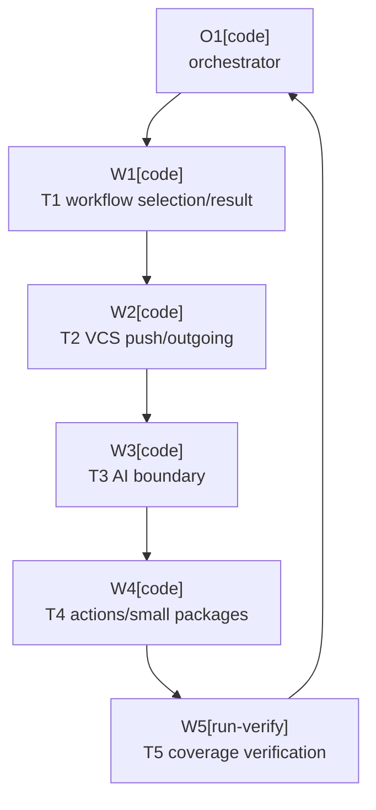

# Plan: Test Coverage Growth

Plan-ID: PLAN-test-coverage-growth

Status: Draft

Workers: 1

Filename: `.agents/plans/PLAN-test-coverage-growth.md`

## Readiness

- Plan readiness: Drafted from a full current JaCoCo coverage pass and source/test layout review; ready for maintainer review, not approved for implementation.
- Open questions: None blocking. Coverage targets are plan assumptions and can be adjusted during approval.
- Implementation progress: Not started.

## Status History

- 2026-05-24T23:01:33+02:00: none -> Draft by OpenAI Codex <codex@openai.com>; plan created from whole-codebase coverage analysis.

## Goal

Increase automated test coverage for the IntelliJ plugin codebase by adding focused behavior tests around the highest missed-line and missed-branch clusters, while preserving existing plugin behavior and commit/push safety guarantees.

Current baseline from `.\gradlew.bat test jacocoTestReport` on 2026-05-24:

| Metric      | Covered / Total | Coverage | Missed |
|-------------|-----------------|----------|--------|
| Line        | 2161 / 2981     | 72.5%    | 820    |
| Branch      | 751 / 1152      | 65.2%    | 401    |
| Instruction | 10280 / 14383   | 71.5%    | 4103   |

Package concentration:

| Package                                        | Line Coverage | Missed Lines | Branch Coverage | Missed Branches |
|------------------------------------------------|---------------|--------------|-----------------|-----------------|
| `pl.devopssolutions.aicommitall.workflow`      | 62.0%         | 337          | 62.0%           | 108             |
| `pl.devopssolutions.aicommitall.vcs`           | 65.6%         | 221          | 51.0%           | 149             |
| `pl.devopssolutions.aicommitall.ai`            | 73.2%         | 159          | 77.3%           | 56              |
| `pl.devopssolutions.aicommitall.actions`       | 88.0%         | 85           | 70.1%           | 69              |
| `pl.devopssolutions.aicommitall.settings`      | 91.4%         | 11           | 77.9%           | 19              |
| `pl.devopssolutions.aicommitall.notifications` | 68.4%         | 6            | 100.0%          | 0               |

Target outcome for this plan:

- Raise actual coverage to at least 78% line and 70% branch coverage.
- Stretch target: 80% line and 72% branch coverage if the additional tests stay deterministic and low-maintenance.
- Keep `verifyJacocoCoverageReport` thresholds unchanged in this plan unless the maintainer explicitly approves a validation-policy change after the measured result.

## Non-Goals

- Do not change user-visible plugin behavior.
- Do not bypass IDE commit, push, before-commit, or AI Assistant safeguards to make tests easier.
- Do not add brittle UI sleeps or real remote pushes.
- Do not raise `build.gradle.kts` coverage gates as part of this plan without explicit maintainer approval or a separate required decision.
- Do not replace manual release validation for live AI Assistant and Marketplace behavior.

## Assumptions

- Coverage growth should prioritize behavior risk and branch concentration over maximizing raw line count.
- Small internal test seams are acceptable when they preserve production defaults and remove static IntelliJ service coupling from otherwise valuable unit tests.
- Local Git repositories and deterministic fakes remain preferred over real remotes, live AI Assistant, or long-running sandbox scenarios.
- Current skipped asset-generation test remains skipped unless asset regeneration is explicitly requested.

## Open Questions

- None.

## Proposed Changes

1. Add or extend workflow tests for selection preparation and commit result registration.
2. Add or extend VCS tests for outgoing-commit status, safe immediate push decisions, push completion tracking, and Git selection service behavior.
3. Add AI integration-boundary tests for commit-message invocation data, completion service wiring, text access, and completion edge states.
4. Add action and UI branch tests for availability, data context fallback, and section-state behavior that currently remains partially covered.
5. Run the full coverage gate and record the achieved coverage in the plan result summary before any optional threshold follow-up.

Expected write areas:

- `src/test/kotlin/pl/devopssolutions/aicommitall/workflow/`
- `src/test/kotlin/pl/devopssolutions/aicommitall/vcs/`
- `src/test/kotlin/pl/devopssolutions/aicommitall/ai/`
- `src/test/kotlin/pl/devopssolutions/aicommitall/actions/`
- Narrow internal production seams under matching `src/main/kotlin/...` files only when needed for deterministic tests.

## Task Packets

### Task Packet: T1-workflow-selection-and-result-registration

Task id: T1-workflow-selection-and-result-registration

Lane: testing

Required skills:

- `plugin-test-tdd`
- `kotlin-plugin-style`

Goal:

- Add focused tests for `CommitWorkflowSelectionService` and `IntellijCommitWorkflowResultRegistrar`, the workflow files with the weakest current direct coverage.

Initial context budget:

- Read first:
  - This plan header, readiness summary, execution graph, and this task packet.
  - `src/main/kotlin/pl/devopssolutions/aicommitall/workflow/CommitWorkflowSelectionService.kt`
  - `src/main/kotlin/pl/devopssolutions/aicommitall/workflow/CommitWorkflowSelectionResult.kt`
  - `src/main/kotlin/pl/devopssolutions/aicommitall/workflow/CommitWorkflowSelectionItems.kt`
  - `src/main/kotlin/pl/devopssolutions/aicommitall/workflow/CommitWorkflowResultRegistrar.kt`
  - Existing workflow tests in `src/test/kotlin/pl/devopssolutions/aicommitall/workflow/`
- Escalate to:
  - `src/main/kotlin/pl/devopssolutions/aicommitall/vcs/GitChangeSelectionService.kt` only if a selection-service seam is needed.
  - `.agents/references/code-style.md` if adding shared test helpers.

Allowed inputs:

- Files named in `Read first`.
- Files named in `Escalate to` after an escalation trigger.

Forbidden inputs:

- Unrelated archived plans.
- Previous worker chat beyond the orchestrator handoff summary.
- Implementation evidence from unrelated task packets.

Write scope:

- `src/test/kotlin/pl/devopssolutions/aicommitall/workflow/CommitWorkflowSelectionServiceTest.kt`
- `src/test/kotlin/pl/devopssolutions/aicommitall/workflow/CommitWorkflowResultRegistrarTest.kt`
- Existing workflow test helpers only if duplication becomes material.
- `src/main/kotlin/pl/devopssolutions/aicommitall/workflow/CommitWorkflowSelectionService.kt` only for a narrow internal seam.
- `src/main/kotlin/pl/devopssolutions/aicommitall/workflow/CommitWorkflowResultRegistrar.kt` only for a narrow internal seam.

Dependencies:

- None.

Validation:

- Run targeted workflow tests added or changed by this packet.
- Run `.\gradlew.bat test --tests "pl.devopssolutions.aicommitall.workflow.*"` when practical.
- Run `.\gradlew.bat spotlessCheck` if Kotlin files changed.

Escalation triggers:

- Static IntelliJ service access prevents deterministic unit coverage.
- A fake `AbstractCommitWorkflowHandler` cannot be built without relying on unstable platform internals.
- Added seams would change observable commit workflow behavior.

Stop conditions:

- Testing `IntellijCommitWorkflowResultRegistrar` requires a full IDE fixture or platform implementation detail that is less stable than the coverage value.
- Any proposed seam would alter production behavior or bypass platform commit safeguards.

Expected output:

- Tests for missing workflow, unsupported VCS, empty selection, no owning changelist, activation failure, synchronization failure, and prepared selection paths where feasible.
- Tests for commit result listener success, success-after-refresh, cancel, failure, disposal idempotence, and failed registration where feasible.
- Coverage result delta for workflow package.

Result summary:

- Status: pending
- Worker:
- Changed files or reviewed diff:
- Validation evidence:
- Blockers:
- Review risks:
- Handoff notes:

### Task Packet: T2-vcs-push-and-outgoing-coverage

Task id: T2-vcs-push-and-outgoing-coverage

Lane: testing

Required skills:

- `plugin-test-tdd`
- `kotlin-plugin-style`

Goal:

- Add behavior tests for the VCS package branch clusters: `SafeImmediatePushService`, `GitOutgoingCommitsStatus`, `GitPushCompletionTracker`, and selection collection boundaries.

Initial context budget:

- Read first:
  - This plan header, readiness summary, execution graph, and this task packet.
  - `src/main/kotlin/pl/devopssolutions/aicommitall/vcs/SafeImmediatePushService.kt`
  - `src/main/kotlin/pl/devopssolutions/aicommitall/vcs/GitOutgoingCommitsService.kt`
  - `src/main/kotlin/pl/devopssolutions/aicommitall/vcs/GitPushCompletionService.kt`
  - `src/main/kotlin/pl/devopssolutions/aicommitall/vcs/GitChangeSelection.kt`
  - `src/main/kotlin/pl/devopssolutions/aicommitall/vcs/GitChangeSelectionService.kt`
  - Existing VCS tests in `src/test/kotlin/pl/devopssolutions/aicommitall/vcs/`
- Escalate to:
  - `src/test/kotlin/pl/devopssolutions/aicommitall/validation/LocalGitTestSupport.kt` for local-repository coverage only if fakes cannot prove the behavior.

Allowed inputs:

- Files named in `Read first`.
- Files named in `Escalate to` after an escalation trigger.

Forbidden inputs:

- Real remotes or credentials.
- Live push targets outside temporary local repositories.
- Unrelated archived plans.

Write scope:

- `src/test/kotlin/pl/devopssolutions/aicommitall/vcs/SafeImmediatePushServiceTest.kt`
- `src/test/kotlin/pl/devopssolutions/aicommitall/vcs/GitOutgoingCommitsStatusTest.kt`
- `src/test/kotlin/pl/devopssolutions/aicommitall/vcs/GitOutgoingCommitsServiceTest.kt`
- `src/test/kotlin/pl/devopssolutions/aicommitall/vcs/GitPushCompletionServiceTest.kt`
- `src/test/kotlin/pl/devopssolutions/aicommitall/vcs/GitChangeSelectionServiceTest.kt`
- Narrow internal production seams in matching VCS services only if deterministic tests need them.

Dependencies:

- None.

Validation:

- Run targeted VCS tests added or changed by this packet.
- Run `.\gradlew.bat test --tests "pl.devopssolutions.aicommitall.vcs.*"` when practical.
- Run `.\gradlew.bat spotlessCheck` if Kotlin files changed.

Escalation triggers:

- A coverage target requires exercising private IntelliJ environment adapters instead of the existing injected environment interfaces.
- A local Git fixture is needed to prove path, staged-state, or upstream behavior that fakes cannot model safely.

Stop conditions:

- A test would push to a real remote.
- A test depends on timing sleeps instead of deterministic scheduler handles.
- Additional coverage would mostly exercise platform internals rather than repository behavior.

Expected output:

- Tests for loader-failure, unchanged-cache, throttle, pending-refresh, and action-refresh branches in `GitOutgoingCommitsStatus`.
- Tests for empty repository waits, listener registration/removal, dispose cancellation, irrelevant repository events, duplicate completion events, and every successful push result type in `GitPushCompletionTracker`.
- Tests for affected-path extraction from before/after revisions, resolved conflicts, staging-area paths, duplicates, outgoing-only filtering, null push specs, unsafe filtered states, and push invocation failure propagation in `SafeImmediatePushService`.
- Coverage result delta for VCS package.

Result summary:

- Status: pending
- Worker:
- Changed files or reviewed diff:
- Validation evidence:
- Blockers:
- Review risks:
- Handoff notes:

### Task Packet: T3-ai-boundary-coverage

Task id: T3-ai-boundary-coverage

Lane: testing

Required skills:

- `plugin-test-tdd`
- `kotlin-plugin-style`

Goal:

- Cover AI integration-boundary paths with deterministic fakes, focusing on `AiGenerationCompletion.kt` and `AiCommitMessageActionInvocationContext.kt`.

Initial context budget:

- Read first:
  - This plan header, readiness summary, execution graph, and this task packet.
  - `src/main/kotlin/pl/devopssolutions/aicommitall/ai/AiGenerationCompletion.kt`
  - `src/main/kotlin/pl/devopssolutions/aicommitall/ai/AiCommitMessageActionInvocationContext.kt`
  - `src/main/kotlin/pl/devopssolutions/aicommitall/ai/CommitMessageUiAccessors.kt`
  - Existing AI tests in `src/test/kotlin/pl/devopssolutions/aicommitall/ai/`
- Escalate to:
  - `src/main/kotlin/pl/devopssolutions/aicommitall/workflow/AiCommitAllWorkflowCoordinator.kt` only if workflow calls expose an uncovered AI result path that is better tested at runner level.

Allowed inputs:

- Files named in `Read first`.
- Files named in `Escalate to` after an escalation trigger.

Forbidden inputs:

- Proprietary AI Assistant classes.
- Live AI Assistant execution.
- Unrelated archived plans.

Write scope:

- `src/test/kotlin/pl/devopssolutions/aicommitall/ai/AiGenerationCompletionObserverTest.kt`
- `src/test/kotlin/pl/devopssolutions/aicommitall/ai/AiGenerationCompletionServiceTest.kt`
- `src/test/kotlin/pl/devopssolutions/aicommitall/ai/AiCommitMessageActionInvocationContextFactoryTest.kt`
- `src/test/kotlin/pl/devopssolutions/aicommitall/ai/CommitMessageUiReaderTest.kt`
- Narrow AI test helpers only when shared across these tests.

Dependencies:

- None.

Validation:

- Run targeted AI tests added or changed by this packet.
- Run `.\gradlew.bat test --tests "pl.devopssolutions.aicommitall.ai.*"` when practical.
- Run `.\gradlew.bat spotlessCheck` if Kotlin files changed.

Escalation triggers:

- A proposed test duplicates an existing observer case without adding a new branch or behavior invariant.
- An uncovered line is a platform adapter that cannot be tested without a live AI Assistant dependency.

Stop conditions:

- A test requires compile-time dependency on proprietary AI Assistant APIs.
- A test relies on wall-clock sleeps instead of injected time source and sleeper fakes.

Expected output:

- Tests for service wrapper wiring, default option normalization, text cleaner branches, focus inactive handling, user-edit signal fallback, unavailable running-signal diagnostics, parent data-context fallback, and input-event propagation.
- Coverage result delta for AI package.

Result summary:

- Status: pending
- Worker:
- Changed files or reviewed diff:
- Validation evidence:
- Blockers:
- Review risks:
- Handoff notes:

### Task Packet: T4-actions-and-small-package-coverage

Task id: T4-actions-and-small-package-coverage

Lane: testing

Required skills:

- `plugin-test-tdd`
- `kotlin-plugin-style`

Goal:

- Close low-risk branch gaps in action availability, control state, settings, notifications, and the plugin marker where tests can remain small and stable.

Initial context budget:

- Read first:
  - This plan header, readiness summary, execution graph, and this task packet.
  - `src/main/kotlin/pl/devopssolutions/aicommitall/actions/AiCommitAllActions.kt`
  - `src/main/kotlin/pl/devopssolutions/aicommitall/actions/AiCommitAllShortcutActions.kt`
  - `src/main/kotlin/pl/devopssolutions/aicommitall/actions/AiCommitAllThreeSectionControl.kt`
  - `src/main/kotlin/pl/devopssolutions/aicommitall/settings/AiCommitAllConfigurable.kt`
  - Existing action and settings tests in `src/test/kotlin/pl/devopssolutions/aicommitall/actions/` and `src/test/kotlin/pl/devopssolutions/aicommitall/settings/`
- Escalate to:
  - `src/main/resources/META-INF/plugin.xml` only if a registration assertion is affected.

Allowed inputs:

- Files named in `Read first`.
- Files named in `Escalate to` after an escalation trigger.

Forbidden inputs:

- Visual asset regeneration unless explicitly requested.
- Live IDE screenshots.
- Unrelated archived plans.

Write scope:

- Existing action tests under `src/test/kotlin/pl/devopssolutions/aicommitall/actions/`
- Existing settings tests under `src/test/kotlin/pl/devopssolutions/aicommitall/settings/`
- Small new tests for `AiCommitAllPluginMarker` or notification branches only if they add meaningful coverage.

Dependencies:

- None.

Validation:

- Run targeted action/settings tests added or changed by this packet.
- Run `.\gradlew.bat test --tests "pl.devopssolutions.aicommitall.actions.*" --tests "pl.devopssolutions.aicommitall.settings.*"` when practical.
- Run `.\gradlew.bat spotlessCheck` if Kotlin files changed.

Escalation triggers:

- A control-rendering branch requires pixel assertions beyond existing deterministic paint helpers.
- A test would make generated asset dimensions or screenshots part of this plan.

Stop conditions:

- A proposed test is only asserting Kotlin data-class generated code without behavior value.
- A visual test is flaky across themes, fonts, or headless environments.

Expected output:

- Tests for action update branches with missing or partial providers, unknown running mode, mixed enabled/disabled availability, component fallback, keyboard/mouse paths not already covered, settings validation branch gaps, and small marker/notification lines where useful.
- Coverage result delta for actions and smaller packages.

Result summary:

- Status: pending
- Worker:
- Changed files or reviewed diff:
- Validation evidence:
- Blockers:
- Review risks:
- Handoff notes:

### Task Packet: T5-coverage-verification-and-threshold-recommendation

Task id: T5-coverage-verification-and-threshold-recommendation

Lane: review

Required skills:

- `plugin-test-tdd`
- `repository-documentation`

Goal:

- Run the complete coverage validation, record measured results, and recommend whether a later threshold update is justified.

Initial context budget:

- Read first:
  - This plan header, readiness summary, execution graph, and this task packet.
  - `build.gradle.kts`
  - `README.md`
  - `build/reports/jacoco/test/jacocoTestReport.xml` after T1 through T4 complete.
- Escalate to:
  - `.agents/references/documentation.md` only if updating documentation.
  - `docs/decisions/README.md` only if the maintainer explicitly asks to raise coverage gates and that is treated as a validation-policy change.

Allowed inputs:

- Files named in `Read first`.
- Files named in `Escalate to` after an escalation trigger.

Forbidden inputs:

- Threshold changes without explicit maintainer approval.
- Changelog entries unless a public plugin-facing behavior or release artifact changes.

Write scope:

- This plan file result summaries and handoff notes.
- No `build.gradle.kts` or `README.md` edits unless explicitly approved after measured coverage results.

Dependencies:

- T1, T2, T3, and T4 complete or intentionally skipped with reasons.

Validation:

- Run `.\gradlew.bat test jacocoTestReport verifyJacocoCoverageReport`.
- Run `.\gradlew.bat spotlessCheck` if Kotlin files changed.
- Run `pwsh -NoProfile -ExecutionPolicy Bypass -File scripts/validate-docs.ps1` if this plan or docs are updated.
- Run `pwsh -NoProfile -ExecutionPolicy Bypass -File scripts/ai/validate-agent-artifacts.ps1` if `.agents/` artifacts are updated.
- Run `git diff --check`.

Escalation triggers:

- Coverage target is missed after deterministic tests are added.
- Coverage gain comes mostly from low-value generated or platform-adapter code.
- The maintainer requests a threshold increase.

Stop conditions:

- Full test suite or coverage report is failing.
- A threshold update would require ADR or explicit decision that has not been accepted.

Expected output:

- Final line and branch coverage numbers.
- List of task packets completed, skipped, and why.
- Recommendation for future coverage gates, if any.
- Remaining manual or fixture coverage gaps.

Result summary:

- Status: pending
- Worker:
- Changed files or reviewed diff:
- Validation evidence:
- Blockers:
- Review risks:
- Handoff notes:

## Execution Model

- `Workers: 1`; execute packets sequentially unless the maintainer explicitly approves parallel sub-agent work later.
- T1 through T4 are independent enough to reorder, but T5 must run last.
- Approved-plan execution in this repository normally requires fresh sub-agent task workers. If the active tool contract does not authorize sub-agents at implementation time, stop before implementation and ask for explicit delegation approval.
- Keep production changes limited to internal test seams that preserve existing defaults.
- Commit each completed approved-plan task separately when commits are requested or required by the active execution rules.

## Execution Graph

## Validation

Planning validation:

- `.\gradlew.bat test jacocoTestReport`
- `pwsh -NoProfile -ExecutionPolicy Bypass -File scripts/validate-docs.ps1`
- `pwsh -NoProfile -ExecutionPolicy Bypass -File scripts/ai/validate-agent-artifacts.ps1`
- `git diff --check`

Implementation validation:

- Packet-specific targeted tests from `## Task Packets`.
- Final `.\gradlew.bat test jacocoTestReport verifyJacocoCoverageReport`.
- `.\gradlew.bat spotlessCheck` for Kotlin changes.
- `git diff --check`.

## Risks

- Some missed lines are IntelliJ environment adapters; tests that mock too much platform behavior may add maintenance cost without improving confidence.
- Coverage from private platform wrappers should not displace behavior tests for commit/push safety.
- Any internal seam added for tests must keep existing production constructors and service defaults unchanged.
- Raising coverage gates may be a validation-policy change; treat that as a separate explicit approval path.

## Handoff Notes

- Current high-value coverage targets by missed lines are `AiCommitAllWorkflowCoordinator.kt` (91), `AiGenerationCompletion.kt` (66), `CommitWorkflowSelectionService.kt` (58), `SafeImmediatePushService.kt` (55), `GitPushCompletionService.kt` (52), `ReflectiveCommitWorkflowSynchronizer.kt` (47), `GitOutgoingCommitsService.kt` (46), `GitStageConfirmation.kt` (45), `AiCommitAllActions.kt` (39), `AiCommitMessageActionInvocationContext.kt` (39), `GitChangeSelectionService.kt` (39), and `CommitWorkflowResultRegistrar.kt` (32).
- The current suite has broad workflow behavior coverage already (`287` passing, `1` pending), so avoid duplicating existing happy paths.
- The best expected return is from service edge cases, scheduler/timeout behavior, failure branches, and deterministic fakes around existing injection points.
