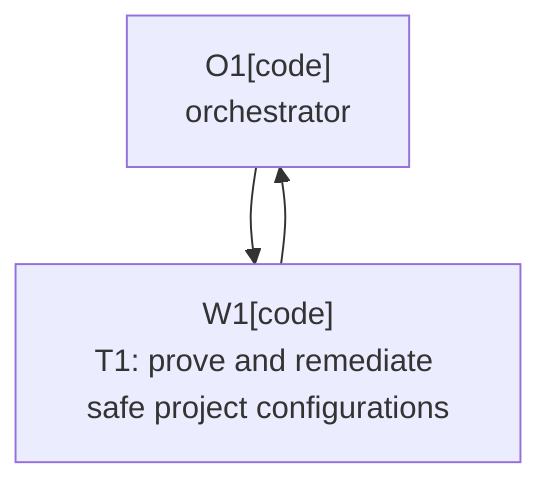

# Plan: Transitive Build Dependency Remediation

Plan-ID: PLAN-transitive-build-dependency-remediation

Status: In Progress

Workers: 1

Filename: `.agents/plans/PLAN-transitive-build-dependency-remediation.md`

## Readiness

- Plan readiness: Approved and executing.
- Approved by: Kamil Kiewisz <kamkie@outlook.com>
- Approved at: 2026-07-30T20:39:23+02:00
- Open questions: None.
- Implementation progress: T1 dispatch is starting after PR #41 merged.

## Status History

- 2026-07-30T18:58:43+02:00: none -> Draft by Codex <codex@openai.com>; investigation established the alert families, upstream dependency paths, and compatibility-sensitive remediation boundary.
- 2026-07-30T20:39:23+02:00: Draft -> Approved by Kamil Kiewisz <kamkie@outlook.com>; the maintainer explicitly approved PR #42 and authorized autonomous implementation.
- 2026-07-30T20:39:24+02:00: Approved -> In Progress by Codex <codex@openai.com>; autonomous approved-plan execution started after confirming PR #41 was merged.

## Goal

Reduce the repository's 19 open transitive Dependabot alerts wherever patched versions can be applied safely to build and integration-test configurations, while preserving IntelliJ IDE Starter compatibility and reporting upstream-only alerts accurately.

## Investigation Findings

- GitHub reports 19 open Gradle alerts in `settings.gradle.kts`: 7 high and 12 medium.
- The alert families are:
  - 9 Netty alerts, patched in `4.2.16.Final`.
  - 7 Jackson 2 alerts, requiring patched releases through `2.21.5`.
  - 1 Jackson 3 alert, patched in `3.1.5`.
  - 1 OpenTelemetry API alert, patched in `1.62.0`.
  - 1 LZ4 alert, patched in `1.11.1`.
- The dependencies are build or integration-test tooling and are not packaged in the distributed plugin.
- JetBrains IDE Starter `262.8665.337`, used by IntelliJ IDEA 2026.2.0.1, still declares Netty `4.2.15.Final`, Jackson 2 `2.19.0`, Jackson 3 `3.1.4`, OpenTelemetry `1.48.0`, and LZ4 `1.11.0`.
- JetBrains IntelliJ Platform Gradle Plugin `2.18.1` also reaches Jackson 2 `2.20.2` through its own settings/build plugin classpath. Ordinary project dependency constraints cannot replace that settings-plugin dependency.
- GitHub's Gradle dependency-submission action supports configuration filters, but filtering out build or test dependencies would hide executable supply-chain dependencies rather than remediate them. This plan does not use filtering or alert dismissal as a fix.

Primary evidence:

- [Dependabot alerts](https://github.com/kamkie/intellij-ai-commit-all-plugin/security/dependabot)
- [IDE Starter 262.8665.337 POM](https://www.jetbrains.com/intellij-repository/releases/com/jetbrains/intellij/tools/ide-starter-squashed/262.8665.337/ide-starter-squashed-262.8665.337.pom)
- [IntelliJ Platform Gradle Plugin 2.18.1 POM](https://plugins.gradle.org/m2/org/jetbrains/intellij/platform/intellij-platform-gradle-plugin/2.18.1/intellij-platform-gradle-plugin-2.18.1.pom)
- [Gradle dependency-submission inputs](https://github.com/gradle/actions/blob/main/dependency-submission/action.yml)

## Non-Goals

- Do not change plugin runtime behavior or the IntelliJ 2026.2 support baseline.
- Do not add dependencies to the packaged plugin.
- Do not exclude configurations merely to suppress GitHub alerts.
- Do not dismiss alerts through the GitHub API.
- Do not force versions across every Gradle configuration.
- Do not upgrade unrelated dependencies or refactor the build.

## Assumptions

- Upgrade PR #41 lands before implementation, so dependency probes use IntelliJ IDEA 2026.2.0.1 build `262.8665.337`.
- Patched minimum versions are preferred over newer unrelated releases.
- An alert remains open when its only safe remedy is an upstream JetBrains update.
- A constraint is retained only when dependency insight proves its scope and the full relevant validation remains compatible.

## Open Questions

None. Any new incompatibility or broader remediation choice stops implementation and returns the plan to maintainer review.

## Proposed Changes

### T1: Prove and remediate safe project configurations

1. Capture sequential `dependencyInsight` evidence for every alert family on the integration-test runtime and any other affected project configuration.
2. Add the smallest constraints limited to configurations that execute IntelliJ IDE Starter or integration tests.
3. Evaluate these patched minimums independently so one incompatible family does not block safer fixes:
   - Netty BOM `4.2.16.Final`.
   - Jackson 3 BOM `3.1.5`.
   - LZ4 `1.11.1`.
   - OpenTelemetry BOM `1.62.0`.
   - Jackson 2 BOM `2.21.5` only where it does not attempt to alter the settings-plugin classpath.
4. Remove any constraint that does not affect the vulnerable resolution path or that destabilizes IDE Starter.
5. Preserve unresolved settings-plugin alerts as upstream findings; do not hide or dismiss them.

Expected implementation files:

- `build.gradle.kts`
- `gradle.properties` only if named version properties make the retained constraints clearer
- This plan and `.agents/plans/README.md` for lifecycle and result metadata

## Task Packets

### Task Packet: T1-prove-and-remediate-safe-project-configurations

Task id: T1-prove-and-remediate-safe-project-configurations

Lane: implementation

Required skills:

- `gh-fix-ci-security-quality`
- `intellij-plugin-development`
- `platform-docs-research`

Goal:

- Apply only compatibility-proven patched versions to affected project configurations, validate them, and distinguish remediated alerts from upstream-only settings-plugin alerts.

Initial context budget:

- Read first:
  - This plan's header, readiness summary, execution graph, and this task packet.
  - `AGENTS.md`.
  - `build.gradle.kts`.
  - `gradle.properties`.
  - `settings.gradle.kts`.
  - `.github/workflows/dependency-submission.yml`.
  - `docs/decisions/adr-0089-advance-minimum-intellij-platform-to-2026-2.md`.
  - `.agents/references/testing.md`.
  - `.agents/references/reviews.md`.
- Escalate to:
  - JetBrains or Gradle primary dependency metadata for a conflicting resolution.
  - `.agents/references/troubleshooting.md` for a validation failure.

Allowed inputs:

- Files and artifacts named in `Read first`.
- Current GitHub Dependabot alert data and dependency-graph SBOM.
- Files and sources named in `Escalate to` only after an escalation trigger fires.

Forbidden inputs:

- Unrelated archived plans.
- Previous worker chat beyond the orchestrator handoff summary.
- Unrelated source or product documentation.

Write scope:

- `build.gradle.kts`
- `gradle.properties`
- `.agents/plans/PLAN-transitive-build-dependency-remediation.md`
- `.agents/plans/README.md`

Dependencies:

- PR #41 merged into `main`.
- Explicit maintainer approval recorded in this plan.

Validation:

- Run sequential `dependencyInsight` checks for Netty, Jackson 2, Jackson 3, OpenTelemetry, and LZ4 before and after constraints.
- Run `.\gradlew.bat --no-daemon spotlessCheck test buildPlugin verifyPlugin`.
- Run the existing IntelliJ IDEA full and PyCharm/WebStorm smoke release-matrix UI lanes on the 2026.2 release line.
- Run `pwsh -NoProfile -ExecutionPolicy Bypass -File scripts\validate-docs.ps1`.
- Run `pwsh -NoProfile -ExecutionPolicy Bypass -File scripts\ai\validate-agent-artifacts.ps1`.
- Run `git diff --check`.
- Re-run the dependency-submission workflow on the pushed branch and inspect the generated snapshot before merge.
- After merge and GitHub reprocessing, re-query open Dependabot alerts and record which findings remain upstream-only.
- Self-review that no constraint enters the packaged plugin, no configuration is filtered from dependency submission, and no alert is dismissed.

Escalation triggers:

- Escalate if a patched family changes production compile or runtime configurations.
- Escalate if IDE Starter, Plugin Verifier, or a release-matrix UI lane fails after a constraint.
- Escalate if the dependency graph reports a settings/build plugin path that project constraints cannot control.
- Escalate if a candidate requires a version newer than the first patched release.

Stop conditions:

- A constraint would alter the packaged plugin.
- Safe remediation requires dependency-submission filtering or alert dismissal.
- A JetBrains tooling dependency is binary-incompatible with its patched version.
- A new durable dependency or support policy decision is required.

Expected output:

- A minimal build-configuration diff containing only compatible constraints.
- Before-and-after dependency resolution evidence for every retained constraint.
- Validation and self-review evidence.
- A task commit and pushed pull-request head.
- A result summary distinguishing remediated and upstream-only alert families.
- No changelog entry unless implementation unexpectedly changes public plugin behavior.

Result summary:

- Status: pending
- Worker:
- Changed files or reviewed diff:
- Validation evidence:
- Self-review evidence from `.agents/references/reviews.md`:
- Commit:
- Worker events:
- Orchestrator reconciliation:
- Changelog/docs/spec/tasks updates:
- Blockers:
- Review risks:
- Handoff notes and next action:

## Execution Model

- Use one fresh implementation worker after explicit approval.
- The orchestrator owns plan status, worker reconciliation, GitHub alert rechecks, and final handoff.
- If sub-agents are unavailable or unauthorized, stop before implementation instead of executing this approved-plan task locally.
- Keep all resolution probes sequential to avoid Gradle daemon and cache contention.
- Use the current branch only.

## Long-Run Continuity

- Resume docs reread:
  - After context compaction, interruption, resume, or handoff, reread `AGENTS.md`; this plan's header, `## Readiness`, `## Long-Run Continuity`, `## Execution Model`, current task packet, and current result summary; `.agents/references/execution.md`; `.agents/references/orchestration.md`; `.agents/references/testing.md`; `.agents/references/reviews.md`; `.gitmessage` before any commit; and the next action's exact owner files.
- Current task or wave: T1-prove-and-remediate-safe-project-configurations is starting.
- Completed commits: None.
- Plan status and readiness: In Progress; approved by Kamil Kiewisz <kamkie@outlook.com> at 2026-07-30T20:39:23+02:00.
- Validation and self-review state: Investigation evidence captured; implementation validation not started.
- Worker event state: No worker dispatched.
- Orchestrator reconciliation state: Not started.
- Changelog, docs, spec, task, or plan updates: This plan and the active plan catalog only.
- Blockers or open questions: None.
- Next action: Dispatch the T1 implementation worker.
- Context handoff notes: Preserve upstream-only alerts rather than filtering or dismissing them.

## Execution Graph

## Validation

- Plan-only PR:
  - `pwsh -NoProfile -ExecutionPolicy Bypass -File scripts\validate-docs.ps1`
  - `pwsh -NoProfile -ExecutionPolicy Bypass -File scripts\ai\validate-agent-artifacts.ps1`
  - `git diff --check`
- Implementation validation is defined in task packet T1.

## Risks

- Jackson 2 and OpenTelemetry require larger minor-version jumps than the other alert families and may be binary-incompatible with JetBrains tooling.
- Settings-plugin dependencies cannot be governed by ordinary project constraints, so a truthful result may retain some alerts until JetBrains publishes an updated Gradle plugin.
- Dependency resolution passing is insufficient; IDE Starter and release-matrix UI execution must also pass.
- GitHub alert closure occurs asynchronously after an updated default-branch dependency snapshot.

## Handoff Notes

- Upgrade PR #41 is intentionally separate from this security plan.
- The investigation found no direct vulnerable dependency in the packaged plugin.
- Do not represent a reduced alert count as complete remediation while upstream-only alerts remain.
