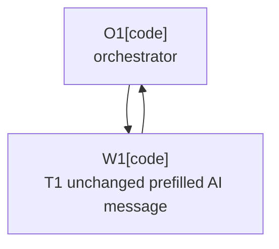

# Plan: Unchanged Prefilled AI Message

Plan-ID: PLAN-unchanged-prefilled-ai-message

Status: Draft

Workers: 1

Filename: `.agents/plans/PLAN-unchanged-prefilled-ai-message.md`

## Readiness

- Plan readiness: Draft companion plan for proposed ADR 0081; implementation is blocked until ADR 0081 is accepted and this plan is later explicitly approved.
- Open questions: None; ADR acceptance and plan approval are pending.
- Implementation progress: Not started.

## Status History

- 2026-05-24T01:28:36+02:00: none -> Draft by OpenAI Codex <codex@openai.com>; companion plan created for proposed ADR 0081.

## Goal

Implement ADR 0081 so a non-empty prefilled commit message may remain unchanged after reliable AI completion when clear-message-before-generation is disabled, while preserving fail-closed behavior for missing completion evidence and unusable AI output.

## Non-Goals

- Do not change the default clear-message setting.
- Do not accept unchanged empty messages.
- Do not bypass IDE commit checks, push safeguards, or user-edit stop behavior.
- Do not add custom confirmation UI for unchanged prefilled messages.
- Do not implement before ADR 0081 is accepted and this plan is explicitly approved.

## Assumptions

- ADR 0081 will define the accepted behavior before implementation starts.
- The existing AI completion signal remains the authority for deciding whether AI generation reliably finished.
- Documentation-only wording already in `docs/user-guide.md` remains current until the ADR is accepted and implemented.

## Open Questions

- None. If review changes ADR 0081's selected behavior, update the proposed ADR first and keep this plan in Draft.

## Proposed Changes

- Update `docs/specification.md` so REQ-AI-008 and REQ-AI-013 distinguish unchanged empty snapshots from accepted unchanged non-empty prefilled messages.
- Update AI completion result classification in `src/main/kotlin/pl/devopssolutions/aicommitall/ai/AiGenerationCompletion.kt`.
- Add or update focused tests under `src/test/kotlin/pl/devopssolutions/aicommitall/ai/`.
- Update `docs/user-guide.md` so the clear-message-disabled revise-existing-message behavior is documented only after implementation.
- Update `CHANGELOG.md` if the behavior change is notable for plugin users.
- Run focused tests, docs validation, and whitespace checks.

## Task Packets

### Task Packet: T1-unchanged-prefilled-ai-message

Task id: T1-unchanged-prefilled-ai-message

Lane: implementation

Required skills:

- `intellij-plugin-development`
- `kotlin-plugin-style`
- `plugin-test-tdd`
- `repository-documentation`

Goal:

- Implement and document ADR 0081 while preserving existing fail-closed AI generation stop paths.

Initial context budget:

- Read first:
    - Plan header, readiness summary, execution graph, and this task packet.
    - `docs/decisions/adr-0081-allow-unchanged-prefilled-ai-message-after-completion.md`
    - `docs/specification.md`
    - `docs/user-guide.md`
    - `src/main/kotlin/pl/devopssolutions/aicommitall/ai/AiGenerationCompletion.kt`
    - `src/test/kotlin/pl/devopssolutions/aicommitall/ai/AiGenerationCompletionObserverTest.kt`
- Escalate to:
    - `src/main/kotlin/pl/devopssolutions/aicommitall/workflow/AiCommitAllWorkflowCoordinator.kt` only if completion result handling requires workflow changes.
    - `src/test/kotlin/pl/devopssolutions/aicommitall/workflow/` only if workflow-level regression coverage is needed.
    - `CHANGELOG.md` only after confirming the public behavior change should be noted.

Allowed inputs:

- Files and artifacts named in `Read first`.
- Files and artifacts named in `Escalate to` only after an escalation trigger fires.

Forbidden inputs:

- Unrelated archived plans.
- Previous worker chat beyond the orchestrator handoff summary.
- Implementation evidence from unrelated task packets.

Write scope:

- `docs/specification.md`
- `docs/user-guide.md`
- `CHANGELOG.md`
- `src/main/kotlin/pl/devopssolutions/aicommitall/ai/AiGenerationCompletion.kt`
- `src/main/kotlin/pl/devopssolutions/aicommitall/workflow/AiCommitAllWorkflowCoordinator.kt`
- `src/test/kotlin/pl/devopssolutions/aicommitall/ai/`
- `src/test/kotlin/pl/devopssolutions/aicommitall/workflow/`

Dependencies:

- ADR 0081 accepted.
- This plan explicitly approved.

Validation:

- Run a red focused test before changing production code when practical.
- Run focused AI completion tests, such as `.\gradlew.bat test --tests "pl.devopssolutions.aicommitall.ai.AiGenerationCompletionObserverTest"`.
- Run broader workflow tests if workflow result handling changes.
- Run `pwsh -NoProfile -ExecutionPolicy Bypass -File scripts/validate-docs.ps1`.
- Run `git diff --check`.
- Self-review for commit/push safety, user-edit stop behavior, empty-message stop behavior, and documentation/spec alignment.

Escalation triggers:

- Load workflow sources if changing completion result types affects coordinator behavior.
- Load release guidance before updating `CHANGELOG.md`.
- Stop and return to ADR review if implementation reveals that reliable completion cannot distinguish accepted unchanged text from a silent failure.

Stop conditions:

- Stop if ADR 0081 is not accepted.
- Stop if this plan is not approved.
- Stop if a new user-facing choice appears that is not covered by ADR 0081.
- Stop if accepting unchanged prefilled text would bypass existing IDE commit safeguards or user-edit detection.

Expected output:

- Changed files.
- Validation evidence.
- Blockers.
- Review risks.
- Handoff notes.
- Suggested changelog entry only if not already applied.

Result summary:

- Status: pending
- Worker:
- Changed files or reviewed diff:
- Validation evidence:
- Blockers:
- Review risks:
- Handoff notes:

## Execution Model

- Use one implementation worker after ADR acceptance and explicit plan approval.
- Approved-plan execution requires a fresh sub-agent worker under ADR 0080.
- Keep work on the current branch.
- Commit the completed task before any later dependent plan work when commits are allowed.

## Execution Graph

## Validation

- Focused AI completion tests.
- Broader workflow tests if workflow result handling changes.
- `pwsh -NoProfile -ExecutionPolicy Bypass -File scripts/validate-docs.ps1`
- `git diff --check`

## Risks

- Accepting unchanged text too broadly could commit a stale manual message after a silent AI failure.
- Result classification changes may require notification or coordinator updates.
- Documentation can overstate behavior before implementation lands.
- Tests must prove both the accepted unchanged-prefilled path and the preserved fail-closed paths.

## Handoff Notes

- Do not implement until ADR 0081 is accepted and this plan is explicitly approved.
- Keep `docs/user-guide.md` aligned with implemented behavior, not just design intent.
