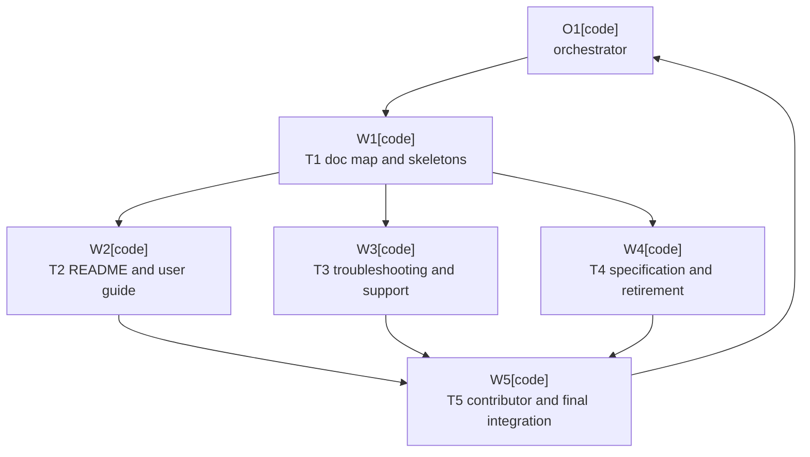

# Plan: User Documentation Rebuild

Plan-ID: PLAN-user-documentation-rebuild

Status: Implemented

Workers: 3 (parallel, tasks: T2-readme-user-guide, T3-troubleshooting-support, T4-specification-and-retirement)

Filename: `.agents/plans/PLAN-user-documentation-rebuild.md`

## Readiness

- Plan readiness: Approved; implementation may start in a separate execution pass.
- Approved by: Kamil Kiewisz <kamkie@outlook.com>
- Approved at: 2026-05-23T21:12:25+02:00
- Open questions: None.
- Implementation progress: Implemented.

## Status History

- 2026-05-23T20:52:54+02:00: none -> Draft by OpenAI Codex <codex@openai.com>; companion plan created for proposed ADR 0076.
- 2026-05-23T21:12:25+02:00: Draft -> Approved by Kamil Kiewisz <kamkie@outlook.com>; explicit user approval recorded for ADR 0076 and this companion plan.
- 2026-05-23T21:18:46+02:00: Approved -> In Progress by OpenAI Codex <codex@openai.com>; implementation started for ADR 0076 documentation rebuild.
- 2026-05-23T21:43:09+02:00: In Progress -> Implemented by OpenAI Codex <codex@openai.com>; ADR 0076 documentation ownership rebuild implemented and validated.

## Goal

Rebuild the repository's user-facing and validation documentation around the ownership model proposed in ADR 0076: concise README landing page, full user guide, user troubleshooting/FAQ, clean intended-behavior specification, separate validation evidence, contributor-focused CONTRIBUTING, support-focused `docs/SUPPORT.md`, and no standalone requested-feature inventory.

## Non-Goals

- Do not change plugin runtime behavior.
- Do not implement Marketplace description or change-notes work for `T-DOC-018` or `T-DOC-019`; leave those for a later pass after the source docs are stable.
- Do not change supported IDE scope, Git-only scope, AI Assistant dependency policy, release policy, or validation requirements.
- Do not rewrite ADR history or completed task archive entries except for mechanical link updates if validation requires them.
- Do not create a large documentation site structure beyond the pages needed for this prerelease.

## Assumptions

- ADR 0076 is accepted before this plan is approved or implemented.
- The current plugin behavior described by ADRs, `docs/specification.md`, tests, and validation records remains the source for documentation content.
- Documentation-only changes are covered by docs validation and whitespace checks.
- Screenshots or animation can be linked only when a reviewed asset exists; missing final visual assets remain a task gap rather than a blocker for the structural rebuild.

## Open Questions

- None currently. If review changes the target documentation ownership model, update the proposed ADR first and keep this plan in Draft.

## Proposed Changes

- Rebuild `README.md` as a concise landing page with links to deeper docs.
- Add `docs/user-guide.md` for full user workflow documentation.
- Add `docs/troubleshooting.md` for user-facing FAQ and problem-path guidance.
- Rewrite `docs/specification.md` so it describes intended observable behavior for validation and removes implementation mechanics from requirement wording.
- Delete `docs/requested-features.md` after migrating any still-useful traceability to `docs/decisions/README.md`, `docs/specification.md`, or task/archive refs.
- Update `CONTRIBUTING.md` to own contributor setup, validation commands, and pull-request expectations.
- Move `SUPPORT.md` to `docs/SUPPORT.md`, then link it to troubleshooting while preserving support-scope ownership.
- Update `.agents/references/documentation.md` so owner mapping and `docs/` naming guidance match ADR 0076.
- Update `TASKS.md` documentation rows so `T-DOC-017`, `T-DOC-020`, `T-DOC-022`, and `T-DOC-023` reflect the rebuilt docs, while `T-DOC-018` and `T-DOC-019` remain deferred.
- Run documentation validation and whitespace checks.

## Task Packets

### Task Packet: T1-doc-map-and-skeletons

Task id: T1-doc-map-and-skeletons

Lane: implementation

Required skills:

- repository-documentation

Goal:

- Establish the target documentation structure and minimal skeletons so later content work has stable paths and ownership.

Initial context budget:

- Read first:
    - Plan header, readiness summary, execution graph, and this task packet.
    - `docs/decisions/adr-0076-separate-user-docs-intent-specification-and-validation.md`
    - `.agents/references/documentation.md`
    - `README.md`
    - `CONTRIBUTING.md`
    - `SUPPORT.md`
    - `docs/specification.md`
    - `docs/requested-features.md`
- Escalate to:
    - `TASKS.md` only when task refs need wording updates.
    - `docs/validation/manual-sandbox.md` and `docs/scenario-coverage.md` only when links or validation-owner text must be aligned.

Allowed inputs:

- Files and artifacts named in `Read first`.
- Files and artifacts named in `Escalate to` only after an escalation trigger fires.

Forbidden inputs:

- Unrelated archived plans.
- Previous worker chat beyond the orchestrator handoff summary.
- Implementation evidence from unrelated task packets.

Write scope:

- `docs/user-guide.md`
- `docs/troubleshooting.md`
- `.agents/references/documentation.md`
- `TASKS.md`

Dependencies:

- ADR 0076 accepted and this plan approved.

Validation:

- Review skeleton headings against ADR 0076.
- `pwsh -NoProfile -ExecutionPolicy Bypass -File scripts/validate-docs.ps1`
- `git diff --check`

Escalation triggers:

- Update `TASKS.md` only if the new docs make existing documentation tasks stale.
- Load validation docs only if skeleton links refer to validation evidence.

Stop conditions:

- Stop if ADR 0076 is not accepted.
- Stop if the target documentation ownership model changes during review.

Expected output:

- Changed files.
- Validation evidence.
- Blockers.
- Review risks.
- Handoff notes.

Result summary:

- Status: completed
- Worker: OpenAI Codex orchestrator
- Changed files or reviewed diff: `.agents/references/documentation.md`, `TASKS.md`
- Validation evidence: final `pwsh -NoProfile -ExecutionPolicy Bypass -File scripts\validate-docs.ps1`, `pwsh -NoProfile -ExecutionPolicy Bypass -File scripts\ai\validate-agent-artifacts.ps1`, and `git diff --check` passed.
- Blockers: none.
- Review risks: ownership mapping moved support policy to `docs/SUPPORT.md`; root `SUPPORT.md` has since been removed.
- Handoff notes: documentation owner map now matches ADR 0076 naming and ownership rules; task rows were reconciled during final integration.

### Task Packet: T2-readme-user-guide

Task id: T2-readme-user-guide

Lane: implementation

Required skills:

- repository-documentation

Goal:

- Rebuild `README.md` as the concise landing page and fill `docs/user-guide.md` with the complete user workflow.

Initial context budget:

- Read first:
    - Plan header, readiness summary, execution graph, and this task packet.
    - `docs/decisions/adr-0076-separate-user-docs-intent-specification-and-validation.md`
    - `README.md`
    - `docs/user-guide.md`
    - `docs/specification.md`
    - `docs/concepts/graphics/README.md`
    - `src/main/resources/META-INF/plugin.xml`
- Escalate to:
    - `docs/validation/manual-sandbox.md` only to avoid claiming visual validation beyond current evidence.
    - `TASKS.md` only for `T-DOC-020` or `T-DOC-023` wording updates.

Allowed inputs:

- Files and artifacts named in `Read first`.
- Files and artifacts named in `Escalate to` only after an escalation trigger fires.

Forbidden inputs:

- Unrelated archived plans.
- Previous worker chat beyond the orchestrator handoff summary.
- Implementation evidence from unrelated task packets.

Write scope:

- `README.md`
- `docs/user-guide.md`
- `TASKS.md`

Dependencies:

- T1-doc-map-and-skeletons.

Validation:

- Confirm README remains a landing page and does not duplicate full user guide content.
- Confirm shortcut wording is backed by `plugin.xml` or explicitly marked as keymap-specific.
- `pwsh -NoProfile -ExecutionPolicy Bypass -File scripts/validate-docs.ps1`
- `git diff --check`

Escalation triggers:

- Load validation records before adding screenshots, animation, or final visual-state claims.
- Escalate to the maintainer if macOS shortcut wording cannot be confirmed from repo evidence.

Stop conditions:

- Stop if the README would need to claim Marketplace availability before publication.
- Stop if final visual assets are missing and the task would otherwise imply they exist.

Expected output:

- Changed files.
- Validation evidence.
- Blockers.
- Review risks.
- Handoff notes.

Result summary:

- Status: completed
- Worker: worker Sartre
- Changed files or reviewed diff: `README.md`, `docs/user-guide.md`
- Validation evidence: worker reported `pwsh -NoProfile -ExecutionPolicy Bypass -File scripts/validate-docs.ps1` and `git diff --check`; final orchestrator validation repeated docs, agent-artifact, and whitespace checks.
- Blockers: none.
- Review risks: macOS shortcut wording remains keymap-specific because `plugin.xml` only declares default Windows/Linux keymap bindings.
- Handoff notes: README is a concise landing page; `docs/user-guide.md` owns the full task-oriented user workflow.

### Task Packet: T3-troubleshooting-support

Task id: T3-troubleshooting-support

Lane: implementation

Required skills:

- repository-documentation

Goal:

- Create user-facing troubleshooting and FAQ guidance, then move and align `docs/SUPPORT.md` without duplicating the full FAQ.

Initial context budget:

- Read first:
    - Plan header, readiness summary, execution graph, and this task packet.
    - `docs/decisions/adr-0076-separate-user-docs-intent-specification-and-validation.md`
    - `docs/troubleshooting.md`
    - `SUPPORT.md`
    - `README.md`
    - `docs/specification.md`
- Escalate to:
    - `docs/validation/manual-sandbox.md` only when troubleshooting text needs current manual coverage status.
    - `TASKS.md` only for `T-DOC-022` wording updates.

Allowed inputs:

- Files and artifacts named in `Read first`.
- Files and artifacts named in `Escalate to` only after an escalation trigger fires.

Forbidden inputs:

- Unrelated archived plans.
- Previous worker chat beyond the orchestrator handoff summary.
- Implementation evidence from unrelated task packets.

Write scope:

- `docs/troubleshooting.md`
- `SUPPORT.md`
- `docs/SUPPORT.md`
- `README.md`
- `TASKS.md`

Dependencies:

- T1-doc-map-and-skeletons.

Validation:

- Confirm troubleshooting covers missing or disabled AI Assistant, AI timeout, hidden or disabled controls, push fallback, outgoing-only push stops, unresolved conflicts, and background VCS operation states.
- Confirm `docs/SUPPORT.md` remains support scope and reporting guidance, not a duplicate user guide.
- `pwsh -NoProfile -ExecutionPolicy Bypass -File scripts/validate-docs.ps1`
- `git diff --check`

Escalation triggers:

- Escalate to specification if a troubleshooting item implies behavior not currently specified.
- Escalate to maintainer if support promises would change.

Stop conditions:

- Stop if a new support promise or behavior claim would require a separate ADR.

Expected output:

- Changed files.
- Validation evidence.
- Blockers.
- Review risks.
- Handoff notes.

Result summary:

- Status: completed
- Worker: worker Beauvoir
- Changed files or reviewed diff: `docs/troubleshooting.md`, `docs/SUPPORT.md`, `SUPPORT.md`
- Validation evidence: worker reported `pwsh -NoProfile -ExecutionPolicy Bypass -File scripts/validate-docs.ps1` and scoped `git diff --check`; final orchestrator validation repeated docs, agent-artifact, and whitespace checks.
- Blockers: none.
- Review risks: support promises were preserved; future support-scope changes must update `docs/SUPPORT.md`.
- Handoff notes: troubleshooting owns FAQ/problem paths; support policy owns scope, reporting, privacy, and out-of-scope cases.

### Task Packet: T4-specification-and-retirement

Task id: T4-specification-and-retirement

Lane: implementation

Required skills:

- repository-documentation

Goal:

- Rewrite `docs/specification.md` as a clean intended-observable-behavior validation contract and retire the standalone requested-feature inventory.

Initial context budget:

- Read first:
    - Plan header, readiness summary, execution graph, and this task packet.
    - `docs/decisions/adr-0076-separate-user-docs-intent-specification-and-validation.md`
    - `docs/specification.md`
    - `docs/requested-features.md`
    - `docs/scenario-coverage.md`
    - `docs/validation/manual-sandbox.md`
- Escalate to:
    - Specific ADR files only when requirement source wording is unclear.
    - `TASKS_ARCHIVE.md` only when existing `Implements:` refs must be preserved or checked.

Allowed inputs:

- Files and artifacts named in `Read first`.
- Files and artifacts named in `Escalate to` only after an escalation trigger fires.

Forbidden inputs:

- Unrelated archived plans.
- Previous worker chat beyond the orchestrator handoff summary.
- Implementation evidence from unrelated task packets.

Write scope:

- `docs/specification.md`
- `docs/requested-features.md`
- `docs/scenario-coverage.md`
- `docs/validation/manual-sandbox.md`

Dependencies:

- T1-doc-map-and-skeletons.

Validation:

- Confirm requirement refs remain stable.
- Confirm implementation details are removed from requirement wording or moved to an appropriate owner.
- Confirm validation links remain accurate.
- Confirm `docs/requested-features.md` has no remaining active inbound links before deletion.
- `pwsh -NoProfile -ExecutionPolicy Bypass -File scripts/validate-docs.ps1`
- `git diff --check`

Escalation triggers:

- Load specific ADRs only when `Source:` or intended behavior is ambiguous.
- Escalate if a requirement appears to describe current implementation rather than intended behavior and no owner exists for the detail.

Stop conditions:

- Stop if rewriting a requirement would change intended behavior rather than documentation ownership.
- Stop if requirement traceability cannot be preserved through ADR, specification, task, or validation refs.

Expected output:

- Changed files.
- Validation evidence.
- Blockers.
- Review risks.
- Handoff notes.

Result summary:

- Status: completed
- Worker: worker Noether
- Changed files or reviewed diff: `docs/specification.md`, deleted `docs/requested-features.md`
- Validation evidence: worker reported `pwsh -NoProfile -ExecutionPolicy Bypass -File scripts/validate-docs.ps1` and scoped `git diff --check`; final orchestrator validation repeated docs, agent-artifact, and whitespace checks.
- Blockers: none.
- Review risks: historical ADRs still mention the retired requested-feature inventory as part of their accepted context; active user and contributor docs no longer link to it.
- Handoff notes: specification now owns observable behavior requirements and traceability without duplicating user-guide or implementation mechanics.

### Task Packet: T5-contributor-and-final-integration

Task id: T5-contributor-and-final-integration

Lane: implementation

Required skills:

- repository-documentation

Goal:

- Align contributor docs, integrate cross-links, update task status, and run final documentation validation and self-review.

Initial context budget:

- Read first:
    - Plan header, readiness summary, execution graph, all task result summaries, and this task packet.
    - `CONTRIBUTING.md`
    - `README.md`
    - `docs/user-guide.md`
    - `docs/troubleshooting.md`
    - `docs/specification.md`
    - `docs/SUPPORT.md`
    - `TASKS.md`
- Escalate to:
    - `.agents/references/documentation.md` if owner mappings changed.
    - `CHANGELOG.md` only if public plugin docs changed in a way the release notes should mention.

Allowed inputs:

- Files and artifacts named in `Read first`.
- Files and artifacts named in `Escalate to` only after an escalation trigger fires.

Forbidden inputs:

- Unrelated archived plans.
- Previous worker chat beyond the orchestrator handoff summary.

Write scope:

- `CONTRIBUTING.md`
- `README.md`
- `docs/user-guide.md`
- `docs/troubleshooting.md`
- `docs/specification.md`
- `docs/SUPPORT.md`
- `.agents/references/documentation.md`
- `TASKS.md`
- `CHANGELOG.md`

Dependencies:

- T2-readme-user-guide.
- T3-troubleshooting-support.
- T4-specification-and-retirement.

Validation:

- `pwsh -NoProfile -ExecutionPolicy Bypass -File scripts/validate-docs.ps1`
- `git diff --check`
- Self-review for stale links, duplicated ownership, unsupported Marketplace claims, and user-facing behavior claims not backed by specification or validation evidence.

Escalation triggers:

- Update `CHANGELOG.md` only if the final public documentation change is notable under repository changelog rules.
- Escalate if task completion should archive `T-DOC` rows but validation evidence is incomplete.

Stop conditions:

- Stop if any task introduced a behavior claim that conflicts with ADRs or the specification.
- Stop if validation fails for reasons that require code or validator changes outside this plan.

Expected output:

- Changed files.
- Validation evidence.
- Blockers.
- Review risks.
- Handoff notes.
- Suggested changelog entry only if public documentation changes require one.

Result summary:

- Status: completed
- Worker: OpenAI Codex orchestrator
- Changed files or reviewed diff: `CONTRIBUTING.md`, `README.md`, `docs/user-guide.md`, `docs/troubleshooting.md`, `docs/specification.md`, `docs/SUPPORT.md`, `.agents/references/documentation.md`, `.agents/references/releases.md`, `.agents/prompts/release-readiness.md`, `.agents/skills/repository-documentation/SKILL.md`, `.agents/skills/platform-docs-research/SKILL.md`, `.github/ISSUE_TEMPLATE/config.yml`, `SECURITY.md`, `TASKS.md`, `TASKS_ARCHIVE.md`, `CHANGELOG.md`, `docs/decisions/README.md`
- Validation evidence: `pwsh -NoProfile -ExecutionPolicy Bypass -File scripts\validate-docs.ps1`, `pwsh -NoProfile -ExecutionPolicy Bypass -File scripts\ai\validate-agent-artifacts.ps1`, and `git diff --check` passed.
- Blockers: none.
- Review risks: `T-DOC-018`, `T-DOC-019`, `T-DOC-020`, and `T-DOC-023` remain open or deferred follow-ups; no Marketplace publication or final screenshot claim was added.
- Handoff notes: active links were reconciled to `docs/SUPPORT.md`; `docs/requested-features.md` is retired; ADR implementation tracker and changelog were updated.

## Execution Model

- Use a sequential setup task, then parallel documentation rewrite tasks with disjoint primary ownership, then a final integration task.
- Use a fresh task worker per task when delegation is available.
- The orchestrator owns final link reconciliation, validation evidence, task status updates, and handoff.
- Work stays on the current branch.

## Execution Graph

## Validation

- `pwsh -NoProfile -ExecutionPolicy Bypass -File scripts/validate-docs.ps1`
- `git diff --check`
- Run `pwsh -NoProfile -ExecutionPolicy Bypass -File scripts/ai/validate-agent-artifacts.ps1` if `.agents/` references or this plan are updated during implementation.

## Risks

- The specification rewrite can accidentally change behavior instead of documentation wording.
- README can grow too large if it absorbs user guide or troubleshooting content.
- Troubleshooting can duplicate support policy if ownership is not kept clear.
- Marketplace claims can appear before publication if release status is not reviewed carefully.
- Cross-links can drift across README, user guide, troubleshooting, support, specification, requested features, validation records, and tasks.

## Handoff Notes

- `T-DOC-018` and `T-DOC-019` are intentionally deferred until this plan lands.
- Treat screenshots or animation as user-facing assets only after they are reviewed as current production UI evidence.
- Do not implement until ADR 0076 is accepted and this plan is explicitly approved.
