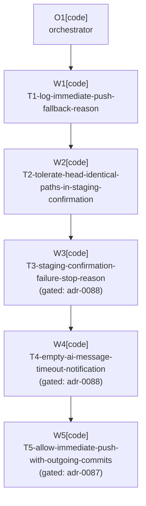

# Plan: Workflow Stop Feedback And Push Alignment

Plan-ID: PLAN-workflow-stop-feedback-and-push-alignment

Status: Implemented

Workers: 1

Filename: `.agents/plans/PLAN-workflow-stop-feedback-and-push-alignment.md`

## Readiness

- Plan readiness: Ready; adr-0087 and adr-0088 accepted 2026-06-11, plan explicitly approved by the user in the same request ("accept and implement adr's and plan").
- Approved by: Kamil Kiewisz <kamkie@outlook.com>
- Approved at: 2026-06-11T23:25:00+02:00
- Open questions: None; user decisions recorded on 2026-06-11 (notify and log first, conservative staging fix with stronger fallback in `TASKS.md` T-BUG-017, align commit-and-push with outgoing-only push policy, report AI-caused empty messages as generation failure).
- Implementation progress: all five tasks implemented, validated, and committed; full `.\gradlew.bat check` passed (429 tests, 1 pre-existing skip).

## Status History

- 2026-06-11T23:15:00+02:00: none -> Draft by Claude Fable 5 <noreply@anthropic.com>; companion draft plan created with proposed adr-0087 and adr-0088 from the June 2026 IDE-log investigation.
- 2026-06-11T23:25:00+02:00: Draft -> Approved by Kamil Kiewisz <kamkie@outlook.com>; explicit user approval together with adr-0087 and adr-0088 acceptance.
- 2026-06-11T23:26:00+02:00: Approved -> In Progress by Claude Fable 5 <noreply@anthropic.com>; sequential sub-agent task execution started with T1.
- 2026-06-12T01:05:00+02:00: In Progress -> Implemented by Claude Fable 5 <noreply@anthropic.com>; T1-T5 committed with per-task validation and the full Gradle check passed.

## Goal

Fix the four field failures diagnosed in the June 2026 IDE-log investigation of plugin `0.1.0-beta.3`: silent staging-confirmation stops perceived as hangs, undiagnosable push-dialog fallbacks, unwinnable staging confirmation on HEAD-identical phantom paths, and misleading empty-message errors after AI Assistant generation timeouts.

## Non-Goals

- Replacing `GitStageTracker`-based confirmation with git command output as ground truth (recorded as fallback hardening in `TASKS.md` T-BUG-017).
- Automatic retry of AI generation after an empty result (user deferred).
- Upstream YouTrack issue for the AI Assistant inlay generation timeout (user deferred).
- Changing outgoing-only push behavior (ADR 0069 unchanged).

## Assumptions

- The staging-confirmation hard failures are caused by expected paths whose staged content equals HEAD (for example CRLF-only differences), per the investigation evidence; treating such paths as satisfied is safe because they contribute nothing to a commit.
- The decision to align commit-and-push push policy with outgoing-only push is owned by proposed ADR 0087; the notification changes are owned by proposed ADR 0088.

## Open Questions

- None.

## Proposed Changes

- T1-log-immediate-push-fallback-reason: log the `SafeImmediatePushDecision.Fallback` reason in the commit-and-push path-selection diagnostic in `CommitWorkflowExecutionService`. Diagnostics only; no behavior change; no ADR gate.
- T2-tolerate-head-identical-paths-in-staging-confirmation: in `GitStageConfirmation`/`GitStageSelectionItems`, treat expected paths that have no status entry after staging and refresh (staged content identical to HEAD) as satisfied instead of unconfirmable; update `REQ-SEL-008` sourcing this plan. Fail-closed behavior is retained for genuinely unconfirmed paths. No ADR gate.
- T3-staging-confirmation-failure-stop-reason: add the `StagingConfirmationFailed` stop reason and plugin-owned warning notification; staging-confirmation failure stops report it instead of `UnsupportedWorkflow`; update specification Section 10.1 and `REQ-ERR-002..004`. Gated on ADR 0088 acceptance.
- T4-empty-ai-message-timeout-notification: report `EmptyMessage` stops that follow an observed AI generation run with the plugin-owned AI-generation warning instead of `error.no.commit.message`; update `REQ-ERR-002..003` and `REQ-AI-012`. Gated on ADR 0088 acceptance.
- T5-allow-immediate-push-with-outgoing-commits: drop the commit-and-push head-match verification and the `ForcePushStateUnverified` reason from `SafeImmediatePushDecisionPolicy`; update `REQ-PUSH-002` and `REQ-PUSH-005`, README "Push fallback" paragraph, and user guide. Gated on ADR 0087 acceptance.
- Changelog entries for T2..T5 (public behavior changes); T1 is internal-only.

## Task Packets

### Task Packet: T1-log-immediate-push-fallback-reason

Task id: T1-log-immediate-push-fallback-reason

Lane: implementation

Required skills:

- `kotlin-plugin-style`

Goal:

- The commit-and-push diagnostic line that currently logs only `immediatePushStarted=false` also logs the `SafeImmediatePushFallbackReason` when the decision is a fallback.

Initial context budget:

- Read first:
  - This task packet and the plan header.
  - `src/main/kotlin/pl/devopssolutions/aicommitall/workflow/CommitWorkflowExecutionService.kt`
  - `src/main/kotlin/pl/devopssolutions/aicommitall/vcs/SafeImmediatePushService.kt` (decision types only).
- Escalate to:
  - `src/test/kotlin/pl/devopssolutions/aicommitall/workflow/CommitWorkflowExecutionServiceTest.kt` when extending tests.

Allowed inputs:

- Files named in `Read first` and `Escalate to`.

Forbidden inputs:

- Unrelated archived plans; other packets' implementation evidence.

Write scope:

- `src/main/kotlin/pl/devopssolutions/aicommitall/workflow/CommitWorkflowExecutionService.kt`
- `src/test/kotlin/pl/devopssolutions/aicommitall/workflow/` (matching test).

Dependencies:

- None.

Validation:

- `./gradlew test --tests "*CommitWorkflowExecutionService*"` and detekt/format checks per `.agents/references/testing.md`.
- Self-review per `.agents/references/reviews.md`.
- Commit before T2 starts.

Escalation triggers:

- Report to the orchestrator when the fallback reason is not reachable at the logging call site without restructuring the `SafeImmediatePushSupport` contract.

Stop conditions:

- Logging would require changing the `SafeImmediatePushSupport` contract in a way that affects behavior.

Expected output:

- Changed files, validation evidence, commit identifier, handoff notes.

Result summary:

- Status: done
- Worker: worker-t1 (implementation, mode code)
- Changed files or reviewed diff: `CommitWorkflowExecutionService.kt` (path-selected diagnostic now logs `fallbackReason=<enum or NoSelection|UnsupportedHandler|ResultListenerUnavailable>`; `executeImmediatePushWhenSafe` returns sealed `ImmediatePushAttempt`), `CommitWorkflowExecutionServiceTest.kt` (5 new tests plus prepare-call-count guard).
- Validation evidence: `.\gradlew.bat test --tests "*CommitWorkflowExecutionService*"` 29/29 passed; `.\gradlew.bat spotlessCheck` passed.
- Self-review evidence: decision logic, prepare-call ordering, and fallback executor conditions verified unchanged by orchestrator diff review; no platform API changes.
- Commit: T1 plan-task commit on main (`Project-Plan-Task: T1-log-immediate-push-fallback-reason`).
- Blockers: none.
- Review risks: `executeImmediatePushWhenSafe` visibility widened private -> internal as a test seam (deliberate).
- Handoff notes and next action: diagnostics-only; no changelog entry. Next: T2.

### Task Packet: T2-tolerate-head-identical-paths-in-staging-confirmation

Task id: T2-tolerate-head-identical-paths-in-staging-confirmation

Lane: implementation

Required skills:

- `kotlin-plugin-style`, `plugin-test-tdd`

Goal:

- Staging confirmation succeeds when every expected path is either confirmed staged or provably HEAD-identical after staging and refresh; the June 2026 phantom-path failure sequences (logged `refreshedState=true, confirmed=false` across all attempts) no longer fail.

Initial context budget:

- Read first:
  - This task packet and the plan header.
  - `src/main/kotlin/pl/devopssolutions/aicommitall/workflow/GitStageConfirmation.kt`
  - `src/main/kotlin/pl/devopssolutions/aicommitall/vcs/GitStageSelectionItems.kt`
  - `docs/specification.md` `REQ-SEL-004`, `REQ-SEL-005`, `REQ-SEL-008`.
- Escalate to:
  - Existing `SCN-STAGE-AUT-*` tests and `git4idea.index.GitStageTracker` API when refining the satisfied-path predicate.

Allowed inputs:

- Files named in `Read first` and `Escalate to`.

Forbidden inputs:

- Unrelated archived plans; other packets' implementation evidence.

Write scope:

- `src/main/kotlin/pl/devopssolutions/aicommitall/workflow/GitStageConfirmation.kt`
- `src/main/kotlin/pl/devopssolutions/aicommitall/vcs/GitStageSelectionItems.kt`
- Matching tests under `src/test/kotlin/` and `src/integrationTest/kotlin/`.
- `docs/specification.md` (`REQ-SEL-008` update), `CHANGELOG.md`.

Dependencies:

- T1 committed.

Validation:

- New regression test reproducing a HEAD-identical expected path; `./gradlew test integrationTest` staging scenarios; detekt/format; docs validation after the spec edit.
- Self-review per `.agents/references/reviews.md`.
- Commit before T3 starts.

Escalation triggers:

- Load the `git4idea.index.GitStageTracker` platform sources and existing `SCN-STAGE-AUT-*` tests when the tracker state cannot distinguish "no status entry because HEAD-identical" from "no status entry because refresh is stale" within the existing refresh round.

Stop conditions:

- The fix cannot preserve fail-closed behavior for genuinely unconfirmed paths.

Expected output:

- Changed files, regression test evidence, spec/changelog updates, commit identifier, handoff notes.

Result summary:

- Status: done
- Worker: worker-t2 (implementation, mode code)
- Changed files or reviewed diff: `GitStageSelectionItems.kt` (`missingStagedPaths` treats no-status-entry paths as satisfied only when all tracker roots are initialized; reported-but-unstaged paths stay missing), tests for `GitStageSelectionItems` and `GitStageConfirmation` (7 new, TDD red->green), `docs/specification.md` REQ-SEL-008 + Section 13.2 row, `CHANGELOG.md` Unreleased/Fixed entry.
- Validation evidence: `.\gradlew.bat test --tests "*GitStage*"` 42/42 passed (3 new regressions red first); `.\gradlew.bat test spotlessCheck` 426 passed/1 pre-existing skip; `validate-docs.ps1` passed; `git diff --check` clean. Integration suite skipped (no staging-confirmation coverage there); full check at plan end.
- Self-review evidence: fail-closed paths (present-but-unstaged, empty state, uninitialized roots, null refresh, rename `origPath`) covered by tests; `GitStageConfirmation` confirmed the only predicate caller.
- Commit: T2 plan-task commit on main (`Project-Plan-Task: T2-tolerate-head-identical-paths-in-staging-confirmation`).
- Blockers: escalated pre-existing detekt debt from T1 (`ReturnCount`, `LargeClass`) — fixed by orchestrator follow-up commit under T1 before T3.
- Review risks: residual stale-snapshot risk direction is committing less than selected; mitigated by refresh-round guard and `TASKS.md` T-BUG-017 fallback.
- Handoff notes and next action: scenario-register rows for new tests deferred to release validation sweep. Next: T3.

### Task Packet: T3-staging-confirmation-failure-stop-reason

Task id: T3-staging-confirmation-failure-stop-reason

Lane: implementation

Required skills:

- `kotlin-plugin-style`, `plugin-test-tdd`

Goal:

- Staging-confirmation failure stops report `StagingConfirmationFailed` with a plugin-owned warning notification per ADR 0088; `UnsupportedWorkflow` no longer covers this path.

Initial context budget:

- Read first:
  - This task packet, the plan header, and `docs/decisions/adr-0088-improve-silent-and-misleading-stop-feedback.md`.
  - `src/main/kotlin/pl/devopssolutions/aicommitall/workflow/AiCommitAllWorkflowCoordinator.kt` (stop reasons)
  - `src/main/kotlin/pl/devopssolutions/aicommitall/workflow/AiCommitAllWorkflowStopReporter.kt`
  - `src/main/kotlin/pl/devopssolutions/aicommitall/workflow/CommitWorkflowSelectionService.kt`
- Escalate to:
  - `docs/specification.md` Sections 10 and 10.1 for the REQ updates.

Allowed inputs:

- Files named in `Read first` and `Escalate to`.

Forbidden inputs:

- Unrelated archived plans; other packets' implementation evidence.

Write scope:

- The four source files above plus matching tests, `docs/specification.md`, `CHANGELOG.md`.

Dependencies:

- T2 committed; ADR 0088 accepted.

Validation:

- Stop-reporter unit tests for the new reason and notification; `SCN-STAGE-AUT-*` runs; docs validation; detekt/format.
- Self-review per `.agents/references/reviews.md`.
- Commit before T4 starts.

Escalation triggers:

- Report to the orchestrator when the selection service cannot distinguish staging-confirmation failure from other `UnsupportedWorkflow` causes at the stop site.

Stop conditions:

- ADR 0088 not accepted, or a notification path would require a plugin-owned dialog (ADR 0017 conflict).

Expected output:

- Changed files, validation evidence, spec/changelog updates, commit identifier, handoff notes.

Result summary:

- Status: done
- Worker: worker-t3 (implementation, mode code)
- Changed files or reviewed diff: synchronizer returns sealed `CommitWorkflowSynchronizationResult` (staging failure vs incompatible vs synchronized); `CommitWorkflowSelectionResult.StagingConfirmationFailed`; coordinator enum + mapping; stop reporter warning (constant body, AiTimeout precedent); tests for reporter, runner (failure vs genuinely-unsupported), synchronizer; spec 10.1 row, REQ-ERR-003/004, REQ-ACT-006 (orchestrator follow-up), 13.1 row; changelog entry.
- Validation evidence: scoped Gradle tests 141/141 passed; `detekt spotlessCheck` passed; `validate-docs.ps1` passed (re-run after orchestrator REQ-ACT-006 amendment).
- Self-review evidence: only `Synchronized` maps to `Prepared`; both failure variants stop without commit/push; notification body pinned by test.
- Commit: T3 plan-task commit on main (`Project-Plan-Task: T3-staging-confirmation-failure-stop-reason`).
- Blockers: none.
- Review risks: unconfirmed path count omitted from the notification (would require payload-carrying stop reasons; ADR 0088 SHOULD-level). `synchronizeGitStageWorkflow` mapping verified by exhaustiveness + downstream tests; real-IDE confirmation stays with `SCN-STAGE-AUT-*`.
- Handoff notes and next action: next: T4.

### Task Packet: T4-empty-ai-message-timeout-notification

Task id: T4-empty-ai-message-timeout-notification

Lane: implementation

Required skills:

- `kotlin-plugin-style`

Goal:

- `EmptyMessage` stops that follow an observed AI generation run surface the plugin-owned AI-generation warning (timeout/large-change hint) instead of the standard empty-comment error, per ADR 0088; user-cleared messages keep `UserEditedMessage` behavior.

Initial context budget:

- Read first:
  - This task packet, the plan header, and `docs/decisions/adr-0088-improve-silent-and-misleading-stop-feedback.md`.
  - `src/main/kotlin/pl/devopssolutions/aicommitall/workflow/AiCommitAllWorkflowStopReporter.kt`
  - `src/main/kotlin/pl/devopssolutions/aicommitall/ai/AiGenerationCompletion.kt`
- Escalate to:
  - `docs/specification.md` `REQ-AI-012`, `REQ-ERR-002..003`.

Allowed inputs:

- Files named in `Read first` and `Escalate to`.

Forbidden inputs:

- Unrelated archived plans; other packets' implementation evidence.

Write scope:

- The two source files above plus matching tests, `docs/specification.md`, `CHANGELOG.md`.

Dependencies:

- T3 committed; ADR 0088 accepted.

Validation:

- Unit tests for the reporter mapping; `SCN-AI-*` runs; docs validation; detekt/format.
- Self-review per `.agents/references/reviews.md`.
- Commit before T5 starts.

Escalation triggers:

- Report to the orchestrator when completion detection cannot tell observed-generation-empty from never-started-empty without new state.

Stop conditions:

- ADR 0088 not accepted.

Expected output:

- Changed files, validation evidence, spec/changelog updates, commit identifier, handoff notes.

Result summary:

- Status: done
- Worker: worker-t4 (implementation, mode code)
- Changed files or reviewed diff: `AiCommitAllWorkflowStopReporter.kt` (`EmptyMessage` reports plugin-owned `EMPTY_AI_MESSAGE_NOTIFICATION_CONTENT` warning instead of standard empty-comment texts), reporter test (body pinned), spec REQ-ERR-002/003, REQ-AI-012, 13.1 row, changelog entry. `AiGenerationCompletion.kt` unchanged — worker proved every `EmptyMessage` follows an observed generation run (`observedRunning` gate); user-cleared messages stay `UserEditedMessage`.
- Validation evidence: scoped Gradle tests 36/36 passed; `detekt spotlessCheck` passed; `validate-docs.ps1` passed.
- Self-review evidence: notification-surface-only change of an already-terminal stop; no commit/push behavior change; fail-closed preserved.
- Commit: T4 plan-task commit on main (`Project-Plan-Task: T4-empty-ai-message-timeout-notification`).
- Blockers: none.
- Review risks: third hardcoded English notification body (accepted by ADR 0088); `SCN-AI-*` scenario-register coverage deferred to release validation sweep.
- Handoff notes and next action: next: T5.

### Task Packet: T5-allow-immediate-push-with-outgoing-commits

Task id: T5-allow-immediate-push-with-outgoing-commits

Lane: implementation

Required skills:

- `kotlin-plugin-style`, `plugin-test-tdd`

Goal:

- Commit-and-push immediate push tolerates existing outgoing commits per ADR 0087; `ForcePushStateUnverified` is removed from the policy; a local-ahead commit-and-push takes the silent immediate-push path in tests.

Initial context budget:

- Read first:
  - This task packet, the plan header, and `docs/decisions/adr-0087-allow-immediate-push-with-outgoing-commits.md`.
  - `src/main/kotlin/pl/devopssolutions/aicommitall/vcs/SafeImmediatePushService.kt`
  - `src/main/kotlin/pl/devopssolutions/aicommitall/workflow/CommitWorkflowExecutionService.kt`
- Escalate to:
  - `docs/specification.md` `REQ-PUSH-002`, `REQ-PUSH-005`; `README.md` "Push fallback" paragraph; `docs/user-guide.md`.

Allowed inputs:

- Files named in `Read first` and `Escalate to`.

Forbidden inputs:

- Unrelated archived plans; other packets' implementation evidence.

Write scope:

- The two source files above plus matching tests, `docs/specification.md`, `README.md`, `docs/user-guide.md`, `CHANGELOG.md`.

Dependencies:

- T4 committed (or T2 committed when ADR 0088 tasks are skipped); ADR 0087 accepted.

Validation:

- `SCN-PUSH-*` automated scenarios including a new local-ahead immediate-push case and a diverged-remote failure-surface case; docs validation; detekt/format.
- Self-review per `.agents/references/reviews.md`.
- Final task commit.

Escalation triggers:

- Review the failing test's governing requirement and report to the orchestrator when removing the head-match check breaks an existing test that encodes intended behavior beyond ADR 0047.

Stop conditions:

- ADR 0087 not accepted.

Expected output:

- Changed files, validation evidence, spec/docs/changelog updates, commit identifier, handoff notes.

Result summary:

- Status: done
- Worker: worker-t5 (implementation, mode code)
- Changed files or reviewed diff: `SafeImmediatePushService.kt` (removed `ForcePushStateUnverified` and the `requireTrackedUpstreamHeadMatch` head-match check; `localMatchesTrackedUpstream` field and settling heuristic kept unchanged), policy/service tests (local-ahead now Immediate, TDD red captured; all other fallback coverage retained), spec REQ-PUSH-002/003/005 + 13.1 ADR 0087 row, README new push-fallback paragraph, user-guide push sections, changelog Changed entry.
- Validation evidence: `clean test --tests "*SafeImmediatePush*"` 29/29 passed; full `.\gradlew.bat test` 429/429 passed (1 pre-existing skip); `detekt spotlessCheck` passed; `validate-docs.ps1` passed; `git diff --check` clean.
- Self-review evidence: force push impossible (`force=false` unchanged); all other ADR 0047 conditions verified intact; no stale `ForcePushStateUnverified` references repo-wide.
- Commit: T5 plan-task commit on main (`Project-Plan-Task: T5-allow-immediate-push-with-outgoing-commits`).
- Blockers: none.
- Review risks: settling heuristic `hasOnlyRefreshablePushSpecUnavailable` still requires head match, so a local-ahead repo with a transiently missing push spec falls back without the 3x50ms settling retry (pre-existing shape, explicitly out of scope; candidate follow-up). Diverged-remote discovery moves post-commit per ADR 0087 — release notes must mention it.
- Handoff notes and next action: plan complete pending full `gradlew check` and release-sweep scenario-register updates.

## Execution Model

- `Workers: 1`; sequential execution with one fresh sub-agent task worker per named task per `.agents/references/orchestration.md`.
- Tasks share write scope in `CommitWorkflowExecutionService.kt` and `docs/specification.md`, so no parallel waves are planned.
- Each task is implemented, validated through `.agents/references/testing.md`, self-reviewed through `.agents/references/reviews.md`, and committed before the next task starts, with `Project-Source: plan-task`, `Project-Plan: PLAN-workflow-stop-feedback-and-push-alignment`, and `Project-Plan-Task: <task id>` commit metadata.
- If sub-agents are unavailable or forbidden for approved-plan execution, stop before implementation and report the blocker.

## Long-Run Continuity

- Resume docs reread: after compaction, resume, or handoff, reread `AGENTS.md`; this plan's header, `## Readiness`, current task packet, and current result summary; `.agents/references/execution.md`; `.agents/references/orchestration.md`; `.agents/references/testing.md`; `.agents/references/reviews.md`; `.gitmessage` before any commit.
- Current task or wave: none; all tasks complete.
- Completed commits: T1 526fcd0 (+ detekt follow-up 1351b5f), T2 136e689, T3 716237c, T4 f36d8b8, T5 3c1e1a9.
- Plan status and readiness: Implemented; release workflow still pending (release-notes mention of the post-commit diverged-remote discovery, scenario-register rows for the new tests).
- Next action: release preparation per `.agents/references/releases.md` when the user requests it.
- Context handoff notes: investigation evidence summarized in the ADRs; raw extracts in `build/log-investigation/` (untracked). The settling-heuristic head-match asymmetry from T5 risks was resolved by a direct follow-up on 2026-06-12 (`localMatchesTrackedUpstream` removed end to end; the outgoing-only refreshable-metadata retry, previously unreachable, now works per REQ-PUSH-006). Remaining follow-up candidate: `TASKS.md` T-BUG-017 (stronger staging ground-truth fallback).

## Execution Graph

## Validation

- Per-task Gradle unit and integration test runs scoped to the touched scenarios (`SCN-STAGE-AUT-*`, `SCN-AI-*`, `SCN-PUSH-*`).
- `pwsh -NoProfile -ExecutionPolicy Bypass -File scripts/validate-docs.ps1` after every specification, README, ADR, or plan edit.
- Full `./gradlew check` before plan completion handoff.

## Risks

- T2 predicate risk: misclassifying a stale-tracker path as HEAD-identical would commit less than the user selected; mitigated by only treating a path as satisfied after staging plus completed refresh rounds, and by the T-BUG-017 fallback hardening if field reports persist.
- T5 moves diverged-remote discovery from a pre-commit dialog to a post-commit push failure; acceptable per ADR 0087, but release notes must mention it.
- Stop-reason set change (T3) touches the fixed specification taxonomy; tests asserting `UnsupportedWorkflow` on staging paths must be updated deliberately, not loosened.

## Handoff Notes

- Created together with proposed `adr-0087-allow-immediate-push-with-outgoing-commits` and `adr-0088-improve-silent-and-misleading-stop-feedback` from the 2026-06-11 IDE-log investigation; do not start implementation before ADR acceptance and explicit plan approval.
- Stronger staging-confirmation hardening (git output as ground truth) is tracked as `TASKS.md` T-BUG-017, deliberately outside this plan.
