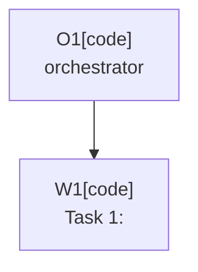

# Plan: <title>

Plan-ID: PLAN-<short-kebab-slug>

Status: Draft

<!-- For Status: Closed, add `Close-Reason: Released|Rejected|Superseded|Deferred|Archived`. -->

Workers: 1

Filename: `.agents/plans/PLAN-<short-kebab-slug>.md`

## Readiness

- Plan readiness: Not ready until open questions and required decisions are resolved.
- Approved by:
- Approved at:
- Open questions: Yes; see `## Open Questions`.
- Implementation progress: Not started.

## Status History

- YYYY-MM-DDTHH:mm:ss+HH:mm: none -> Draft by <actor Name <email>>; plan created.

## Goal

State the behavior or repository outcome this plan should achieve.

## Non-Goals

List work that is intentionally out of scope.

## Assumptions

- Document assumptions that are safe enough to proceed with.

## Open Questions

- Link to `docs/decisions/OPEN_QUESTIONS.md` entries or list task-specific questions.
- Approved plans must have every question answered, decided, moved to an owner document, or explicitly documented as an allowed assumption.

## Proposed Changes

- List files, modules, or docs expected to change.
- Keep this at the level of implementation steps, not backlog history.
- Reference related `TASKS.md` items by `T-AREA-NNN` task ref when applicable.
- For multi-task plans, use named tasks suitable for `Project-Plan-Task:` commit metadata.

## Task Packets

Use task packets for approved multi-task plans. For a single-task plan with no delegated task workers, write `No separate task packets.`

### Task Packet: T1-<task-label>

Task id: T1-<task-label>

Lane: implementation

Required skills:

- List required repository skills, or `none`.

Goal:

- State the exact task outcome.

Initial context budget:

- Read only this packet's initial context unless an escalation trigger fires.

Allowed inputs:

- `AGENTS.md`
- `.agents/references/orchestration.md`
- `.agents/references/execution.md`
- `.agents/references/testing.md`
- Plan header, readiness summary, execution graph, and this task packet.
- List exact source files, specs, ADRs, or validation output needed by this task.

Forbidden inputs:

- Unrelated archived plans.
- Previous worker chat beyond the orchestrator handoff summary.
- Implementation evidence from unrelated task packets.

Write scope:

- List exact files or directories this task may edit, or write `read-only` for review packets.

Dependencies:

- List predecessor task packets, wave constraints, or `none`.

Validation:

- List task-specific commands, review checks, manual checks, and self-review expectations.

Escalation triggers:

- List the conditions that allow the worker to load additional context, such as a missing decision, source conflict, validation blocker, or need to align with another owner guide.

Stop conditions:

- List missing decisions, unsafe assumptions, or scope conflicts that should stop work.

Expected output:

- Changed files or reviewed diff.
- Validation evidence.
- Blockers.
- Review risks.
- Handoff notes.
- Suggested changelog entry only when public plugin behavior changes.

Result summary:

- Status: pending
- Worker:
- Changed files or reviewed diff:
- Validation evidence:
- Blockers:
- Review risks:
- Handoff notes:

## Execution Model

- `Workers: 1` for sequential execution, or `Workers: N (parallel, tasks: <task refs or labels>)` when the approved plan marks those tasks independent with disjoint write scopes.
- For multi-task plans, use an orchestrator plus one fresh task worker per named task when agent delegation is available.
- Follow `.agents/references/orchestration.md` for worker lanes, packet dispatch, parallel synchronization, structured worker events, result summaries, branch topology, and plan or changelog handoffs.
- Dispatch the plan header or readiness summary, execution graph, assigned task packet, and explicitly named governing artifacts or source files. Do not dispatch the full approved plan by default.
- Record any task that is safe to run in parallel only when it has a disjoint write scope.
- Use the current branch only unless a later accepted ADR authorizes per-worker git worktrees.

## Execution Graph

## Validation

- List commands, manual checks, or content reviews expected for this task.

## Risks

- Note compatibility, commit/push safety, AI Assistant availability, or validation risks.

## Handoff Notes

- Record anything the next agent or maintainer should know after implementation.
- If a new question appeared during implementation, note where it was recorded and whether work resumed.
