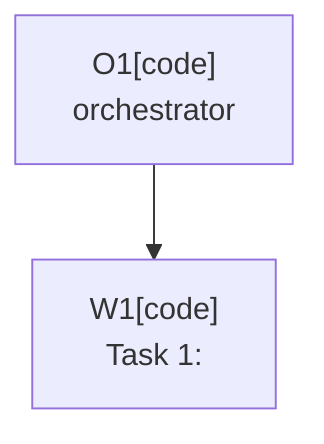

# Plan: <title>

Plan-ID: PLAN-<short-kebab-slug>

Status: Draft

<!-- For Status: Closed, add `Close-Reason: Released|Rejected|Superseded|Deferred|Archived`. -->

Workers: 1

Filename: `.agents/plans/PLAN-<short-kebab-slug>.md`

## Readiness

- Plan readiness: Not ready until open questions and required decisions are resolved.
- Approved by:
- Approved at:
- Open questions: Yes; see `## Open Questions`.
- Implementation progress: Not started.

## Status History

- YYYY-MM-DDTHH:mm:ss+HH:mm: none -> Draft by <actor Name <email>>; plan created.

## Goal

State the behavior or repository outcome this plan should achieve.

## Non-Goals

List work that is intentionally out of scope.

## Assumptions

- Document assumptions that are safe enough to proceed with.

## Open Questions

- Link to `docs/decisions/OPEN_QUESTIONS.md` entries or list task-specific questions.
- Approved plans must have every question answered, decided, moved to an owner document, or explicitly documented as an allowed assumption.

## Proposed Changes

- List files, modules, or docs expected to change.
- Keep this at the level of implementation steps, not backlog history.
- Reference related `TASKS.md` items by `T-AREA-NNN` task ref when applicable.
- For multi-task plans, use named tasks suitable for `Project-Plan-Task:` commit metadata.

## Task Packets

Use task packets for approved multi-task plans. For a single-task plan with no delegated task workers, write `No separate task packets.`

Use inline task packets by default. For long plans with more than six worker-owned tasks, multiple parallel waves, or expected parent-plan length above roughly 200 lines after packeting, link child packet files here and keep stable task packet refs in the parent plan.

### Task Packet: T1-<task-label>

Task id: T1-<task-label>

Lane: implementation

<!-- Use `implementation`, `exploration`, `testing`, or `review`. Exploration and review packets must use `Write scope: read-only`. -->

Required skills:

- `repository-documentation`, another exact repository skill, or `none`.

Goal:

- State the exact task outcome.

Initial context budget:

- Read first:
  - Plan header, readiness summary, execution graph, and this task packet.
  - Exact owner artifacts and source files required for this task, for example `AGENTS.md` or `src/main/kotlin/...`.
- Escalate to:
  - Exact owner guides, source files, logs, validation output, or docs allowed only when an escalation trigger fires.

Allowed inputs:

- Files and artifacts named in `Read first`.
- Files and artifacts named in `Escalate to` only after an escalation trigger fires.

Forbidden inputs:

- Unrelated archived plans.
- Previous worker chat beyond the orchestrator handoff summary.
- Implementation evidence from unrelated task packets.

Write scope:

- Exact files or directories this task may edit, or `read-only` for exploration and review packets.

Dependencies:

- List predecessor task packets, wave constraints, or `none`.

Validation:

- List task-specific commands and manual checks selected through `.agents/references/testing.md`.
- List self-review checks selected through `.agents/references/reviews.md`.
- For multi-task plans, state the task or approved parallel-wave commit boundary that must exist before any dependent task or wave starts.

Escalation triggers:

- Conditions that allow the worker to load additional named context, such as a missing decision, source conflict, validation blocker, or need to align with another owner guide.

Stop conditions:

- List missing decisions, unsafe assumptions, or scope conflicts that should stop work.

Expected output:

- Changed files or reviewed diff.
- Validation evidence from `.agents/references/testing.md`.
- Self-review evidence from `.agents/references/reviews.md`.
- Commit identifier for the task or approved parallel wave.
- Structured worker event evidence for approved-plan workers and write workers.
- Orchestrator reconciliation note comparing worker claims with the final diff, validation output, and governing artifact.
- Blockers.
- Review risks.
- Handoff notes.
- Suggested changelog entry only when public plugin behavior changes.

Result summary:

- Status: pending
- Worker:
- Changed files or reviewed diff:
- Validation evidence from `.agents/references/testing.md`:
- Self-review evidence from `.agents/references/reviews.md`:
- Commit:
- Worker events:
- Orchestrator reconciliation:
- Changelog/docs/spec/tasks updates:
- Blockers:
- Review risks:
- Handoff notes and next action:

## Execution Model

- `Workers: 1` for sequential execution, or `Workers: N (parallel, tasks: <task refs or labels>)` when the approved plan marks those tasks independent with disjoint write scopes.
- For multi-task plans, use an orchestrator plus one fresh sub-agent task worker per named task.
- If sub-agents are unavailable, unauthorized by the active tool contract, or explicitly forbidden for approved-plan execution, stop before implementation and report the blocker instead of running the task locally.
- Follow `.agents/references/orchestration.md` for worker lanes, packet dispatch, parallel synchronization, structured worker events, result summaries, branch topology, and plan or changelog handoffs.
- Dispatch the plan header or readiness summary, execution graph, assigned task packet, and explicitly named governing artifacts or source files. Do not dispatch the full approved plan by default.
- Record an orchestrator decision capsule before context-heavy work, delegated work, write-worker work, approved parallel waves, or work likely to trigger context compaction.
- Record any task that is safe to run in parallel only when it has a disjoint write scope.
- Before write delegation, check current worktree state, reserve explicit write scopes, and keep parallel write scopes disjoint.
- For multi-task plans, each task or approved parallel wave must be fully implemented, validated through `.agents/references/testing.md`, self-reviewed through `.agents/references/reviews.md`, and committed before the next dependent task or wave starts.
- Before starting the next dependent task or approved parallel wave, confirm every predecessor task result summary records implementation status, validation evidence from `.agents/references/testing.md`, self-review evidence from `.agents/references/reviews.md`, and a commit identifier.
- For approved parallel waves, all task commits in the current wave must exist before any dependent wave starts.
- Use `Project-Source: plan-task`, `Project-Plan: <Plan-ID>`, and `Project-Plan-Task: <task id>` metadata for approved plan-task commits.
- Include `Project-Worker:`, `Project-Orchestrator:`, and `Project-Agent-Mode:` metadata for orchestrated multi-agent commits.
- Keep compact evidence in the plan. Do not paste raw test output, raw worker transcripts, or bulky run logs.
- Use the current branch only unless a later accepted ADR authorizes per-worker git worktrees.

## Long-Run Continuity

Use this checkpoint for multi-task, context-heavy, delegated, parallel, or likely-compaction plans. Update it before starting each dependent task or wave, before a pause or handoff, and after any context transition.

- Current task or wave:
- Completed commits:
- Plan status and readiness:
- Validation and self-review state:
- Worker event state:
- Orchestrator reconciliation state:
- Changelog, docs, spec, task, or plan updates:
- Blockers or open questions:
- Next action:
- Context handoff notes:

## Execution Graph

## Validation

- List commands, manual checks, or content reviews expected for this task.

## Risks

- Note compatibility, commit/push safety, AI Assistant availability, or validation risks.

## Handoff Notes

- Record anything the next agent or maintainer should know after implementation.
- If a new question appeared during implementation, note where it was recorded and whether work resumed.
