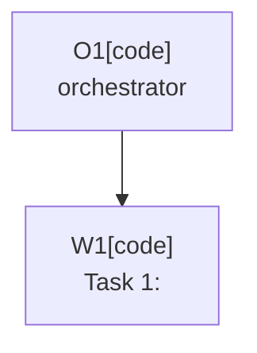

# Plan: <title>

Plan-ID: PLAN-<short-kebab-slug>

Status: Draft

<!-- For Status: Closed, add `Close-Reason: Released|Rejected|Superseded|Deferred|Archived`. -->

Workers: 1

Filename: `.agents/plans/PLAN-<short-kebab-slug>.md`

## Readiness

- Plan readiness: Not ready until open questions and required decisions are resolved.
- Approved by:
- Approved at:
- Open questions: Yes; see `## Open Questions`.
- Implementation progress: Not started.

## Status History

- YYYY-MM-DDTHH:mm:ss+HH:mm: none -> Draft by <actor Name <email>>; plan created.

## Goal

State the behavior or repository outcome this plan should achieve.

## Non-Goals

List work that is intentionally out of scope.

## Assumptions

- Document assumptions that are safe enough to proceed with.

## Open Questions

- Link to `docs/decisions/OPEN_QUESTIONS.md` entries or list task-specific questions.
- Approved plans must have every question answered, decided, moved to an owner document, or explicitly documented as an allowed assumption.

## Proposed Changes

- List files, modules, or docs expected to change.
- Keep this at the level of implementation steps, not backlog history.
- Reference related `TASKS.md` items by stable `T-AREA-NNN` task ID when applicable.
- For multi-task plans, use named tasks suitable for `Project-Plan-Task:` commit metadata.

## Execution Model

- `Workers: 1` for sequential execution, or `Workers: N (parallel, tasks: <task ids or labels>)` when the approved plan marks those tasks independent with disjoint write scopes.
- For multi-task plans, use an orchestrator plus one fresh task worker per named task when agent delegation is available.
- Record any task that is safe to run in parallel only when it has a disjoint write scope.
- Use the current branch only unless a later accepted ADR authorizes per-worker git worktrees.

## Execution Graph

## Validation

- List commands, manual checks, or content reviews expected for this task.

## Risks

- Note compatibility, commit/push safety, AI Assistant availability, or validation risks.

## Handoff Notes

- Record anything the next agent or maintainer should know after implementation.
- If a new question appeared during implementation, note where it was recorded and whether work resumed.
