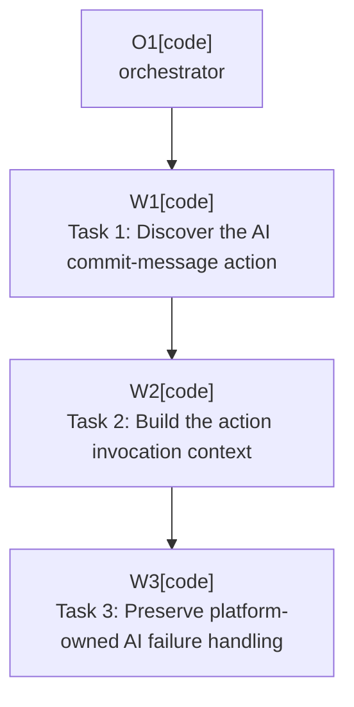

# Plan: AI Assistant Message Generation

Plan-ID: PLAN-ai-assistant-message-generation

Status: Closed

Close-Reason: Archived

Workers: 1

Filename: `.agents/plans/archive/PLAN-ai-assistant-message-generation.md`

## Superseded By

`docs/specification.md` REQ-AI-002 owns the current AI commit-message action discovery behavior. The Task 1 wording below ("fall back to `Vcs.MessageActionGroup` or commit toolbar action presentation text") records the original design at archive time and does NOT match the current implementation, which uses a three-stage ladder over `Vcs.LLMCommitMessageAction`, then the `Vcs.LLM` ID prefix, then the `Vcs.` ID prefix with presentation heuristics. Treat this plan as a historical snapshot and consult `docs/specification.md` for current behavior.

## Readiness

- Plan readiness: Closed; archived by user request.
- Approved by: Kamil Kiewisz <kamkie@outlook.com>
- Approved at: 2026-05-15T04:23:08+02:00
- Open questions: None.
- Implementation progress: Implemented through committed plan tasks; automated validation passed.

## Status History

- 2026-05-15T03:55:19+02:00: none -> Draft by Kamil Kiewisz <kamkie@outlook.com>; plan created.
- 2026-05-15T04:23:08+02:00: Draft -> Approved by Kamil Kiewisz <kamkie@outlook.com>; explicit user approval recorded.
- 2026-05-15T04:41:13+02:00: Approved -> In Progress by OpenAI Codex <codex@openai.com>; orchestrated implementation started.
- 2026-05-15T06:39:50+02:00: In Progress -> Implemented by OpenAI Codex <codex@openai.com>; planned changes completed and validated.

- 2026-05-17T22:40:44+02:00: Implemented -> Closed by Kamil Kiewisz <kamkie@outlook.com>; archived completed plan by user request.

## Goal

Invoke JetBrains AI Assistant's commit-message generation through the IntelliJ action system using the active commit workflow context, while preserving AI Assistant's own sign-in, unavailable, and failure handling.

## Non-Goals

- Do not depend directly on proprietary AI Assistant implementation classes unless a later accepted decision permits it.
- Do not decide AI completion timing; that belongs to `PLAN-ai-generation-completion`.
- Do not create fallback non-AI commit messages.

## Assumptions

- JetBrains AI Assistant remains a required plugin dependency per ADR 0013.
- Runtime invocation should use the IntelliJ action system per ADR 0012 and `.agents/references/code-style.md`.
- Missing runtime availability, sign-in, and generation errors should use standard AI Assistant or IntelliJ messages where possible per ADR 0014 and ADR 0016.

## Open Questions

No open plan questions.

## Proposed Changes

- Task 1: Discover the AI commit-message action.
    - Covers `T-AI-001`, `T-AI-002`, and `T-AI-003`.
    - Prefer known action IDs and fall back to `Vcs.MessageActionGroup` or commit toolbar action presentation text.
- Task 2: Build the action invocation context.
    - Covers `T-AI-004`.
    - Provide project, commit workflow handler, commit UI, and commit message control data through a data context compatible with the target IDEs.
- Task 3: Preserve platform-owned AI failure handling.
    - Covers `T-AI-006`.
    - Let AI Assistant surface standard sign-in, unavailable, and generation failure messages when available.

## Execution Model

Use one orchestrator and one fresh task worker per named task when agent delegation is available. Do not run these tasks in parallel because action discovery and invocation context need to evolve together.

Each named task should be implemented, validated, self-reviewed, and committed before the next task starts.

## Execution Graph

## Validation

- Run `gradle buildPlugin`.
- Add focused tests around action lookup fallback behavior where practical.
- Manually test in a sandbox IDE with AI Assistant installed, not signed in, and runtime unavailable where those states can be reproduced.
- Confirm missing or disabled AI Assistant still fails at installation or loading through the required plugin dependency.

## Risks

- AI Assistant action IDs and group placement may change across target IDE builds.
- Presentation-text fallback can be localization-sensitive; prefer stable IDs whenever evidence supports them.
- A data context that is too thin may open AI UI but not update the intended commit message control.

## Handoff Notes

If implementation cannot find a stable public action route, stop before using proprietary classes and ask for a decision. This plan should return explicit success or failure signals for the completion-wait plan to observe.
