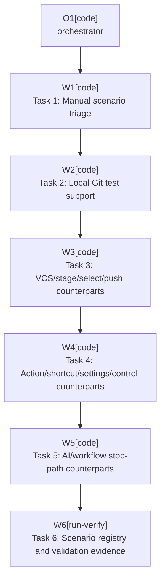

# Plan: Automate Manual Scenarios

Plan-ID: PLAN-automate-manual-scenarios

Status: Closed

Close-Reason: Archived

Workers: 1

Filename: `.agents/plans/archive/PLAN-automate-manual-scenarios.md`

## Readiness

- Plan readiness: Closed.
- Approved by: Kamil Kiewisz <kamkie@outlook.com>
- Approved at: 2026-05-18T15:06:11+02:00
- Open questions: None. The plan assumes manual scenarios may gain automated counterpart rows while retaining residual manual checks when live IDE or AI Assistant behavior remains the primary evidence.
- Implementation progress: Complete; automated counterparts, scenario registry updates, validation, and archival completed.

## Status History

- 2026-05-18T14:56:52+02:00: none -> Draft by Codex <codex@openai.com>; plan created to design automated coverage for scenarios currently limited to `Manual` execution.
- 2026-05-18T15:06:11+02:00: Draft -> Approved by Kamil Kiewisz <kamkie@outlook.com>; explicit user approval recorded.
- 2026-05-18T15:06:11+02:00: Approved -> In Progress by Codex <codex@openai.com>; implementation started after approval.
- 2026-05-18T15:13:00+02:00: In Progress -> Implemented by Codex <codex@openai.com>; automated counterpart tests, scenario registry updates, and validation completed.
- 2026-05-18T20:52:35+02:00: Implemented -> Closed by Kamil Kiewisz <kamkie@outlook.com>; completed plan archived.

## Goal

Create a maintainable automated-test strategy for the 55 scenario rows currently limited to `Manual` execution in `docs/scenario-coverage.md`.

The outcome should be new repository tests for every manual scenario whose invariant can be tested with deterministic unit fakes, service collaborators, local Git repositories, or lightweight Swing/component assertions. Manual rows should remain only for evidence that genuinely requires a sandbox IDE, real JetBrains AI Assistant availability, product-specific keymaps, platform commit or push UI, screenshots, or installation/loading behavior.

## Non-Goals

- Do not automate by driving a real signed-in JetBrains AI Assistant session.
- Do not contact real remotes. Local bare remotes are allowed.
- Do not remove manual sandbox coverage for visual, product-specific, or platform-owned behavior that repository tests cannot prove.
- Do not introduce broad production abstractions solely for tests. Add small seams only when they expose a stable behavior boundary already present in the code.
- Do not change runtime plugin behavior except for low-risk testability seams approved as part of this plan.

## Assumptions

- A manual scenario can be split into an automated counterpart plus a residual manual row when repository tests can prove the core invariant but not the live IDE evidence.
- `docs/scenario-coverage.md` remains the source of truth for counts, execution mode, status, and evidence targets.
- Local Git CLI tests may use JUnit assumptions to skip when `git` is unavailable.
- Tests should prefer existing unit boundaries before heavier IntelliJ fixtures.
- Existing tests already cover many underlying invariants; this plan should add missing counterparts instead of duplicating current assertions.

## Open Questions

- None. If implementation discovers that an IntelliJ Platform fixture or Gradle test dependency change is required, record it in this plan before changing build configuration.

## Current Manual Scope

| Set            | Manual scenarios | Primary manual evidence today                                                                           |
|----------------|------------------|---------------------------------------------------------------------------------------------------------|
| `SCN-STAGE`    | 18               | Commit tool window staging UI, AI workflow starts/stops, staged-list retention, IDE VCS operation state |
| `SCN-CONTROL`  | 3                | Real toolbar placement, light/dark rendering, real IDE visibility states                                |
| `SCN-SHORTCUT` | 4                | Product keymap shortcut routing and opt-out behavior                                                    |
| `SCN-AI`       | 7                | Real AI Assistant presence, sign-in, action IDs, generation, timeout, and user edits                    |
| `SCN-SELECT`   | 6                | Real Commit tool window inclusion state across changelists, roots, conflicts, and unsupported projects  |
| `SCN-WORKFLOW` | 8                | End-to-end AI/commit/push behavior and platform-owned safeguard UI                                      |
| `SCN-PUSH`     | 6                | Local remote push behavior, fallback UI, target safety, and push errors                                 |
| `SCN-SETTINGS` | 3                | Settings dialog defaults, persistence, and runtime effect                                               |

## Proposed Changes

- Task 1: Triage manual scenarios into automation buckets.
    - Add a compact automation-triage section to `docs/scenario-coverage.md`.
    - For each current manual row, classify it as `Automate fully`, `Automated counterpart plus residual manual`, or `Keep manual`.
    - Record the intended automated evidence target before adding tests.
    - Do not lower manual counts unless the repository test covers the scenario's primary assertion under the counting rules.

- Task 2: Extract local Git test support.
    - Move the reusable `LocalGitRepository` and `GitCli` helpers from `LocalGitRepositoryValidationTest` into a small test-support file.
    - Add fixture helpers for staged-only, mixed staged/unstaged, no staged files, multi-root nested paths, local bare remotes, missing upstream, diverged upstream, and safe push failure setup.
    - Keep helpers explicit and local to tests; no production Git command execution should be introduced.

- Task 3: Add VCS, staging, selection, and push automated counterparts.
    - Add local-repository tests for `SCN-STAGE-MAN-004` through `SCN-STAGE-MAN-007` where the invariant is Git state preservation rather than live UI rendering.
    - Add local-repository or policy/service tests for `SCN-PUSH-MAN-001` through `SCN-PUSH-MAN-006`, using only temporary bare remotes.
    - Add selection/filter counterpart tests for `SCN-SELECT-MAN-001` through `SCN-SELECT-MAN-006` where current pure filters or commit-selection items can prove the invariant.
    - Keep residual manual checks for real Commit tool window visibility, staged-list flicker, and platform push dialogs.

- Task 4: Add action, shortcut, settings, and control counterparts.
    - Extend shortcut tests for no-project delegation, disabled availability delegation, source-action suppression boundaries, and opt-out behavior that does not depend on a real keymap.
    - Add plugin descriptor tests for required AI Assistant dependency and settings registration where the descriptor is the source of truth.
    - Add settings-configurable tests for component defaults, reset, validation, and apply behavior if this can be done through a light fixture or a small settings UI model seam.
    - Add focused control rendering/component tests for state transitions that can be asserted without screenshots; keep theme screenshots manual.

- Task 5: Add AI and workflow stop-path counterparts.
    - Extend workflow runner tests for readiness stops, missing workflow, missing AI action, empty selection, completion failure, timeout, empty/unchanged message, no completion signal, and user edit outcomes where current coverage is not explicit for the manual row.
    - Extend AI action discovery tests with additional supported-version label/action-id variations that can be represented by fake `ActionManager` lookup data.
    - Extend stop reporter tests for every plugin-owned or forwarded stop reason where repository assertions can prove the notification policy.
    - Keep real AI Assistant signed-in, unavailable, and product-specific action discovery checks manual.

- Task 6: Update scenario coverage and validation evidence.
    - Add new `SCN-*-AUT-*` rows for automated counterparts and update project/set counts.
    - Move a manual row to `Automated` only when the new test owns the primary assertion under the counting rules.
    - Update `## Automation Candidates` so future agents know which residual manual checks are intentionally retained.
    - Run documentation validation and the relevant targeted Gradle tests after each implementation slice.

## Execution Model

- Execute sequentially with `Workers: 1`.
- Complete and validate one task before starting the next so scenario counts never drift far from test evidence.
- Use one commit per implementation task if the maintainer requests commits during approved execution.
- Do not parallelize because multiple tasks update `docs/scenario-coverage.md` and adjacent test fixtures.

## Execution Graph

## Validation

- `.\gradlew.bat test --tests "<changed test class>"`
- `.\gradlew.bat test`
- `pwsh -NoProfile -ExecutionPolicy Bypass -File scripts\validate-docs.ps1`
- `git diff --check`

Run `.\gradlew.bat buildPlugin` only if implementation changes plugin descriptors, Gradle configuration, service registration, or compatibility boundaries beyond descriptor read tests.

## Risks

- Overstated coverage is the main risk. If a repository test only proves an underlying invariant, keep the manual scenario and add an automated counterpart row instead of changing the original execution mode.
- IntelliJ light/heavy fixtures can be slower and more brittle than pure unit tests. Prefer fakes and local Git fixtures unless the scenario is specifically about platform wiring.
- Settings UI tests may require a small model seam to avoid application-service global state. Keep that seam narrow and covered.
- Local Git behavior can vary by installed Git version and platform defaults. Use explicit repository config, local remotes, path-normalized assertions, and assumptions for missing Git.
- Real AI Assistant behavior, plugin dependency loading, product-specific action IDs, before-commit warnings, and push UI errors may remain manual by design.

## Handoff Notes

- Implementation started after explicit user approval on 2026-05-18.
- Added automated counterparts while retaining residual manual checks for live IDE, AI Assistant, platform-owned UI, and product-specific behavior.
- Validation completed with targeted changed test classes, full Gradle tests, docs validation, and whitespace checks.
