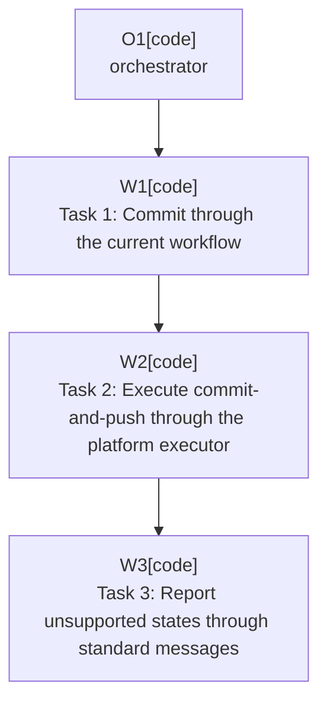

# Plan: Commit And Push Execution

Plan-ID: PLAN-commit-and-push-execution

Status: Closed

Close-Reason: Archived

Workers: 1

Filename: `.agents/plans/archive/PLAN-commit-and-push-execution.md`

## Readiness

- Plan readiness: Closed; archived by user request.
- Approved by: Kamil Kiewisz <kamkie@outlook.com>
- Approved at: 2026-05-15T04:23:08+02:00
- Open questions: None.
- Implementation progress: Implemented through committed plan tasks; automated validation passed.

## Status History

- 2026-05-15T03:55:19+02:00: none -> Draft by Kamil Kiewisz <kamkie@outlook.com>; plan created.
- 2026-05-15T04:23:08+02:00: Draft -> Approved by Kamil Kiewisz <kamkie@outlook.com>; explicit user approval recorded.
- 2026-05-15T04:41:13+02:00: Approved -> In Progress by OpenAI Codex <codex@openai.com>; orchestrated implementation started.
- 2026-05-15T06:39:50+02:00: In Progress -> Implemented by OpenAI Codex <codex@openai.com>; planned changes completed and validated.

- 2026-05-17T22:40:44+02:00: Implemented -> Closed by Kamil Kiewisz <kamkie@outlook.com>; archived completed plan by user request.

## Goal

Execute the commit-only and commit-and-push flows through the existing IntelliJ commit workflow after all files are selected and AI message generation has completed safely.

## Non-Goals

- Do not select files, invoke AI, or wait for AI completion except by using services from earlier workflow plans.
- Do not bypass before-commit checks, IDE confirmations, commit errors, or push errors.
- Do not push through raw Git commands.

## Assumptions

- Automatic commit after AI generation follows ADR 0010.
- Push behavior uses the IDE's commit-and-push executor where available.
- Standard IDE confirmation and error barriers remain authoritative per ADR 0016 and ADR 0017.

## Open Questions

No open plan questions.

## Proposed Changes

- Task 1: Commit through the current workflow.
    - Covers `T-COMMIT-001`, `T-COMMIT-003`, and `T-COMMIT-004`.
    - Trigger the same commit pathway the active Commit tool window would use so before-commit checks and platform errors remain active.
- Task 2: Execute commit-and-push through the platform executor.
    - Covers `T-COMMIT-002`.
    - Use Git commit-and-push executor behavior when available and fail closed when it is unavailable.
- Task 3: Report unsupported states through standard messages.
    - Covers `T-COMMIT-005`.
    - Stop without committing or pushing when the project is unsupported, not Git-backed, or lacks a compatible push executor.

## Execution Model

Use one orchestrator and one fresh task worker per named task when agent delegation is available. Do not run these tasks in parallel because commit-only and commit-and-push share workflow state and safety checks.

Each named task should be implemented, validated, self-reviewed, and committed before the next task starts.

## Execution Graph

## Validation

- Run `gradle buildPlugin`.
- Add local-repository tests for commit-only and local-remote commit-and-push where safe.
- Manually test before-commit checks, commit warnings, commit failures, push confirmation, and push errors in a sandbox IDE.
- Confirm unsupported non-Git and unavailable push-executor states do not commit.

## Risks

- Commit executor APIs may differ across IDE builds or require UI thread coordination.
- Commit-and-push behavior can touch real remotes if validation is not constrained to local repositories.
- If the plugin calls too low-level an API, it may bypass user safeguards; treat that as a blocker.

## Handoff Notes

Implementation should be sequenced after file selection and AI completion services exist. Any concrete uncovered confirmation risk should be recorded as a new open question and placeholder task before continuing.
