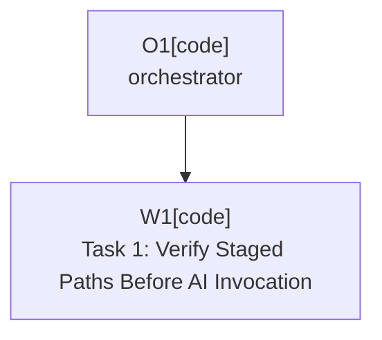

# Plan: Confirm Staged Before AI Generation

Plan-ID: PLAN-confirm-staged-before-ai-generation

Status: Closed

Close-Reason: Archived

Workers: 1

Filename: `.agents/plans/archive/PLAN-confirm-staged-before-ai-generation.md`

## Readiness

- Plan readiness: Closed; archived by user request.
- Approved by: Kamil Kiewisz <kamkie@outlook.com>
- Approved at: 2026-05-18T01:36:59+02:00
- Open questions: No task-local questions.
- Implementation progress: Complete; plan archived.

## Status History

- 2026-05-18T01:33:08+02:00: none -> Draft by Codex <codex@openai.com>; plan created for `TASKS.md` T-BUG-002.
- 2026-05-18T01:36:59+02:00: Draft -> Approved by Kamil Kiewisz <kamkie@outlook.com>; explicit implementation request approved the plan.
- 2026-05-18T01:36:59+02:00: Approved -> In Progress by Codex <codex@openai.com>; implementation started for approved plan.
- 2026-05-18T01:42:30+02:00: In Progress -> Implemented by Codex <codex@openai.com>; staged-path confirmation implemented and targeted validation completed.
- 2026-05-18T11:40:31+02:00: Implemented -> Closed by Kamil Kiewisz <kamkie@outlook.com>; archived completed plan by user request.

## Goal

Fix `T-BUG-002` so the `AI` section does not invoke JetBrains AI Assistant until the Git staging-area workflow has rechecked that every expected committable path is actually staged and included by the IDE commit workflow.

## Non-Goals

- Do not change commit-only or push execution semantics beyond sharing the safer pre-AI selection preparation.
- Do not replace the IDE commit workflow with direct Git commit execution.
- Do not add a new user setting or change visible control layout.
- Do not implement `T-BUG-003`.

## Assumptions

- The intermittent first-run failure is caused by the Git staging-area path trusting a single tracker refresh after `git add`.
- A bounded retry and verification step is acceptable because it happens before AI generation and fails closed when the IDE stage tracker does not reflect the expected staged paths.
- The non-staging commit workflow can continue using the existing reflective changelist/unversioned inclusion methods.

## Open Questions

- None.

## Proposed Changes

### Task 1: Verify Staged Paths Before AI Invocation

- Update `src/main/kotlin/pl/devopssolutions/aicommitall/workflow/ReflectiveCommitWorkflowSynchronizer.kt` so the Git staging-area branch:
  - captures the expected committable paths before staging;
  - stages them through `GitFileUtils.addPaths`;
  - refreshes `GitStageTracker`;
  - verifies that the refreshed tracker state contains all expected paths as staged changes;
  - retries the add/refresh/check loop a small bounded number of times before failing closed.
- Keep the existing UI state update only after verification succeeds, so AI generation sees the confirmed staged state.
- Add focused helper logic in `src/main/kotlin/pl/devopssolutions/aicommitall/vcs/GitStageSelectionItems.kt` if needed to make staged-path verification testable.
- Update `TASKS.md` to mark `T-BUG-002` complete after implementation and validation.

## Execution Model

- Single implementation task.
- No agent delegation or parallel implementation is needed.

## Execution Graph

## Validation

- `gradle test`
- `gradle buildPlugin`
- `pwsh -NoProfile -ExecutionPolicy Bypass -File scripts/validate-docs.ps1`
- `git diff --check`

Manual sandbox validation remains recommended for the actual intermittent IDE behavior because the JetBrains AI Assistant action and live Git staging tracker timing cannot be fully exercised by the current unit tests.

## Risks

- IntelliJ Git staging APIs are not part of a stable plugin-owned contract; keep the compatibility boundary isolated in the existing synchronizer.
- A retry loop must be bounded and fail closed to avoid invoking AI with incomplete input or hanging the UI.
- Path comparison must use stable path strings rather than object identity because refreshed tracker state may contain new `FilePath` instances.

## Handoff Notes

- Initial investigation found the Git staging path in `ReflectiveCommitWorkflowSynchronizer.synchronizeGitStageWorkflow`.
- Before this plan, the implementation staged paths and refreshed once, but did not confirm that every expected path was staged before returning success to `AiCommitAllWorkflowCoordinator`, which immediately invokes AI message generation.
- Implementation now retries Git staging-area add and tracker refresh up to three times, then confirms the refreshed tracker state contains every expected staged path before updating commit UI inclusion and allowing AI generation to start.
- Validation run: `gradle test` passed; `gradle buildPlugin` passed; `git diff --check` passed; `scripts/validate-docs.ps1` failed on unrelated dirty `docs/proposals/PROP-04-multi-agent-execution-2026-05-15T09-57.md` and `docs/proposals/README.md` tracker inconsistencies.
