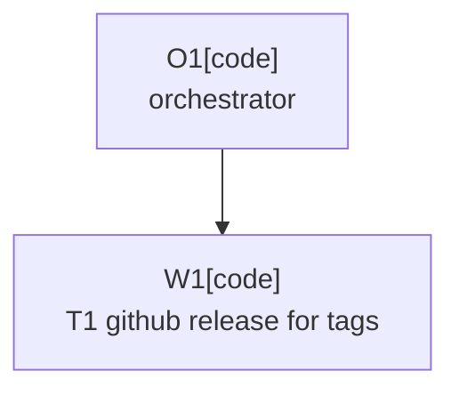

# Plan: GitHub Release For Tags

Plan-ID: PLAN-github-release-for-tags

Status: Closed

Close-Reason: Archived

Workers: 1

Filename: `.agents/plans/archive/PLAN-github-release-for-tags.md`

## Readiness

- Plan readiness: Closed; task validation and closeout are complete.
- Approved by: Kamil Kiewisz <kamkie@outlook.com>
- Approved at: 2026-05-24T17:56:31+02:00
- Open questions: None.
- Implementation progress: Worker W1 completed `T1-github-release-for-tags`; no further plan work is expected.

## Status History

- 2026-05-24T17:53:06+02:00: none -> Draft by Kamil Kiewisz <kamkie@outlook.com>; plan created from `TASKS.md` `T-REL-017`.
- 2026-05-24T17:56:31+02:00: Draft -> Approved by Kamil Kiewisz <kamkie@outlook.com>; explicit user approval recorded.
- 2026-05-24T17:56:31+02:00: Approved -> In Progress by Codex <codex@openai.com>; approved-plan implementation started through worker W1.
- 2026-05-24T18:06:24+02:00: In Progress -> Implemented by Codex <codex@openai.com>; worker W1 completed `T1-github-release-for-tags`.
- 2026-05-24T23:16:16+02:00: Implemented -> Closed by Kamil Kiewisz <kamkie@outlook.com>; current validation confirmed implementation complete and ready for archive closeout.

## Goal

Complete `T-REL-017` by creating GitHub Releases automatically when semantic version tags are pushed, with release notes generated from the matching `CHANGELOG.md` release section so the GitHub Release includes the changes since the previous release.

## Non-Goals

- Do not publish to JetBrains Marketplace from the tag-push GitHub Release workflow.
- Do not create tags automatically.
- Do not change plugin version derivation or Marketplace signing configuration.
- Do not rewrite historical changelog entries except for narrowly required formatting fixes.
- Do not execute a real release during implementation.

## Assumptions

- Pushed release tags use the repository's existing semantic tag format: `vMAJOR.MINOR.PATCH` or `vMAJOR.MINOR.PATCH-PRERELEASE`.
- `CHANGELOG.md` remains the source of truth for public release notes.
- A pushed tag must have a matching `## [vMAJOR.MINOR.PATCH...] - YYYY-MM-DD` changelog section before the workflow creates a GitHub Release.
- The matching changelog section represents the changes since the previous release section, following the existing Keep a Changelog ordering.
- GitHub Release creation should use `GITHUB_TOKEN` with the minimum required `contents: write` permission and should not require Marketplace secrets.

## Open Questions

- None.

## Proposed Changes

### Task 1: Release Notes Generator

Refs: `T-REL-017`.

- Add a small repository script that reads `CHANGELOG.md`, finds the release section for a supplied tag, validates that it is non-empty, and writes a Markdown release-notes file.
- Fail clearly when the tag format is invalid, the matching changelog section is missing, or the section has no release-note items.
- Add focused tests or CI workflow tests that prove the generator behavior and failure modes.

### Task 2: Tag-Push GitHub Release Workflow

Refs: `T-REL-017`.

- Add a GitHub Actions workflow for pushed release tags.
- Validate the tag name, check out full history, generate release notes from `CHANGELOG.md`, and create or update the GitHub Release for the pushed tag.
- Keep this workflow separate from the manual Marketplace `release.yml` publish workflow.
- Add or update CI workflow tests so the tag-push workflow has stable coverage for trigger, permissions, changelog-note generation, and GitHub Release creation.

### Task 3: Task Closeout

Refs: `T-REL-017`.

- Update `CHANGELOG.md` with a public release-pipeline entry.
- Move `T-REL-017` from `TASKS.md` to `TASKS_ARCHIVE.md` only after implementation, validation, and self-review pass.
- Update `.agents/plans/README.md` and this plan's result summaries/status during implementation.

## Task Packets

### Task Packet: T1-github-release-for-tags

Task id: T1-github-release-for-tags

Lane: implementation

Required skills:

- `repository-documentation`
- `kotlin-plugin-style`

Goal:

- Implement automatic GitHub Release creation for pushed semantic tags, with release notes generated from the matching `CHANGELOG.md` release section.

Initial context budget:

- Read first:
  - Plan header, readiness summary, execution graph, and this task packet.
  - `TASKS.md` `T-REL-017`.
  - `CHANGELOG.md`.
  - `.github/workflows/release.yml`.
  - `.github/workflows/ci.yml`.
  - `src/test/kotlin/pl/devopssolutions/aicommitall/ci/GitHubActionsWorkflowTest.kt`.
  - Existing scripts under `scripts/` that parse or validate `CHANGELOG.md`.
- Escalate to:
  - `.agents/references/releases.md` for changelog eligibility and release boundaries.
  - `.agents/references/testing.md` for validation scope.
  - GitHub documentation only if workflow syntax, `gh release`, or `GITHUB_TOKEN` behavior needs confirmation.

Allowed inputs:

- Files and artifacts named in `Read first`.
- Files and artifacts named in `Escalate to` only after an escalation trigger fires.

Forbidden inputs:

- Unrelated archived plans.
- Previous worker chat beyond the orchestrator handoff summary.
- Implementation evidence from unrelated task packets.

Write scope:

- `.github/workflows/`
- `scripts/`
- `src/test/kotlin/pl/devopssolutions/aicommitall/ci/GitHubActionsWorkflowTest.kt`
- `CHANGELOG.md`
- `TASKS.md`
- `TASKS_ARCHIVE.md`
- `.agents/plans/archive/PLAN-github-release-for-tags.md`
- `.agents/plans/README.md`

Dependencies:

- None after explicit plan approval.

Validation:

- Focused release workflow and release-note generator tests.
- `pwsh -NoProfile -ExecutionPolicy Bypass -File scripts/validate-docs.ps1`
- `pwsh -NoProfile -ExecutionPolicy Bypass -File scripts/ai/validate-agent-artifacts.ps1`
- `./gradlew.bat test --tests "pl.devopssolutions.aicommitall.ci.GitHubActionsWorkflowTest"`
- `./gradlew.bat spotlessCheck`
- `./gradlew.bat detekt`
- `git diff --check`

Escalation triggers:

- Escalate if the implementation would need a third-party GitHub Action instead of GitHub-owned tooling or `gh`.
- Escalate if changelog parsing cannot reliably identify the matching tag section.
- Escalate if release notes would need to include unreleased content or multiple changelog sections.
- Escalate if workflow permissions would require more than `contents: write`.

Stop conditions:

- GitHub Release creation cannot be tested without secrets or real publication.
- The workflow would publish Marketplace artifacts or require Marketplace secrets.
- The changelog section required for a pushed tag is ambiguous.
- A repository rule or release policy decision is needed beyond the accepted task scope.

Expected output:

- Changed files.
- Validation evidence.
- GitHub Release workflow behavior summary.
- Release-note generation behavior summary.
- Blockers.
- Review risks.
- Handoff notes.

Result summary:

- Status: completed
- Worker: W1
- Changed files or reviewed diff: `.github/workflows/github-release.yml`, `scripts/generate-github-release-notes.ps1`, `src/test/kotlin/pl/devopssolutions/aicommitall/ci/GitHubActionsWorkflowTest.kt`, `CHANGELOG.md`, `TASKS.md`, `TASKS_ARCHIVE.md`, `.agents/plans/archive/PLAN-github-release-for-tags.md`, `.agents/plans/README.md`
- Validation evidence: `.\gradlew.bat test --tests "pl.devopssolutions.aicommitall.ci.GitHubActionsWorkflowTest"`, `.\gradlew.bat spotlessCheck`, `.\gradlew.bat detekt`, `pwsh -NoProfile -ExecutionPolicy Bypass -File scripts/validate-docs.ps1`, `pwsh -NoProfile -ExecutionPolicy Bypass -File scripts/ai/validate-agent-artifacts.ps1`, `git diff --check`
- Blockers: none
- Review risks: GitHub Release creation itself was not executed locally; coverage is by script execution tests and workflow contract assertions.
- Handoff notes: Workflow is separate from Marketplace publication, uses only `contents: write`, validates pushed semantic tags, generates notes from the matching `CHANGELOG.md` release section, and creates or updates the GitHub Release with `gh`.

## Execution Model

- `Workers: 1`; execute the task packet through a fresh sub-agent worker after explicit plan approval.
- If sub-agents are unavailable, unauthorized by the active tool contract, or explicitly forbidden for approved-plan execution, stop before implementation and report the blocker instead of running the task locally.
- Commit the completed task packet when validation and self-review pass.

## Execution Graph



## Validation

Finish with:

```powershell
pwsh -NoProfile -ExecutionPolicy Bypass -File scripts/validate-docs.ps1
pwsh -NoProfile -ExecutionPolicy Bypass -File scripts/ai/validate-agent-artifacts.ps1
.\gradlew.bat test --tests "pl.devopssolutions.aicommitall.ci.GitHubActionsWorkflowTest"
.\gradlew.bat spotlessCheck
.\gradlew.bat detekt
git diff --check
```

Run `.\gradlew.bat test` if the implementation touches broader test helpers or Gradle behavior beyond workflow assertions.

## Risks

- A tag-push workflow creates public GitHub Releases; the guardrails must fail before creation when changelog notes are missing or malformed.
- Release-note parsing can drift from the Marketplace change-notes generator if helpers are duplicated without tests.
- GitHub Release automation must not expose or require Marketplace signing and publishing secrets.
- Existing manual Marketplace release workflow must remain gated and protected.

## Handoff Notes

- Implementation is complete for `T1-github-release-for-tags`.
- No real GitHub Release or Marketplace publication was executed during implementation.
- Unrelated user edits were preserved during implementation.
