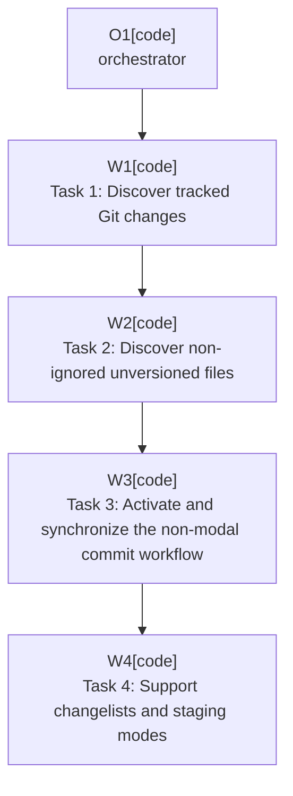

# Plan: Include All Git Files

Plan-ID: PLAN-include-all-git-files

Status: Closed

Close-Reason: Archived

Workers: 1

Filename: `.agents/plans/archive/PLAN-include-all-git-files.md`

## Readiness

- Plan readiness: Closed; archived by user request.
- Approved by: Kamil Kiewisz <kamkie@outlook.com>
- Approved at: 2026-05-15T04:23:08+02:00
- Open questions: None.
- Implementation progress: Implemented through committed plan tasks; automated validation passed.

## Status History

- 2026-05-15T03:55:19+02:00: none -> Draft by Kamil Kiewisz <kamkie@outlook.com>; plan created.
- 2026-05-15T04:23:08+02:00: Draft -> Approved by Kamil Kiewisz <kamkie@outlook.com>; explicit user approval recorded.
- 2026-05-15T04:41:13+02:00: Approved -> In Progress by OpenAI Codex <codex@openai.com>; orchestrated implementation started.
- 2026-05-15T06:39:50+02:00: In Progress -> Implemented by OpenAI Codex <codex@openai.com>; planned changes completed and validated.

- 2026-05-17T22:40:44+02:00: Implemented -> Closed by Kamil Kiewisz <kamkie@outlook.com>; archived completed plan by user request.

## Goal

Build the file-selection layer that discovers every non-ignored committable Git change across changelists and Git roots, activates the non-modal commit workflow, and marks all eligible files for commit.

## Non-Goals

- Do not execute commits or pushes.
- Do not invoke AI Assistant or mutate the commit message.
- Do not support non-Git VCS integrations in the first implementation.

## Assumptions

- Git-only and multi-root support follow ADR 0009.
- All-files scope follows ADR 0003 and includes tracked changes, non-ignored unversioned files, and committable conflict resolutions when exposed by the platform.
- Changelist and Git staging support follow ADR 0020.
- Prefer `ChangeListManager`, VCS commit workflow APIs, and IDE commit UI state over shelling out to Git.

## Open Questions

No open plan questions.

## Proposed Changes

- Task 1: Discover tracked Git changes.
    - Covers `T-FILES-001`, `T-FILES-003`, and part of `T-FILES-006`.
    - Collect modified, added, deleted, moved or renamed, and other committable changes from `ChangeListManager` across changelists and Git roots.
- Task 2: Discover non-ignored unversioned files.
    - Covers `T-FILES-002`.
    - Include non-ignored unversioned paths exposed by IntelliJ VCS APIs without manually parsing ignore files.
- Task 3: Activate and synchronize the non-modal commit workflow.
    - Covers `T-FILES-004` and `T-FILES-005`.
    - Open or focus the Commit tool window workflow and set commit inclusion state for every eligible file.
- Task 4: Support changelists and staging modes.
    - Covers `T-FILES-006` and `T-FILES-007`.
    - Verify behavior when changes are spread across changelists and when Git staging is enabled or disabled.

## Execution Model

Use one orchestrator and one fresh task worker per named task when agent delegation is available. Do not run these tasks in parallel because they share commit workflow state and VCS selection behavior.

Each named task should be implemented, validated, self-reviewed, and committed before the next task starts.

## Execution Graph

## Validation

- Run `gradle buildPlugin`.
- Add unit or local-repository tests where practical for tracked, unversioned, ignored, deleted, moved or renamed, multi-changelist, multi-root, and staging-mode cases.
- Manually verify Commit tool window inclusion state in a sandbox IDE for cases not yet automatable.
- Confirm ignored files remain excluded.

## Risks

- IntelliJ commit workflow APIs can vary by target IDE build and staging mode.
- Selecting files across multiple roots or changelists can accidentally include unsupported VCS changes if filtering is too broad.
- Conflict resolution state may not have a single stable API across IDE versions; fail closed and document any uncovered path.

## Handoff Notes

This plan should produce a reusable selection service that later workflow plans can call before AI generation and commit execution. New unsupported commit-state behavior should become an open question or ADR before implementation continues.
