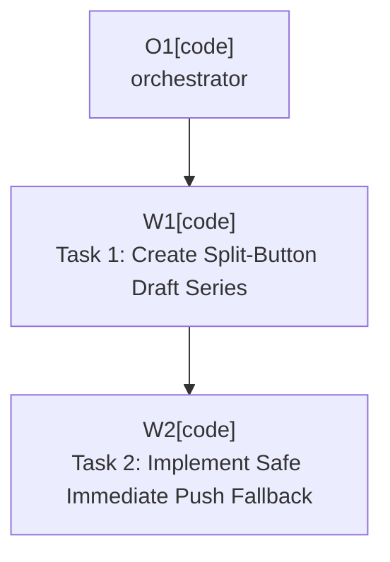

# Plan: Pre-Release ADR Implementation

Plan-ID: PLAN-pre-release-adr-implementation

Status: Closed

Close-Reason: Archived

Workers: 1

Filename: `.agents/plans/archive/PLAN-pre-release-adr-implementation.md`

## Readiness

- Plan readiness: Closed; archived by user request.
- Approved by: Kamil Kiewisz <kamkie@outlook.com>
- Approved at: 2026-05-17T19:45:43+02:00
- Open questions: None.
- Implementation progress: Task 1 and Task 2 complete; automated validation passed.

## Status History

- 2026-05-17T19:41:06+02:00: none -> Draft by Codex <codex@openai.com>; plan created for ADR 0025 and ADR 0047 implementation.
- 2026-05-17T19:45:43+02:00: Draft -> Approved by Kamil Kiewisz <kamkie@outlook.com>; explicit user approval recorded.
- 2026-05-17T19:45:43+02:00: Approved -> In Progress by Codex <codex@openai.com>; implementation started after approval.
- 2026-05-17T20:25:39+02:00: In Progress -> Implemented by Codex <codex@openai.com>; Task 1 and Task 2 implementation and automated validation completed.

- 2026-05-17T22:40:44+02:00: Implemented -> Closed by Kamil Kiewisz <kamkie@outlook.com>; archived completed plan by user request.

## Goal

Implement the remaining accepted ADR work identified for pre-release UX:

- ADR 0025: create the split-button styling draft series before final detailed styling is selected.
- ADR 0047: add safe immediate push behavior for `& Push`, with fallback to the standard push dialog path when safety cannot be verified.

## Non-Goals

- Do not change the accepted split-button structure from ADR 0006.
- Do not select a final split-button draft unless the maintainer explicitly chooses one after reviewing the draft set.
- Do not bypass IntelliJ commit, VCS, Git, or push error handling with direct Git CLI execution.
- Do not take over keyboard shortcuts or implement `PROP-02` `E006`; that needs its own ADR before behavior changes.
- Do not implement `PROP-02` `E001` commit-message clearing in this plan unless the maintainer expands the scope.

## Assumptions

- The split-button drafts should use the visual direction already recorded in `PROP-02` `E004`: closer to the current concept graphics, no arrow in the middle, and slightly different or contrasting left/right segment colors.
- The safe immediate push path must use IntelliJ Platform and Git integration APIs available in the supported 2026.1 IDE line.
- If implementation cannot verify ADR 0047 safety conditions through supported APIs, the affected path falls back to the existing standard commit-and-push executor or the plan becomes blocked for a focused decision.
- Existing local-repository tests should be extended where practical; sandbox validation remains acceptable for IDE UI paths that cannot be reliably automated.

## Open Questions

- None.

## Proposed Changes

### Task 1: Create Split-Button Draft Series

Reference: ADR 0025 and `PROP-02-pre-release-ux` `E003` through `E005`.

- Add `docs/concepts/graphics/split-button-drafts/`.
- Create four to six draft style directories or files covering:
  - normal enabled state;
  - running or AI-generation-in-progress state;
  - disabled state;
  - commit-only flow;
  - commit-and-push flow;
  - light and dark theme rendering.
- Add draft documentation with scoring criteria for legibility, theme contrast, segment distinction, IntelliJ guideline fit, brand signal, and accessibility.
- Add a compact decision tree for later final style selection.
- Update `docs/concepts/graphics/README.md` to link the draft series.
- Update `PROP-02` tracker rows that are fully satisfied by the draft work.

### Task 2: Implement Safe Immediate Push Fallback

Reference: ADR 0047 and `PROP-02-pre-release-ux` `E002`.

- Add a small push-safety decision layer before the current `Git.Commit.And.Push.Executor` path.
- Verify the ADR 0047 conditions where supported:
  - each affected Git repository has a tracked upstream branch;
  - no affected repository requires force push;
  - no unresolved conflicts are present in the affected commit scope;
  - push target selection is unambiguous across affected Git roots;
  - standard IntelliJ, Git, VCS, and push errors remain platform-owned.
- Use the immediate push path only when every safety condition is verified.
- Fall back to the standard push dialog or existing commit-and-push executor behavior when any condition cannot be verified.
- Add focused automated tests for safety decision outcomes and executor-path selection.
- Update user-facing documentation if the observable `& Push` behavior changes.
- Update `PROP-02` tracker rows that are fully satisfied by the implementation.

## Execution Model

- Use normal sequential execution.
- Task 1 and Task 2 have different primary write areas, but they both update `PROP-02`; run them sequentially to avoid tracker conflicts.
- After approval, each task is an independent plan task and should be committed before starting the next task.

## Execution Graph

## Validation

- Always run `pwsh -NoProfile -ExecutionPolicy Bypass -File scripts\validate-docs.ps1`.
- For Task 1, review the draft SVG/Markdown artifacts for broken links, state coverage, light/dark readability, and consistency with ADR 0006 and ADR 0025.
- For Task 2, run targeted unit tests for the push-safety decision layer and commit-and-push execution selection.
- For Task 2, run `gradle test` or the narrower Gradle test task that covers changed Kotlin tests.
- For Task 2, run `gradle buildPlugin` if production Kotlin or plugin descriptor changes affect packaging.
- Record any manual sandbox checks that are needed for push-dialog fallback or immediate-push UI behavior.

## Risks

- IntelliJ Platform APIs may not expose every ADR 0047 safety condition directly; fallback must remain conservative.
- A too-broad immediate push path could bypass useful IDE confirmation, so implementation should prefer fallback when uncertain.
- Draft graphics can drift from actual IntelliJ rendering; treat the draft set as a review artifact, not a production UI guarantee.
- Proposal tracker rows should be marked done only when the specific accepted finding is actually satisfied.

## Handoff Notes

- The worktree already contains ADR 0047 acceptance and `PROP-02` tracker consistency changes from prior steps.
- The plan was approved by the maintainer on 2026-05-17 and is being implemented sequentially.
- 2026-05-17T19:50:02+02:00: Task 1 added five split-button draft SVGs, draft scoring notes, and a decision tree; `PROP-02` `E003` and `E004` are done while `E005` remains open until final draft selection ADR exists.
- 2026-05-17T20:25:39+02:00: Task 2 added safe immediate push selection for tracked-upstream Git states, post-commit platform pusher execution, standard commit-and-push fallback, focused tests, Git4Idea dependency wiring, and user-facing documentation updates. `PROP-02` `E002` is done.
- 2026-05-17T21:55:22+02:00: Maintainer feedback revised the split-button drafts toward an IntelliJ run-widget-like control: one rounded toolbar-like body, text primary segment, icon-forward push segment, straight divider, minimal middle gap, and primary/push hover-state examples. At that point, `PROP-02` `E005` was still waiting on final draft selection and an ADR.
- 2026-05-17T23:40:43+02:00: Follow-up design work accepted ADR 0052 and ADR 0053, selected the violet AI snake draft, and moved future runtime implementation to `PLAN-three-section-ai-commit-push-control`.
- Validation completed for Task 2: `.\gradlew.bat test --rerun-tasks --stacktrace`, `.\gradlew.bat buildPlugin --rerun-tasks --stacktrace`, `pwsh -NoProfile -ExecutionPolicy Bypass -File scripts\validate-docs.ps1`, and `git diff --check`. Manual sandbox push-dialog and immediate-push checks remain release-preparation coverage.
