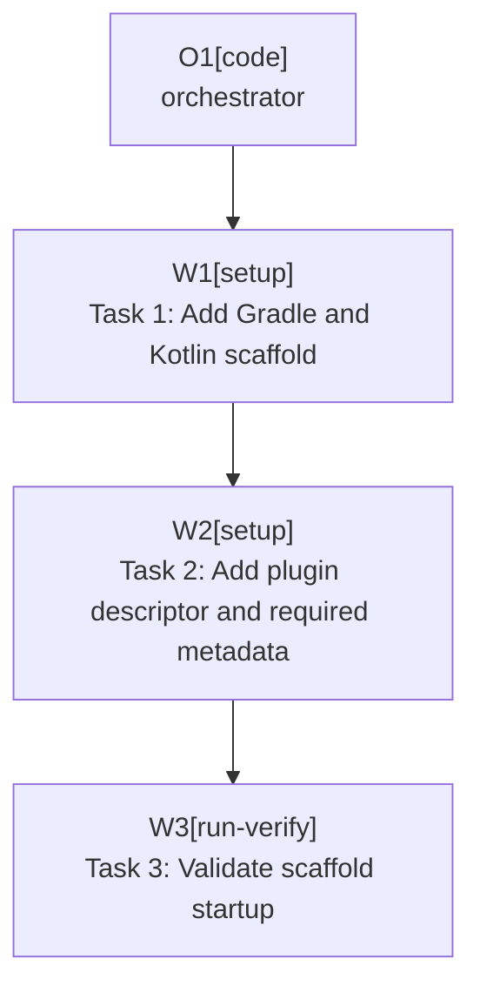

# Plan: Scaffold Plugin Project

Plan-ID: PLAN-scaffold-plugin-project

Status: Closed

Close-Reason: Archived

Workers: 1

## Readiness

- Plan readiness: Complete.
- Approved by: Kamil Kiewisz <kamkie@outlook.com>
- Open questions: None.
- Implementation progress: Implemented in commits `f6fb83e`, `de91f49`, and `b84bc3d`; archived during `v0.1.0-alpha.1` release preparation.

## Goal

Add the first executable IntelliJ Platform plugin scaffold so the repository can build a Kotlin plugin, load a sandbox IDE with `runIde`, and carry the accepted project identity and dependency decisions into plugin metadata.

## Non-Goals

- Do not implement the `AI Commit All` commit workflow.
- Do not add Commit tool window actions beyond placeholder-safe metadata needed by the scaffold.
- Do not implement Marketplace publishing, signing, or CI release automation beyond scaffold-compatible placeholders.
- Do not add direct compile-time usage of proprietary JetBrains AI Assistant implementation classes.

## Assumptions

- Use IntelliJ Platform 2026.1 as the baseline per ADR 0008.
- Use IntelliJ Platform Gradle Plugin 2.x unless compatibility work proves otherwise per ADR 0019.
- Use Kotlin for plugin implementation per `.agents/references/code-style.md`.
- Use plugin ID and base package `pl.devopssolutions.aicommitall` per ADR 0022.
- Treat the JetBrains AI Assistant plugin dependency ID as implementation discovery inside this plan; if it cannot be identified safely for 2026.1, stop and update `docs/decisions/OPEN_QUESTIONS.md` or an ADR before continuing.

## Open Questions

No open plan questions.

## Proposed Changes

- Task 1: Add Gradle and Kotlin scaffold.
  - Covers `T-SCAFFOLD-001`, `T-SCAFFOLD-002`, `T-SCAFFOLD-003`, and `T-SCAFFOLD-007`.
  - Expected files include `settings.gradle.kts`, `build.gradle.kts`, `gradle.properties`, Gradle Wrapper files (`gradlew`, `gradlew.bat`, `gradle/wrapper/gradle-wrapper.properties`, `gradle/wrapper/gradle-wrapper.jar`), `src/main/kotlin/pl/devopssolutions/aicommitall/`, and supporting resource directories.
- Task 2: Add plugin descriptor and required metadata.
  - Covers `T-SCAFFOLD-004`, `T-SCAFFOLD-005`, and `T-SCAFFOLD-006`.
  - Expected files include `src/main/resources/META-INF/plugin.xml` and any Gradle metadata needed for the plugin ID, vendor, license, and required AI Assistant dependency.
- Task 3: Validate scaffold startup.
  - Covers `T-SCAFFOLD-008` and starts `T-VAL-001`.
  - Run the build tasks available after scaffolding and verify `runIde` can start a sandbox IDE.

## Execution Model

Use one orchestrator and one fresh task worker per named task when agent delegation is available. Do not run these tasks in parallel because they share Gradle, plugin descriptor, and documentation surfaces.

Each named task should be implemented, validated, self-reviewed, and committed before the next task starts, following `.agents/references/planning.md` and `.agents/references/execution.md`.

## Execution Graph

## Validation

- Run `pwsh -NoProfile -ExecutionPolicy Bypass -File scripts/validate-docs.ps1` after documentation or plan edits.
- Run the Gradle build task selected by the scaffold, expected to include `gradle buildPlugin`.
- Run `gradle runIde` and confirm the sandbox IDE starts.
- If plugin verifier or `verifyPlugin` is configured in the scaffold task, run the configured check.

## Risks

- The JetBrains AI Assistant dependency ID for IntelliJ Platform 2026.1 may be unavailable or unstable; do not guess if official or local IDE evidence is insufficient.
- IntelliJ Platform Gradle Plugin versions may need compatibility adjustment for the selected 2026.1 patch release.
- Plugin metadata can imply installability before runtime behavior exists; keep README and support docs clear that workflow implementation is still pending.
- `runIde` validation depends on local IDE download/cache availability and may need a longer first-run setup.

## Handoff Notes

Implemented in three plan-task commits:

- Task 1 added the Gradle/Kotlin scaffold and Gradle Wrapper.
- Task 2 added plugin descriptor metadata and the required JetBrains AI Assistant dependency.
- Task 3 validated `buildPlugin` and `runIde` startup for IntelliJ IDEA 2026.1.1.

`runIde` startup validation used the sandbox log to confirm `JetBrains AI Assistant` and `AI Commit All` loaded as custom plugins. A first exploratory `runIde` launch also reached plugin loading but later exited with code 2 after the IDE attempted an internal restart; the controlled validation rerun stopped the sandbox immediately after startup evidence was captured.
