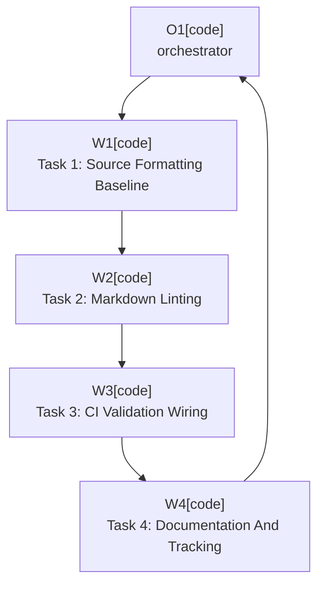

# Plan: Unified Formatting And Linting Toolchain

Plan-ID: PLAN-unified-formatting-linting-toolchain

Status: Closed

Close-Reason: Archived

Workers: 1

Filename: `.agents/plans/archive/PLAN-unified-formatting-linting-toolchain.md`

## Readiness

- Plan readiness: Closed.
- Approved by: Kamil Kiewisz <kamkie@outlook.com>
- Approved at: 2026-05-18T20:35:04+02:00
- Open questions: No task-local questions identified.
- Implementation progress: Implemented and archived.

## Status History

- 2026-05-18T20:27:04+02:00: none -> Draft by Kamil Kiewisz <kamkie@outlook.com>; plan created after accepting ADR 0064.
- 2026-05-18T20:35:04+02:00: Draft -> Approved by Kamil Kiewisz <kamkie@outlook.com>; explicit user approval recorded.
- 2026-05-18T20:35:04+02:00: Approved -> In Progress by Codex <codex@openai.com>; implementation started after plan approval.
- 2026-05-18T20:43:07+02:00: In Progress -> Implemented by Codex <codex@openai.com>; formatting, linting, source-header, docs validation, and CI wiring implemented.
- 2026-05-18T20:52:35+02:00: Implemented -> Closed by Kamil Kiewisz <kamkie@outlook.com>; completed plan archived.

## Goal

Implement [adr-0064](../../../docs/decisions/adr-0064-use-unified-formatting-and-linting-toolchain.md) so repository formatting and linting are mechanically enforceable for Kotlin, Gradle Kotlin DSL, Markdown, and basic editor behavior.

## Non-Goals

- Do not implement unrelated `PROP-03` findings: Dependabot, CodeQL, security policy, contributor templates, CODEOWNERS, or completed-task archival.
- Do not add `.idea/codeStyles/` unless implementation reveals `.editorconfig` and formatter configuration are insufficient.
- Do not change plugin runtime behavior.
- Do not perform unrelated broad refactors while applying formatting.

## Assumptions

- Spotless with ktlint is the single source-formatting path for Kotlin and Gradle Kotlin DSL.
- markdownlint is the Markdown style checker.
- `.editorconfig` is the shared editor baseline, with 4-space Markdown nested-list indentation.
- Apache-2.0 source headers for Kotlin files can be enforced through Spotless in the same toolchain.
- Current external action and plugin versions were verified against official sources before pinning them: Spotless `8.5.1`, ktlint `1.8.0`, markdownlint-cli2 `0.22.1`, and `gradle/actions/wrapper-validation@v3`.

## Open Questions

- None.

## Proposed Changes

### Task 1: Source Formatting Baseline

- Add root `.editorconfig` for charset, final newline, trailing whitespace, line endings, Kotlin, Gradle Kotlin DSL, Markdown, YAML, and PowerShell basics.
- Add Spotless to `build.gradle.kts`.
- Configure ktlint formatting for `src/**/*.kt`, `build.gradle.kts`, and other Gradle Kotlin DSL files.
- Add Apache-2.0 license-header enforcement for Kotlin source files through Spotless.
- Apply the formatter once in a mechanical change and keep any source changes limited to formatting/header results.

### Task 2: Markdown Linting

- Add markdownlint configuration consistent with the ADR and existing docs structure.
- Add a local Markdown lint command, likely through `markdownlint-cli2`, with pinned tooling where practical.
- Update `scripts/validate-docs.ps1` so existing docs validation can run Markdown linting or clearly call the Markdown lint command.
- Keep proposal tracker tables compatible with the selected markdownlint table and list rules.

### Task 3: CI Validation Wiring

- Update `.github/workflows/ci.yml` to run Gradle wrapper validation before Gradle-dependent work.
- Add required setup for Markdown linting if Node-based tooling is selected.
- Run source formatting checks, Markdown linting, existing docs validation, tests, plugin structure verification, and plugin packaging in CI.
- Keep release secrets unavailable to formatting and linting jobs.

### Task 4: Documentation And Tracking

- Update `.agents/references/code-style.md` with the accepted formatting and linting contract.
- Update `.agents/references/testing.md` or validation guidance with the new local validation commands.
- Update contributor-facing docs only if the implementation adds or changes public contributor commands.
- Update `docs/decisions/README.md` and `docs/proposals/README.md` implementation evidence for ADR 0064 and `PROP-03` E003/E008.
- Add `CHANGELOG.md` only if the CI or release pipeline change is public plugin-facing under ADR 0063.

## Execution Model

- `Workers: 1` sequential execution.
- Use one implementation pass because Gradle formatting, Markdown linting, docs validation, and CI wiring overlap in configuration and validation.
- If implementation reveals a new repository rule choice, stop and record the required ADR/update before continuing.

## Execution Graph

## Validation

- Run the local Markdown lint command selected by implementation.
- Run `pwsh -NoProfile -ExecutionPolicy Bypass -File scripts\validate-docs.ps1`.
- Run `.\gradlew.bat spotlessCheck`.
- Run `.\gradlew.bat test`.
- Run `.\gradlew.bat buildPlugin`.
- Run `git diff --check`.
- Review CI workflow changes for least-privilege permissions and no release-secret exposure.

## Risks

- Markdown lint rules may conflict with existing proposal tables or generated document structures; tune rules conservatively rather than rewriting all docs for low-value churn.
- Node-based Markdown linting adds a contributor prerequisite unless the command is isolated and documented clearly.
- ktlint may reformat Kotlin in ways that create large mechanical diffs; keep those diffs isolated from behavior changes.
- License-header insertion affects many Kotlin files; avoid changing logic while applying headers.

## Handoff Notes

- Implemented after explicit plan approval.
- `TASKS.md` had newly added duplicate open task IDs outside this plan; those entries were kept and renumbered to the next available IDs so documentation validation could pass.
