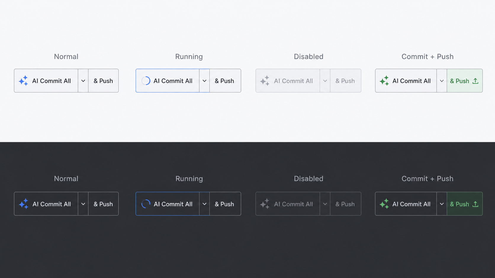
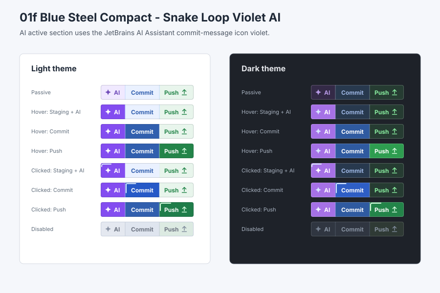

# Concept Graphics

This directory stores generated or drafted visual references for design decisions.

Files here are concept inputs, not final plugin UI assets. Final implementation assets must still be adapted to IntelliJ Platform UI and icon conventions before use.

## Split Button Placeholder

Generated placeholder for the historical `AI Commit All` split-button styling direction from ADR 0027. ADR 0053 supersedes this placeholder for future implementation work.

It shows the intended visual direction for normal, running, disabled, commit-only, and commit-and-push states. Treat it as a reference for implementation, not as a production bitmap asset.

## Selected Three-Section Reference

ADR 0053 selects the violet AI snake draft as the final styling reference for the ADR 0052 three-section control.

- Selected draft: [01-blue-steel-compact-snake-violet-ai.svg](split-button-drafts/01-blue-steel-compact-snake-violet-ai.svg)
- Structure: `<AI icon> AI | Commit | Push`
- Activity model: snake-loop running indication on the active section.
- State coverage: passive, cumulative hover, clicked/running, disabled, light, and dark states.

## Split Button Draft Series

Draft series for ADR 0025 and `PROP-02-pre-release-ux` review:

- [Draft series notes](split-button-drafts/README.md)
- [Decision tree](split-button-drafts/DECISION_TREE.md)

These drafts are concept references only. The selected draft intentionally follows an IntelliJ run-widget-like three-section control with a compact AI icon/text section, a `Commit` section, an icon-forward `Push` section, clean full-height dividers, rounded outer corners, compact internal margins, and related but distinct section accents.
