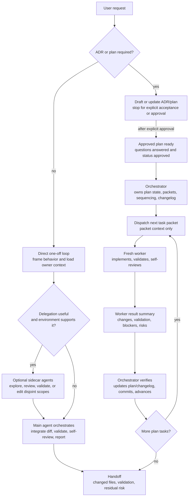

# Optimize AI Execution Paths And Orchestration Context

## Context and Problem Statement

The repository already has strong AI workflow guidance for plans, task packets, validation, review, and multi-agent orchestration. However, the hot execution path has become dense: `.agents/references/execution.md` and `.agents/references/planning.md` both carry orchestration rules, task packet rules, context rules, commit rules, and stop conditions. This makes direct one-off work pay the context cost of approved-plan orchestration and leaves one-off subagent use less explicit than plan-based delegation.

The user asked to apply recommendations from an AI instruction review to make execution more efficient and capable, especially around context management, subagents, and orchestrator responsibility.

## Decision Drivers

* Keep direct one-off work fast and low-context.
* Preserve accepted plan gates, ADR gates, task-packet dispatch, and one-commit-per-plan-task rules.
* Make the orchestrator's responsibility explicit for both approved plans and one-off delegated work.
* Avoid duplicating orchestration policy across `execution.md`, `planning.md`, templates, and human-facing docs.
* Allow subagent delegation by default while preserving disjoint write scopes and final orchestrator review.
* Make task packets more executable by naming context budgets, required skills, escalation triggers, and validation expectations.
* Add validation only after the policy shape is accepted.

## Considered Options

* Adopt split execution paths with a dedicated orchestration owner and delegation allowed by default.
* Keep the current guidance unchanged.
* Only compact wording in the existing files.
* Allow unbounded subagent delegation by default.

## Decision Outcome

Chosen option: "Adopt split execution paths with a dedicated orchestration owner and delegation allowed by default", because it reduces context load for direct tasks while preserving the repository's existing gates and multi-agent traceability.

If accepted, implement these guidance changes:

1. Split `.agents/references/execution.md` into two explicit paths:
    * A direct one-off task loop for ad hoc user requests, task IDs, narrow documentation edits, and small implementation tasks that do not require a plan.
    * An approved plan task loop for `Status: Approved` plans, including per-task validation, self-review, and commit boundaries.
2. Add `.agents/references/orchestration.md` as the single AI-facing owner for orchestration rules:
    * orchestrator responsibilities,
    * worker lanes,
    * task packet dispatch,
    * structured worker chat events,
    * parallel worker synchronization,
    * compact task result summaries,
    * one-off delegated work rules.
3. Reduce duplication by making `.agents/references/execution.md`, `.agents/references/planning.md`, `.agents/plans/README.md`, and `.agents/plans/PLAN_TEMPLATE.md` link to `.agents/references/orchestration.md` for orchestration details instead of restating the full policy.
4. Add a direct one-off subagent policy:
    * Treat subagent delegation as allowed by default when the active agent environment supports delegation.
    * Do not require separate user opt-in before using sidecar agents or workers.
    * Respect an explicit no-delegation instruction in the current request and any higher-priority environment or tool limits.
    * Prefer read-only sidecar agents for focused exploration, review, or validation when they can run in parallel with local work.
    * Permit write workers only with explicit, disjoint write scopes.
    * The main agent remains the orchestrator and owns final diff review, validation evidence, risk reporting, and commit decisions.
    * One-off worker results are summarized in chat; they do not create plan-file result summaries unless the work is governed by an approved plan.
5. Change the default plan-file update responsibility:
    * Task workers should return compact result summaries by default.
    * The orchestrator updates the governing plan file and `CHANGELOG.md` when required before dispatching the next dependent task.
    * A task packet may still grant explicit plan-file write scope when keeping the plan update in the task commit is clearer and safe.
6. Extend task packets with:
    * `Required skills`,
    * `Initial context budget`,
    * `Escalation triggers`,
    * explicit validation and review expectations.
7. Extend `scripts/ai/validate-agent-artifacts.ps1` after the guidance lands so approved multi-task plans validate required task-packet fields.
8. Update `docs/WORKING_WITH_AI.md` with request shapes for direct one-off work, one-off delegated work, approved plan execution, and review-only sidecar delegation.

This decision does not change the ADR gate, plan approval gate, one-commit-per-approved-plan-task rule, single-branch topology, changelog ownership, or requirement that parallel write workers have disjoint write scopes.

### Execution Flow

The intended execution model has two paths. Direct one-off work stays short and may use optional sidecar agents when useful. Approved plan execution keeps the orchestrator-and-fresh-worker model with task packets, per-task validation, and plan state updates.

### Consequences

* Good, because direct one-off tasks no longer need to load the full approved-plan orchestration model.
* Good, because orchestration policy has one owner and fewer duplicate restatements.
* Good, because one-off subagent usage is allowed by default while staying bounded by orchestrator review and write-scope rules.
* Good, because workers receive clearer context budgets and escalation rules.
* Good, because the orchestrator owns final plan state and changelog consistency by default.
* Bad, because accepted guidance and validator updates will touch several repository workflow files.
* Bad, because moving policy to a new owner file requires careful validation to avoid broken links or stale summaries.

### Confirmation

After acceptance, confirm implementation by checking:

* `.agents/references/execution.md` contains distinct direct one-off and approved-plan loops.
* `.agents/references/orchestration.md` owns orchestration details and is linked from planning, execution, and plan template docs.
* `.agents/references/planning.md` focuses on plan creation, readiness, status, and task-packet shape instead of duplicating full execution policy.
* `.agents/plans/PLAN_TEMPLATE.md` includes `Required skills`, `Initial context budget`, and `Escalation triggers` in task packets.
* `scripts/ai/validate-agent-artifacts.ps1` validates the new task-packet fields for approved multi-task plans.
* `docs/WORKING_WITH_AI.md` explains direct one-off, delegated one-off, approved-plan, and sidecar review request shapes.
* `pwsh -NoProfile -ExecutionPolicy Bypass -File scripts/ai/validate-agent-artifacts.ps1` passes.
* `git diff --check` passes.

## Pros and Cons of the Options

### Adopt split execution paths with a dedicated orchestration owner and delegation allowed by default

This option keeps existing accepted plan safety rules while making the normal one-off path lighter.

* Good, because direct task execution, approved plan execution, and orchestration become separate concepts.
* Good, because subagent use does not require repeated user opt-in and remains optional rather than mandatory for every task.
* Good, because validator support can enforce task-packet quality after the guidance changes.
* Bad, because it adds one more reference file, so ownership and links must be clear.

### Keep the current guidance unchanged

This option avoids any guidance churn.

* Good, because no ADR follow-up implementation is needed.
* Good, because current guidance is already internally functional.
* Bad, because direct one-off tasks continue to carry plan-orchestration context cost.
* Bad, because orchestration policy remains duplicated across execution and planning guidance.

### Only compact wording in the existing files

This option reduces prose without changing ownership.

* Good, because it is a smaller edit than adding an orchestration owner.
* Good, because it can reduce some duplication.
* Bad, because it does not create a clear single owner for orchestration policy.
* Bad, because one-off delegation rules would still be mixed into the general execution path.

### Allow unbounded subagent delegation by default

This option prioritizes maximum parallelism without the repository's current write-scope, orchestration, and review boundaries.

* Good, because it could speed up broad audits or independent implementation slices.
* Bad, because it conflicts with the repository's existing conservative parallelism rules.
* Bad, because it increases write conflicts, stale assumptions, and review burden.
* Bad, because it would make direct tasks less predictable and more expensive to coordinate.

## More Information

Related decisions:

* `adr-0023` requires one commit per task in approved multi-task plans.
* `adr-0026` requires one orchestrator and fresh task workers for plans.
* `adr-0058` defines orchestrator synchronization and chat logging.
* `adr-0059` defines worker plan and changelog handoffs.
* `adr-0061` keeps multi-agent execution on the current branch.
* `adr-0071` defines task packets for multi-agent plan execution.
* `adr-0072` extends agent artifact validation.

After this ADR is accepted, update the ADR Implementation Tracker in `docs/decisions/README.md` with implementation status, evidence, and last updated date, then implement the guidance, template, validator, and human-facing documentation changes.
