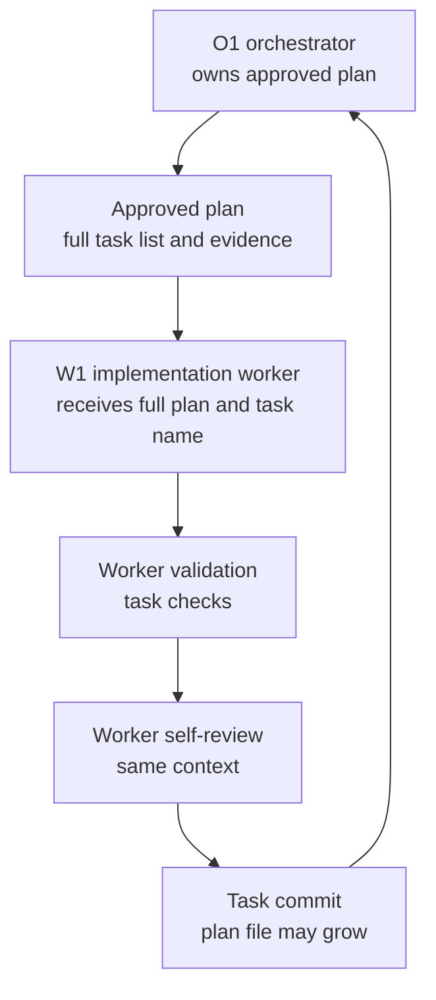
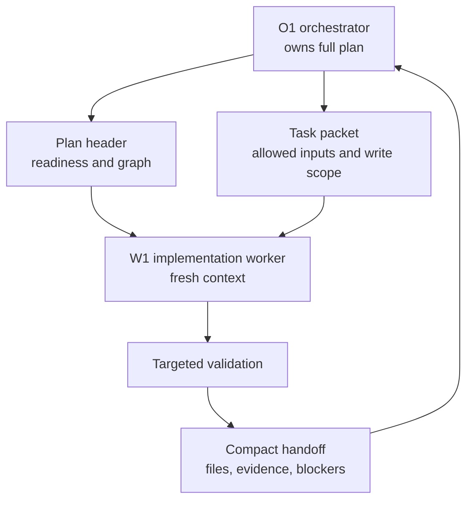
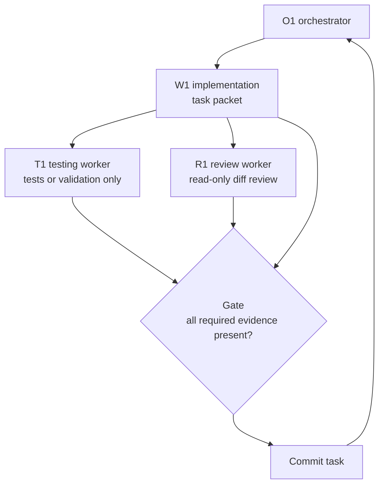
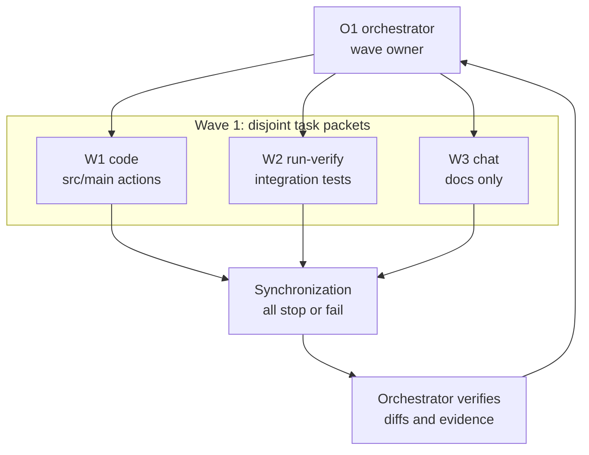

# Multi-Agent Context Packet Workflow

This proposal respects `AGENTS.md`, `TASKS.md`, `docs/decisions/OPEN_QUESTIONS.md`, `docs/decisions/`, and `docs/proposals/README.md`. It lists findings for maintainer triage only; it does not implement changes by itself.

## Table of Contents

- [Summary](#summary)
- [Creation Context](#creation-context)
- [Progress Tracker](#progress-tracker)
- [Proposal Items](#proposal-items)
    - [New Features](#new-features)
        - [F001. Add task packet dispatch contracts](#f001-add-task-packet-dispatch-contracts)
        - [F002. Define optional review and testing worker lanes](#f002-define-optional-review-and-testing-worker-lanes)
        - [F003. Add compact orchestration records](#f003-add-compact-orchestration-records)
    - [Errors And Mistakes](#errors-and-mistakes)
        - [E001. Full-plan dispatch weakens task-shaped context](#e001-full-plan-dispatch-weakens-task-shaped-context)
    - [Duplications To Remove Or Reduce](#duplications-to-remove-or-reduce)
    - [Simplification Opportunities](#simplification-opportunities)
        - [S001. Split long plans into parent plans and task packets](#s001-split-long-plans-into-parent-plans-and-task-packets)
    - [Smaller / Stylistic Items](#smaller--stylistic-items)
- [Examples And Workflow Graphs](#examples-and-workflow-graphs)
- [Suggested Priority Order](#suggested-priority-order)
- [Out Of Scope](#out-of-scope)

## Summary

- The current repository workflow already uses fresh workers per plan task, but worker dispatch can still pass the full approved plan and accumulated plan evidence into each worker context.
- The `D:\Projects\Jit\interview-feedback` repository uses a stricter batch-isolation pattern: one fresh worker, exact allowed inputs, explicit forbidden inputs, one output, and one final status line.
- `PLAN-release-matrix-ui-automation` is the motivating local example: it is a long sequential plan with accumulating implementation evidence, and the maintainer reported that its execution triggered multiple context compactions while running without a fresh subagent per task.
- This proposal combines that isolation pattern with this repository's stronger implementation safeguards: approved plans, disjoint write scopes, validation, review, commits, and ADR-gated workflow changes.
- No implementation is performed by this proposal. Accepted findings would still need ADRs, plan/template edits, or task work according to the normal repository flow.

## Creation Context

- Why this proposal exists: long approved plans can overload the context window during implementation, especially when every worker receives the full plan, prior evidence, and chat-log history. The immediate example is `.agents/plans/PLAN-release-matrix-ui-automation.md`, which the maintainer reported triggered multiple context compactions while being executed without one fresh subagent per task.
- How it was created: compared `.agents/references/planning.md`, `.agents/references/execution.md`, `.agents/plans/PLAN_TEMPLATE.md`, the active `PLAN-release-matrix-ui-automation` shape, and the batch-isolation rules in `D:\Projects\Jit\interview-feedback\AGENTS.md` and `D:\Projects\Jit\interview-feedback\specs\feedback-spec.md`.
- Scope guardrails: this proposal preserves ADR-gated repository rule changes, one commit per plan task, disjoint write scopes for parallel work, and the existing requirement to stop on missing decisions or unsafe assumptions.

## Progress Tracker

Compact overview only. The metadata table inside each finding remains the source of truth; this table mirrors statuses at a glance. Tracker mirroring, status and decision vocabulary, and Proposal Implementation Summary updates live in `docs/proposals/README.md`.

| Id   | Title                                           | Priority | Status | Decision |
|------|-------------------------------------------------|----------|--------|----------|
| F001 | Add task packet dispatch contracts              | 5        | done   | accepted |
| F002 | Define optional review and testing worker lanes | 4        | done   | accepted |
| F003 | Add compact orchestration records               | 5        | done   | accepted |
| E001 | Full-plan dispatch weakens task-shaped context  | 3        | done   | accepted |
| S001 | Split long plans into parent plans and packets  | 4        | done   | accepted |

## Proposal Items

### New Features

#### F001. Add task packet dispatch contracts

| Field       | Value                     |
|-------------|---------------------------|
| Status      | done                      |
| Decision    | accepted                  |
| Decision at | 2026-05-21T20:36:31+02:00 |
| Priority    | 5                         |
| Owner       |                           |
| Updated     | 2026-05-21T20:56:11+02:00 |

##### Context

- Evidence: `.agents/references/planning.md` says each worker gets only task-shaped context, but the orchestrated execution section still says to give the worker the approved plan. `PLAN-release-matrix-ui-automation` is a concrete local example of a sequential long plan with accumulated implementation evidence; the maintainer reported multiple context compactions during execution without a fresh subagent per task. The `interview-feedback` repository uses a stricter allowed-input list for each worker.
- Impact: A long plan can become part of every worker's starting context even when the worker needs only one task, which reduces available room for source files, test output, and reasoning.
- Non-goals:
    - Do not remove approved plans, `Workers:` metadata, execution graphs, validation, review, or one-commit-per-task rules.
    - Do not make worker packet content informal or hidden in chat only.
- Acceptance criteria:
    - Plan guidance defines a `Task Packet` contract with goal, allowed inputs, forbidden inputs, write scope, dependencies, validation, stop conditions, and expected output.
    - Worker dispatch guidance says to give the worker the plan header, readiness summary, assigned task packet, and explicitly named governing artifacts instead of the full plan by default.
    - Workers may load the full plan only when the task packet names it or when a blocker requires broader plan review.

##### Recommended Change

Author an ADR that adopts task packet dispatch for approved multi-task plan execution. If accepted, update `.agents/references/planning.md`, `.agents/references/execution.md`, `.agents/plans/PLAN_TEMPLATE.md`, and `.agents/plans/README.md`.

##### Review Notes

- none

##### Follow-Up

- Artifact: ADR, then direct guidance and template edits.
- Validation: `pwsh -NoProfile -ExecutionPolicy Bypass -File scripts/validate-docs.ps1`.

#### F002. Define optional review and testing worker lanes

| Field       | Value                     |
|-------------|---------------------------|
| Status      | done                      |
| Decision    | accepted                  |
| Decision at | 2026-05-21T20:36:31+02:00 |
| Priority    | 4                         |
| Owner       |                           |
| Updated     | 2026-05-21T20:56:11+02:00 |

##### Context

- Evidence: `.agents/references/execution.md` requires task validation and self-review, but it does not define when a separate review worker or testing worker should be used. This repository already has specialized skills for plugin review and test-driven validation, while the comparison repository shows that worker isolation is strongest when the worker has one clear responsibility.
- Impact: Implementation workers can accumulate coding, validation, and review context in one window. High-risk tasks may benefit from independent review context, but using separate agents for every small task would create avoidable overhead.
- Non-goals:
    - Do not require separate review or testing workers for every small documentation or code edit.
    - Do not let review or testing workers bypass the orchestrator's commit and plan-state responsibilities.
- Acceptance criteria:
    - Guidance defines when to use an implementation worker only, implementation plus review worker, implementation plus testing worker, or all three.
    - Review workers are read-only by default and receive the task packet, diff, relevant spec or ADR, and validation output.
    - Testing workers own tests or validation investigation only, with explicit write scope when they are allowed to edit tests.

##### Recommended Change

Add role-lane guidance for approved multi-task plans: implementation workers remain the default, review workers are used for high-risk plugin behavior, and testing workers are used when validation design or test failure triage is substantial.

##### Review Notes

- none

##### Follow-Up

- Artifact: ADR or direct guidance edit if the maintainer decides this is workflow clarification rather than a new durable rule.
- Validation: documentation validation and review against `.agents/skills/plugin-review/SKILL.md` and `.agents/skills/plugin-test-tdd/SKILL.md`.

#### F003. Add compact orchestration records

| Field       | Value                     |
|-------------|---------------------------|
| Status      | done                      |
| Decision    | accepted                  |
| Decision at | 2026-05-21T20:36:31+02:00 |
| Priority    | 5                         |
| Owner       |                           |
| Updated     | 2026-05-21T20:56:11+02:00 |

##### Context

- Evidence: `.agents/references/execution.md` requires structured worker `start`, `stop`, and `fail` events in the chat transcript and explicitly says not to create `.agents/runs/` logs unless a later accepted ADR defines ownership, retention, cleanup, and commit rules.
- Impact: Chat-only run logging keeps audit evidence visible during the session but increases live context pressure during long plans. Plan files can also grow when implementation evidence is appended directly to the plan.
- Non-goals:
    - Do not create `.agents/runs/` or any durable run-log structure before an ADR is accepted.
    - Do not require committing bulky logs, raw test output, or transient sandbox artifacts.
- Acceptance criteria:
    - A durable or semi-durable record option is decided before changing the current chat-log rule.
    - The record format keeps one compact event per worker action and one compact result per task.
    - The plan file links or summarizes records instead of absorbing detailed task logs.

##### Recommended Change

Author an ADR that compares chat-only logs, untracked local run logs, committed compact run summaries, and plan-only summaries. If accepted, update execution guidance with the selected retention and cleanup model.

##### Review Notes

- none

##### Follow-Up

- Artifact: ADR.
- Validation: documentation validation plus review that no generated run logs are committed unless the ADR explicitly allows it.

### Errors And Mistakes

#### E001. Full-plan dispatch weakens task-shaped context

| Field       | Value                     |
|-------------|---------------------------|
| Status      | done                      |
| Decision    | accepted                  |
| Decision at | 2026-05-21T20:36:31+02:00 |
| Priority    | 3                         |
| Owner       |                           |
| Updated     | 2026-05-21T20:56:11+02:00 |

##### Context

- Evidence: `.agents/references/planning.md` says each task worker gets only task-shaped context, but later says to give the worker `AGENTS.md`, the approved plan, the current task name, relevant ADRs, relevant source files, expected validation, and commit metadata requirements.
- Impact: The two rules point in different directions for long plans. A worker can obey the dispatch list and still receive more context than needed.
- Non-goals:
    - Do not weaken the requirement that workers understand approved plan status and task dependencies.
    - Do not remove the orchestrator role.
- Acceptance criteria:
    - The guidance distinguishes full plan ownership by the orchestrator from packet-level ownership by workers.
    - The default worker read set no longer includes the full approved plan when a task packet is available.
    - The worker can still escalate to the orchestrator when a missing dependency or plan contradiction appears.

##### Recommended Change

After F001 is accepted, edit planning and execution guidance so the full plan is an orchestrator-owned artifact. Workers receive only the task packet and explicit cross-references unless the task packet requires broader context.

##### Review Notes

- none

##### Follow-Up

- Artifact: Same ADR and guidance edits as F001, or a narrower guidance correction if the maintainer accepts E001 independently.
- Validation: documentation validation and review of the next approved plan execution handoff.

### Duplications To Remove Or Reduce

_No tracked findings._

### Simplification Opportunities

#### S001. Split long plans into parent plans and task packets

| Field       | Value                     |
|-------------|---------------------------|
| Status      | done                      |
| Decision    | accepted                  |
| Decision at | 2026-05-21T20:36:31+02:00 |
| Priority    | 4                         |
| Owner       |                           |
| Updated     | 2026-05-21T20:56:11+02:00 |

##### Context

- Evidence: `.agents/plans/PLAN_TEMPLATE.md` keeps all plan sections in one document. The active release-matrix plan already combines goals, task list, execution graph, implementation evidence, validation, risks, and handoff notes in one file; at proposal creation it was 125 lines and 11,947 bytes.
- Impact: Long plan files become hard to review and expensive to load during implementation. The plan also becomes a mixed contract, status dashboard, and evidence log.
- Non-goals:
    - Do not require small plans to split into multiple files.
    - Do not move active backlog into plan packet files.
- Acceptance criteria:
    - Guidance defines a size or complexity trigger for splitting a plan into a parent plan plus task packet sections or child packet files.
    - Sequential and parallel execution graphs continue to live in the parent plan.
    - Task packets remain stable enough to cite from worker dispatch, review notes, and commit metadata.

##### Recommended Change

Add a long-plan handling rule: when a plan exceeds a maintainer-chosen threshold, keep the parent plan focused on status, dependencies, and graph topology, while moving task-level execution details into compact task packets.

##### Review Notes

- none

##### Follow-Up

- Artifact: ADR or approved plan-template update.
- Validation: documentation validation and manual review of one long active plan converted to the new shape.

### Smaller / Stylistic Items

- Consider a short named prompt such as `Plan Task Execution Packet` only after the durable policy owner is accepted in `.agents/references/`.
- Keep examples in templates compact; long examples should live in a proposal, reference, or archived demonstration plan.

## Examples And Workflow Graphs

### Case Study: PLAN-release-matrix-ui-automation

`PLAN-release-matrix-ui-automation` is the practical example this proposal should optimize for. It is sequential (`Workers: 1`), contains six planned tasks, and already records completed Task 1 and Task 2 implementation evidence in the plan file. The maintainer reported that this execution triggered multiple context compactions and ran without a fresh subagent per task.

The proposed packet model would keep the parent plan responsible for approval, graph topology, dependency order, and compact task status. Each implementation task would then get a fresh packet, such as the Task 2 packet below, rather than carrying the whole plan plus previous task evidence forward.

### Example Task Packet

```markdown
### Task Packet: Task 2 deterministic fixtures

Task id: T2-deterministic-fixtures
Plan: PLAN-release-matrix-ui-automation
Mode: implementation

Goal:

- Add deterministic IDE fixtures for local Git repositories and fake AI action behavior.

Allowed inputs:

- AGENTS.md
- .agents/references/execution.md
- .agents/references/testing.md
- plan header, readiness, execution graph, and this task packet
- build.gradle.kts
- src/integrationTest/**
- docs/scenario-coverage.md only if updating scenario ownership

Forbidden inputs:

- unrelated archived plans
- previous worker chat beyond the orchestrator handoff summary
- unrelated implementation evidence from other task packets

Write scope:

- src/integrationTest/**
- build.gradle.kts only if fixture dependencies are missing

Stop conditions:

- fixture design requires production test switches
- fake AI plugin cannot satisfy dependency loading
- task needs a repository rule change not covered by an accepted ADR

Validation:

- .\gradlew.bat releaseMatrixUiTest "-PideProducts=IU" "-PideVersion=2026.1.2"
- .\gradlew.bat test
- git diff --check

Expected output:

- changed files
- validation evidence
- blocker or handoff notes
- suggested changelog entry only when public plugin behavior changes
```

### Example Worker Dispatch Prompt

```text
Worker W2 owns Task Packet T2-deterministic-fixtures.
Use a fresh context. Do not fork prior worker context.
Read only the allowed inputs in the packet.
Stay inside the write scope.
Stop and report if a stop condition appears.
Return changed files, validation evidence, and review risks.
Do not update unrelated plan sections or CHANGELOG.md unless the packet says so.
```

### Current Long-Plan Dispatch



### Proposed Packet Dispatch



### Proposed Review And Testing Lanes



### Proposed Parallel Wave With Disjoint Packets



## Suggested Priority Order

1. `E001` - clarify the current contradiction between task-shaped context and full-plan dispatch.
2. `F001` - define the task packet contract that resolves the context-load issue.
3. `S001` - add a long-plan split rule once packet structure exists.
4. `F002` - add optional review and testing worker lanes after packet dispatch is clear.
5. `F003` - decide whether compact run records should replace some chat-log pressure.

## Out Of Scope

- Implementing the proposed workflow changes.
- Creating or accepting ADRs.
- Editing `.agents/references/`, `.agents/plans/`, `.agents/prompts/`, `.agents/skills/`, or validation scripts beyond this proposal and the proposal index.
- Changing plugin runtime behavior, tests, Gradle configuration, CI, Marketplace release behavior, or public user documentation.
- Committing the proposal.
