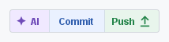
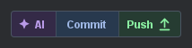
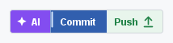

# AI Commit All User Guide

This guide covers the day-to-day workflow for AI Commit All. For the behavioral contract, see [Specification](specification.md). For problem-specific help, see [Troubleshooting](troubleshooting.md). For support scope and reporting expectations, see [Support](SUPPORT.md).

## Before You Start

Use AI Commit All in a Git project opened in a JetBrains IDE on the `2026.1` IntelliJ Platform line.

Required setup:

- Install the plugin from a local build ZIP.
- Install, enable, and sign in to JetBrains AI Assistant.
- Use the non-modal Commit tool window.
- Open a Git working copy. Other VCS integrations are not supported.

If JetBrains AI Assistant is missing or disabled, the IDE refuses to load AI Commit All because the AI Assistant dependency is required.

## Commit Tool Window Control

AI Commit All adds a compact three-section control to the Commit tool window:

```text
AI | Commit | Push
```

Current reviewed control rendering:

| Light theme | Dark theme |
|-------------|------------|
|  |  |

Short running-state animation:



The running section shows where the workflow is now: `AI` while JetBrains AI
Assistant generates the message, `Commit` while the IDE commit workflow runs,
and `Push` while the push step is in progress. The control is disabled until
the current run finishes.

Marketplace-ready workflow media is generated from the same control rendering
and stored in the [marketplace assets](assets/marketplace/README.md).

The control is available only inside a supported Git commit workflow. It hides outside that context and disables while a plugin-owned workflow is already running.

Eligible changes include:

- Modified tracked files.
- Added files.
- Deleted files.
- Moved or renamed files.
- Unversioned files.
- Resolved-conflict paths when the IDE exposes them as committable.

Ignored files are excluded. Multi-root Git projects are handled per Git root, so paths from one repository are not merged into another repository's selection.

## AI

Use `AI` when you want JetBrains AI Assistant to write a commit message but you do not want the plugin to commit.

What happens:

1. The plugin collects every eligible non-ignored Git path.
2. If the Git staging-area workflow is active, the plugin stages the eligible paths first.
3. The plugin applies the clear-message setting, then captures the current commit message as a snapshot.
4. JetBrains AI Assistant generates a commit message.
5. The workflow stops after the message is generated.

No commit or push is attempted by the `AI` section.

The workflow treats AI generation as unsuccessful when generation times out, the result is empty, AI Assistant cannot be invoked after a bounded retry, or you edit the commit message while generation is running. It also stops when completion cannot be observed reliably after the bounded observation window.

With the default clear-message setting, the snapshot starts empty and AI Assistant must produce a non-empty message. When you disable clearing, you can intentionally ask AI Assistant to revise existing text. If AI Assistant runs to reliable completion and leaves that non-empty prefilled message unchanged, the workflow may continue; unchanged empty text, missing completion evidence, and user edits still stop the workflow.

## Commit

Use `Commit` when you want one action to generate the message and then commit the collected changes.

What happens:

1. The plugin performs the full `AI` workflow.
2. If AI generation succeeds, the plugin runs the active IntelliJ commit workflow.
3. IDE before-commit checks, warnings, confirmations, and commit error handling remain in charge.

The plugin does not bypass standard IDE commit checks. If the IDE commit executor is unavailable, the workflow stops without committing.

## Push

Use `Push` when you want the plugin to commit and push, or when you have local outgoing commits and nothing new to commit.

When committable changes exist:

1. The plugin performs the full `Commit` workflow.
2. After the commit completes, the plugin attempts to push.
3. If the push state is safe, the IDE Push Commits dialog is skipped. Local commits that were not pushed yet, for example from earlier `Commit` runs, do not block the immediate push.
4. If the push state is not safe for immediate push, for example a missing tracked upstream, an ambiguous push target, unresolved conflicts, an abnormal repository state, or an unsupported push API, the workflow falls back to the IDE commit-and-push executor and Push Commits dialog.

When no committable changes exist but local outgoing commits are available:

1. The plugin skips AI generation and commit.
2. The plugin attempts a safe immediate push of the outgoing commits.
3. If safe immediate push cannot be prepared, the workflow stops instead of opening the IDE Push Commits dialog.

## Changelist And Staging Behavior

In the changelist-backed commit workflow, AI Commit All targets all eligible non-ignored Git changes exposed by the IDE, not only the current visual selection.

Practical effects:

- Changes from multiple changelists can be included.
- Modified, added, deleted, moved or renamed, unversioned, and resolved-conflict paths can be included.
- Ignored files remain excluded.
- If the IDE reports no eligible changes and no outgoing commits, `AI` and `Commit` are disabled and `Push` is disabled unless outgoing commits are available.

When the IDE's Git staging-area commit workflow is active, AI Commit All stages every eligible non-ignored path before invoking JetBrains AI Assistant. This keeps the generated commit message aligned with the content that the IDE commit workflow will commit.

Already staged paths remain staged when additional eligible unstaged paths are added. If IntelliJ is still refreshing or mutating VCS state, such as during a branch switch, update, commit, push, staging, rollback, merge, or rebase, the plugin briefly rechecks that state before changing staged files. If the state is still busy or frozen after that bounded wait, the workflow stops before changing staged files. Wait for the IDE operation to finish, then try again.

## Shortcuts

AI Commit All registers two shortcut-target actions that mirror the IDE `CheckinProject` and `Vcs.Push` actions:

| Plugin action | Mirrors IDE action | Default Windows/Linux keymap | Default macOS keymap | Notes |
|---------------|--------------------|------------------------------|----------------------|-------|
| `Commit` | `Commit...` | `Ctrl+K` | `Cmd+K` | Routes to the plugin when the Commit tool window workflow is available and shortcut takeover is enabled. |
| `Push` | `Push...` | `Ctrl+Shift+K` | `Cmd+Shift+K` | Routes to the plugin when the Commit tool window workflow is available and shortcut takeover is enabled. |

The `AI` section does not have a standard VCS shortcut. The listed shortcuts are the predefined JetBrains keymap defaults; custom keymaps can differ.

If a plugin workflow is already running, the shortcut actions are disabled for that project until the workflow finishes. When shortcut takeover is disabled or no plugin workflow is available, the standard IDE actions handle the shortcuts.

## Settings

Open `Settings | Tools | AI Commit All`.

| Setting                                             | Default    | Effect                                                                                                                                                                                  |
|-----------------------------------------------------|------------|-----------------------------------------------------------------------------------------------------------------------------------------------------------------------------------------|
| AI generation timeout                               | `30000` ms | Maximum wait before the workflow stops with an AI timeout.                                                                                                                              |
| Completion check interval                           | `500` ms   | Polling interval used while waiting for AI generation to finish.                                                                                                                        |
| Clear commit message before AI generation           | enabled    | Clears stale message text before invoking JetBrains AI Assistant, so the captured snapshot starts empty. Disable only when you intentionally want AI Assistant to revise existing text; after reliable completion, AI Assistant may leave a non-empty prefilled message unchanged. |
| Use AI Commit All for IDE commit and push shortcuts | enabled    | Routes the IDE commit and push shortcuts to the plugin when the workflow is available.                                                                                                  |

Both timing values must be positive. Setting changes apply to later workflow runs; shortcut takeover changes apply to later shortcut activations without requiring an IDE restart.

## Safe Push Behavior

AI Commit All uses the immediate-push path only when the affected Git repositories are ready for a normal, unambiguous tracked-branch push.

At user level, that means every affected Git repository must have:

- A current branch with a tracked upstream.
- A normal repository state.
- No unresolved conflicts in the affected scope.
- An unambiguous target that matches the tracked upstream.
- No force-push requirement, new-branch push, or special-ref target.

A local branch that is already ahead of its tracked upstream does not block immediate push. Both commit-and-push and outgoing-only push tolerate existing unpushed commits, for example from earlier `Commit` runs. The push is always a normal non-force push: if the remote moved ahead in the meantime, the Git server rejects the push and the rejection surfaces as a standard IDE push failure after the commit; update your branch with pull or rebase, then push again.

The plugin does not add its own confirmation dialog for the safe immediate-push path. Unsafe commit-and-push states fall back to the IDE dialog. Unsafe outgoing-only push states stop instead of opening the dialog.

## Limitations

- Git is the only supported VCS.
- JetBrains AI Assistant is required; there is no non-AI fallback message generator.
- The plugin is an unreleased prerelease and is installed from a local build ZIP.
- Safe immediate push is intentionally conservative.
- The screenshots and animation in this guide are generated from the runtime Swing control rendering; full manual visual review across supported IDE products is still tracked as validation work.
- Shortcut names outside the predefined JetBrains keymaps are keymap-specific unless confirmed in the active IDE.

## More References

- [README](../README.md) - concise landing page and install path.
- [Troubleshooting](troubleshooting.md) - FAQ and problem-path guidance.
- [Support](SUPPORT.md) - support scope and issue-reporting expectations.
- [Specification](specification.md) - observable behavior requirements and traceability.
